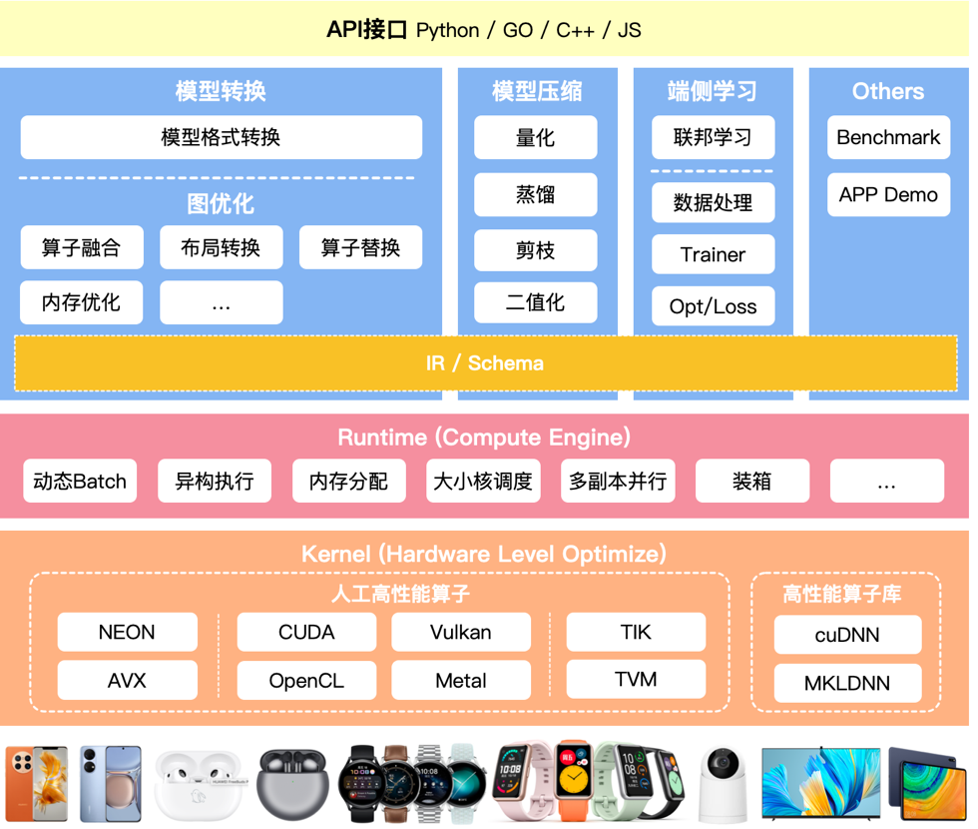
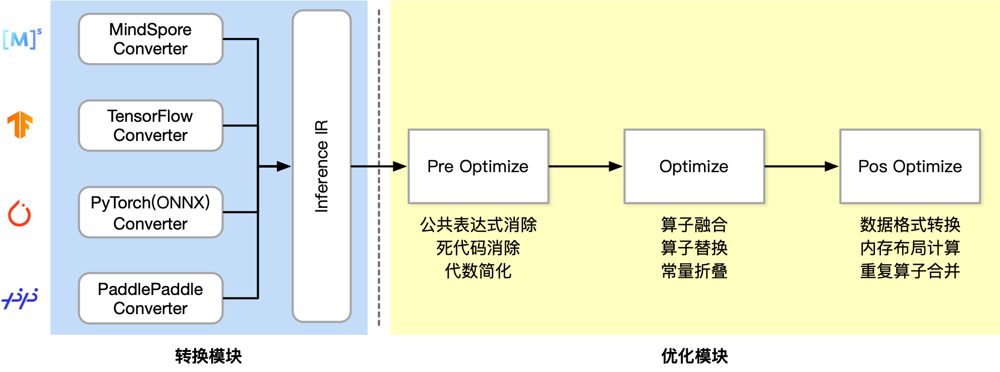

<!--Copyright © 适用于[License](https://github.com/chenzomi12/AISystem)版权许可-->

# 计算图优化

现在来到推理引擎转换中的图优化模块，这里主要负责实现计算图中的算子融合、布局转换、算子替换、内存优化等非常多不同的类型的优化的 pass，以达到更好的推理效果。



======= 这里要介绍计算图优化，本节要介绍的内容哦

## 挑战与架构

### 离线模块的挑战

首先整体看下在离线优化模块中的挑战和架构，在最开始第一节内容的时候其实已经跟大家详细的普及过，优化模块的挑战主要由以下几部分组成：

- 结构冗余：深度学习网络模型结构中的无效计算节点、重复的计算子图、相同的结构模块，可以在保留相同计算图语义情况下无损去除的冗余类型；

- 精度冗余：推理引擎数据单元是张量，一般为 FP32 浮点数，FP32 表示的特征范围在某些场景存在冗余，可压缩到 FP16/INT8 甚至更低；数据中可能存大量 0 或者重复数据。

- 算法冗余：算子或者 Kernel 层面的实现算法本身存在计算冗余，比如均值模糊的滑窗与拉普拉斯的滑窗实现方式相同。

- 读写冗余：在一些计算场景重复读写内存，或者内存访问不连续导致不能充分利用硬件缓存，产生多余的内存传输。

针对每一种冗余，我们在离线优化模块都是有对应的方式处理的：

- 针对于结构冗余：一般会对计算图进行优化，例如算子融合、算子替换、常量折叠等。

  算子融合（Operator Fusion）：算子融合是指在计算图中，将多个相邻的算子（operations）融合成一个新的算子。这样可以减少运算过程中的数据传输和临时存储，从而提高计算效率。例如，如果有两个连续的矩阵乘法操作，可以将它们融合为一个新的操作，从而减少一次数据读写。这在 GPU 等并行计算设备上特别有用，因为它们的数据传输成本相对较高。

  算子替换（Operator Substitution）：算子替换是指在计算图中，用一个效率更高的算子替换原有的算子。例如，如果一个算子是通过多个基础操作组成的，那么可能存在一个复杂但效率更高的算子可以替换它。这样可以减少计算的复杂性，提高计算效率。

  常量折叠（Constant Folding）：常量折叠是指在计算图的优化过程中，预先计算出所有可以确定的常量表达式的结果，然后用这个结果替换原有的表达式。这样可以减少运行时的计算量。例如，如果计算图中有一个操作是`3*4`，那么在优化过程中，可以将这个操作替换为`12`。

- 针对于精度冗余：一般会对算子进行优化，例如量化、稀疏化、低秩近似等。

  量化（Quantization）：量化是一种将浮点数转换为定点数或更低比特宽度的整数的方法，从而减少模型的存储和计算需求。量化可以分为静态量化和动态量化。静态量化是在模型训练后进行的，需要额外的校准步骤来确定量化范围；动态量化则是在模型运行时进行的，不需要额外的校准步骤。量化能够显著减小模型的大小，并提高推理速度，但可能会带来一些精度损失。

  稀疏化（Sparsity）：稀疏化是一种将模型中的一部分权重设为零的方法，从而减少模型的有效参数数量。稀疏化可以通过在训练过程中添加 L1 正则化或使用专门的稀疏训练算法来实现。稀疏化后的模型可以通过专门的稀疏矩阵运算库进行高效的推理。

  低秩近似（Low-rank Approximation）：低秩近似是一种将大的权重矩阵近似为两个小的矩阵乘积的方法，从而减少模型的参数数量。这种方法通常使用奇异值分解（SVD）或其他矩阵分解方法来实现。低秩近似能够显著减小模型的大小，并提高推理速度，但可能会带来一些精度损失。

- 针对于算法冗余：一般会统一算子/计算图的表达，例如 kernel 提升泛化性等。
  Kernel 提升泛化性是指通过设计和优化 Kernel 函数，使得它能够适应更多类型的数据和任务，从而提高算子或计算图的泛化能力。例如多尺度 kernel、深度可分离卷积等方法。

- 针对于读写冗余：一般会通过数据排布的优化和内存分配的优化进行解决。

  数据排布的优化：数据排布的优化主要是根据计算的访问模式和硬件的内存层次结构，来选择一个合适的数据排布方式。例如，在 CPU 上，为了利用缓存的局部性，可以将经常一起访问的数据放在一起；在 GPU 上，为了避免内存访问的冲突，可以将数据按照一定的模式分布在不同的内存通道上。此外，数据的排布方式也可以影响向量化（vectorization）和并行化（parallelization）的效果。

  - 内存分配的优化：内存分配的优化主要是通过合理的内存管理策略，来减少内存的分配和回收开销。例如，可以使用内存池（memory pool）来管理内存，将经常使用的内存块预先分配好，然后在需要时直接从内存池中获取，避免频繁的内存分配和回收操作。此外，也可以使用一些高级的内存管理技术，如垃圾回收（garbage collection）和引用计数（reference counting）等。

====== 取消目录结构，按照文章的方式平铺哈，有必要就分 1.2.3 这种。

### 转换模块架构

针对于这些挑战，设计了整个转换模块的架构，可以看到转换模块分为两层：

Graph Converter：把从不同 AI 框架训练得到的计算图转换为我们推理引擎的计算图或者说是推理引擎的 IR

Graph Optimize：整体会做很多 op fusion 的操作，诸如算子融合、算子替代布局调整等。


左边的转换模块，已经在上一节进行了详细的介绍。这里将主要针对于优化模块的三个组成进行阐述：

Pre Optimize: 在预优化阶段大部分都是会把常用的代数优化变成计算图的一种优化。常用的代数优化是指利用代数运算的性质，对计算过程进行简化或者重组，以减少计算的复杂性和提高计算效率。在预优化阶段，这些优化方法会被应用到计算图模型中，成为计算图的优化。例如：公共表达式消除、死代码消除、代数简化等。

Optimize: 在中间优化阶段，将要实现较多与算子相关的一些优化，同时也会将神经网络相关的知识融入进来。例如：算子融合、算子替换、常量折叠等。

Post Optimize: 最后的优化阶段负责对数据的格式转换，以及相似的布局和一些重复算子进行合并。



上面的内容可以删掉了，在前一篇文章里面有，这里面聚焦计算图优化。其实上面的内容，是引导到计算图优化的，因为有很多 XXXX 原因，需要实现计算图优化。弱化上面的背景

## 计算图优化

现在来到了核心内容，离线优化模块的计算图优化。早在本章节之前，AI 编译器的前端优化已经讲述了很多计算图优化相关的内容。但这些是基于 AI 框架实现的且通常出现于训练场景中，主要原因在于在在线训练的过程中。实验时间的要求相对宽松，所以可以引入较多的 GIT 编译或者是其他编译。

而在推理引擎计算图的优化中，更多的是采用预先写好的模板，而不是通过 AI 编译去实现的。常见的推理引擎如 TensorIR、ONLIX Runtime 还有 MMN、MCNN 等，大部分都是基于已经预先写好的模板进行转换的，主要目的就是减少计算图中的冗余的计算。因此衍生出了各种各样的图优化的技术

在特定场景确实图优化，能够给带来相当大的计算的收益，但是基于这种模板的方式，其缺点主要在于需要根据先验的知识来实现图的优化，相比于模型本身的复杂度而言注定是稀疏的，无法完全去除结构冗余。

### 图优化方式

=========== 去掉目录结构，basic 是什么，Extended 是什么，用文字描述出来哈。

- Basic: 基础优化涵盖了所有保留计算图语义的修改，如：常量折叠、冗余节点消除和有限数量的算子融合。

常量折叠：

```python
#Before optimization
x = 2，y = 3，z = x * y
#After constant folding
z = 6
```

冗余节点消除：

```python
#Before optimization
x = a + b，y = c + d，z = x
#After constant folding
z = a + b
```

有限数量的算子融合：

```python
#Before optimization
x = a + b，y = x * c
#After constant folding
y = (a + b) * c
```

- Extended: 扩展优化仅在运行特定后端，如 CPU、CUDA、NPU  后端执行提供程序时适用。其针对硬件进行特殊且复杂的 Kernel 融合策略和方法。

示例： CUDA 后端的算子融合

```C++
// 优化前：（1）独立的 CUDA 内核实现加法
__global__ void add(float *x, float *y, float *z, int n) {
    int index = threadIdx.x;
    if (index < n) {
        z[index] = x[index] + y[index];
    }
}
//优化前：（2）独立的 CUDA 内核实现乘法
__global__ void mul(float *x, float *y, float *z, int n) {
    int index = threadIdx.x;
    if (index < n) {
        z[index] = x[index] * y[index];
    }
}
```

======= 详细介绍对应内容

```C++
//优化后：单一 CUDA 内核实现加法和乘法，减少数据从全局内存到设备内存的传输次数，从而提高计算效率
__global__ void add(float *x, float *y, float *z, int n) {
    int index = threadIdx.x;
    if (index < n) {
        float tmp = x[index] + y[index];
        w[index] = tmp * z[index];
    }
}
```

- Layout & Memory: 布局转换优化，主要是不同 AI 框架，在不同的硬件后端训练又在不同的硬件后端执行，数据的存储和排布格式不同。

===== 取消目录结构，根据自己的理解详细展开内容哈

例如在 TensorFlow 中，数据默认以"NHWC"（批量大小、高度、宽度、通道数）的格式存储，而在 PyTorch 中，数据默认以"NCHW"（批量大小、通道数、高度、宽度）的格式存储。当在不同的硬件后端进行训练和执行时，可能需要进行类似的数据格式转换，以确保数据能够在不同的环境中正确地被处理。

在讲述了图优化的相关方式之后，这些方法与架构中优化模块的对应关系如下所示：

- Pre Optimize：主要使用最开始的 basic 优化方式

- Optimize：中间的部分主要可能会涉及到 basic 优化方式和 extend 优化方式

- Post Optimize: 最后的部分则主要位 extend 的优化方式以及 layout 和 memory 的优化方式

## ONNX Runtime 图优化示例

ONNX Runtime（Open Neural Network Exchange Runtime，简称 ORT），这是一个用于神经网络模型推理的跨平台库。

ONNXRuntime 支持多种运行后端包括 CPU，GPU，TensorRT，DML 等。可以说 ONNXRuntime 是对 ONNX 模型最原生的支持，只要掌握模型导出的相应操作，便能对将不同框架的模型进行部署，提高开发效率。

======= 内容太过于简陋啦，一定要深入哈，深入找一个图优化示例，用 PyTorch 的 Trition 等都可以。

### Levels

ONNX 运行时定义了“ GraphOptimizationLevel”枚举，以确定将启用上述哪些优化级别。 选择一个级别将启用该级别的优化，以及所有先前级别的优化。 例如，启用扩展优化，也将启用基本优化。 这些级别到枚举的映射如下：

```c++
GraphOptimizationLevel::ORT_DISABLE_ALL -> Disable all optimizations
GraphOptimizationLevel::ORT_ENABLE_BASIC -> Enables basic optimizations
GraphOptimizationLevel::ORT_ENABLE_EXTENDED -> Enables basic and extended optimizations
GraphOptimizationLevel::ORT_ENABLE_ALL -> Enables all available optimizations including layout optimizations

Ort::SessionOptions session_options;

// Set graph optimization level
session_options.SetGraphOptimizationLevel(SetGraphOptimizationLevel::ORT_ENABLE_EXTENDED)
```

### Online/Offline Mode

SessionOptions 选项中的 optimized_model_path 为优化模型的存储路径。

```c++
// To enable model serialization after graph optimization set this
session_options.SetOptimizedModelFilePath("optimized_file_path")

auto session_ = Ort::Session(env, "optimized_file_path", session_options)
```

## 计算图优化回顾

## 小姐诶 

本章节简要围绕计算图优化的基础内容进行了介绍，在了解当前挑战与架构的基础上，梳理了计算图优化的相关方式，同时结合示例描述了主流图优化方法 ONNX Runtime

- Challenges and Architecture - 挑战与架构

- graph Optimization - 计算图优化

- Example - ONNX Runtime 图优化

====== 取消目录结构，分开几个内容介绍本节内容哈。

## 本节视频

<html>
<iframe src="https://www.bilibili.com/video/BV1g84y1L7tF/?vd_source=48d8e5ac90484eed50f6a9e77c0e730e&as_wide=1&high_quality=1&danmaku=0&t=30&autoplay=0" width="100%" height="500" scrolling="no" border="0" frameborder="no" framespacing="0" allowfullscreen="true"> </iframe>
</html>