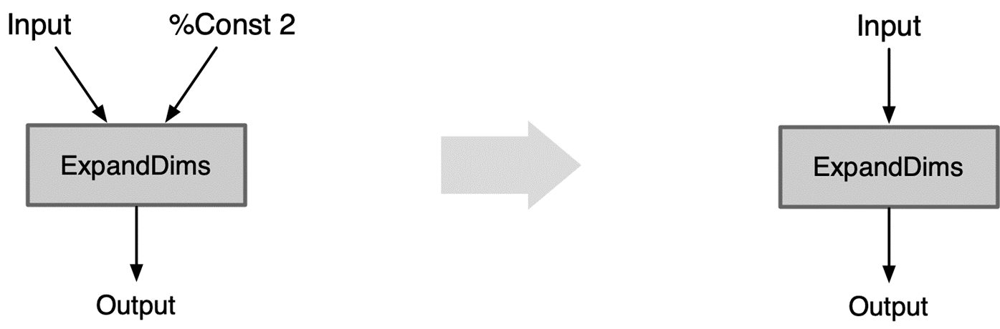
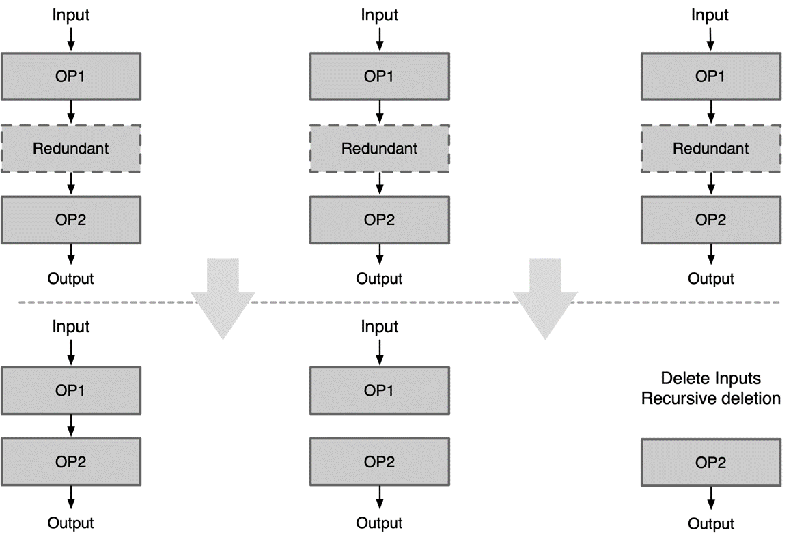
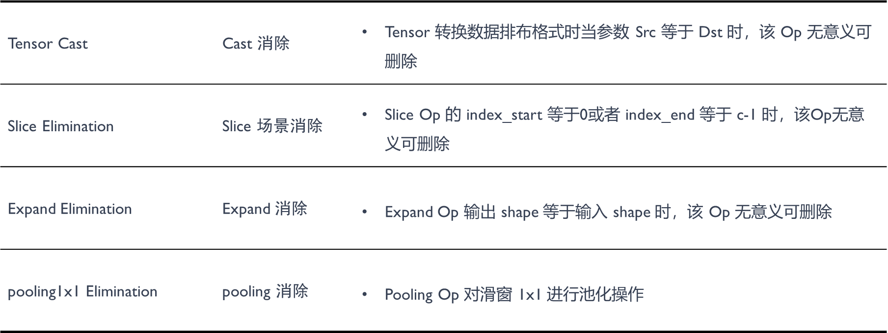
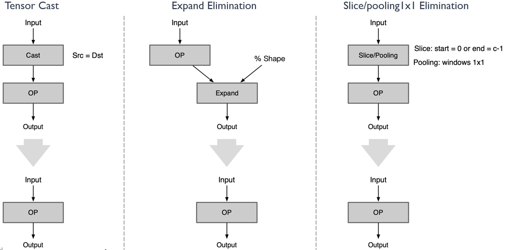
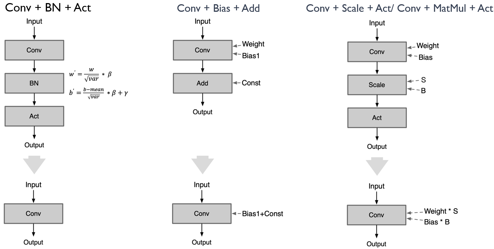

<!--Copyright © 适用于[License](https://github.com/chenzomi12/AISystem)版权许可-->

# 常量折叠&冗余节点消除

上一章节主要回顾了计算图优化的各个组成部分，包括基础图优化、扩展优化以及布局和内存优化。这些优化方式在预优化阶段、优化阶段和后优化阶段都有所应用，以提高计算效率。同时，还介绍了AI框架和推理引擎在图优化方面的不同应用和侧重点。接下来，我们从计算图优化的各个组成部分开始逐步进行讲解。

## Basic Graph Optimizations 基础图优化

基础图优化指涵盖了所有保留语义的修改，如常量折叠、冗余节点消除和有限数量的节点融合，具体如下所示：

1.Constant folding 常量折叠

2.Redundant eliminations 冗余节点消除

3.Operation fusion 算子融合

4.Operation Replace 算子替换

5.Operation Forward 算子前移

## 计算图优化-常量折叠

### Constant Folding 常量折叠

常量折叠：Constant folding，常量折叠，编译器优化技术之一，通过对编译时常量或常量表达式进行计算来简化代码。常量折叠是将计算图中可以预先可以确定输出值的节点替换成常量，并对计算图进行一些结构简化的操作。

传统编译器常量折叠，示例代码如下所示:

```c 语言
int main() {
    const int a = 100;
    int b = a + 100;
    printf(“b is %d\n”, b);
    return 0;
}
```

其中 b 的值只依赖于 a 的值, 由于 a 为常量, 其取值在编译阶段就确定了, 因此也可以在编译阶段计算得到 b 的值, 所以上面的代码经过常量折叠优化后,等价于下面的代码:

```c 语言
int main() {
    printf(“b is %d\n”, 200);
    return 0;
}
```

深度学习编译器中的常量折叠和传统编译器是类似的, 只需将输入变为 Tensor 即可. 比如对于下面的一个网络:

```c 语言
A = const([3, 5], 1.0, fp32)
B = const([3, 5], 0.5, fp32)
C = var([5, 4], fp32)
D = dot(A + B, C)
```

通过常量折叠后, 就可以变为:

```c 语言
TMP = const([3, 5], 1.5, fp32)
C = var([5, 4], fp32)
D = dot(TMP, C)
```

具体方法如下所示：

Constant folding：Const 折叠，常量折叠如果一个 Op 所有输入都是常量 Const，可以先计算好结果 Const 代替该 Op，而不用每次都在推理阶段都计算一遍

Fold Const To ExpandDims：ExpandDims 折叠，ExpandDims Op 指定维度的输入是常量 Const，则把这个维度以参数的形式折叠到 ExpandDims 算子中

Fuse Const To Binary：Binary 折叠，Binary Op 第二个输入是标量 Const，把这个标量以参数形式折叠到 Binary Op 的属性中

(1) Constant folding 常量折叠：如果一个 Op 所有输入都是常量 Const，可以先计算好结果Const 代替该 Op，而不用每次都在推理阶段都计算一遍。


(2) ExpandDims 折叠： ExpandDims Op 指定维度的输入是常量 Const，则把这个维度以参数的形式折叠到 ExpandDims 算子中。



(3) Binary 折叠： Binary Op 第二个输入是标量 Const ，把这个标量以参数的形式折叠到 Binary Op 的属性中。


## 计算图优化-冗余节点消除

冗余节点消除：在不改变图形结构的情况下删除所有冗余节点，目前支持 Identity Elimination、Slice Elimination、Unsqueeze Elimination、 Dropout Elimination 优化方式

### Op 本身无意义

有些 Op 本身不参与计算，在推理阶段可以直接去掉对结果没有影响。如下图所示，在转换前后类型相同的 cast，只有一个输入 tensor 的 concat，以及 Seq2Out、Identity、NoOp、Print、Assert、StopGradient、Split 等算子均可以通过一系列的模板删除包括 dropout 算子。


具体示例如下图所示：

当图中存在冗余算子时，可能会出现以下三种情况：

1、当前冗余算子的输出对于下一个节点是有意义的：可以直接去除冗余算子，然后将上一个算子的输出和下一个算子的输入相连

2、当前冗余算子的输出对于下一个节点是无意义的：此时可以把它切成两个子图，一个子图就是 input->op1，另一个子图则是 op2->output

3、当前冗余算子的输入对于下一个节点是无意义的：只要这个节点的输入没有意义，轮循删除往上的节点，直到输入有意义为止。



### Op 参数无意义

有些 Op 本身是有意义，但是设置成某些参数后就变成了无意义了的 Op。典型示例如 cast 算子，其主要是对数据的排布进行转换，当输入的参数等于输出的参数的时候，算子本身则无意义且可删除。还有很多种其他情况下的算子，在删除处理后，实践证明对于模型性能的提升具有极大的帮助。如下图所示：



详细示例如下所示：

（1）对于 cast 算子，当它的 source 等于 destination 的时候，cast 算子可以删除

（2）对于 ExpandDims 算子，当输出的 shape 跟输入的 shape 是一致时，ExpandDims 算子可以删除

（3）对于 slice/pooling 算子，index_start 等于 0 或者 index_end 等于 channel-1 以及 pooling 算子的窗口为 1x1 的时候，算子均可删除



### Op 位置无意义

一些 Op 在计算图中特殊位置会变得多余无意义。


详细示例如下所示：

示例中的 cast 算子，unsqueeze 算子以及无后续输出的 op1 和在 global pooling 之后的 reshape/flatten 算子等，均可以进行冗余算子的消除。


### Op 前后反义

前后两个相邻 Op 进行操作时，语义相反的两个 Op 都可以删除

Squeeze ExpandDims Eliminate: Squeeze和ExpandDims这两个Op是反义的,一个压缩维度，一个是拓展维度，当连续的这两个Op指定的axis相等时即可同时删除这两个Op

Inverse Cast Eliminate: 当连续的两个内存排布转换Op的参数前后反义，即src1等于dst2,可同时删除这两个 Op

Quant Dequant Eliminate: 连续进行量化和反量化，可同时删除这两个 Op

Concat Slice Elimination: 合并后又进行同样的拆分，可同时删除这两个 Op

详细示例如下所示：可参考上述规则，对于存在前后反义算子的情况，进行冗余节点的消除


### 公共子图

在一个深度神经网络中，如果几个子图的类型、参数和输入均相同, 则将他们称做公共子图。 对于公共子图, 只需要计算其中一个子图的值, 其他子图的值可以通过赋值得到。这个过程就称作公共子图消除, 它是一种传统编译器中常用的优化手段, 经过迁移也可以应用到深度学习编译器中。

Common Subexpression Elimination：当模型当中出现了公共子图，如一个输出是另外两个同类型同参数的Op的输入，则可进行删除其中一个Op。

基本思路是通过一个 MAP 表, 记录截止当前, 已处理过的同一种类型的 OP。 对于当前正在处理的 OP, 先查找该 MAP 表, 如果能找到其他和正在处理的 OP 类型相同的 OP, 则对他们进行遍历, 如果其中某个 OP 的输入和参数与当前正在处理的 OP 相同, 则它们为公共子表达式, 结果可以互相替代；如果所有 OP 都不能与当前正在处理的 OP 匹配, 则将当前 OP 复制一份返回。


## 计算图优化-算子融合

算子融合（Operator Fusion）是深度学习中一种常见的优化技术，主要用于减少GPU内存访问，从而提高模型的执行效率。在深度学习模型中，一个模型通常由多个算子（例如卷积、激活函数、池化等）组成，这些算子的计算过程中会涉及到大量的数据的读取和写入。如果能将多个算子融合为一个复合算子，就可以减少内存访问次数，从而提高模型的运行效率。

例如，假设我们有一个计算过程：`y = ReLU(Conv(x))`，如果我们将这个计算过程拆分为两步：`temp = Conv(x)`，`y = ReLU(temp)`，那么我们需要先将`Conv(x)`的结果写入内存，然后再从内存中读取这个结果用于ReLU的计算。但如果我们将这两个算子融合为一个算子，那么就可以直接将`Conv(x)`的结果输入到ReLU，无需额外的内存访问，从而提高运行效率。

算子融合不仅可以减少内存访问次数，还可以提高计算密度，使得GPU等硬件能更充分地利用其计算资源。但是，算子融合也需要考虑到算子的计算顺序和计算精度，不能随意地将算子进行融合。下面将围绕相邻 Op 中，存在数学上线性可融合的关系进行主要的介绍：

示例一：

Conv + BN + Act：Conv Op 后跟着的 Batch Normal 的算子可以把 BN 的参数融合到Conv里面

Conv + Bias + Add：Conv Op 后跟着的 Add 可以融合到 Conv 里的 Bias 参数里面

Conv + Scale + Act：Conv Op 后跟着的 Scale 可以融合到 Conv 里的 Weight 里面

Conv + MatMul + Act：Conv Op 后跟着的 MatMul 可以融合到 Conv 里的 Weight 里面



示例二：

Matmul + Add：使用 GEMM 代替矩阵乘 Matmul + Add

Matmul + Scale：Matmul 前或者后接 Scale / Div 可以融合到 Matmul 的相乘系数 alpha 里

Mean + Add：使用 Mean 后面跟着 Add，使用 Layer Norm 代替

Batch Norm + Scale：scale 的 s 和 b 可以直接融合到 BN Op 里

Matmul + Batch Norm：与 Conv + BN 相类似

Matmul + Add：全连接层后 Add 可以融合到全连接层的 bias 中


最后，还有一种融合是算子与后续的激活相融合：Conv + ReLU、Conv + ReLU6、Conv + Act

Act 激活操作和 Conv 操作虽然是连续但是计算过程是独立的，在推理的时候是先计算 Conv 层：访问 Conv 输出位置，再计算 ReLU 层（即第二次访存）。因此造成了访问两遍输出output，增加了访存时间降低了推理效率。

如果计算出 Conv 结果后立马进行 Act 激活计算，把最终结果输出，则只需要访存一次。计算量不变，减少访存次数，也能提高推理速度。

## 计算图优化-算子替换

算子替换（Operator Substitution）是一种深度学习模型优化技术，主要用于改善模型的计算效率和性能。这种技术是将模型中的某些算子替换为功能相同或相似，但计算效率更高或对特定硬件优化更好的算子。

例如：

1、在某些情况下，两个连续的卷积层可以被替换为一个等效的卷积层，以减少计算量。

2、使用深度可分离的卷积（depthwise separable convolution）替换标准卷积，可以显著减少计算量，但仍能保持相似的性能。

算子替换需要保证替换后的模型在功能上与原模型尽可能接近，以保证模型的性能不会因为算子的替换而有所下降。算子替换的原理是通过合并同类项、提取公因式等数学方法，将算子的计算公式加以简化，并将简化后的计算公式映射到某类算子上。算子替换可以达到降低计算量、降低模型大小的效果。在实际应用中，算子替换通常与其他优化技术如算子融合等结合使用，以达到最佳的优化效果。

算子替换--一换一，将某 Op 以另外 Op 代替，能减少推理引擎需要单独实现及支持的 OP

具体示例：

MatMul -> Conv2D：将矩阵乘变成Conv，因为一般框架对Conv是做了更多的优化

Linear -> Conv2D：将全连接层转变成1x1 Conv，因为对Conv做了更多的优化

Batch Normal -> Scale：BN是等价于Scale Op的，转换成Scale计算量更少，速度更快

pReLU -> Leaky ReLU：将 pReLU 转变成 Leaky ReLU，不影响性能和精度的前提下，聚焦有限算法

Conv -> Linear After global pooling：在 Global Pooling 之后 Conv 算子转换成为全连接层


算子替换--一换多，将某 Op 以其他 Op 组合形式代替，能减少推理引擎需要单独实现及支持 Op 数量

具体示例：

Shuffle Channel Replace：Shuffle Channel Op 大部分框架缺乏单独实现，可以通过组合 Reshape + Permute实现

Pad Replace：将老版onnx的pad-2的pads从参数形式转成输入形式

ShapeN Replace：将 ShapeN Op 通过组合多个 Shape 的方式实现

Group Conv Replace：把Group 卷积通过组合 Slice、Conv 实现


## 计算图优化-算子前移

在深度学习模型优化中，算子前移通常指的是将某些计算过程提前进行，以减少重复计算并提高模型的运行效率。

例如，假设我们有一个深度学习模型，其中有一部分计算是固定的，即无论输入是什么，这部分计算的结果都不会改变。在这种情况下，我们就可以将这部分计算提前进行，并将结果保存下来。然后在实际的计算过程中，我们只需要使用保存的结果，而无需再次进行这部分计算。这样就可以大大减少计算量，提高模型的运行效率。

算子前移是一种常见的深度学习模型优化技术，它可以有效地减少计算量，提高模型的运行效率。然而，算子前移也需要考虑到模型的计算顺序和数据依赖性，不能随意地将计算过程提前。

具体示例：

Slice and Mul：Shuffle Channel Op 大部分框架缺乏单独实现，可以通过组合 Reshape + Permute实现

Bit shift and Reduce Sum：利用算术简化中的交换律，对计算的算子进行交换减少数据的传输和访存次数


## 计算图优化02回顾

1）小结 

本章节简要围绕计算图优化中常量折叠&冗余节点消除进行了介绍，在了解计算图优化的相关方式的基础上，针对常量折叠和冗余节点消除进行了详细的展开，重点探讨了 cast 算子、ExpandDims 算子、Squeeze 算子以及 Slice 等算子在神经网络中不同搭配组合时，可以进行优化的情况，以达到减少重复计算和冗余计算的目的。

2）视频更新链接（1）：<iframe src="https://www.bilibili.com/video/BV1fA411r7hr/?spm_id_from=333.788" width="100%" height="500" scrolling="no" border="0" frameborder="no" framespacing="0" allowfullscreen="true"> </iframe>

3）视频更新链接（2）：<iframe src="https://www.bilibili.com/video/BV1Qj411T7Ef/?spm_id_from=333.788" width="100%" height="500" scrolling="no" border="0" frameborder="no" framespacing="0" allowfullscreen="true"> </iframe>
