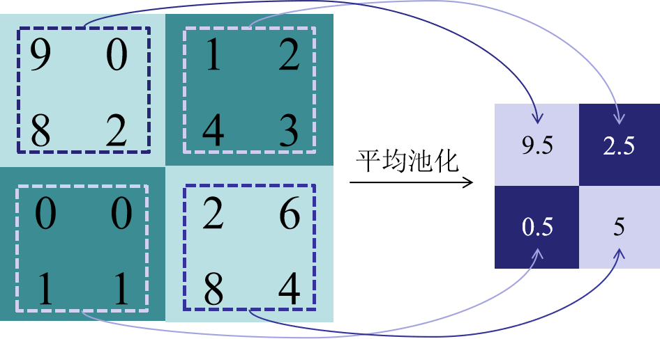
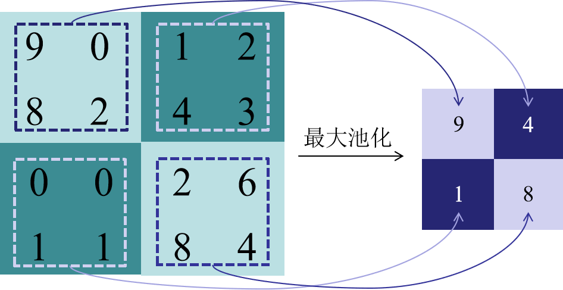

# 卷积操作原理


卷积是神经网络里面的核心计算之一，它是一种特殊的线性运算。卷积神经网络（CNN）是针对图像领域任务提出的神经网络，其受猫的视觉系统启发，堆叠使用卷积层和池化层提取特征。它在 CV 领域方面的突破性进展引领了深度学习的热潮。卷积的变种丰富，计算复杂，神经网络运行时大部分时间都耗费在计算卷积，网络模型的发展在不断增加网络的深度，因此优化卷积计算就显得尤为重要。

本章首先介绍了卷积在数学范畴中的定义，之后介绍了CNN中的卷积计算的定义。卷积层是卷积神经网络的核心部分，它通过对输入图像进行卷积操作来提取图像的特征，本章以Lenet-5为例对典型CNN网络的结构和参数进行了分析。在了解了卷积计算的基础上，本章介绍了卷积在内存中的数据格式以及张量中的卷积计算过程。


## 卷积神经网络的数学原理

在通常形式中，卷积是对两个实变函数的一种数学运算。在泛函分析中，卷积、旋积或褶积 (Convolution) 是通过两个函数f和g生成第三个函数的一种数学运算，其本质是一种特殊的积分变换，表征函数 f 与 g 经过翻转和平移的重叠部分函数值乘积对重叠长度的积分。

卷积神经网络（Convolution Neural Networks, CNN）的概念拓展自信号处理领域的卷积。信号处理的卷积定义为：

$$
(f*g)(t)\triangleq\int_{\mathbb{R}^{n}}f(\tau)g(t-\tau)d\tau 
$$

可以证明，关于几乎所有的实数 x，随着 x 的不同取值，积分定义了一个新函数 ℎ(x)，称为函数 f 与 g 的卷积，记为：

$$
f(t)=(f*g)(t)
$$

卷积计算在直觉上不易理解，其可视化后如下图所示。图中红色滑块在移动过程中与蓝色方块的积绘制成的三角图案即为卷积结果在各点上的取值：

 

对于信号处理的卷积定义为连续的表示，真正计算的过程中会把连续用离散形式进行计算：

$$
(f*g)(n)\triangleq\sum_{\mathbb{Z}^{n}}f(m)g(n-m) 
$$

将该离散卷积公式拓展到二维空间即可得到神经网络中的卷积，可简写为：

$$
S(i,j)=(I^{*}K)(i,j)=\sum_{m}\sum_{n}I(i-m,j-n)K(m,n) 
$$

>其中：
 S为卷积的输出； I为卷积输入； K为卷积核的尺寸；


## CNN中的卷积计算

CNN主要由卷积层、池化层和全连接层三个部分构成。其中，卷积层是卷积神经网络的核心部分，它通过对输入图像进行卷积操作来提取图像的特征。卷积层的输入通常是一个多通道的（例如多通道图像），每个通道代表一个特征，卷积层的输出也是多通道的，其中每个通道表示一个不同的特征。

如图1所示, 神经网络中的卷积计算过程可描述为：3 * 3 的卷积核在 8 * 8 的图像上进行滑动，每次滑动时，都把卷积核和对应位置的元素进行相乘再求和。青色区域为其感受野。

  

### 名词解释：

>填充（padding）：防止图像边缘信息丢失，在输入图像的周围添加额外的行/列。其作用为使卷积后图像分辨率不变，方便计算特征图尺寸的变化，弥补边界
>步长（Stride）：步长是指卷积核在每一次卷积操作中滑动的距离。步长的大小可以影响输出数据的大小，也可以影响特征提取能力和计算复杂度。当步长增大时，输出数据的尺寸会减小，特征提取能力会变弱，但计算速度会加快。
>通道数（Channel）：通道数也称为深度或特征图数量，是指卷积神经网络中每一层输出的特征图数量。通道数的大小直接影响了卷积神经网络的特征提取能力和计算复杂度。通过增加通道数，可以增强卷积神经网络的特征提取能力，但也会增加计算复杂度。


>卷积核：是具有可学习参数的算子，用于对输出图像进行特征提取，输出通常为特征图。每一个卷积核代表一种模式/特征，有几个卷积核就有几张特征图,每一个卷积核都对应一个特征图。在机器学习中，卷积核的参数是由反向传播/梯度下降算法计算更新，非人工设置。其特点为：
   1. 卷积核每次仅连接K×K区域，K×K是卷积核的尺寸；
   2. 卷积核参数重复使用（参数共享），在图像上滑动。


>特征图：输出特征图的尺寸的计算公式为如下所示。
$$
F_{out}=\left[\frac{F_{in}-k+2p}s\right]+1 
$$

以下是针对各层的详细描述：

卷积层用来提取图像的底层特征。在常见的RGB图像三通道(Channel)卷积计算中，如图2所示：

 

其过程可描述为：红色的卷积核层和红色通道的层进行卷积计算，绿色的卷积核层和绿色通道的层进行卷积计算，蓝色同上。之后三个通道的计算结果加起来作为最后的输出结果。假设在图2中输入图像尺寸为6×6 ，通道数为3，卷积核有1个，每个尺寸为3×3，通道数为3（与输入图像通道数一致）。卷积时，仍是以滑动窗口的形式，从左至右，从上至下，3个通道的对应位置相乘求和，输出结果为4×4×1的特征图。

该动画源于：[RGB三通道卷积](https://thomelane.github.io/convolutions/2DConvRGB.html/ "RGB三通道卷积")

池化层用于降低特征图的空间分辨率，并增强模型对输入图像的平移不变性和鲁棒性。其基本思想为：使用1个像素表示一块区域的像素值（均值或最值）。

常用的池化方式包括最大池化和平均池化。最大池化的操作是在一个滑动窗口中取最大值作为输出，平均池化的操作是在一个滑动窗口中取平均值作为输出。如下图所示，其中滑动步长为2。

  

 

全连接层通常用于将卷积层和池化层提取的特征进行分类或回归。它的输入是一维向量，其输出的维度与任务的分类数或回归值的维度相同。


### 卷积网络的过程（以LeNet-5手写数字识别为例）：

LeNet-5的基本结构包括7层网络结构（不含输入层），其中包括2个卷积层、2个降采样层（池化层）、2个全连接层和输出层。


第一步把手写数字图片转成灰度图像。此时图像大小为：32×32；

C1（Convolutional layer C1）: 通过6个卷积核（每个卷积核的大小为 5×5 ，步长为1，填充为0）对灰度图进行卷积计算，生成6张特征图。特征图大小的计算过程为：
$$
F_{out}=\left[\frac{32-5}1\right]+1=28
$$

S2（Subsampling layer S2）：通过6个卷积核（每个卷积核的大小为 2×2 ，步长为2，填充为0）对上述特征图进行下采样，即池化操作，特征图大小的计算过程为：
$$
F_{out}=\left[\frac{28-2}2\right]+1=14
$$

C3（Convolutional layer C3）：再经16个卷积核（每个卷积核的大小为 5×5 ，步长为1，填充为0）对池化结果再次进行卷积，得到16张特征图，特征图大小的计算过程为：
$$
F_{out}=\left[\frac{14-5}1\right]+1=10
$$

S4（Subsampling layer S4）：再通过16个卷积核（每个卷积核的大小为 2×2 ，步长为2，填充为0）对前述特征图进行下采样，得到16张特征图，其大小的计算过程为：
$$
F_{out}=\left[\frac{10-2}2\right]+1=5
$$

C5（Fully connected layer C5）：通过120个5×5的卷积，将S4得到的16个 5×5 的特征图计算为120个长度为1×1的特征图，并通过一个带有120个神经元的全连接层进行连接。120是由 LeNet-5 的设计者根据实验得到的最佳值。
$$
F_{out}=\left[\frac{5-5}1\right]+1=1
$$

F6（Fully connected layer F6）：全连接层F6将120个神经元连接到84个神经元。


最终的输出层由10个神经元组成，每个神经元对应0-9中的一个数字，并输出最终的分类结果。在训练过程中，使用交叉熵损失函数计算输出层的误差，并通过反向传播算法更新卷积核和全连接层的权重参数。最终输出到softmax层，得到识别结果。


## 卷积的计算分析及实现（LeNet-5）


### 1 计算分析

>定义：
H：图片高度；
W：图片宽度；
C：原始图片通道数；
N：卷积核个数；
K：卷积核高宽大小；
P：图像边扩充大小；
S：滑动步长。

在卷积操作中卷积核是可学习的参数，经过上面的介绍，每层卷积的参数大小为C×K×K×N。卷积层的参数较少，这也是由卷积层的主要特性即局部连接和共享权重所决定。

局部连接：每个神经元仅与输入神经元的一块区域连接，这块局部区域称作感受野（receptive field）。在图像卷积操作中，即神经元在空间维度（spatial dimension，即在图像平面滑动区域）是局部连接，但在深度（通道方面的计算）上是全部连接。这种局部连接保证了学习后的卷积核能够对于局部的输入特征有最强的响应。

权重共享：计算同一个输出特征图时采用的卷积核是共享的，即一个卷积核在输入图像上滑动，产生一张特征图。该特征图的每个像素点都是由上述卷积核在输入图像上滑动卷积计算产生。这样可以很大程度上减少参数。在卷积层，通常采用多个卷积核提取不同特征，单个卷积核的不同通道之间权重不共享（比如RGB有三通道，每个通道的权重参数相互独立）。另外，偏置参数对同一个卷积核的各个参数共享。


#### 各层参数详解：

C1（Convolutional layer C1）: 

>输入图片大小：32×32
卷积核大小：5×5
卷积核通道数：1
卷积核个数：6
步长：1
填充：0
输出特征图大小：28×28
产生特征图数量：6

共产生连接数：
$$
（5×5+1）×6×28×28=122304 
$$

最终的特征图大小为28×28，共784个像素点。每个像素点由一次卷积计算产生，每次卷积计算产生156条连接，共计122304条连接。

可训练参数：
$$
(5×5+1) × 6=156
$$

该层共6个卷积核，每个卷积核有5×5=25个权值参数，+1代表的是每个卷积核进行卷积操作之后需要有一个额外的偏置参数。


S2（Subsampling layer S2）: 

>输入特征图大小：28×28
输入特征图数量：6
池化区域：2×2
池化方式：对输入矩阵中2×2的区域中的全部元素先求和，接着乘上一个可训练的系数$$ w_i$$ ，再加上一个偏置项 $$ b_i $$ ，最后通过一个sigmoid函数，得到最终的输出。
步长：2
填充：0
输出特征图大小：14×14
产生特征图数量：6

共产生连接数：
$$
（2×2+1）×6×14×14=5880 
$$

最终的特征图大小为14×14，共196个像素点。每个像素点由一次池化计算产生，每次池化计算产生5条连接，共6个卷积核，共计5880条连接。

可训练参数：
$$
6 × 2=12
$$

该层共6个28×28的特征图作为输入。每张特征图的池化方式为：对输入矩阵中2×2的区域中的全部元素先求和，接着乘上一个可训练的系数$$ w_i$$ ，再加上一个偏置项 $$ b_i $$ ，最后通过一个sigmoid函数，得到最终的输出。即对一张特征图进行上述池化操作需要的可训练参数只有2个，即系数$$ w_i$$ 和偏置 $$ b_i $$ ，6张特征图共计有12个可训练参数。


C3（Convolutional layer C3）: 

>输入特征图大小：14×14
输入特征图数量：6
卷积核大小：5×5
卷积核通道数：视每组特征图数量而定
卷积核个数：16
步长：1
填充：0
输出特征图大小：10×10
产生特征图数量：16

注意：S2中的所有特征图并不直接与C3中的每一个卷积核全部相连！

  


C3的前6个特征图（对应①）：由C3层中的前6个卷积核（编号0,1,2,3,4,5）分别与S2层中的连续的3张特征图（编号：012,123,234,345,450,501）相连接产生；

C3的6-11号特征图（对应②）：由C3层中的6,7,8号卷积核分别与S2层中连续的4张特征图（编号：0123,1234,2345,3450,4501,5012）相连接产生；

C3的12-14号特征图（对应③）：由C3层中的9,10,11,12,13,14号卷积核分别与S2层中不连续的4张特征图（编号：0134,1245,0235）相连接产生；

C3的最后一个特征图（对应④）：由C3层中的15号卷积核与S2层的所有特征图相连接产生。

>为什么S2中的所有特征图不直接与C3中的每一个卷积核全部相连呢？
作者认为有2点原因：第一是因为不使用全连接能够保证有连接的数量保持在一个合理的界限范围内可以减少参数。第二是通过这种方式可以打破对称性，不同的卷积核通过输入不同的特征图以期望得到互补的特征。


共产生连接数：
$$
①: (5×5×3+1)×6=456
$$
$$
②,③: (5×5×4+1)×9=909
$$
$$
④: (5×5×6+1)×1=151
$$
$$
(456+909+151)×10×10=151600
$$

最终的特征图大小为10×10，共100个像素点。①中一个卷积核要对3张特征图进行卷积操作，一共有6个卷积核，共计产生456条连接；②和③中一个卷积核要对4张特征图进行卷积操作，一共有9个卷积核，共计产生909条连接；④中一个卷积核要对6张特征图进行卷积操作，一共有1个卷积核，共计产生151条连接。综上，C3层中共计产生151600条连接。

可训练参数：
$$
①: (5×5×3+1)×6=456
$$
$$
②,③: (5×5×4+1)×9=909
$$
$$
④: (5×5×6+1)×1=151
$$
$$
456+909+151=1516
$$
该层共16个卷积核，每个卷积核有5×5=25个权值参数，①组卷积核通道数为3，②和③组卷积核通道数为4，④组通道数为6。+1代表的是每个卷积核进行卷积操作之后需要有一个额外的偏置参数。


S4（Subsampling layer S4）：
>输入特征图大小：10×10
输入特征图数量：16
池化区域：2×2
池化方式：对输入矩阵中2×2的区域中的全部元素先求和，接着乘上一个可训练的系数$$ w_i$$ ，再加上一个偏置项 $$ b_i $$ ，最后通过一个sigmoid函数，得到最终的输出。
步长：2
填充：0
输出特征图大小：5×5
产生特征图数量：16

共产生连接数：
$$
（2×2+1）×16×5×5=2000 
$$

最终的特征图大小为5×5，共25个像素点。每个像素点由一次池化计算产生，每次池化计算产生5条连接，共16个卷积核，共计5880条连接。

可训练参数：
$$
16 × 2=32
$$

该层共16个10×10的特征图作为输入。每张特征图的池化方式为：对输入矩阵中2×2的区域中的全部元素先求和，接着乘上一个可训练的系数$$ w_i$$ ，再加上一个偏置项 $$ b_i $$ ，最后通过一个sigmoid函数，得到最终的输出。即对一张特征图进行上述池化操作需要的可训练参数只有2个，即系数$$ w_i$$ 和偏置 $$ b_i $$ ，6张特征图共计有32个可训练参数。


C5（Convolutional layer C5）: 

>输入特征图大小：5×5
输入特征图数量：16
卷积核通道数：1
卷积核个数：120
步长：1
填充：0
输出特征图大小：1×1
产生特征图数量：6

C5中的120个卷积核与S4层的全部16个特征图全相连。

共产生连接数：
$$
（16×5×5+1）×120×1×1=48120 
$$
可训练参数：
$$
（16×5×5+1）×120×1×1=48120 
$$
最终的特征图大小为1×1，这里形成120个卷积结果。每个卷积核都与上一层的16个特征图图相连。所以共有 48120个参数，同样有48120个连接。


F6 是全连接层，共有 84 个神经元，与 C5 层进行全连接，即每个神经元都与 C5 层的 120 个1×1的特征图相连。计算输入向量和权重向量之间的点积，再加上一个偏置，结果通过 sigmoid 函数输出。

F6 层有 84 个节点，对应于一个 7x12 的比特图，-1 表示白色，1 表示黑色，这样每个符号的比特图的黑白色就对应于一个编码。该层的训练参数和连接数为：
$$
(120 + 1)×84=10164
$$


最后的 Output 层也是全连接层，是 Gaussian Connections，采用了 RBF 函数（即径向欧式距离函数），计算输入向量和参数向量之间的欧式距离（目前已经被Softmax 取代）。

Output 层共有 10 个节点，分别代表数字 0 到 9。假设x是上一层的输入，y 是 RBF的输出，则 RBF 输出的计算方式是：
$$
y_i=\sum_{j=0}^{83}(x_j-w_{ij})^2
$$
上式中 i 取值从 0 到 9，j 取值从 0 到83，w 为参数。RBF 输出的值越接近于 0，则越接近于 i，即越接近于 i 的 ASCII 编码图，表示当前网络输入的识别结果是字符 i。
该层的训练参数和连接数为：
$$
10×84=840
$$


### 2 基于pytorch的实现

该代码源于：[Lenet-5手写数字识别](https://github.com/RedstoneWill/CNN_PyTorch_Beginner/blob/main/LeNet-5 "Lenet-5手写数字识别")

#### 2.1 环境准备及数据集预处理

导入 PyToch 的相关算法库：
```
import torch
import torch.nn as nn
import torch.nn.functional as F
import torch.optim as optim
from torchvision import datasets, transforms
import time
from matplotlib import pyplot as plt

```

LeNet-5 网络输入原始图像的大小为 32x32，MNIST 数据集图片大小为 28x28，因此使用 transforms.Resize 将输入图片尺寸调整为 32x32。尺寸和方向调整后，将图像转换为张量，然后使用Normalize函数对图像进行标准化。
Pytorch中的ToTensor函数会将图像像素值缩放到0到1之间，并将图像数据类型转换为张量。Normalize函数的两个参数分别是均值和标准差，这里的均值和标准差是提前计算得到的。

```
pipline_train = transforms.Compose([
    #随机旋转图片
    transforms.RandomHorizontalFlip(),
    #将图片尺寸resize到32x32
    transforms.Resize((32,32)),
    #将图片转化为Tensor格式
    transforms.ToTensor(),
    #正则化(当模型出现过拟合的情况时，用来降低模型的复杂度)
    transforms.Normalize((0.1307,),(0.3081,))    
])
pipline_test = transforms.Compose([
    #将图片尺寸resize到32x32
    transforms.Resize((32,32)),
    transforms.ToTensor(),
    transforms.Normalize((0.1307,),(0.3081,))
    #其中，0.1307和0.3081是mnist数据集的均值和标准差，因为mnist数据值都是灰度图，     #所以图像的通道数只有一个，因此均值和标准差各一个
])
#下载数据集
train_set = datasets.MNIST(root="./data", train=True, download=True, transform=pipline_train)
test_set = datasets.MNIST(root="./data", train=False, download=True, transform=pipline_test)
#加载数据集
trainloader = torch.utils.data.DataLoader(train_set, batch_size=64, shuffle=True)
testloader = torch.utils.data.DataLoader(test_set, batch_size=32, shuffle=False)
```

#### 2.2 搭建网络，定义前向传播过程

核心函数：

C1层：$$ C_in $$ =32×32, Channel=1,Kernel_num=6,Kernel_size=5×5,stride=1，padding=0
```
	self.conv1 = nn.Conv2d(1, 6, 5)
	self.relu = nn.ReLU() #激活函数为ReLU
```

S2层：$$ F_in $$ =28×28,Channel=1,Kernel_num=6,pool_size=2×2,stride=2，padding=0
```
	self.maxpool1 = nn.MaxPool2d(2, 2) #代码中使用的是最大池化
```

C3：$$ C_in $$ =14×14, Channel(S2输出的特征图数量) =6, Kernel_num=16, Kernel_size=5×5, stride=1，padding=0
```
	self.conv2 = nn.Conv2d(6, 16, 5) 
	#代码中对前述方法进行了简化，直接定义为16个卷积核与6通道全连接
```

S4：$$ F_in $$ =10×10,Channel(C3输出的特征图数量)=16,Kernel_num=6, pool_size=2×2, stride=2，padding=0
```
	self.maxpool2 = nn.MaxPool2d(2, 2)
```

C5：根据前述方法，计算得到120维向量
```
	self.fc1 = nn.Linear(16*5*5, 120)
```

F6：全连接层
```
self.fc2 = nn.Linear(120, 84)

```

输出层：
```
self.fc3 = nn.Linear(84, 10)
```

完整定义：
```
class LeNet(nn.Module):
    def __init__(self):
        super(LeNet, self).__init__()
        self.conv1 = nn.Conv2d(1, 6, 5) 
        self.relu = nn.ReLU()
        self.maxpool1 = nn.MaxPool2d(2, 2)
        self.conv2 = nn.Conv2d(6, 16, 5)
        self.maxpool2 = nn.MaxPool2d(2, 2)
        self.fc1 = nn.Linear(16*5*5, 120)
        self.fc2 = nn.Linear(120, 84)
        self.fc3 = nn.Linear(84, 10)

#定义前向过程
    def forward(self, x):
        x = self.conv1(x)
        x = self.relu(x)
        x = self.maxpool1(x)
        x = self.conv2(x)
        x = self.maxpool2(x)
        x = x.view(-1, 16*5*5)
        x = F.relu(self.fc1(x))
        x = F.relu(self.fc2(x))
        x = self.fc3(x)
        output = F.log_softmax(x, dim=1)
        return output
```

#### 2.3 将定义好的网络结构搭载到 GPU/CPU，并定义优化器

```
#创建模型，部署gpu
device = torch.device("cuda" if torch.cuda.is_available() else "cpu")
model = LeNet().to(device)
#定义优化器
optimizer = optim.Adam(model.parameters(), lr=0.001)
```

#### 2.4 定义训练过程

```
def train_runner(model, device, trainloader, optimizer, epoch):
    #训练模型, 启用 BatchNormalization 和 Dropout, 将BatchNormalization和Dropout置为True
    model.train()
    total = 0
    correct =0.0


    #enumerate迭代已加载的数据集,同时获取数据和数据下标
    for i, data in enumerate(trainloader, 0):
        inputs, labels = data
        #把模型部署到device上
        inputs, labels = inputs.to(device), labels.to(device)
        #初始化梯度
        optimizer.zero_grad()
        #保存训练结果
        outputs = model(inputs)
        #计算损失和
        #多分类情况通常使用cross_entropy(交叉熵损失函数), 而对于二分类问题, 通常使用sigmod
        loss = F.cross_entropy(outputs, labels)
        #获取最大概率的预测结果
        #dim=1表示返回每一行的最大值对应的列下标
        predict = outputs.argmax(dim=1)
        total += labels.size(0)
        correct += (predict == labels).sum().item()
        #反向传播
        loss.backward()
        #更新参数
        optimizer.step()
        if i % 1000 == 0:
            #loss.item()表示当前loss的数值
            print("Train Epoch{} \t Loss: {:.6f}, accuracy: {:.6f}%".format(epoch, loss.item(), 100*(correct/total)))
            Loss.append(loss.item())
            Accuracy.append(correct/total)
    return loss.item(), correct/total
```

#### 2.5 定义测试过程

```
def test_runner(model, device, testloader):
    #模型验证, 必须要写, 否则只要有输入数据, 即使不训练, 它也会改变权值
    #因为调用eval()将不启用 BatchNormalization 和 Dropout, BatchNormalization和Dropout置为False
    model.eval()
    #统计模型正确率, 设置初始值
    correct = 0.0
    test_loss = 0.0
    total = 0
    #torch.no_grad将不会计算梯度, 也不会进行反向传播
    with torch.no_grad():
        for data, label in testloader:
            data, label = data.to(device), label.to(device)
            output = model(data)
            test_loss += F.cross_entropy(output, label).item()
            predict = output.argmax(dim=1)
            #计算正确数量
            total += label.size(0)
            correct += (predict == label).sum().item()
        #计算损失值
        print("test_avarage_loss: {:.6f}, accuracy: {:.6f}%".format(test_loss/total, 100*(correct/total)))
```

#### 2.6 训练运行

```
# 调用
epoch = 5
Loss = []
Accuracy = []
for epoch in range(1, epoch+1):
    print("start_time",time.strftime('%Y-%m-%d %H:%M:%S',time.localtime(time.time())))
    loss, acc = train_runner(model, device, trainloader, optimizer, epoch)
    Loss.append(loss)
    Accuracy.append(acc)
    test_runner(model, device, testloader)
    print("end_time: ",time.strftime('%Y-%m-%d %H:%M:%S',time.localtime(time.time())),'\n')


print('Finished Training')
plt.subplot(2,1,1)
plt.plot(Loss)
plt.title('Loss')
plt.show()
plt.subplot(2,1,2)
plt.plot(Accuracy)
plt.title('Accuracy')
plt.show()
```

#### 2.7 保存模型

```
print(model)
torch.save(model, './models/model-mnist.pth') #保存模型
```

#### 2.8 测试模型

```
import cv2

if __name__ == '__main__':
    device = torch.device('cuda' if torch.cuda.is_available() else 'cpu')
    model = torch.load('./models/model-mnist.pth') 
    #加载训练后已保存的模型
    
    model = model.to(device)
    model.eval()    #把模型转为test模式
    
    #读取要预测的图片
    img = cv2.imread("./images/test_mnist.jpg")
    img=cv2.resize(img,dsize=(32,32),interpolation=cv2.INTER_NEAREST)
    plt.imshow(img,cmap="gray") # 显示图片
    plt.axis('off') # 不显示坐标轴
    plt.show()
    
    # 导入图片，图片扩展后为[1，1，32，32]
    trans = transforms.Compose(
        [
            transforms.ToTensor(),
            transforms.Normalize((0.1307,), (0.3081,))
        ])
    img = cv2.cvtColor(img, cv2.COLOR_BGR2GRAY)#图片转为灰度图，因为mnist数据集都是灰度图
    img = trans(img)
    img = img.to(device)
    img = img.unsqueeze(0)  #图片扩展多一维,因为输入到保存的模型中是4维的[batch_size,通道,长，宽]，而普通图片只有三维，[通道,长，宽]
    
    # 预测 
    #output = model(img)
    #predict = output.argmax(dim=1)
    #print(predict.item())
    
    
    
    # 预测 
    output = model(img)
    prob = F.softmax(output,dim=1) #prob是10个分类的概率
    print("概率：",prob)
    value, predicted = torch.max(output.data, 1)
    predict = output.argmax(dim=1)
    print("预测类别：",predict.item())
```


## 卷积的优化手段


### Tensor运算

张量（英文Tensor）是标量、矢量、矩阵等概念的总称与拓展，是机器学习领域的基础数据结构。程序中的张量是一个多维数组的数据结构。
```
#define MAX_DIM 6
struct Tensor {
    // 维度信息
    size_t dim[MAX_DIM];
    uint8_t num_dim;

    // 数据信息
    float* data;
    size_t num_data;
};
```

0维张量，就是一个数。1维张量等同于一个向量。2维张量对应一个矩阵。3维张量则是一个立方体。

 

张量集到张量集的映射称为张量计算。

用编程语言来说，输入是若干张量，输出也是若干个张量，并且无副作用（参考函数式编程）的函数称之为张量计算。

张量有 “维度” 和 “数据” 两个组成要素，张量计算，也就包含维度与数据这两个组成要素的处理。

比如矩阵乘法C = MatMul(A, B)，首先是根据输入的两个张量A, B确定C的维度，然后根据A和B的数据再去计算C的数据。具体一些可参考下面的代码：

```
Tensor* MatMul(Tensor* A, Tensor* B) {
    Tensor* C = new Tensor;
    // 计算维度
    C->num_dim = 2;
    C->dim[0] = A->dim[0];
    C->dim[1] = B->dim[1];

    // 分配内存
    C->data = malloc(C->dim[0]*C->dim[1]*sizeof(float));

    // 计算数据
    Matrix::multi(C, A, B);
    return C;
}
```


### Tensor内存布局

NHWC和NCHW是卷积神经网络(cnn)中广泛使用的数据格式。它们决定了多维数据，如图像、点云或特征图如何存储在内存中。

>NHWC(样本数，高度，宽度，通道):这种格式存储数据通道在最后，是TensorFlow的默认格式>NCHW(样本数，通道，高度，宽度):通道位于高度和宽度尺寸之前，经常与PyTorch一起使用。


### Tensor卷积运算

当中张量的内存布局为 NHWC 时，卷积计算相应的伪代码如下。其中外三层循环遍历输出C的每个数据点，对于每个输出数据都需要经由内三层循环累加求和得到（点积）。

```
for (int oh = 0; oh < OH; oh++) {
  for (int ow = 0; ow < OW; ow++) {
    for (int oc = 0; oc < OC; oc++) {
      C[oh][ow][oc] = 0;
      for (int kh = 0; kh < KH, kh++){
        for (int kw = 0; kw < KW, kw++){
          for (int ic = 0; ic < IC, ic++){
            C[oh][ow][oc] += A[oh+kh][ow+kw][ic] * B[kh][kw][ic];
          }
        }
      }
    }
  }
}
```

和矩阵乘的优化方法类似，我们也可针对该计算进行向量化、并行化、循环展开的基本的优化操作。


## 总结

本篇介绍了卷积计算的数学原理及其在CNN的应用过程。以Lenet-5为例，分析了Lenet-5中每层的参数计算情况和连接情况。可以观察到，当卷积核在图像上滑动的时候，参数量庞大，且部分参数进行了重复计算，造成了算力资源的浪费。为解决此问题。诸多研究者了各种各样的卷积优化算法，该部分将于后续文章进行详细介绍。


## 参考文献

- [1] [ 卷积神经网络优化算法 ]( https://zhenhuaw.me/blog/2019/convolution-neural-networks-optimization.html)
- [2] [ 卷积及其代码实现 ](https://blog.csdn.net/Biyoner/article/details/88916247)
- [3] [ 卷积算子优化 ](https://zhuanlan.zhihu.com/p/661166785)
- [4] [图像数据通道格式：NCHW和NHWC的区别](https://www.jianshu.com/p/61de601bc90f)
- [5] [Lecun Y , Bottou L .Gradient-based learning applied to document recognition[J].Proceedings of the IEEE, 1998, 86(11):2278-2324.DOI:10.1109/5.726791.](https://ieeexplore.ieee.org/document/726791)
- [6] [Fukushima, Kunihiko and Sei Miyake. “Neocognitron: A Self-Organizing Neural Network Model for a Mechanism of Visual Pattern Recognition.” (1982).](https://www.semanticscholar.org/paper/Neocognitron%3A-A-Self-Organizing-Neural-Network-for-Fukushima-Miyake/9b2541b8d8ca872149b4dabd2ccdc0cacc46ebf5)
- [7] [ Bouvrie J .Notes on Convolutional Neural Networks[J].neural nets, 2006.](https://www.semanticscholar.org/paper/Notes-on-Convolutional-Neural-Networks-Bouvrie/2a4393aa1bc3cb7fe2deecc88720bfb84dabb263)
- [8] [Krizhevsky A , Sutskever I , Hinton G .ImageNet Classification with Deep Convolutional Neural Networks[J].Advances in neural information processing systems, 2012, 25(2).DOI:10.1145/3065386.](https://dl.acm.org/doi/10.1145/3065386)
- [9] [卷积神经网络经典回顾之LeNet-5](https://zhuanlan.zhihu.com/p/616996325)
- [10] [网络解析（一）：LeNet-5详解](https://cuijiahua.com/blog/2018/01/dl_3.html)
- [11] [这可能是神经网络 LeNet-5 最详细的解释了！](https://cloud.tencent.com/developer/article/1931721)
- [12] [PyTorch实现经典网络之LeNet5](https://www.jianshu.com/p/56833f9d6d66)


## 本节视频

<html>
<iframe src="https://www.bilibili.com/video/BV1No4y1e7KX/?spm_id_from=333.337.search-card.all.click&vd_source=096daa038c279ccda6e4f8c5eea82de7" width="100%" height="500" scrolling="no" border="0" frameborder="no" framespacing="0" allowfullscreen="true"> </iframe>
</html>

