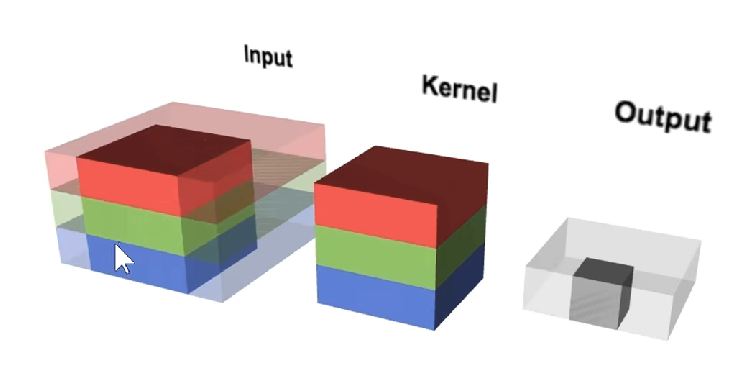
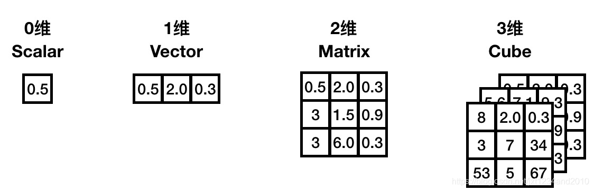

# 卷积操作原理

卷积是神经网络里面的核心计算之一，它是一种特殊的线性运算。卷积神经网络（CNN）是针对图像领域任务提出的神经网络，其受猫的视觉系统启发，堆叠使用卷积层和池化层提取特征。它在 CV 领域方面的突破性进展引领了深度学习的热潮。卷积的变种丰富，计算复杂，神经网络运行时大部分时间都耗费在计算卷积，网络模型的发展在不断增加网络的深度，因此优化卷积计算就显得尤为重要。

本章首先介绍了卷积在数学范畴中的定义，之后介绍了CNN中的卷积计算的定义。卷积层是卷积神经网络的核心部分，它通过对输入图像进行卷积操作来提取图像的特征，本章以Lenet-5为例对典型CNN网络的结构和参数进行了分析。在了解了卷积计算的基础上，本章介绍了卷积在内存中的数据格式以及张量中的卷积计算过程。
====（介绍了XXX，这种是过去式，这里还没有开始讲，用将来时，例如将要介绍XXX）

## 卷积的数学原理

==== （卷积的数学原理可以继续打开一层，深入到卷积里面，这里太粗浅，大家都知道）

在通常形式中，卷积是对两个实变函数的一种数学运算。在泛函分析中，卷积、旋积或褶积 (Convolution) 是通过两个函数f和g生成第三个函数的一种数学运算，其本质是一种特殊的积分变换，表征函数 f 与 g 经过翻转和平移的重叠部分函数值乘积对重叠长度的积分。

卷积神经网络（Convolution Neural Networks, CNN）的概念拓展自信号处理领域的卷积。信号处理的卷积定义为：

$$
(f*g)(t)\triangleq\int_{\mathbb{R}^{n}}f(\tau)g(t-\tau)d\tau 
$$

可以证明，关于几乎所有的实数 x，随着 x 的不同取值，积分定义了一个新函数 ℎ(x)，称为函数 f 与 g 的卷积，记为：

$$
f(t)=(f*g)(t)
$$

卷积计算在直觉上不易理解，其可视化后如下图所示。图中红色滑块在移动过程中与蓝色方块的积绘制成的三角图案即为卷积结果在各点上的取值：

 

对于信号处理的卷积定义为连续的表示，真正计算的过程中会把连续用离散形式进行计算：

$$
(f*g)(n)\triangleq\sum_{\mathbb{Z}^{n}}f(m)g(n-m) 
$$

将该离散卷积公式拓展到二维空间即可得到神经网络中的卷积，可简写为：

$$
S(i,j)=(I^{*}K)(i,j)=\sum_{m}\sum_{n}I(i-m,j-n)K(m,n)
$$

其中：S为卷积的输出，I为卷积输入，K为卷积核的尺寸。

## CNN 中卷积计算

CNN主要由卷积层、池化层和全连接层三个部分构成。其中，卷积层是卷积神经网络的核心部分，它通过对输入图像进行卷积操作来提取图像的特征。卷积层的输入通常是一个多通道的（例如多通道图像），每个通道代表一个特征，卷积层的输出也是多通道的，其中每个通道表示一个不同的特征。池化层用于降低特征图的空间分辨率，并增强模型对输入图像的平移不变性和鲁棒性。全连接层通常用于将卷积层和池化层提取的特征进行分类或回归。它的输入是一维向量，其输出的维度与任务的分类数或回归值的维度相同。

如图所示, 神经网络中的卷积计算过程可描述为：3 * 3 的卷积核在 8 * 8 的图像上进行滑动，每次滑动时，都把卷积核和对应位置的元素进行相乘再求和。青色区域为其感受野。

  

### 名词解释

填充（padding）：防止图像边缘信息丢失，在输入图像的周围添加额外的行/列。其作用为使卷积后图像分辨率不变，方便计算特征图尺寸的变化，弥补边界

步长（Stride）：步长是指卷积核在每一次卷积操作中滑动的距离。步长的大小可以影响输出数据的大小，也可以影响特征提取能力和计算复杂度。当步长增大时，输出数据的尺寸会减小，特征提取能力会变弱，但计算速度会加快。

通道数（Channel）：通道数也称为深度或特征图数量，是指卷积神经网络中每一层输出的特征图数量。通道数的大小直接影响了卷积神经网络的特征提取能力和计算复杂度。通过增加通道数，可以增强卷积神经网络的特征提取能力，但也会增加计算复杂度。

卷积核（Kernel）：是具有可学习参数的算子，用于对输出图像进行特征提取，输出通常为特征图。每一个卷积核代表一种模式/特征，有几个卷积核就有几张特征图,每一个卷积核都对应一个特征图。在机器学习中，卷积核的参数是由反向传播/梯度下降算法计算更新，非人工设置。其特点为：

1. 卷积核每次仅连接K×K区域，K×K是卷积核的尺寸；

2. 卷积核参数重复使用（参数共享），在图像上滑动。

特征图（Feature Map）：输出特征图的尺寸的计算公式为如下所示：

$$
F_{out}=\left[\frac{F_{in}-k+2p}s\right]+1
$$

其中：

1. $$ k $$为卷积核大小
2. $$ p $$为填充边的数目
3. $$ s $$为步长

### 简单的卷积过程

以下是针对各层的详细描述，首先卷积层用来提取图像的底层特征。在常见的RGB图像三通道(Channel)卷积计算中，如图所示：

 

其过程可描述为：红色的卷积核层和红色通道的层进行卷积计算，绿色的卷积核层和绿色通道的层进行卷积计算，蓝色同上。之后三个通道的计算结果加起来作为最后的输出结果。

假设在图中输入图像尺寸为6×6 ，通道数为3，卷积核有1个，每个尺寸为3×3，通道数为3（与输入图像通道数一致）。卷积时，仍是以滑动窗口的形式，从左至右，从上至下，3个通道的对应位置相乘求和，输出结果为4×4×1的特征图。

该动画源于：[<RGB三通道卷积>](https://thomelane.github.io/convolutions/2DConvRGB.html/ "<RGB三通道卷积>")
====（动画在哪里？）

###  计算分析

====（什么的定义？多加点前缀和定语）
>定义：
>H：图片高度；
>W：图片宽度；
>C：原始图片通道数；
>N：卷积核个数；
>K：卷积核高宽大小；
>P：图像边扩充大小；
>S：滑动步长。

在N个卷积核对一张特征图进行卷积过程中，以上述C1层为例，其经过的步骤为：
====（例子搬到最后了，需要修改，卷积的介绍网上特别多，特别成熟，可以参考下别人怎么写的，基本的计算原理在哪里？可以参考我之前写的《深度学习：原理与实践》，网上很多例子都是讲卷积神经网络，你这里是讲卷积，没有神经网络，要讲清楚卷积的内容）

1. 一个卷积核覆盖的$$ K×K=5×5 $$的区域，对应位置的数据相乘后相加。

2. $$ N=6(Channel=1) $$个卷积核均对1所述区域做乘加操作，并在不同通道(Channel)对应位置相加（本例中每个卷积核的通道数C=1），得到的结果为$$ N $$个特征图上相应位置的数值。

$$
f_{out}(i,j)=\sum_{C=0}^{1}\sum_{m=0}^{5}\sum_{n=0}^{5}I(i+m,j+n)K(m,n,C)
$$

3. 卷积核在图像上从左到右，从上到下滑动，计算

$$
f_{out}^{l}(i,j)
$$

$$
i=0,1,……,W-1;J=0,1,……,H-1
$$

每滑动一次，计算得到第$$ l $$个特征图上的一个像素点。其滑动的总次数即为特征图的像素点数量。
 
在卷积操作中卷积核是可学习的参数，经过上面的介绍，可知每层卷积的参数大小为C×K×K×N。卷积层的参数较少，这也是由卷积层的主要特性即局部连接和共享权重所决定。

局部连接：每个神经元仅与输入神经元的一块区域连接，这块局部区域称作感受野（receptive field）。在图像卷积操作中，即神经元在空间维度（spatial dimension，即在图像平面滑动区域）是局部连接，但在深度（通道方面的计算）上是全部连接。这种局部连接保证了学习后的卷积核能够对于局部的输入特征有最强的响应。

权重共享：计算同一个输出特征图时采用的卷积核是共享的，即一个卷积核在输入图像上滑动，产生一张特征图。该特征图的每个像素点都是由上述卷积核在输入图像上滑动卷积计算产生。这样可以很大程度上减少参数。在卷积层，通常采用多个卷积核提取不同特征，单个卷积核的不同通道之间权重不共享（比如RGB有三通道，每个通道的权重参数相互独立）。另外，偏置参数对同一个卷积核的各个参数共享。

### pytorch 实现

首先定义padding模式。深度学习框架中通常会实现三种不同的卷积模式，分别是 SAME、VALID、FULL。这三种模式的核心区别在于卷积核进行卷积操作的移动区域不同，进而导致输出的尺寸不同。

> FULL 模式下卷积核从与输入有一个点的相交的地方就开始卷积;
>
> VALID 模式与 FULL 模式相反，在整个卷积核与输入重叠的地方才开始卷积操作，因此不需要 padding，输出的尺寸也最小;
>
> SAME 模式是最常用的一种模式，SAME 的意思是卷积后输出的尺寸与输入尺寸保持一致（假定 stride 为 1）。通过将卷积核的中心与输入的第一> 个点进行对齐确定卷积核起始位置，然后补齐对应 padding 即可。SAME 模式下当卷积核边长为偶数时，可以通过在其中一边增加多一行（列）padding，即不对称的 padding 实现输出尺寸与输入尺寸保持一致

```
def get_padding(inputs, ks, mode="SAME"):
    """
    Return padding list in different modes.
    params: inputs (input array)
    params: ks (kernel size) [p, q]
    return: padding list [n,m,j,k]
    """

    pad = None
    if mode == "FULL":
        pad = [ks[0] - 1, ks[1] - 1, ks[0] - 1, ks[1] - 1]
    elif mode == "VALID":
        pad = [0, 0, 0, 0]
    elif mode == "SAME":
        pad = [(ks[0] - 1) // 2, (ks[1] - 1) // 2,
               (ks[0] - 1) // 2, (ks[1] - 1) // 2]
        if ks[0] % 2 == 0:
            pad[2] += 1
        if ks[1] % 2 == 0:
            pad[3] += 1
    else:
        print("Invalid mode")
    return pad
```

确定了输入尺寸、卷积核尺寸、padding 以及 stride，输出的尺寸就被确定下来。之后利用这些参数计算特征图的大小，并定义卷积。

```
def conv(inputs, kernel, stride, mode="SAME"):
    # 确定卷积核的尺寸
    ks = kernel.shape[:2]
    
    # get_padding 确定padding的模式和数值
    pad = get_padding(inputs, ks, mode="SAME")
    padded_inputs = np.pad(inputs, pad_width=((pad[0], pad[2]), (pad[1], pad[3]), (0, 0)), mode="constant")
	  
    # 得到输入图像的尺寸和通道数
    height, width, channels = inputs.shape
    
    # 确定输出特征图的尺寸
    out_width = int((width + pad[0] + pad[2] - ks[0]) / stride + 1)
    out_height = int((height + pad[1] + pad[3] - ks[1]) / stride + 1)
    outputs = np.empty(shape=(out_height, out_width))
    
    # 进行卷积计算
    for r, y in enumerate(range(0, padded_inputs.shape[0]-ks[1]+1, stride)):
        for c, x in enumerate(range(0, padded_inputs.shape[1]-ks[0]+1, stride)):
            outputs[r][c] = np.sum(padded_inputs[y:y+ks[1], x:x+ks[0], :] * kernel)
    return outputs
```

=====（上面的卷积计算公式没给出来，padding的计算公式也没给出来，原理，原理原理哈）

## 卷积的优化手段

### Tensor 运算

张量（英文Tensor）是标量、矢量、矩阵等概念的总称与拓展，是机器学习领域的基础数据结构。程序中的张量是一个多维数组的数据结构。

```
#define MAX_DIM 6
struct Tensor {
    // 维度信息
    size_t dim[MAX_DIM];
    uint8_t num_dim;

    // 数据信息
    float* data;
    size_t num_data;
};
```

0维张量，就是一个数。1维张量等同于一个向量。2维张量对应一个矩阵。3维张量则是一个立方体。

 

张量集到张量集的映射称为张量计算。用编程语言来说，输入是若干张量，输出也是若干个张量，并且无副作用（参考函数式编程）的函数称之为张量计算。

张量有 “维度” 和 “数据” 两个组成要素，张量计算，也就包含维度与数据这两个组成要素的处理。比如矩阵乘法C = MatMul(A, B)，首先是根据输入的两个张量A, B确定C的维度，然后根据A和B的数据再去计算C的数据。具体一些可参考下面的代码：

```
Tensor* MatMul(Tensor* A, Tensor* B) {
    Tensor* C = new Tensor;
    // 计算维度
    C->num_dim = 2;
    C->dim[0] = A->dim[0];
    C->dim[1] = B->dim[1];

    // 分配内存
    C->data = malloc(C->dim[0]*C->dim[1]*sizeof(float));

    // 计算数据
    Matrix::multi(C, A, B);
    return C;
}
```

### Tensor 内存布局

NHWC和NCHW是卷积神经网络(cnn)中广泛使用的数据格式。它们决定了多维数据，如图像、点云或特征图如何存储在内存中。

> NHWC(样本数，高度，宽度，通道):这种格式存储数据通道在最后，是TensorFlow的默认格式>NCHW(样本数，通道，高度，宽度):通道位于高度和宽度尺寸之前，经常与PyTorch一起使用。

### Tensor 卷积运算

当中张量的内存布局为 NHWC 时，卷积计算相应的伪代码如下。其中外三层循环遍历输出C的每个数据点，对于每个输出数据都需要经由内三层循环累加求和得到（点积）。

```
for (int oh = 0; oh < OH; oh++) {
  for (int ow = 0; ow < OW; ow++) {
    for (int oc = 0; oc < OC; oc++) {
      C[oh][ow][oc] = 0;
      for (int kh = 0; kh < KH, kh++){
        for (int kw = 0; kw < KW, kw++){
          for (int ic = 0; ic < IC, ic++){
            C[oh][ow][oc] += A[oh+kh][ow+kw][ic] * B[kh][kw][ic];
          }
        }
      }
    }
  }
}
```

====（上面的伪代码多解释解释哈）
和矩阵乘的优化方法类似，我们也可针对该计算进行向量化、并行化、循环展开的基本的优化操作。


## 总结

本篇介绍了卷积计算的数学原理及其在CNN的应用过程。可以观察到，当卷积核在图像上滑动的时候，可训练参数量较少，但产生的连接计算量庞大，且部分参数在不同连接中进行了重复计算，造成了算力资源的浪费。为解决此问题，诸多研究者了各种各样的卷积优化算法，该部分将于后续文章进行详细介绍。

## 参考文献

- [1] [ 卷积神经网络优化算法 ]( https://zhenhuaw.me/blog/2019/convolution-neural-networks-optimization.html)
- [2] [ 卷积及其代码实现 ](https://blog.csdn.net/Biyoner/article/details/88916247)
- [3] [ 卷积算子优化 ](https://zhuanlan.zhihu.com/p/661166785)
- [4] [图像数据通道格式：NCHW和NHWC的区别](https://www.jianshu.com/p/61de601bc90f)
- [5] [Lecun Y , Bottou L .Gradient-based learning applied to document recognition[J].Proceedings of the IEEE, 1998, 86(11):2278-2324.DOI:10.1109/5.726791.](https://ieeexplore.ieee.org/document/726791)
- [6] [Fukushima, Kunihiko and Sei Miyake. “Neocognitron: A Self-Organizing Neural Network Model for a Mechanism of Visual Pattern Recognition.” (1982).](https://www.semanticscholar.org/paper/Neocognitron%3A-A-Self-Organizing-Neural-Network-for-Fukushima-Miyake/9b2541b8d8ca872149b4dabd2ccdc0cacc46ebf5)
- [7] [ Bouvrie J .Notes on Convolutional Neural Networks[J].neural nets, 2006.](https://www.semanticscholar.org/paper/Notes-on-Convolutional-Neural-Networks-Bouvrie/2a4393aa1bc3cb7fe2deecc88720bfb84dabb263)
- [8] [Krizhevsky A , Sutskever I , Hinton G .ImageNet Classification with Deep Convolutional Neural Networks[J].Advances in neural information processing systems, 2012, 25(2).DOI:10.1145/3065386.](https://dl.acm.org/doi/10.1145/3065386)
- [9] [卷积神经网络经典回顾之LeNet-5](https://zhuanlan.zhihu.com/p/616996325)
- [10] [网络解析（一）：LeNet-5详解](https://cuijiahua.com/blog/2018/01/dl_3.html)
- [11] [这可能是神经网络 LeNet-5 最详细的解释了！](https://cloud.tencent.com/developer/article/1931721)
- [12] [PyTorch实现经典网络之LeNet5](https://www.jianshu.com/p/56833f9d6d66)
- [13] [卷积 Convolution 原理及可视化](https://zhuanlan.zhihu.com/p/76606892)

## 本节视频

<html>
<iframe src="https://www.bilibili.com/video/BV1No4y1e7KX/?spm_id_from=333.337.search-card.all.click&vd_source=096daa038c279ccda6e4f8c5eea82de7" width="100%" height="500" scrolling="no" border="0" frameborder="no" framespacing="0" allowfullscreen="true"> </iframe>
</html>

