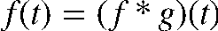
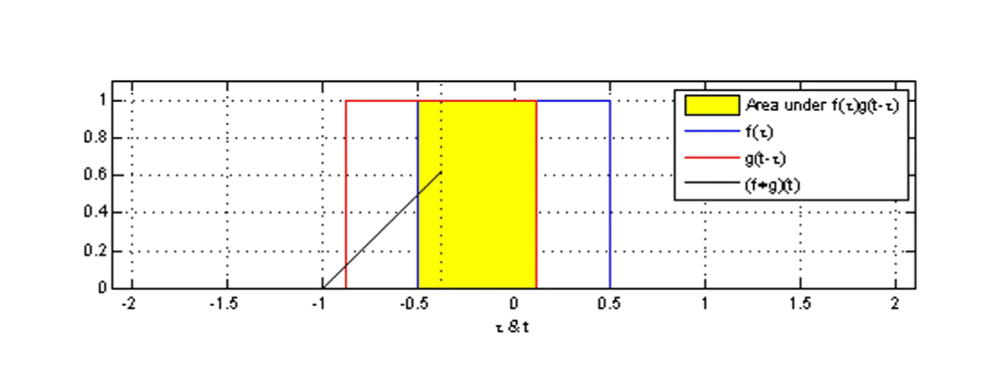
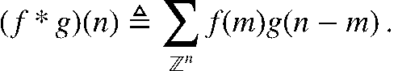
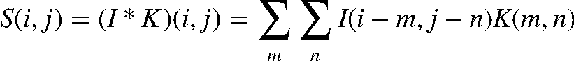
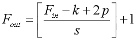

# 卷积操作原理

## 什么是卷积
卷积是神经网络里面的核心计算之一，它是一种特殊的线性运算。卷积神经网络（CNN）是针对图像领域任务提出的神经网络，其受猫的视觉系统启发，堆叠使用卷积层和池化层提取特征。它在 CV 领域方面的突破性进展引领了深度学习的热潮。卷积的变种丰富，计算复杂，神经网络运行时大部分时间都耗费在计算卷积，网络模型的发展在不断增加网络的深度，因此优化卷积计算就显得尤为重要。

## 卷积神经网络的数学原理
在通常形式中，卷积是对两个实变函数的一种数学运算。在泛函分析中，卷积、旋积或褶积 (Convolution) 是通过两个函数f和g生成第三个函数的一种数学运算，其本质是一种特殊的积分变换，表征函数 f 与 g 经过翻转和平移的重叠部分函数值乘积对重叠长度的积分。
<br />卷积神经网络（Convolution Neural Networks, CNN）的概念拓展自信号处理领域的卷积。信号处理的卷积定义为：
$$F_{\text {out }}=\left[\frac{F_{i n}-k+2 p}{s}\right]+1$$

可以证明，关于几乎所有的实数 x，随着 x 的不同取值，积分定义了一个新函数 ℎ(x)，称为函数 f 与 g 的卷积，记为：
<br /><center>  </center>
卷积计算在直觉上不易理解，其可视化后如下图所示。图中红色滑块在移动过程中与蓝色方块的积绘制成的三角图案即为卷积结果在各点上的取值：
<br /><center>  </center>

<br />对于信号处理的卷积定义为连续的表示，真正计算的过程中会把连续用离散形式进行计算：
<br /><center>  </center>
将该离散卷积公式拓展到二维空间即可得到神经网络中的卷积，可简写为：
<br /><center>  </center>
>其中：
 S为卷积的输出； I为卷积输入； K为卷积核的尺寸；

## 卷积神经网络中的卷积计算
如图1所示, 神经网络中的卷积计算过程可描述为：3 * 3 的卷积核在 8 * 8 的图像上进行滑动，每次滑动时，都把卷积核和对应位置的元素进行相乘再求和。青色区域为其感受野。
<br />
<br /> <center>  </center>
### 名词解释：
>填充（padding）：防止图像边缘信息丢失，在输入图像的周围添加额外的行/列。其作用为使卷积后图像分辨率不变，方便计算特征图尺寸的变化，弥补边界

>卷积核：是具有可学习参数的算子，用于对输出图像进行特征提取，输出通常为特征图。每一个卷积核代表一种模式/特征，有几个卷积核就有几张特征图,每一个卷积核都对应一个特征图。在机器学习中，卷积核的参数是由反向传播/梯度下降算法计算更新，非人工设置。其特点为：
><br />    1）卷积核每次仅连接K*K区域，K*K是卷积核的尺寸；
><br />    2）卷积核参数重复使用（参数共享），在图像上滑动。

>特征图：输出特征图的尺寸的计算公式为如下所示。 
> <br /><center>  </center>

>卷积层：用来提取图像的底层特征
><br />  池化层：使用1个像素表示一块区域的像素值（均值或最值），降低图像分辨率，用来防止过拟合，减少参数量
><br />  全连接层：用来汇总特征信息，进行输出

在常见的RGB图像三通道(Channel)卷积计算中，如图2所示：
<br /> <center>  </center>

<br /> 其过程可描述为：红色的卷积核层和红色通道的层进行卷积，绿色的卷积核层和绿色通道的层进行卷积，蓝色同上。之后三个通道的计算结果加起来作为最后的输出结果。
该动画源于：[RGB三通道卷积](https://thomelane.github.io/convolutions/2DConvRGB.html/ "RGB三通道卷积")

### 卷积网络的过程（以LeNet手写数字识别为例）：
<br /><center>  </center>

第一步把手写数字图片转成灰度图像。之后通过6个卷积核对灰度图进行卷积计算，生成6张特征图。之后通过6个卷积核对上述特征图进行下采样，即池化操作。之后再经16个卷积核对池化结果再次进行卷积，得到16张特征图，再通过16个卷积核对前述特征图进行下采样，之后把得到的结果拉平成一个长向量，送入全连接层（2层），最终输出到softmax层，得到识别结果。

## 卷积的代码实现
### 基于Tensorflow的实现

```
tf.nn.conv2d(input, filter, strides, padding, use_cudnn_on_gpu=None, name=None)
```
>input：指需要做卷积的输入图像，它要求是一个Tensor，具有[batch, in_height, in_width, in_channels]这样的shape，具体含义是[训练时一个batch的图片数量, 图片高度, 图片宽度, 图像通道数]，注意这是一个4维的Tensor，要求类型为float32和float64其中之一
<br /> 第二个参数filter：相当于CNN中的卷积核，它要求是一个Tensor，具有[filter_height, filter_width, in_channels, out_channels]这样的shape，具体含义是[卷积核的高度，卷积核的宽度，图像通道数，卷积核个数]，要求类型与参数input相同，有一个地方需要注意，第三维in_channels，就是参数input的第四维
<br /> 第三个参数strides：卷积时在图像每一维的步长，这是一个一维的向量，长度4
<br /> 第四个参数padding：string类型的量，只能是"SAME","VALID"其中之一，这个值决定了不同的卷积方式

实现：（为了简化运算，使用了batch_size =1)

```
class Conv(object):
    def __init__(self,input_data,weights_data,stride,padding='SAME'):
        const_input = tf.constant(input_data, tf.float32)
        const_weight = tf.constant(weights_data, tf.float32)
        input = tf.Variable(const_input, name="input")
        input = self.chw2hwc(input)
        self.input = tf.expand_dims(input, 0)
        weights = tf.Variable(const_weight, name="weights")
        weights = self.chw2hwc(weights)
        self.weights = tf.expand_dims(weights, 3)
        self.stride = stride
        self.padding = padding
 
    def get_shape(self,tensor):
        [s1,s2,s3] = tensor.get_shape()
        s1 = int(s1)
        s2 = int(s2)
        s3 = int(s3)
        return s1,s2,s3
 
    def chw2hwc(self,chw_tensor):
        chw_tensor = tf.transpose(chw_tensor,[1,2,0])
        return chw_tensor
 
    def hwc2chw(self,hwc_tensor):
        hwc_tensor = tf.transpose(hwc_tensor,[2,0,1])
        return hwc_tensor
 
    def tf_conv2d(self):
        """
        tf.nn.conv2d(input, filter, strides, padding, use_cudnn_on_gpu=None, name=None)
        """
        conv = tf.nn.conv2d(self.input, self.weights, strides=self.stride, padding=self.padding)
        rs = self.hwc2chw(conv[0])
        return rs
```
代码主要包括以下几个部分：

1) 对于数据格式进行预处理，使 c*h*w 的数据变为 h*w*c 

2) 调用 tf.nn.conv2d

3) 将结果转换成常用 c*h*w 的格式
### 基于python 与 numpy 的实现

```
class myConv(object):
    def __init__(self,input_data,weight_data,stride,padding='SAME'):
        self.input = np.asarray(input_data, np.float32)
        self.weights = np.asarray(weights_data, np.float32)
        self.stride = stride
        self.padding = padding
    def compute_conv(self,fm,kernel):
        [h,w] = fm.shape
        [k,_] = kernel.shape
 
        if self.padding == 'SAME':
            pad_h = (self.stride *(h-1) + k - h)//2
            pad_w = (self.stride *(w-1) + k - w)//2
            rs_h = h
            rs_w = w
        elif self.padding == 'VALID':
            pad_h = 0
            pad_w = 0
            rs_h = (h-k)/self.stride+1
            rs_w = (w-k)/self.stride+1
        elif self.padding == 'FULL':
            pad_h = k-1
            pad_w = k-1
            rs_h = (h+k-2)/self.stride+1
            rs_w = (w+k-2)/self.stride+1
        else:
            pad_h = 0
            pad_w = 0
            rs_h = (h - k) / self.stride + 1
            rs_w = (w - k) / self.stride + 1
        padding_fm = np.zeros([h+2*pad_h,w+2*pad_w],np.float32)
        padding_fm[pad_h:pad_h+h,pad_w:pad_w+w] = fm
        rs = np.zeros([rs_h,rs_w],np.float32)
 
        for i in range(rs_h):
            for j in range(rs_w):
                roi = padding_fm[i*self.stride:(i*self.stride+k),j*self.stride:(j*self.stride+k)]
                rs[i][j] = np.sum(roi*kernel)
        return rs
 
    def my_conv2d(self):
        """
        self.input:c*h*w
        self.weights:c*h*w
        :return:
        """
        [c,h,w] = self.input.shape
        [kc,k,_] = self.weights.shape
        assert c==kc
        outputs = []
        for i in range(c):
            f_map = self.input[i]
            kernel = self.weights[i]
            rs = self.compute_conv(f_map,kernel)
            if outputs==[]:
                outputs = rs
            else:
                outputs += rs
        return outputs
```
 与上面不同，这里不需要处理数据格式，但需要对参数进行人为约束，主要分为以下几个方面：
1) 首先根据 pad 的形式，对输入进行补零操作；

2) 其次根据 input，pad, stride 利用公式计算输出大小；

3) 然后进行循环进行卷积操作，对不同channel进行卷积，再相加，得到卷积后的结果。具体也可以看上面的动图，整体实现会比较清楚。
## 卷积的优化手段
### Tensor运算
张量（英文Tensor）是标量、矢量、矩阵等概念的总称与拓展，是机器学习领域的基础数据结构。程序中的张量是一个多维数组的数据结构。
```
#define MAX_DIM 6
struct Tensor {
    // 维度信息
    size_t dim[MAX_DIM];
    uint8_t num_dim;

    // 数据信息
    float* data;
    size_t num_data;
};
```
0维张量，就是一个数。1维张量等同于一个向量。2维张量对应一个矩阵。3维张量则是一个立方体。
<br /><center>  </center>
张量集到张量集的映射称为张量计算。

用编程语言来说，输入是若干张量，输出也是若干个张量，并且无副作用（参考函数式编程）的函数称之为张量计算。
张量有 “维度” 和 “数据” 两个组成要素，张量计算，也就包含维度与数据这两个组成要素的处理。

比如矩阵乘法C = MatMul(A, B)，首先是根据输入的两个张量A, B确定C的维度，然后根据A和B的数据再去计算C的数据。具体一些可参考下面的代码：
```
Tensor* MatMul(Tensor* A, Tensor* B) {
    Tensor* C = new Tensor;
    // 计算维度
    C->num_dim = 2;
    C->dim[0] = A->dim[0];
    C->dim[1] = B->dim[1];

    // 分配内存
    C->data = malloc(C->dim[0]*C->dim[1]*sizeof(float));

    // 计算数据
    Matrix::multi(C, A, B);
    return C;
}
```

### Tensor内存布局
NHWC和NCHW是卷积神经网络(cnn)中广泛使用的数据格式。它们决定了多维数据，如图像、点云或特征图如何存储在内存中。

>NHWC(样本数，高度，宽度，通道):这种格式存储数据通道在最后，是TensorFlow的默认格式。
<br />NCHW(样本数，通道，高度，宽度):通道位于高度和宽度尺寸之前，经常与PyTorch一起使用。

### Tensor卷积运算
当中张量的内存布局为 NHWC 时，卷积计算相应的伪代码如下。其中外三层循环遍历输出C的每个数据点，对于每个输出数据都需要经由内三层循环累加求和得到（点积）。
```
for (int oh = 0; oh < OH; oh++) {
  for (int ow = 0; ow < OW; ow++) {
    for (int oc = 0; oc < OC; oc++) {
      C[oh][ow][oc] = 0;
      for (int kh = 0; kh < KH, kh++){
        for (int kw = 0; kw < KW, kw++){
          for (int ic = 0; ic < IC, ic++){
            C[oh][ow][oc] += A[oh+kh][ow+kw][ic] * B[kh][kw][ic];
          }
        }
      }
    }
  }
}
```
和矩阵乘的优化方法类似，我们也可针对该计算进行向量化、并行化、循环展开的基本的优化操作。


## 参考文献

## 本节视频

<html>
<iframe src="https:&as_wide=1&high_quality=1&danmaku=0&t=30&autoplay=0" width="100%" height="500" scrolling="no" border="0" frameborder="no" framespacing="0" allowfullscreen="true"> </iframe>
</html>

