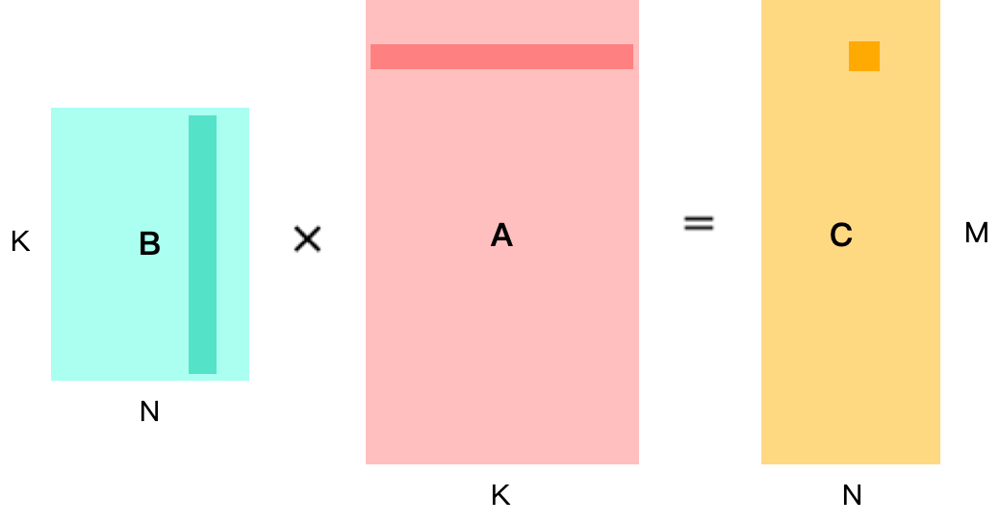
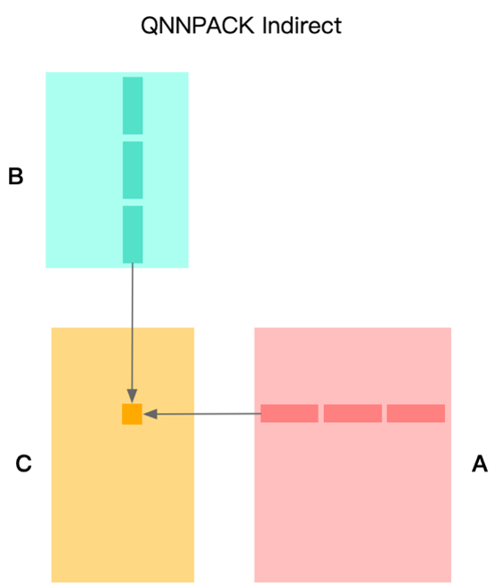
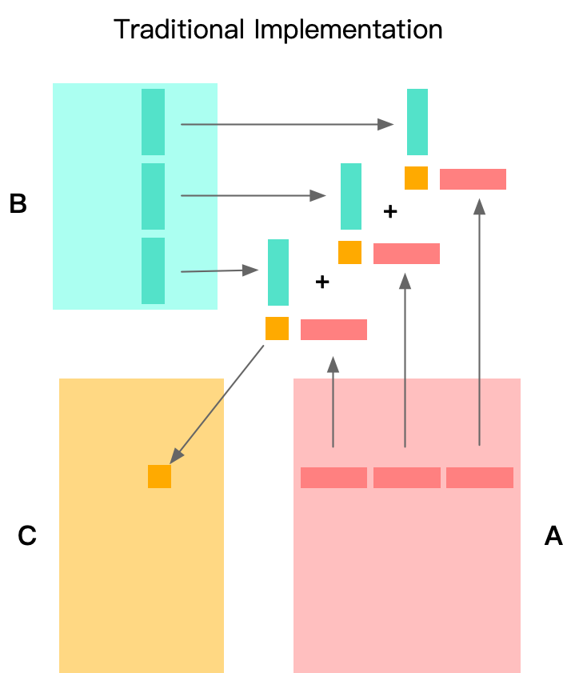

# QNNPack算法

## 算法介绍
QNNPACK(Quantized Neural Networks PACKage) 是 Marat Dukhan (Facebook) 开发的专门用于量化神经网络计算的加速库，其卓越的性能表现一经开源就击败了几乎全部已公开的加速算法。

## 矩阵乘优化 Im2col 算法回顾
在计算MR×NR小块时，传统 GEMM 的方法是对K维度上拆分，在一次计算 kernel 处理中，仅计算K维的局部数据。那么在每次计算 kernel 处理过程，都会发生对输出的加载和存储
 
  

在计算MR×NR小块时，传统 GEMM 的方法是对K维度上拆分，在一次计算 kernel 处理中，仅计算K维的局部数据。那么在每次计算 kernel 处理过程，都会发生对输出的加载和存储
 
  

在计算MR×NR小块时，传统的方法是在K维度上拆分，在一次计算 Kernel 处理中，仅计算K维的局部。那么在每次计算 Kernel 的处理中，都会发生对输出的加载和存储。
 
  

## QNNPACK算法思想
QNNPACK 做法将整个K维全部在计算 Kernel 中处理完，消除了输出部分和的访存。这里所说的「将整个K维全部」并不是指K维不进行拆分，而是指拆分后不和其他维度交换，实际计算中K维会以 2^n 为基础进行拆分。
 
  

## Indirect Convolution Algorithm 工作流程
Indirect 算法在输入缓冲区基础上构建间接缓冲区（Indirect Buffer），而间接缓冲区是间接卷积算法的核心。在网络运行时，每次计算M×N的输出，其中M为将OH×OW视作一维后的向量化规模（一般M×N为4×4、8×8或4×8 ） 。

在计算M×N规模大小输出时，经由间接缓冲区取出对应输入缓冲区数据，并取出权重，计算出结果，整体计算过程等价于计算M×K和K×N矩阵乘。
 
  

## 本节视频

<html>
<iframe src="https:&as_wide=1&high_quality=1&danmaku=0&t=30&autoplay=0" width="100%" height="500" scrolling="no" border="0" frameborder="no" framespacing="0" allowfullscreen="true"> </iframe>
</html>
