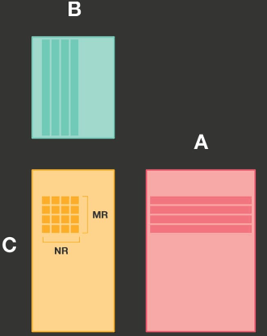
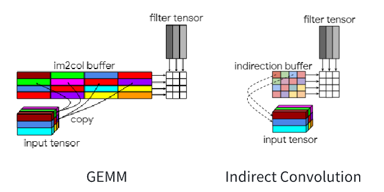
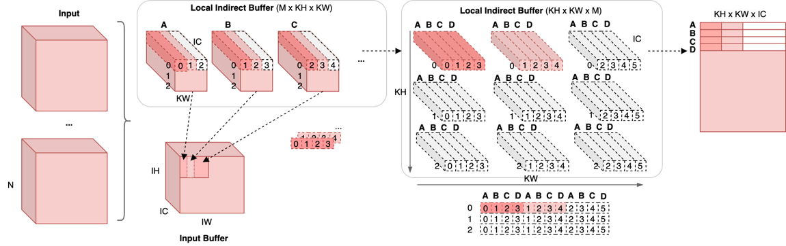
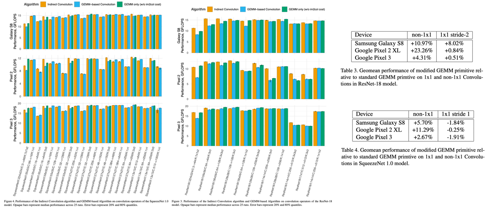

# QNNPACK算法

## 算法介绍
QNNPACK(Quantized Neural Networks PACKage) 是 Marat Dukhan (Facebook) 开发的专门用于量化神经网络计算的加速库，其卓越的性能表现一经开源就击败了几乎全部已公开的加速算法。到目前为止，QNNPACK 仍然是已公开的，用于移动端（手机）的，性能最优的量化神经网络加速库

Marat Dukhan于2019年离开Facebook来到Google之后，发表了一篇名为The Indirect Convolution Algorithm的文章（https://doi.org/10.48550/arXiv.1907.02129），揭秘了QNNPack加速库中针对矩阵卷积运算的核心算法，即如文章标题所示的The Indirect Convolution Algorithm（间接卷积算法）。

在本节中，笔者将结合The Indirect Convolution Algorithm这篇论文以及QNNPack在开源时同期发布的一篇技术性博客QNNPACK: Open source library for optimized mobile deep learning（https://engineering.fb.com/2018/10/29/ml-applications/qnnpack/），带领大家领略间接卷积算法的魅力。

## 传统 im2col + GEMM 方法

在介绍简介卷积算法前，先回顾一下传统的矩阵卷积运算方法。

简单的1×1卷积可以直接映射到矩阵-矩阵乘法，但对于具有较大内核、填充或下采样（步幅）的卷积，则不是这种情况。这些更复杂的卷积可以通过结合im2col算法与GEMM算法来实现：即将四维的输入图像按照卷积窗尺寸进行重排成为一个二维的矩阵，同时将卷积核进行展开重排也成为一个二维的矩阵，将卷积操作转换为两个矩阵的乘法，直接使用GEMM方式完成矩阵乘即可。im2col + GEMM方法能成功的原因本质上是其拆解后忽略内存复用后的计算过程等价于矩阵乘。

现假设已经完成im2col的转换，将卷积已经转换为如下图所示的矩阵乘法。B矩阵为kernel，尺寸为N × K；A矩阵为feature map，尺寸为K × M；结果矩阵C尺寸为N × M。要想得到C矩阵中某一个位置的数据，需要计算B矩阵中对应列与A矩阵中对应行相乘的结果。

一般经过向量化优化后，同时可以并行计算多个结果数据，则一次计算一块MR × NR的小块。

在分块概念出现后，传统im2col+GEMM方法一般是在K维度上进行拆分，在一次计算核中仅计算K维的局部，最后通过累加得到结果数据。这样的话，在每次计算核的处理中，都会发生对输出的加载和存储，即要将本次计算产生的部分和累加到输出中。

使用传统im2col + GEMM存在几个明显的缺陷：

**im2col消耗空间较大**：使用im2col方法将输入图像以及卷积核展开成为二维中间矩阵会消耗大量内存空间。

**GEMM输入缓存空间较大**：在面对大卷积核时，使用GEMM进行通用矩阵乘时需要缓存大量的行数据，就算采用分割方法同样不可避免。

针对以上缺陷，Marat Dukhan提出的间接卷积算法都能较好地解决。

## The Indirect Convolution Algorithm（间接卷积算法）

The Indirect Convolution Algorithm（间接卷积算法）是QNNPACK中的核心算法。QNNPACK原本推出的目的是解决量化问题，但后续发现在非量化的矩阵卷积运算中通用能发挥强大的性能。

### 神经网络量化（Quantization）

神经网络的计算通常依赖于单精度浮点数（FP32）。然而，随着深度学习算法的不断发展，神经网络对计算资源和内存的需求急剧增加。这种需求的增加使得许多移动设备无法有效地运行复杂的神经网络模型。为了解决这个问题，量化（Quantization）技术被引入到神经网络中。量化的核心思想是将神经网络中的权重参数和计算从FP32转换为低精度的整型数，例如INT8。通过这种转换，计算速度和内存利用效率得到了显著提升。

线性量化的核心公式涉及3个参数：

**缩放因子（Scale）**:将浮点数值缩放到整数值范围的比例。

**零点（Zero Point）**:量化过程中用来调整数值的偏移量。

**量化值（Quantized Value）**:最终的整数表示形式。

量化公式即可以表示如下：

给定一个浮点数 𝑟 和相应的缩放因子 scale 和零点 zero_point，量化过程可以表示为：

$$ q = \text{round}\left(\frac{r}{\text{scale}}\right) + \text{zero\_point} $$

其中，q 是量化后的整数值，round() 表示四舍五入操作。

缩放因子与零点需要根据数据的范围（最大值和最小值）计算得到。

缩放因子的计算公式如下：

$$ \text{scale} = \frac{r_{\max} - r_{\min}}{q_{\max} - q_{\min}} $$

零点的计算公式如下：

$$ \text{zero\_point} = \text{round}\left(q_{\min} - \frac{r_{\min}}{\text{scale}}\right) $$

在推理过程中，需要执行反量化过程，以便恢复接近原始的浮点表示。反量化过程的公式表达如下：

$$ r = \text{scale} \times (q - \text{zero\_point}) $$

QNNPACK使用一种与Android神经网络API兼容的线性量化方案。它假设量化值q[i]用8位无符号整数表示，并且它们与实值表示r[i]的关系如下公式：

$$ r[i] = scale × (q[i] − zero_point) $$

其中，scale是一个正的浮点数，zero_point是一个8位无符号整数，和q[i]一样。

### 间接卷积算法的计算划分

虽然QNNPACK利用了像其他BLAS库一样的PDOT微内核（Parallel Dot Product，是一种专门用于加速矩阵乘法运算的小型计算核心，它在处理低精度整数如 8 位整数和矩阵乘法时表现出色，特别是在移动设备和资源受限的硬件环境中；PDOT 微内核的设计目标是高效利用硬件资源，实现低精度整数矩阵乘法的高效计算），但其对具有8位元素的量化张量和移动AI使用案例的关注带来了非常不同的性能优化视角。大多数BLAS库针对科学计算使用案例，处理的矩阵通常由成千上万的双精度浮点元素组成，而QNNPACK的输入矩阵来自低精度、移动设备特定的计算机视觉模型，具有非常不同的维度。

移动架构的约束规定MR和NR不能超过8。因此，即使在具有1024通道的最大模型中，PDOT微内核中读取的整个内存块最多为16KB，这甚至可以适应超低端移动核心的一级缓存。这标志着QNNPACK与其他GEMM实现之间的重要区别：其他库会重新打包A和B矩阵，以更好地利用缓存层次结构，希望通过大量计算来摊销打包开销，而QNNPACK则针对A和B面板可以适应L1缓存的情况进行优化。因此，**它旨在消除所有非计算必需的内存转换**。

间接卷积算法的计算同样也是基于对输出的切分，计算MR × NR的小块。与传统GEMM方法不同的是，其将将整个 K 维全部在计算 Kernel 中处理完，消除了输出部分和的访存。这里所说的「将整个 K 维全部」并不是指 K 维不进行拆分，而是指拆分后不和其他维度交换，实际计算中 K 维会以 2^𝑛 为基础进行拆分。

“消除所有非计算必需的内存转换”即为间接卷积算法的核心特定，这样的特性同样也注定了它在非量化任务中同样能起到显著的优化作用。

### Repacking（内存重新组织）

对内存重新组织（Repacking）可以使得相关联的数据更加靠近，这样在访问一个数据时，相关的数据更有可能已经在缓存中，从而减少缓存未命中的次数。

在传统情况下，由于K可能很大，需要对输入内存进行重新组织，防止相邻的访存引起高速缓存冲突，但是这样的操作是需要额外开销的，具体来讲一般分为以下两种情况：

**矩阵A的Repacking**:由于矩阵 A 包含卷积输入数据，并且每次推理运行时都会改变，因此每次运行都需要重打包，这会导致额外的开销。

**矩阵B的Repacking**:矩阵 B 包含静态权重，可以一次性地转换为任何内存布局，这样在后续计算中可以更高效地使用缓存。

QNNPACK通过消除不必要的Repacking，优化了内存使用率并提高计算效率。具体来讲通过如下几个方面来实现。

**充分利用缓存**：由于QNNPACK适配的是移动设备量化神经网络，K一般来说较小，A 和 B 的面板总能装入 L1 缓存中，因此不需要像传统实现那样对 A 和 B 的面板进行分割和Repacking。

**消除A的Repacking**：由于 A 的数据在每次推理运行时都变化，传统实现为了提高缓存利用率和微内核效率会Repacking A。但是，QNNPACK 通过确保整个面板适合 L1 缓存，避免了这种Repacking，节省了每次运行的开销。

**避免缓存关联性问题**：传统实现中的Repacking部分是为了避免缓存关联性问题，即如果读取的行被大步长分隔，可能会导致不同行的元素落入同一缓存集合中，导致性能下降。而 QNNPACK 通过确保面板适合 L1 缓存，避免了这种情况。

### Indirection Buffer（间接缓冲区）

在QNNPACK中，Marat Dukhan实现了一种更高效的算法。与其将卷积输入转换以适应矩阵-矩阵乘法的实现，不如调整微内核的实现，使其能够实时进行im2col转换。间接卷积算法的有效工作以来一个关键的前提——网络连续运行时，输入张量的内存地址保持不变。这一特性其实比较容易满足，即使地址真的需要变化，也可以将其拷贝到固定的内存区域中。

间接卷积算法没有将实际数据从输入张量复制到im2col缓冲区，而是设置了一个间接缓冲区，其中包含指向用于计算每个输出像素的输入像素行的指针。同时，此算法还修改了矩阵-矩阵乘法微内核，使其从间接缓冲区加载指向虚拟矩阵A行的指针，这个缓冲区通常比im2col缓冲区小得多。此外，如果输入张量的内存位置在推理运行之间不变，间接缓冲区可以在初始化时设置一次指向输入行的指针，然后在多个推理运行中重复使用。从实验结果可以观察到，使用间接缓冲区的微内核不仅消除了im2col转换的开销，而且性能稍微优于矩阵-矩阵乘法微内核（这可能是因为在计算不同的输出像素时重复使用了输入行）。

间接缓冲区是一个指向输入像素行的指针缓冲区。每行包含C个像素，并且这些行可以选择性地跨步。对于每个输出像素位置和每个内核元素，间接缓冲区包含一个指向输入像素行的指针，该行的像素将与相应内核元素的滤波器权重行进行卷积，以生成相应的输出像素。对于非单位内核的卷积，通常使用隐式填充。在带有隐式填充的卷积中，在计算卷积之前，输入张量在空间维度上被隐式地用零填充。为了处理填充卷积，间接卷积算法需要一个显式的零向量——一个由C个元素初始化为零的常量向量。显式零向量不需要与输入张量连续，并且可以在多个卷积操作之间共享。在初始化间接缓冲区时，超出输入张量范围的输入行的指针将被替换为指向显式零向量的指针。

间接缓冲区依赖于多个参数：输入、输出和滤波器张量的形状，卷积步幅、扩张和隐式填充，以及指向输入张量和显式零张量的指针，以及输入张量中像素行的步幅。这些参数可以根据其变化频率及其对间接缓冲区的影响分为几类：

*卷积步幅、扩张、内核大小、隐式填充、输入通道数和输出通道数*：这些是神经网络模型的参数，一旦模型实例化后，它们实际上是不可变的。

*输入或输出张量的高度和宽度*：这些输入参数的变化需要完全重新初始化间接缓冲区。然而，对于大多数类型的模型，特别是在生产环境中，这种变化是罕见的。

*批量大小*：批量大小的变化仅需要对先前未初始化的批次索引部分重新初始化间接缓冲区。

*输入张量或显式零向量的指针*：这些输入参数的变化需要完全重新初始化间接缓冲区。为了避免这种开销，实现卷积的高级框架可以保证在没有形状变化的情况下，张量具有持久位置。

下图展示了间接卷积算法的基本工作流程。

左侧部分表示多个输入使用相同的输入缓冲区（Input Buffer），间接卷积算法会在该输入缓冲区基础上构建间接缓冲区。如图中右侧在网络运行时，每次计算出M × N规模的输出，其中M将视为OH × OW视作一维后的向量规模化。一般M × N的尺寸在量化神经网络中是4 × 4、4 × 8以及8 × 8。在计算 M×N 规模大小输出时，经由间接缓冲区取出对应输入缓冲区数据，并取出权重，计算出结果，整体计算过程等价于计算 M×K 和 K×N 矩阵乘。

在实现过程中，软件的执行过程分为两部分：在准备阶段，需要执行加载模型配置输入缓冲区以及重排权重使其内存布局适用于后续计算两个工作；在运行阶段对于每个输入执行 (𝑂𝐻∗𝑂𝑊/𝑀)∗(𝑂𝐶/𝑁) 次循环，每次使用 GEMM 计算 𝑀×𝑁 大小输出。

现对间接缓冲区布局解释如下。

间接缓冲区可以理解为一组卷积核大小的缓冲区，共有 𝑂𝐻×𝑂𝑊 个，每个缓冲区大小为 𝐾𝐻×𝐾𝑊 （每个缓冲区对应某个输出要使用的输入地址）。每计算一个空间位置输出，使用一个间接缓冲区；空间位置相同而通道不同的输出使用相同间接缓冲区，缓冲区中的每个指针用于索引输入中 IC 个元素。

在计算时，随着输出的索引内存地址移动，选用不同的间接缓冲区，即可得到相应的输入地址。无需再根据输出目标的坐标计算要使用的输入的地址，这等同于预先计算地址。

下图以M和N均为4，KH和KW均为3的情况做出示例。

当计算大小为M × N大小的输出时，使用的输入为卷积核在对应输入位置上滑动M步所覆盖的区域，输入规模为：

$$ KH × (M + 2(KW-1)) × IC $$

这些输入内存由M个间接缓冲区中的指针索引，共有M × KH × KW个。

图中将平面缓冲区展示为三维的形式（引入 IC 维度），意在说明间接缓冲区的每个指针可索引 IC 个输入元素，而每个间接缓冲区索引的内容即为与权重对应的输入内存区域。

间接缓冲区如下图中部下方的排布图所示。 A、B、C、D 四个缓冲区内部相同空间位置的指针被组织到了一起并横向排布。值得注意的是，图例中 Stride 为 1，当 Stride 不为 1 时，重新组织后 A、B、C、D 相同空间的坐标（对应于在输入的坐标）不一定是连续的，相邻的空间位置横向坐标相差 strdie 大小。

现在来分析如何使用间接缓冲区完成计算。间接缓冲区使得可以通过指针模拟出对输入的访存。在实际运行计算尺寸为M × N的计算核时，会有M个智障扫描输入。M个指针每次从间接缓冲区中取出M个地址，即对应于M × IC的输入内存。指针以M × S的形式运行，其中S在IC维度上运动。此部分输入扫描完毕后，这M个指针从间接缓冲区中继续取出相应部分的指针，继续对下一轮M × IC输入内存进行遍历，每次计算出输出部分的大小为1/(KH × KW)。当这个过程运行KH × KW次后即得到了M × N的输出。

上述M个指针不断运动扫描的过程其实就是在扫描三维输入经过im2col之后的矩阵，而输入缓冲区的特点就是他将对二维矩阵的扫描转为对三维张量的扫描。上述M × IC的内存块其实是由M个1 × IC张量组成，他们之间W维度的间距为步长stride。这样一来，只需要运行

$$ \[ \left\lceil \frac{OH \times OW}{M} \right\rceil \times \left\lceil \frac{OC}{N} \right\rceil \] $$

次计算核，即可得到全部的输出。

### 与GEMM算法的对比

与基于GEMM的卷积算法相比，间接卷积的性能受到四个因素的影响：

1. 消除非单位卷积的im2col转换。间接卷积方法不需要执行im2col转换，这减少了内存和计算开销，因为无需将输入数据块复制到im2col缓冲区。

2. 改进的输入行缓存。对于大内核卷积，间接卷积方法通过从同一位置读取不同输出像素的输入行，提高了缓存效率。这是因为间接GEMM方法可以更好地利用缓存，而传统GEMM方法则需要从im2col缓冲区的不同位置读取数据，增加了缓存未命中率。

3. 指针加载的开销。间接缓冲区引入了缓冲区指针，需要从间接缓冲区加载输入数据行的指针，这比在常量步幅假设下直接计算这些指针略微增加了开销。

4. 循环效率的差异。间接卷积操作中，R × S（内核的高度和宽度）和C（通道数）的迭代通过两个嵌套循环进行，这可能比GEMM操作中的单个循环（R × S × C次迭代）效率稍低。单循环通常能更好地利用处理器的流水线和指令缓存，从而提高执行效率。

总体来说，间接卷积优化算法解决了卷积计算的三个问题，一是空间向量化问题，二是地址计算复杂问题，三是内存拷贝问题。同时间接卷积算法也存在一定的缺陷，即其建立的缓冲区和数据重新组织（Repacking）对内存造成大量的消耗。

在The Indirect Convolution Algorithm中作者展示了间接卷积算法、基于GEMM的算法以及ResNet18和SqueezeNet 1.0模型中仅GEMM部分的性能。可以看到间接卷积算法性能会明显优于其他算法的性能。

## 总结

间接卷积算法是对基于GEMM的卷积算法的修改，其中GEMM操作从间接缓冲区读取输入张量中行的地址。实验表明，这种修改后的类似GEMM的操作与传统的GEMM操作性能相似，并且表明两种算法之间的主要区别在于GEMM基于算法中的im2col缓冲区与间接卷积算法中的间接缓冲区之间的差异。与基于GEMM的算法中的im2col缓冲区不同，间接缓冲区在输入通道数上是恒定的，并且可以在卷积调用之间保持不变。间接卷积算法提供了基于GEMM算法的通用性，但具有更小的内存占用和消除im2col转换成本的优势。这些特点使间接卷积算法成为卷积操作默认实现的可行选项。间接卷积算法在本论文范围之外还具有有趣的性能特点。特别是，该算法在多线程卷积调用期间可能比基于GEMM的算法具有额外的性能优势。修改后的GEMM操作是计算密集型的，应该随着核心数量线性扩展，而基于GEMM的卷积中的im2col部分会被内存或缓存带宽所限制，其在核心数量上的扩展是次线性的。

## 本节视频

<html>
<iframe src="https:&as_wide=1&high_quality=1&danmaku=0&t=30&autoplay=0" width="100%" height="500" scrolling="no" border="0" frameborder="no" framespacing="0" allowfullscreen="true"> </iframe>
</html>
