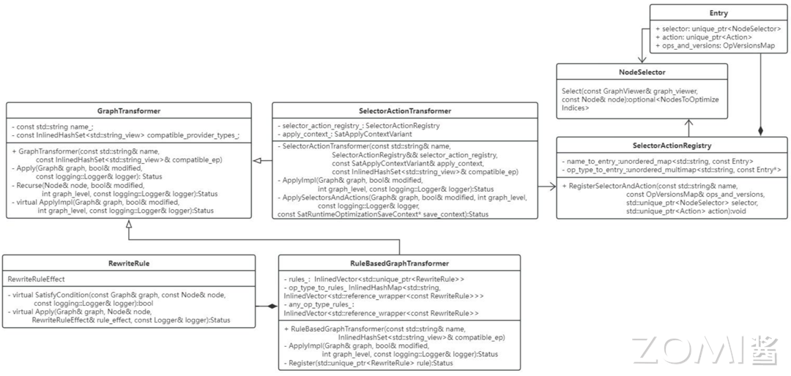

<!--Copyright © 适用于[License](https://github.com/chenzomi12/AISystem)版权许可-->

# 计算图优化

本节主要介绍推理引擎转换中的图优化模块，该模块负责实现计算图中的各种优化操作，包括算子融合、布局转换、算子替换和内存优化等，以提高模型的推理效果。计算图是一种表示和执行数学运算的数据结构，在机器学习和深度学习中，模型的训练和推理过程通常会被表示成一个复杂的计算图，其中节点代表运算操作，边代表数据（通常是张量）在操作之间的流动。计算图优化是一种重要的技术，主要目标是提高计算效率和减少内存占用，通常由AI 框架的编译器自动完成，通过优化，可以降低模型的运行成本，加快运行速度，提高模型的运行效率，尤其在资源有限的设备上，优化能显著提高模型的运行效率和性能


## 挑战与架构

### 离线模块的挑战

首先整体看下在离线优化模块中的挑战和架构，在最开始第一节内容的时候其实已经跟大家详细的普及过，优化模块的挑战主要由以下几部分组成：

1. 结构冗余：神经网络模型结构中的无效计算节点、重复的计算子图、相同的结构模块，可以在保留相同计算图语义情况下无损去除的冗余类型；

2. 精度冗余：推理引擎数据单元是张量，一般为 FP32 浮点数，FP32 表示的特征范围在某些场景存在冗余，可压缩到 FP16/INT8 甚至更低；数据中可能存大量 0 或者重复数据。

3. 算法冗余：算子或者 Kernel 层面的实现算法本身存在计算冗余，比如均值模糊的滑窗与拉普拉斯的滑窗实现方式相同。

4. 读写冗余：在一些计算场景重复读写内存，或者内存访问不连续导致不能充分利用硬件缓存，产生多余的内存传输。

### 离线优化的方案

针对每一种冗余，我们在离线优化模块都是有对应的方式处理的：

1. 针对于结构冗余：一般会对计算图进行优化，例如算子融合、算子替换、常量折叠等。

  算子融合（Operator Fusion）：算子融合是指在计算图中，将多个相邻的算子（operations）融合成一个新的算子。这样可以减少运算过程中的数据传输和临时存储，从而提高计算效率。例如，如果有两个连续的矩阵乘法操作，可以将它们融合为一个新的操作，从而减少一次数据读写。这在 GPU 等并行计算设备上特别有用，因为它们的数据传输成本相对较高。

  算子替换（Operator Substitution）：算子替换是指在计算图中，用一个效率更高的算子替换原有的算子。例如，如果一个算子是通过多个基础操作组成的，那么可能存在一个复杂但效率更高的算子可以替换它。这样可以减少计算的复杂性，提高计算效率。

  常量折叠（Constant Folding）：常量折叠是指在计算图的优化过程中，预先计算出所有可以确定的常量表达式的结果，然后用这个结果替换原有的表达式。这样可以减少运行时的计算量。例如，如果计算图中有一个操作是`3*4`，那么在优化过程中，可以将这个操作替换为`12`。

2. 针对于精度冗余：一般会对算子进行优化，例如量化、稀疏化、低秩近似等。

  量化（Quantization）：量化是一种将浮点数转换为定点数或更低比特宽度的整数的方法，从而减少模型的存储和计算需求。量化可以分为静态量化和动态量化。静态量化是在模型训练后进行的，需要额外的校准步骤来确定量化范围；动态量化则是在模型运行时进行的，不需要额外的校准步骤。量化能够显著减小模型的大小，并提高推理速度，但可能会带来一些精度损失。

  稀疏化（Sparsity）：稀疏化是一种将模型中的一部分权重设为零的方法，从而减少模型的有效参数数量。稀疏化可以通过在训练过程中添加 L1 正则化或使用专门的稀疏训练算法来实现。稀疏化后的模型可以通过专门的稀疏矩阵运算库进行高效的推理。

  低秩近似（Low-rank Approximation）：低秩近似是一种将大的权重矩阵近似为两个小的矩阵乘积的方法，从而减少模型的参数数量。这种方法通常使用奇异值分解（SVD）或其他矩阵分解方法来实现。低秩近似能够显著减小模型的大小，并提高推理速度，但可能会带来一些精度损失。

3. 针对于算法冗余：一般会统一算子/计算图的表达，例如 kernel 提升泛化性等。
  Kernel 提升泛化性是指通过设计和优化 Kernel 函数，使得它能够适应更多类型的数据和任务，从而提高算子或计算图的泛化能力。例如多尺度 kernel、深度可分离卷积等方法。

4. 针对于读写冗余：一般会通过数据排布的优化和内存分配的优化进行解决。

  数据排布的优化：数据排布的优化主要是根据计算的访问模式和硬件的内存层次结构，来选择一个合适的数据排布方式。例如，在 CPU 上，为了利用缓存的局部性，可以将经常一起访问的数据放在一起；在 GPU 上，为了避免内存访问的冲突，可以将数据按照一定的模式分布在不同的内存通道上。此外，数据的排布方式也可以影响向量化（vectorization）和并行化（parallelization）的效果。

5.内存分配的优化：内存分配的优化主要是通过合理的内存管理策略，来减少内存的分配和回收开销。例如，可以使用内存池（memory pool）来管理内存，将经常使用的内存块预先分配好，然后在需要时直接从内存池中获取，避免频繁的内存分配和回收操作。此外，也可以使用一些高级的内存管理技术，如垃圾回收（garbage collection）和引用计数（reference counting）等。

## 计算图优化

现在来到了核心内容，离线优化模块的计算图优化。早在本节之前，AI 编译器的前端优化已经讲述了很多计算图优化相关的内容。但这些是基于 AI 框架实现的且通常出现于训练场景中，主要原因在于在在线训练的过程中。实验时间的要求相对宽松，所以可以引入较多的 GIT 编译或者是其他编译。

而在推理引擎计算图的优化中，更多的是采用预先写好的模板，而不是通过 AI 编译去实现的。常见的推理引擎如 TensorIR、ONLIX Runtime 还有 MMN、MCNN 等，大部分都是基于已经预先写好的模板进行转换的，主要目的就是减少计算图中的冗余的计算。因此衍生出了各种各样的图优化的技术

在特定场景确实图优化，能够给带来相当大的计算的收益，但是基于这种模板的方式，其缺点主要在于需要根据先验的知识来实现图的优化，相比于模型本身的复杂度而言注定是稀疏的，无法完全去除结构冗余。

### 图优化方式

Basic: 基础优化，主要是对计算图进行一些基本的优化操作，这些操作主要保留了计算图的原有语义，亦即在优化过程中，不会改变计算图的基本结构和运算逻辑，只是在一定程度上提高了计算图的运行效率。基础优化主要包括以下几种：

1. 常量折叠：主要用于处理计算图中的常量节点。在计算图中，如果有一些节点的值在编译时就已经确定了，那么这些节点就可以被称为常量节点。常量折叠就是在编译时就对这些常量节点进行计算，然后把计算结果存储起来，替换原来的常量节点，这样可以在运行时节省计算资源。

```python
#Before optimization
x = 2, y = 3, z = x * y
#After constant folding
z = 6
```

2. 冗余节点消除：在计算图中，可能会有一些冗余的节点，这些节点在运算过程中并没有起到任何作用，只是增加了计算的复杂度。冗余节点消除就是找出这些冗余节点，然后从计算图中移除它们，从而简化计算图的结构，提高运行效率。

```python
#Before optimization
x = a + b, y = c + d, z = x
#After constant folding
z = a + b
```

3. 有限数量的算子融合：：算子融合是一种常用的图优化技术，它主要是将计算图中的多个运算节点融合为一个节点，从而减少运算节点的数量，提高运算效率。在基础优化中，算子融合通常只会融合有限数量的算子，以防止融合过多导致的运算复杂度增加。

```python
#Before optimization
x = a + b, y = x * c
#After constant folding
y = (a + b) * c
```

Extended: 扩展优化主要是针对特定硬件进行优化的。不同的硬件设备其架构和运行机制都有所不同，因此，相应的优化方式也会有所不同。扩展优化就是根据这些硬件设备的特性，采用一些特殊且复杂的优化策略和方法，以提高计算图在这些设备上的运行效率。例如，对于支持并行计算的 CUDA 设备，可以通过算子融合的方式将多个独立的运算操作合并成一个操作，从而充分利用 CUDA 设备的并行计算能力。

示例：CUDA 后端的算子融合，以下是一个简单的计算图优化的例子，通过在 CUDA 中合并加法和乘法操作来实现的。

```C++
// 优化前：（1）独立的 CUDA 内核实现加法
__global__ void add(float *x, float *y, float *z, int n) {
    int index = threadIdx.x;
    if (index < n) {
        z[index] = x[index] + y[index];
    }
}
//优化前：（2）独立的 CUDA 内核实现乘法
__global__ void mul(float *x, float *y, float *z, int n) {
    int index = threadIdx.x;
    if (index < n) {
        z[index] = x[index] * y[index];
    }
}
```

原始的代码包含两个独立的 CUDA 内核函数，一个执行加法操作，一个执行乘法操作。这意味着每个操作都需要将数据从全局内存（GPU 内存）传输到设备内存（GPU 核心），执行计算后再将结果写回全局内存。这样的数据传输和转换会占用大量的时间和带宽，降低了计算效率。

```C++
//优化后：单一 CUDA 内核实现加法和乘法，减少数据从全局内存到设备内存的传输次数，从而提高计算效率
__global__ void add(float *x, float *y, float *z, int n) {
    int index = threadIdx.x;
    if (index < n) {
        float tmp = x[index] + y[index];
        w[index] = tmp * z[index];
    }
}
```

优化后的代码将加法和乘法操作合并到了一个 CUDA 内核中。这样，数据只需要从全局内存传输到设备内存一次，然后在设备内存中完成所有的计算，最后再将结果写回全局内存。这大大减少了数据传输和转换的次数，从而提高了计算效率。

这种优化方法称为算子融合，是计算图优化的常用手段。它可以减少数据在操作之间的传输和转换，提高计算效率。同时，算子融合也可以减少全局内存的占用，因为不需要为每个操作的中间结果分配内存。

Layout & Memory: 布局转换优化，主要是不同 AI 框架，在不同的硬件后端训练又在不同的硬件后端执行，数据的存储和排布格式不同。

例如在 TensorFlow 中，数据默认以"NHWC"（批量大小、高度、宽度、通道数）的格式存储，而在 PyTorch 中，数据默认以"NCHW"（批量大小、通道数、高度、宽度）的格式存储。当在不同的硬件后端进行训练和执行时，可能需要进行类似的数据格式转换，以确保数据能够在不同的环境中正确地被处理。

在讲述了图优化的相关方式之后，这些方法与架构中优化模块的对应关系如下所示：

1. Pre Optimize：主要使用最开始的 basic 优化方式

2. Optimize：中间的部分主要可能会涉及到 basic 优化方式和 extend 优化方式

3. Post Optimize: 最后的部分则主要位 extend 的优化方式以及 layout 和 memory 的优化方式

## ONNX Runtime 图优化

ONNX Runtime（Open Neural Network Exchange Runtime，简称 ORT），这是一个用于神经网络模型推理的跨平台库。ONNXRuntim e 作为优秀的推理引擎不仅提供了对 ONNX 的完美支持同时还支持多种不同的后端执行器在不同的硬件平台上进行推理，支持多种运行后端包括 CPU，GPU，TensorRT，DML 等。可以说 ONNXRuntime 是对 ONNX 模型最原生的支持，只要掌握模型导出的相应操作，便能对将不同框架的模型进行部署，提高开发效率。

ORT 提供了五种优化方向，分别为：

1. compute_optimizer 提供计算中内存流的优化

2. layout_transformation 提供数据布局上的转化优化

3. qdq_transformer 提供了针对量化过程中数据格式、指令集对应优化等操作

4. transpose_optimization 提供了 onnx 与 ort format 格式转化上的优化操作

5. selectors_actions 提供计算图节点融合等操作的逻辑抽象

对于计算图中节点的消融、算子融合、常量折叠等操作主要提供了两种接口即 GraphTransofrmer 和 RewriteRule 。ORT 还进一步按照 selectors＋actions 策略设计了 SelectorActionTransformer 接口，按照多个既定规则设计了 RuleBasedGraphTransformer 接口。ORT 提供的绝大多数计算图优化方法都是继承自如上接口。



### GraphTransformer and RewriteRule

GraphTransformer：接口定义在 include/onnxruntime/core/optimizer/graph_transformer.h 路径中。GraphTransformer 定义了在计算图上 in-place 转化接口，旨在提供全局的优化操作。继承的子类需要实现函数 virtual Status ApplyImpl(Graph& graph, bool& modified, int graph_level, const logging::Logger& logger)，具体的优化过程在该函数中编写。GraphTransformer 有一个方法 Recurse 会递归地在所有子图上应用 ApplyImpl 函数。

在 graph_transformer.h 中还定义了一个数据结构 OpkernelRegistryId 用于检查 kernel 是否在提供的 EP(execution provider) 中注册过，如果没有注册对应融合后的 kernel，则不能执行融合操作生成对应的融合节点。

RewriteRule：是计算图中一种保留语义的转换操作，与 GraphTransformer 相比，它更关注于局部的变换操作，例如消除无效操作或用简化的函数来替换复杂的函数等。实现 RewriteRule 接口需要定义两个函数：satisfycondition 和 apply，它们分别用于检查规则的适用条件以及执行具体的转换操作。

其中，函数`virtual common::Status Apply(Graph& graph, Node& node, RewriteRuleEffect& rule_effect, const logging::Logger& logger)`是 RewriteRule 执行的核心，所有子类都需要实现这个函数。从函数的参数可以看出，规则的应用需要一个锚点，也就是传入的参数 node。

另外，在 rewrite_rule.h 文件中定义了一个 RewriteRuleEffect 类，用于描述规则对计算图的影响。它包括四种状态：kNone（不修改原图）、kUpdatedCurrentNode（更新当前节点）、kRemoveCurrentNode（移除当前节点）和 kModifiedRestOfGraph（修改其他节点）。

GraphTransformer vs RewriteRule：ORT 提供的这两种优化接口主要的差别在于 GraphTransformer 会全局遍历所有节点，找到符合优化条件的节点优化并进一步分析优化对应子图。RewriteRule 会从指定的节点出发，在该节点局部按照指定规则进行优化，并不会扩展到全图。

### SelectorActionTransformer

Selectoractiontransformer 继承自 GraphTransformer，是通过一组 selectors+actions 的方式实现对计算图的转换。这种逻辑类似于 RewriteRule 中的 satisfyCondition 函数和 Apply 函数，不同之处在于 selector 和 action 是两个类，选择和执行的逻辑更加复杂并且可以派生不同的子类，组合不同的情况。SelectorActionTransformer 还支持在 minimal build 版本的运行时阶段应用优化方法。

### RuleBasedGraphTransformer

RuleBasedGraphTransformer 是 GraphTransformer 的子类，是融合了 GraphTransformer 和 RewriteRule 的接口。它是由一组 RewriteRule 定义的 GraphTransformer，该转化过程会按照指定的策略迭代地应用所有重写规则。ORT 提供的策略是从上到下的遍历方式。

### ORT 优化实例分类

在 ORT（Open Neural Network Exchange Runtime）中，优化实例可以大致分为三类操作：融合操作（Fusion）、消融操作（Elimination）、其他转化操作（Transform）。此外，这些优化实例可以进一步划分为两种类型，一种是继承了 GraphTransformer 的实例，另一种是继承了 RewriteRule 的实例。

以下是几个具体的 ORT 优化实例：

Attention Fusion (融合操作，GraphTransformer 类型)：这是一种针对自注意力机制的优化，它可以将一系列计算自注意力的操作合并成一个单一的操作。这样可以减少计算过程中的数据传输，提高运行效率。

Cast Elimination (消融操作，RewriteRule 类型)：这是一种消除不必要类型转换的优化。在计算图中，有时会存在一些数据类型的转换操作，如从 float 转为 int，然后又转回 float。这种优化可以消除这些不必要的转换操作，减少计算的复杂性，提高运行速度。

Convolution Fusion (融合操作，GraphTransformer 类型)：这是一种针对卷积操作的优化，它可以将多个连续的卷积操作合并成一个单一的操作。这样可以减少计算过程中的数据传输，提高运行效率。

BatchNormalization Elimination (消融操作，RewriteRule 类型)：这是一种消除批量标准化操作的优化。在计算图中，有时批量标准化操作会在模型推理阶段变得不必要，这种优化可以消除这些不必要的操作，减少计算的复杂性，提高运行速度。

### 推理过程

ORT 的推理脚本需要创建几个变量才能实现模型的加载和推理，分别为 Env(用于声明运行的环境主要做 ExecutionProvider 的声明，ORT 还有一个 Environment 变量是记录操作系统信息的，不是 runtime 环境)、SessionOption(主要设置或从配置文件中解析 session 的配置信息)、Session(模型运行的主要对象，解析模型，内部封装了 InferenceSession 来完成主要的推理工作)、Allocator(主要给输入输出分配存储空间)。

ORT 的整个推理过程可以分为三个阶段分别为管理器的配置、管理器的初始化以及模型的运行，这些部分都由 session 完成，由 CreateSession 函数和 Session.Run 函数实现。

管理器配置阶段
在该阶段中主要创建了 InferenceSession 对象、加载模型到 session 中以及将指定的 ExecutionProvider 注册到 session 中。

InferenceSession 是推理过程中主要的功能类，在该类中包含了推理过程所需的所有资源管理对象如负责算子的 KerenlRegistryManager、负责图分割优化的 GraphTransformerManager、负责日志的 LoggingManager、管理 session 状态的 SessionState、性能分析的 profiler、后端执行器 ExecutionProviders 以及线程持管理、自定义和 IO 绑定等等。创建了 InferenceSession 后，也同时声明了这些管理器，但是并没有对这些对象进行实例化。

然后就是模型的加载，ORT 重载了多种加载方式，可以直接读 ONNX 格式，可以直接读 ORT format 格式还可以从 ModelProto 或者数据流中解析。Load 函数会将模型信息加载到 inference_session.h 文件中的 ModelProto model_proto_变量中然后在 LoadWithLoader 函数中封装为 Model 对象 model_，计算图 Graph 会从该对象中得到即 model_->MainGraph()。模型的元信息会经由 SaveModelMetaData 函数保存在 ModelMetadata model_metadata_对象中。

加载完模型后，从 sessionOption 中获取执行器的信息，然后将提供的执行器通过 session 中的 Register ExecutionProvider 函数进行注册。

2. 管理器初始化阶段
注册完执行器后会调用 sess->Initialize()函数对上一个阶段的对象进行初始化。在该函数中首先会对环境变量进行初始化，然后将 CPU 执行器设置为默认的执行器。

接着初始化 session_state，将模型计算图、执行器、日志等信息进行注册。

然后根据提供的 EP 将对应的算子注册到 kernel_registry_manager 中。

接着对计算图进行转换，如果是 ORT format 格式的话还要进一步图分割(这里还没太懂，图分割应该是按照后端 EP 来进行分割的，将 EP 支持的算子组成一个或者多个子图。但是代码里只对 ort format 进行了分割，后面的 execution plan 中也只有一个计算流。先留个问题吧，回头在看看)。然后将转化后的模型信息进行保存。

最后调用 session_stata_->FinalizeSessionState(~)函数。该函数中会先判断节点是否都有对应的 EP，然后将所有节点的 kernelCreateInfo 进行记录用于 kernel 的创建，最后就是调用 FinalizeSessionSateImpl 函数来为计算图创建执行计划 createPlan 和为 kernel_registry_manager 中的所有节点创建 kernel。

3. 运行阶段
运行阶段调用了 inference_session.cc 中的 InferenceSession::Run() 函数，该函数是模型推理功能实现的主要函数。前面两个阶段完成了推理中需要的管理器设置和初始化，为计算图创建了执行计划 p_seq_exec_plan_，在运行阶段只需要按照创建的执行计划依次调用对应的 kernel 即可。


Session.Run() 函数会调用 ExecutionGraph() 函数来运行计算图，这里的 Session.Run() 是调用了 InferenceSession 中的 Run 函数，而该函数是个递归函数，会调用 N+1 次来捕获全图。ExecutionGraph 会调用 ExecutionGraphImpl 函数，ExecutionGraphImpl 会调用 ExecuteThePlan。

接着 ExecutionThePlan 函数会优先通过 session_state 来获取计算图的执行计划，即 execution plan 类型为 SequentialExecutionPlan，然后依次遍历 execution plan 中的所有 logicstream，在每个 logicstram 中依次调用 ExecutionStep 的 Execute 函数，ExecutionStep 的一个子类就是 lanuch kernel，该子类会调用当前 kernel 的 copmute 函数实现 kernel 的调用。

到此为止，整个推理过程从模型加载到 kernel 计算就完成了。

这里我们给出一个简单的具体示例：首先我们先简单定义一个 Pytorch 模型

```Python
import torch
import torch.nn as nn

class Model(nn.Module):
    def __init__(self):
        super(Model, self).__init__()
        self.conv1 = nn.Conv2d(3, 10, kernel_size=5)
        self.conv2 = nn.Conv2d(10, 20, kernel_size=5)
        self.fc1 = nn.Linear(320, 50)
        self.fc2 = nn.Linear(50, 10)

    def forward(self, x):
        x = F.relu(self.conv1(x))
        x = F.relu(self.conv2(x))
        x = x.view(-1, 320)
        x = F.relu(self.fc1(x))
        x = self.fc2(x)
        return x

model = Model()
```

接着，我们可以通过 ONNX 进行模型的转换

```Python
dummy_input = torch.randn(1, 3, 32, 32)
torch.onnx.export(model, dummy_input, "model.onnx")
```

最后，我们可以使用 ONNX Runtime 进行模型推理，并开启图优化：

```Python
import onnxruntime

sess_options = onnxruntime.SessionOptions()

# 开启图优化
sess_options.graph_optimization_level = onnxruntime.GraphOptimizationLevel.ORT_ENABLE_ALL

# 加载模型
session = onnxruntime.InferenceSession("model.onnx", sess_options)

# 执行推理
input_name = session.get_inputs()[0].name
output_name = session.get_outputs()[0].name
result = session.run([output_name], {input_name: dummy_input.numpy()})
```

## 小结与思考

本节主要介绍了计算图优化的基本内容，包括当前面临的挑战和架构，计算图优化的方法，以及通过 ONNX Runtime 图优化的实例进行详细说明。

## 本节视频

<html>
<iframe src="https://player.bilibili.com/player.html?isOutside=true&aid=608500949&bvid=BV1g84y1L7tF&cid=986409121&p=1&as_wide=1&high_quality=1&danmaku=0&t=30&autoplay=0" width="100%" height="500" scrolling="no" border="0" frameborder="no" framespacing="0" allowfullscreen="true"> </iframe>
</html>
