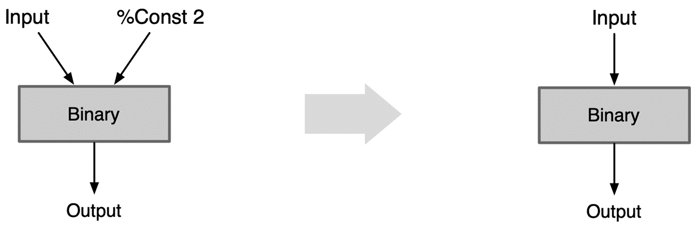
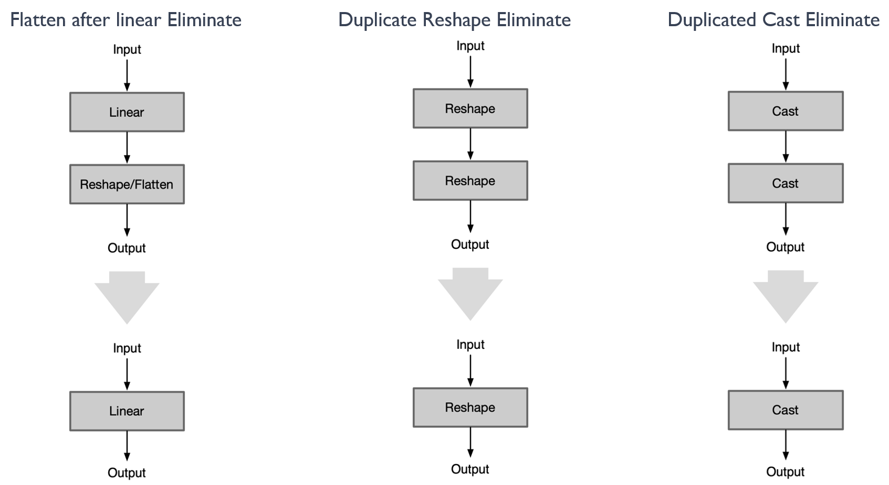
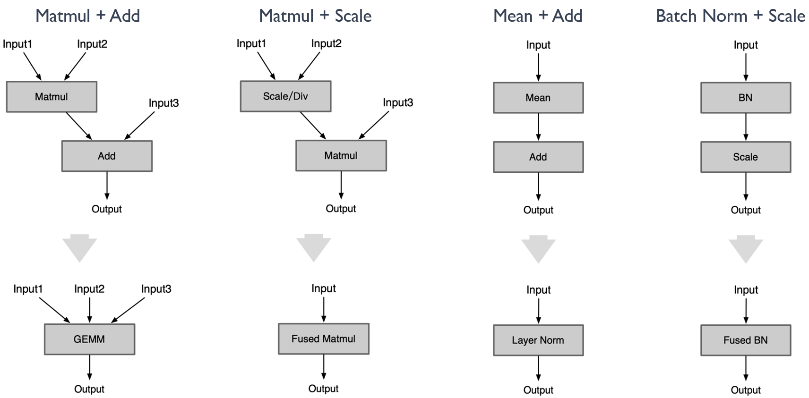
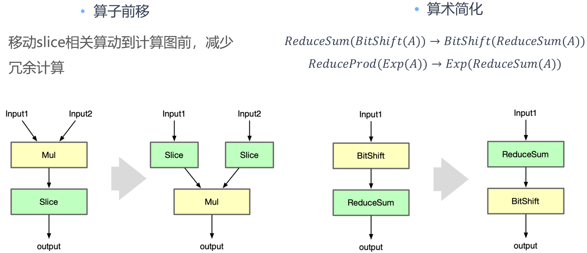

<!--Copyright © 适用于[License](https://github.com/chenzomi12/AISystem)版权许可-->

# 离线图优化技术

========== 图片按规范命名，文档名字是 01Optimizer.md, 那么图片是 01Optimizer01.png，这种

上一章节主要回顾了计算图优化的各个组成部分，包括基础优化、扩展优化以及布局和内存优化。这些优化方式在预优化阶段、优化阶段和后优化阶段都有所应用，以提高计算效率。同时，还介绍了 AI 框架和推理引擎在图优化方面的不同应用和侧重点。接下来，我们从计算图优化的各个组成部分开始逐步进行讲解。

## 基础图优化

========== 一个二级目录的内容，详细展开下哈。不行就用 KIMI 等扩写。

基础图优化指涵盖了所有保留语义的修改，如常量折叠、冗余节点消除和有限数量的节点融合，具体如下所示：

1.Constant folding 常量折叠

2.Redundant eliminations 冗余节点消除

3.Operation fusion 算子融合

4.Operation Replace 算子替换

5.Operation Forward 算子前移

## 常量折叠

常量折叠：Constant folding，常量折叠，编译器优化技术之一，通过对编译时常量或常量表达式进行计算来简化代码。常量折叠是将计算图中可以预先可以确定输出值的节点替换成常量，并对计算图进行一些结构简化的操作。

推理引擎中使用的常量折叠如上所述，通常试图在编译时计算出常量表达式的结果，从而消除在运行时对这些表达式的计算。这种优化可以显著提高程序的运行效率。假设有一个推理引擎正在处理一个计算图，其中包含如下的操作：

```python
x = 5
y = 10
z = x * y
```

在这个例子中，`x` 和 `y` 都是常量，因此他们的乘积 `z` 也是可以在编译时计算出来的常量。常量折叠优化就是将这个计算在编译时进行，从而消除了在运行时进行这个计算的需要。经过优化，上述代码将被转化为：

```python
z = 50
```

这样，程序在运行时就不再需要进行乘法运算，因为 `z` 的值已经在编译时被计算出来了。

具体方法如下所示：

Constant folding：Const 折叠，常量折叠如果一个 Op 所有输入都是常量 Const，可以先计算好结果 Const 代替该 Op，而不用每次都在推理阶段都计算一遍

Fold Const To ExpandDims：ExpandDims 折叠，ExpandDims Op 指定维度的输入是常量 Const，则把这个维度以参数的形式折叠到 ExpandDims 算子中

Fuse Const To Binary：Binary 折叠，Binary Op 第二个输入是标量 Const，把这个标量以参数形式折叠到 Binary Op 的属性中

(1) Constant folding 常量折叠：如果一个 Op 所有输入都是常量 Const，可以先计算好结果 Const 代替该 Op，而不用每次都在推理阶段都计算一遍。


如图所示，我们有两个常量输入，通过两个操作 Op1 和 Op2 进行处理。具体来说，Op1 接收两个常量作为输入，Opened 接收 Op1 的输出作为输入。在离线计算中，我们实际上可以预先计算出这两个常量的结果，然后把这个结果作为一个新的常量输入给 Op2。这种预先计算并替换常量的策略即为常量折叠。

(2) ExpandDims 折叠：ExpandDims Op 指定维度的输入是常量 Const，则把这个维度以参数的形式折叠到 ExpandDims 算子中。


在处理计算图优化的过程中，当 ExpandDims 操作的指定维度输入是常量时，我们可以直接将其堆叠进参数，并放在 ExpandDims 这个操作符内部。这样一来，我们就减少了一个操作符的使用。因为常量可能是一个操作符，或者可能占用一块内存空间。

(3) Binary 折叠：Binary Op 第二个输入是标量 Const ，把这个标量以参数的形式折叠到 Binary Op 的属性中。



Binary 折叠其原理与 ExpandDims 的折叠类似。在 Binary 折叠中，如果输入是标量，那么我们可以直接将标量作为 Binary 操作的一个参数，然后进行计算。这样做的结果是，我们减少了一个计算节点。对于计算过程来说，提高了计算效率，节省了计算资源。

## 冗余节点消除

冗余节点消除：在不改变图形结构的情况下删除所有冗余节点，目前支持 Identity Elimination、Slice Elimination、Unsqueeze Elimination、 Dropout Elimination 优化方式

### Op 本身无意义

有些 Op 本身不参与计算，在推理阶段可以直接去掉对结果没有影响。如下图所示，在转换前后类型相同的 cast，只有一个输入 tensor 的 concat，以及 Seq2Out、Identity、NoOp、Print、Assert、StopGradient、Split 等算子均可以通过一系列的模板删除包括 dropout 算子。


具体示例如下图所示：

当图中存在冗余算子时，可能会出现以下三种情况：

1、当前冗余算子的输出对于下一个节点是有意义的：可以直接去除冗余算子，然后将上一个算子的输出和下一个算子的输入相连

2、当前冗余算子的输出对于下一个节点是无意义的：此时可以把它切成两个子图，一个子图就是 input->op1，另一个子图则是 op2->output

3、当前冗余算子的输入对于下一个节点是无意义的：只要这个节点的输入没有意义，轮循删除往上的节点，直到输入有意义为止。


### Op 参数无意义

有些 Op 本身是有意义，但是设置成某些参数后就变成了无意义了的 Op。典型示例如 cast 算子，其主要是对数据的排布进行转换，当输入的参数等于输出的参数的时候，算子本身则无意义且可删除。还有很多种其他情况下的算子，在删除处理后，实践证明对于模型性能的提升具有极大的帮助。如下图所示：


详细示例如下所示：

（1）对于 cast 算子，当它的 source 等于 destination 的时候，cast 算子可以删除

（2）对于 ExpandDims 算子，当输出的 shape 跟输入的 shape 是一致时，ExpandDims 算子可以删除

（3）对于 slice/pooling 算子，index_start 等于 0 或者 index_end 等于 channel-1 以及 pooling 算子的窗口为 1x1 的时候，算子均可删除


### Op 位置无意义

一些 Op 在计算图中特殊位置会变得多余无意义。


详细示例如下所示：

示例中的 cast 算子，unsqueeze 算子以及无后续输出的 op1 和在 global pooling 之后的 reshape/flatten 算子等，均可以进行冗余算子的消除。


图一：在优化计算图的过程中，有些算子的存在并没有实际意义。例如，Cast 算子，如果它没有作用，我们就可以直接将其删除。

图二：与 Cast 算子类似，UnSqueeze 算子如果在计算图中没有起到实质作用，那么我们也可以选择将其删除，以简化计算图的结构。

图三：部分情况下，输入数据给到了某个算子 OP1，但是 OP1 的输出并没有被其他的算子接收，这就意味着 OP1 的计算结果没有被利用起来。在这种情况下，我们可以选择删除这个分支，因为其存在并没有实际意义。

图四：在处理 Global pooling 算子的过程中，我们发现它后面接的一些 Reshape 或者 Flatten 算子其实是没有意义的。因为这些算子的存在并不会改变 Global pooling 的输出结果。所以，我们可以选择将这些算子删除，以优化计算图的结构。



图一：与上图中的图四相似，我们发现 Linear 前面接的一些 Reshape 或者 Flatten 算子其实是没有意义的。因为这些算子的存在并不会改变 Linear 的输出结果。所以，我们可以选择将这些算子删除，以优化计算图的结构。

图二描述：图示展示了两个相反的 Reshape 算子。在这种情况下，这两个 Reshape 算子相互抵消，即它们的存在并不会改变数据的形状。因此，为了简化计算图和减小计算复杂性，我们可以选择删除这两个算子。

图三描述：图示展示了两个相反的 Cast 算子，一个将数据从 A 类型转换到 B 类型，另一个则将数据从 B 类型转换回 A 类型。这两个算子的存在同样没有实际意义，因为它们的操作结果并不会改变数据的类型。因此，我们同样可以选择删除这两个算子。

### Op 前后反义

前后两个相邻 Op 进行操作时，语义相反的两个 Op 都可以删除

Squeeze ExpandDims Eliminate: Squeeze 和 ExpandDims 这两个 Op 是反义的,一个压缩维度，一个是拓展维度，当连续的这两个 Op 指定的 axis 相等时即可同时删除这两个 Op

Inverse Cast Eliminate: 当连续的两个内存排布转换 Op 的参数前后反义，即 src1 等于 dst2,可同时删除这两个 Op

Quant Dequant Eliminate: 连续进行量化和反量化，可同时删除这两个 Op

Concat Slice Elimination: 合并后又进行同样的拆分，可同时删除这两个 Op

详细示例如下所示：可参考上述规则，对于存在前后反义算子的情况，进行冗余节点的消除。


====== 太笼统了，还是要介绍下图片描述得内容。

### 公共子图优化

在一个深度神经网络中，如果几个子图的类型、参数和输入均相同, 则将他们称做公共子图。对于公共子图, 只需要计算其中一个子图的值, 其他子图的值可以通过赋值得到。这个过程就称作公共子图消除, 它是一种传统编译器中常用的优化手段, 经过迁移也可以应用到深度学习编译器中。

Common Subexpression Elimination：当模型当中出现了公共子图，如一个输出是另外两个同类型同参数的 Op 的输入，则可进行删除其中一个 Op。

基本思路是通过一个 MAP 表, 记录截止当前, 已处理过的同一种类型的 OP。对于当前正在处理的 OP, 先查找该 MAP 表, 如果能找到其他和正在处理的 OP 类型相同的 OP, 则对他们进行遍历, 如果其中某个 OP 的输入和参数与当前正在处理的 OP 相同, 则它们为公共子表达式, 结果可以互相替代；如果所有 OP 都不能与当前正在处理的 OP 匹配, 则将当前 OP 复制一份返回。


## 算子融合

算子融合（Operator Fusion）是深度学习中一种常见的优化技术，主要用于减少 GPU 内存访问，从而提高模型的执行效率。在神经网络模型中，一个模型通常由多个算子（例如卷积、激活函数、池化等）组成，这些算子的计算过程中会涉及到大量的数据的读取和写入。如果能将多个算子融合为一个复合算子，就可以减少内存访问次数，从而提高模型的运行效率。

例如，假设我们有一个计算过程：`y = ReLU(Conv(x))`，如果我们将这个计算过程拆分为两步：`temp = Conv(x)`，`y = ReLU(temp)`，那么我们需要先将`Conv(x)`的结果写入内存，然后再从内存中读取这个结果用于 ReLU 的计算。但如果我们将这两个算子融合为一个算子，那么就可以直接将`Conv(x)`的结果输入到 ReLU，无需额外的内存访问，从而提高运行效率。

算子融合不仅可以减少内存访问次数，还可以提高计算密度，使得 GPU 等硬件能更充分地利用其计算资源。但是，算子融合也需要考虑到算子的计算顺序和计算精度，不能随意地将算子进行融合。下面将围绕相邻 Op 中，存在数学上线性可融合的关系进行主要的介绍：

示例一：

1.Conv + BN + Act：Conv Op 后跟着的 Batch Normal 的算子可以把 BN 的参数融合到 Conv 里面

主要是基于以下数学原理：

卷积操作（Conv）：这是一种线性操作，可以表示为 y=W*x+b，其中 W 代表权重，x 代表输入，b 代表偏置。

批量归一化操作（Batch Normalization，BN）：BN 的基本形式为 y=(x-mean(x))/sqrt(var(x)+eps)*gamma+beta，其中 mean(x) 和 var(x) 分别是 x 的均值和方差，gamma 和 beta 是学习的尺度和偏移参数。

将 Conv 和 BN 进行融合，然后按照 y=W'*x+b' 的形式重新构造，就是将 BN 的参数 gamma 和 beta 融合到 Conv 的权重 W 和偏置 b 中，得到新的权重 W' 和偏置 b'。具体计算方式为：

W' = gamma/sqrt(var(x)+eps) * W

b' = beta - gamma/sqrt(var(x)+eps) * mean(x)

这样，我们就可以将 BN 融合到 Conv 中，得到的新的权重 W'和偏置 b'可以直接用于 Conv 操作，从而减少了 BN 的计算。以下是一个简单的 Python 代码示例：

```python
def fuse_conv_bn(conv, bn):
    # 计算新的权重和偏置
    w = conv.weight
    mean = bn.running_mean
    var_sqrt = torch.sqrt(bn.running_var + bn.eps)

    beta = bn.weight
    gamma = bn.bias

    w_prime = gamma / var_sqrt * w
    b_prime = beta - gamma / var_sqrt * mean

    # 更新 Conv 的权重和偏置
    conv.weight.data = w_prime
    conv.bias.data = b_prime

    return conv
```

2.Conv + Bias + Add：Conv Op 后跟着的 Add 可以融合到 Conv 里的 Bias 参数里面

在"Conv + Bias + Add"的操作中，假设卷积输出为 X，偏置值为 b，Add 操作的值为 a。那么，这个操作序列的输出结果为：Output = X + b + a。注意到，加法操作满足交换律和结合律，所以我们可以将偏置值 b 和 Add 操作的值 a 进行相加，得到一个新的偏置值 b' = b + a。那么，原本的操作序列就可以简化为 "Conv + Bias"，其中 Bias 的值为 b'。

3.Conv + Scale + Act：Conv Op 后跟着的 Scale 可以融合到 Conv 里的 Weight 里面

主要是基于以下的数学原理：

尺度变换操作（Scale）：这是一种乘法操作，可以表示为 y=x*alpha，其中 alpha 是需要学习的尺度参数。

参考 Conv + BN + Act 的融合方式，将 Conv 和 Scale 进行融合，就是将 Scale 的参数 alpha 融合到 Conv 的权重 W 和偏置 b 中，得到新的权重 W' 和偏置 b'。具体计算方式为：

W' = alpha * W

b' = alpha * b

这样，我们就可以将 Scale 融合到 Conv 中，得到的新的权重 W' 和偏置 b' 可以直接用于 Conv 操作，从而减少了 Scale 的计算。

4.Conv + MatMul + Act：Conv Op 后跟着的 MatMul 可以融合到 Conv 里的 Weight 里面，原理与上述 scale 的融合相同


示例二：

1.Matmul + Add：使用 GEMM 代替矩阵乘 Matmul + Add

2.Matmul + Add/Scale：Matmul 前或者后接 Add / Scale / Div 可以融合到 Matmul 中

(in*W+bias0) + bias1 = in*W + (bias0+bias1)

(in*W+bias0) * sclae1 = in*(W*sclae1) + (bias0*sclae1)

(in*W+bias0) / sclae2 = in*(W/sclae2) + (bias0/sclae2)

因此可以一直往后融合下去。这个融合在性能上肯定是提升的，但是在精度上有可能会产生牺牲，特别是融合了 mul 算子。因为原来的矩阵乘 weight 和 bias 以及 scale 通常都是比较小的小于 1 的数值，把 scale 融合到 weight 和 bias 里面后，会导致 weight 和 bias 数值进一步降低，可能导致精度下降。

3.Mean + Add：使用 Mean 后面跟着 Add，使用 Layer Norm 代替

4.Batch Norm + Scale：scale 的 s 和 b 可以直接融合到 BN Op 里

在 BN 操作后通常会有一个 Scale 操作，用于恢复数据的原始分布。具体来说，如果 `x` 是 BN 的输出，那么 Scale 操作就是 `y = s * x + b`，其中 `s` 和 `b` 是可学习的参数。

将两个操作融合到一起，即直接在 BN 操作中包含 Scale 操作。这样做的优点是可以减少计算量和内存消耗，因为不需要单独存储 BN 的输出。同时，由于 BN 和 Scale 是连续的线性操作，它们的融合不会改变模型的表示能力。

5.Matmul + Batch Norm：与 Conv + BN 相类似



最后，还有一种融合是算子与后续的激活相融合：Conv + ReLU、Conv + ReLU6、Conv + Act

Act 激活操作和 Conv 操作虽然是连续但是计算过程是独立的，在推理的时候是先计算 Conv 层：访问 Conv 输出位置，再计算 ReLU 层（即第二次访存）。因此造成了访问两遍输出 output，增加了访存时间降低了推理效率。

如果计算出 Conv 结果后立马进行 Act 激活计算，把最终结果输出，则只需要访存一次。计算量不变，减少访存次数，也能提高推理速度。

## 算子替换

算子替换（Operator Substitution）是一种神经网络模型优化技术，主要用于改善模型的计算效率和性能。这种技术是将模型中的某些算子替换为功能相同或相似，但计算效率更高或对特定硬件优化更好的算子。

例如：

1、在某些情况下，两个连续的卷积层可以被替换为一个等效的卷积层，以减少计算量。

2、使用深度可分离的卷积（depthwise separable convolution）替换标准卷积，可以显著减少计算量，但仍能保持相似的性能。

算子替换需要保证替换后的模型在功能上与原模型尽可能接近，以保证模型的性能不会因为算子的替换而有所下降。算子替换的原理是通过合并同类项、提取公因式等数学方法，将算子的计算公式加以简化，并将简化后的计算公式映射到某类算子上。算子替换可以达到降低计算量、降低模型大小的效果。在实际应用中，算子替换通常与其他优化技术如算子融合等结合使用，以达到最佳的优化效果。

算子替换--一换一，将某 Op 以另外 Op 代替，能减少推理引擎需要单独实现及支持的 OP

具体示例：

MatMul -> Conv2D：将矩阵乘变成 Conv，因为一般框架对 Conv 是做了更多的优化

Linear -> Conv2D：将全连接层转变成 1x1 Conv，因为对 Conv 做了更多的优化

Batch Normal -> Scale：BN 是等价于 Scale Op 的，转换成 Scale 计算量更少，速度更快

pReLU -> Leaky ReLU：将 pReLU 转变成 Leaky ReLU，不影响性能和精度的前提下，聚焦有限算法

Conv -> Linear After global pooling：在 Global Pooling 之后 Conv 算子转换成为全连接层


算子替换--一换多，将某 Op 以其他 Op 组合形式代替，能减少推理引擎需要单独实现及支持 Op 数量

具体示例：

Shuffle Channel Replace：Shuffle Channel Op 大部分框架缺乏单独实现，可以通过组合 Reshape + Permute 实现

```python
import torch
import torch.nn.functional as F

def shuffle_channel(x, groups):
    batchsize, num_channels, height, width = x.data.size()
    channels_per_group = num_channels // groups

    # reshape
    x = x.view(batchsize, groups, channels_per_group, height, width)

    # permute
    x = x.permute(0, 2, 1, 3, 4).contiguous()

    # flatten back
    x = x.view(batchsize, -1, height, width)

    return x
```

Pad Replace：将老版 onnx 的 pad-2 的 pads 从参数形式转成输入形式

```python
import torch.nn.functional as F

def pad_replace(x, pads):
    return F.pad(x, pads)
```

ShapeN Replace：将 ShapeN Op 通过组合多个 Shape 的方式实现

```python
def shape_n_replace(*xs):
    return [x.shape for x in xs]
```

Group Conv Replace：把 Group 卷积通过组合 Slice、Conv 实现

```python
import torch
import torch.nn.functional as F

def group_conv_replace(x, weight, bias, stride, padding, dilation, groups):
    # slice input
    xs = torch.chunk(x, groups, dim=1)

    # apply conv for each slice
    ys = [F.conv2d(xi, wi, bi, stride, padding, dilation, 1) for xi, wi, bi in zip(xs, weight, bias)]

    # concat back
    y = torch.cat(ys, dim=1)

    return y
```


## 算子前移

在神经网络模型优化中，算子前移通常指的是将某些计算过程提前进行，以减少重复计算并提高模型的运行效率。

例如，假设我们有一个神经网络模型，其中有一部分计算是固定的，即无论输入是什么，这部分计算的结果都不会改变。在这种情况下，我们就可以将这部分计算提前进行，并将结果保存下来。然后在实际的计算过程中，我们只需要使用保存的结果，而无需再次进行这部分计算。这样就可以大大减少计算量，提高模型的运行效率。

算子前移是一种常见的神经网络模型优化技术，它可以有效地减少计算量，提高模型的运行效率。然而，算子前移也需要考虑到模型的计算顺序和数据依赖性，不能随意地将计算过程提前。

具体示例：

Slice and Mul：Shuffle Channel Op 大部分框架缺乏单独实现，可以通过组合 Reshape + Permute 实现

Bit shift and Reduce Sum：利用算术简化中的交换律，对计算的算子进行交换减少数据的传输和访存次数



## 小结与思考

本节简要围绕计算图优化中常量折叠&冗余节点消除进行了介绍，在了解计算图优化的相关方式的基础上，针对常量折叠和冗余节点消除进行了详细的展开，重点探讨了 cast 算子、ExpandDims 算子、Squeeze 算子以及 Slice 等算子在神经网络中不同搭配组合时，可以进行优化的情况，以达到减少重复计算和冗余计算的目的。

========== 总结成 1.xxxx，2.xxxx。

## 本节视频

<html>
<iframe src="https://player.bilibili.com/player.html?isOutside=true&aid=308766387&bvid=BV1fA411r7hr&cid=991407476&p=1&as_wide=1&high_quality=1&danmaku=0&t=30&autoplay=0" width="100%" height="500" scrolling="no" border="0" frameborder="no" framespacing="0" allowfullscreen="true"> </iframe>
</html>
