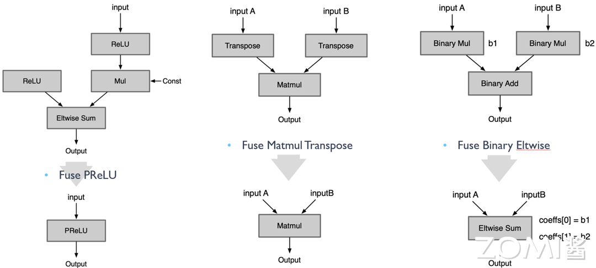
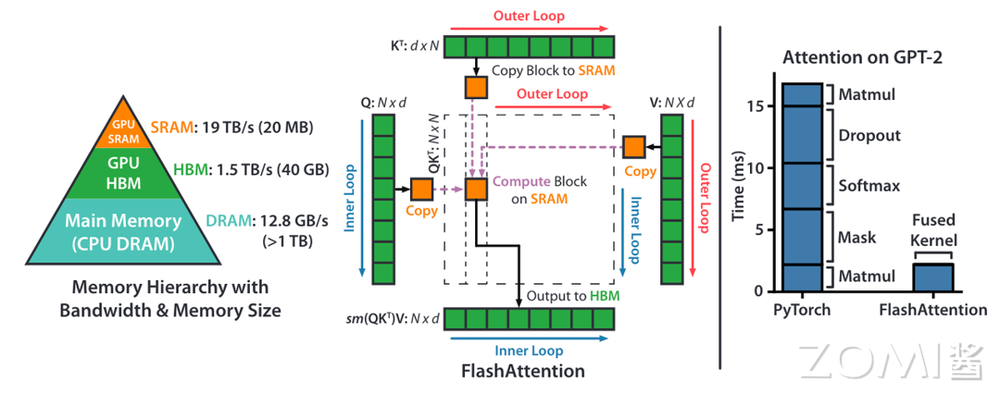
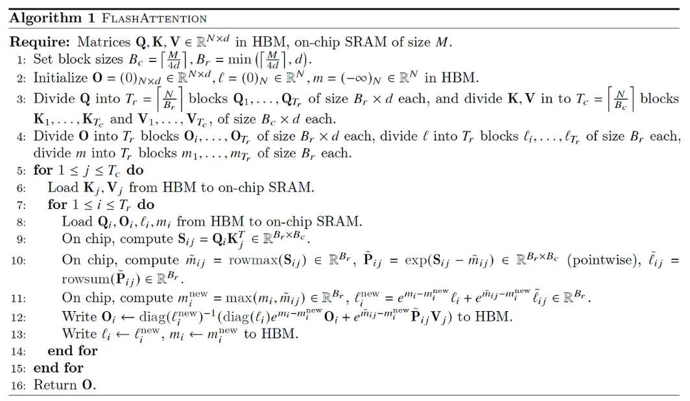
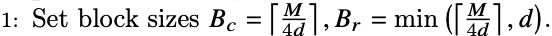
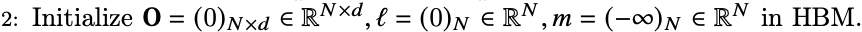
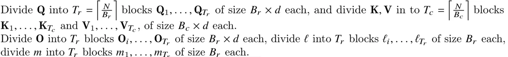

<!--Copyright © 适用于[License](https://github.com/chenzomi12/AISystem)版权许可-->

# 通用图优化技术

除了前面提到的算子替换和算子前移等内容，本节内容将深入探讨计算图的优化策略，我们将细致分析图优化的其他重要内容，如改变数据节点的数据类型或存储格式来提升模型性能，以及优化数据的存储和访问方式以降低内存占用和数据访问时间。以上内容的理解和掌握，对于高效利用计算资源，提升算法性能具有至关重要的作用。

## 计算图优化详解

### 其他图优化

某些复杂的算子在一些深度学习框架上可能没有直接实现，而是通过一系列基本算子的组合来实现。但是，这种组合方式可能会导致计算效率降低，因为每个算子之间的数据传输都需要额外的时间和空间。此外，过多的算子也会使得网络图变得复杂，难以理解和优化。

这时，如果推理引擎实现了该 Op，就可以把这些组合转成这个 Op，能够使得网络图更加简明清晰。具体示例如下：

Fuse Layer Norm：组合实现的 Norm Op 直接转换成一个 Op

Fuse PReLU：组合实现的 PReLU Op 直接转换成一个 Op

Fuse Matmul Transpose：有些框架的矩阵乘法 Matmul 层自身是不带转置操作的，当需要转置的矩阵乘法时需要前面加一个 transpose 层。如 Onnx 的 Matmul 自身有是否转置的参数，因此可以将前面的 transpose 层转换为参数即可

Fuse Binary Eltwise：x3 = x1 *b1+x2 *b2，把 BinaryOp Add 转换成 Eltwise Sum，而 Eltwise Sum 是有参数 coeffs，可以完成上述乘法的效果，因此把两个 BinaryOp Mul 的系数融合到 Eltwise Sum 的参数 coeffs

Fuse Reduction with Global Pooling：对一个三维 tensor 先后两次分别进行 w 维度的 reduction mean 和 h 维度的 reducetion mean，最终只剩下 c 这个维度，就等于进行了一次 global_mean_pooling



### Flash Attention

这里要特别提及的一篇工作是 FlashAttention。它是一种重新排序注意力计算的算法，主要针对 Transformer 模型实现性能优化，无需任何近似即可加速注意力计算并减少内存占用。

众所周知，Transformer 结构已成为自然语言处理和图像分类等应用中最常用的架构。但由于其固有的 O(N^2) 复杂度和内存限制的键值缓存，在推理过程中表现出次优效率。这种低效率使它们的实际部署变得复杂，特别是对于长序列来说，这就是大模型在发展的初期其输入输出往往只支持 2K 或 4K token 原因。

即使是到目前为止，GPT 最长支持 32K token 长度，Claude 最长有 100K token 的模型版本，然而这与现实的需求是不一致的。因为如果大模型要达到人类的高度，就需要从听觉、视觉、触觉多方面获取信息，这就需要更多或者是无限的输入 token。

而真正使得基于 Transformer 的大模型不能处理长 token 的本质原因，是 Transformer 的计算复杂度和空间复杂度随序列长度 N 呈二次方增长。例如，如果要将序列长度 N 翻倍成为 4N，我们所需的资源会变为 16 倍，即将序列长度扩展 N 倍，所需付出的计算和内存资源要扩大了约 N^2 倍，当然这里只是近似比喻。

下面我们分析下 Attention 的计算复杂度：

假设我们有一个长度为 N 的输入序列，每个位置都用一个 d 维向量表示。那么，查询矩阵 Q 的维度是 N×d，键矩阵 K 和值矩阵 V 的维度也是 N×d；

具体来说，Attention 的计算过程可以分为以下几个步骤：

1. 线性变换：对输入序列进行线性变换，得到 Q、K、V 三个矩阵。假设每个 token 的 embedding 维度为 k，则该步骤的复杂度为 O(n * k * 3d)。

2. 计算相似度得分：通过 Q、K 两个矩阵计算相似度得分，得到注意力权重矩阵。注意力权重矩阵的大小为 n * n，计算该矩阵的时间复杂度为 O(n^2 * d * h)。

3. 加权求和：将注意力权重矩阵与 V 矩阵相乘并加权求和，得到最终输出。该步骤的复杂度为 O(n * d * h)。

因此，Attention 的总计算复杂度为 O(n^2 * d * h)，约为 O(n^2）时间复杂度。

FlashAtention 加速的原理是最基础和常见的系统性能优化的手段，即通过利用更高速的上层存储计算单元，减少对低速更下层存储器的访问次数，来提升模型的训练性能。

在之前的学习中，我们了解到 CPU 的多级分层存储架构，其实 GPU 的存储架构也是类似的，遵守同样的规则，即内存越快，越昂贵，容量越小。如下图左侧部分所示，在 A100 GPU 有 40-80GB 的高带宽内存(HBM，它是由多个 DRAM 堆叠出来的)，带宽为 1.5-2.0 TB/s，而每 108 个流处理器(SM)有 192KB 的 SRAM，带宽估计在 19TB/s 左右。这里我们可以了解到 SRAM 的访问速率是 HBM 的 10 倍左右，然而其能承载的数据量却远远小于 HBM。



结合上图，我们了解到 flashAttention 是优化了计算过程中的访存（HBM）的过程，那么我们先来看下标准 Attention 的计算访存：

首先，从 HBM 中读取完整的 Q 和 K 矩阵（每个大小为 N x d），计算点积得到相似度得分 S（大小为 N x N），需要进行 O(Nd + N^2)次 HBM 访问。

其次，计算注意力权重 P（大小为 N x N）时，需要对 S 进行 softmax 操作，这需要进行 O(N^2)次 HBM 访问。

最后，将注意力权重 P 和值向量 V（每个大小为 N x d）加权求和得到输出向量 O（大小为 N x d）时，需要进行 O(Nd)次 HBM 访问。

因此，标准 Attention 算法的总 HBM 访问次数为 O(Nd + N^2)。当 N 比较大时，总的 HBM 访问次数可能会比较昂贵。

从上面可以看出，标准 Attention 算法在 GPU 内存分级存储的架构下，存在以下缺陷：

1. 过多对 HBM 的访问，如 S、P 需要在存入 HMB 后又立即被访问，HBM 带宽较低，从而导致算法性能受限

2. S、P 需要占用 O(N^2)的存储空间，显存占用较高

因此，基于之前提到的内容，可以从减少 HBM 的访问进行优化，而之所以存在大量的访存 HBM，一个原因是在 Attention 的计算中存在三个 kernel，每个 kernel 的计算过程都存在从 HBM 读取数据，计算完成后还要写回 HBM。如果我们将三个 Kernel 融合为一个，则就可以减少部分的访问 HBM 的次数。同时要保证在计算过程中要尽量的利用 SRAM 进行计算，避免访问 HBM 操作

然而，我们都知道虽然 SRAM 的带宽较大，但其计算可存储的数据量较小。如果我们采取“分治”的策略将数据进行 Tilling 处理，放进 SRAM 中进行计算，由于 SRAM 较小，当 sequence length 较大时，sequence 会被截断，从而导致标准的 SoftMax 无法正常工作。

Flash attention 则有效的解决了上述问题，总体可以归结为两个主要点:

1. Tiling (在向前和向后传递时使用)-基本上将 NxN softmax/scores 矩阵分块成块。

2. Recomputation (重算，仅在向后传递中使用)

Tiling（平铺）是一种处理注意力矩阵的策略，其主要思想是将原始的大型注意力矩阵拆分成更小的子矩阵，然后分别对这些子矩阵进行计算。只要每个子矩阵的大小能够适应 SRAM 的存储容量，那么在计算过程中就可以仅访问 SRAM，从而提高计算的效率。这种方法可以有效地在有限的存储和处理能力下处理大型注意力矩阵。

Recomputation（重算）则是一种以计算能力为代价来节省存储空间的策略。这种方法的核心思想是，不保存大量的梯度信息和每一层正向传播过程中的中间状态，而是在反向传播计算到某一层时，临时重新进行正向传播以得到所需的中间状态。这样，即使在存储资源有限的情况下，也能有效进行深度学习模型的训练。

主要的算法实现：

步骤一：计算分子块的大小

首先，我们需要获取 GPU 硬件 SRAM 的大小，我们假设为 M。为了让 Q、K、V 在计算中可以存放在 SRAM 中，我们需要设定分块的大小尺寸。

其次，在 SRAM 上需要存在的数据包括，Q 子块，K 子块，V 子块，其次还应包括计算过程中的中间输出 O，O 的大小应该与 Q、K、V 子块大小一致。

所以，在这里我们计算出子块的列大小 Bc =[M/4d]， d 为矩阵维度。

步骤二：初始化输出矩阵 O

SRAM 上的输出 O 矩阵赋值为全 0，它将作为一个累加器保存 softmax 的累积分母。

步骤三：切分子块

将 Q 划分成 Tr 个 Bolck，K、V 划分成 Tc 个 Block，初始化 attention output O，并划分成 Tr 个 Block。

步骤四：外循环加载 K、V 内循环加载 Q 子块



如图所示：

1. 外循环：对于每一个 Block Key 和 Value，从 HBM 加载进 SRAM
2. 内循环：对于每个 Block Query，从 HBM 加载进 SRAM
3. 在 SRAM 上完成 Block S 的计算

步骤五：实现分块 SoftMax 算法

下面我们看看原版的证明公式：

假如有切片向量 x = [x^(1), x^(2)]，切片后 softmax 的计算方式：



update m(x)，根据更新后的 m(x)，根据上一步计算结果重新计算 f(x), l(x)。假设存在 x^(3), 那么便可以将 x^(1)和 x^(2)合并成一个序列，重复步骤 1 即可。

计算举例：a = [0.1, 0.2, 0.3, 0.4] = [a1, a2]

则可以得到：m(a1) = 0.2, m(a2) = 0.4, m(a) = 0.4

然后计算得到：f(a1) = [e^(0.1-0.2), e^(0.2-0.2)], f(a2) = [e^(0.3-0.4), e^(0.4-0.4)], f(a) = [e^(0.2-0.4)f(a1), e^(0.4-0.4)f(a2)], 同理 l(a) = e^(0.2-0.4)l(a1) + e^(0.4-0.4)l(a2)

最终得到 softmax(a) = f(a) / l(a)

通过上述的转换可知，softmax 与分块 softmax 是在数学上是等价的关系。不过由于真实计算中次数变多，精度上也可能存在一定丢失。

步骤六：反向计算

1. 前向过程会保留 Q，K，V，O， l， m 在 HBM 中，dO 由反向计算获取后，按照前向相同的分块模式重新分块。

2. 初始化 dQ，dK，dV 为全 0 矩阵，并按照对等 Q，K，V 的分割方式分割 dQ，dK，dV。

3. 分别从 HBM 中 Load K V block on SRAM，再 Load Q block on SRAM。根据前向过程重新计算对应 block 的 S 和 P；按分块矩阵的方式分别计算对应梯度，完成参数更新。

代码实现：https://github.com/openai/triton/blob/main/python/tutorials/06-fused-attention.py#L17

```python
def _fwd_kernel(
    Q, K, V, sm_scale,
    L, M,
    Out,
    stride_qz, stride_qh, stride_qm, stride_qk,
    stride_kz, stride_kh, stride_kn, stride_kk,
    stride_vz, stride_vh, stride_vk, stride_vn,
    stride_oz, stride_oh, stride_om, stride_on,
    Z, H, N_CTX,
    BLOCK_M: tl.constexpr, BLOCK_DMODEL: tl.constexpr,
    BLOCK_N: tl.constexpr,
):
    start_m = tl.program_id(0)
    off_hz = tl.program_id(1)
    # initialize offsets
    offs_m = start_m * BLOCK_M + tl.arange(0, BLOCK_M)
    offs_n = tl.arange(0, BLOCK_N)
    offs_d = tl.arange(0, BLOCK_DMODEL)
    off_q = off_hz * stride_qh + offs_m[:, None] * stride_qm + offs_d[None, :] * stride_qk
    off_k = off_hz * stride_qh + offs_n[None, :] * stride_kn + offs_d[:, None] * stride_kk
    off_v = off_hz * stride_qh + offs_n[:, None] * stride_qm + offs_d[None, :] * stride_qk
    # Initialize pointers to Q, K, V
    q_ptrs = Q + off_q
    k_ptrs = K + off_k
    v_ptrs = V + off_v
    # initialize pointer to m and l
    m_prev = tl.zeros([BLOCK_M], dtype=tl.float32) - float("inf")
    l_prev = tl.zeros([BLOCK_M], dtype=tl.float32)
    acc = tl.zeros([BLOCK_M, BLOCK_DMODEL], dtype=tl.float32)
    # load q: it will stay in SRAM throughout
    q = tl.load(q_ptrs)
    # loop over k, v and update accumulator
    for start_n in range(0, (start_m + 1) * BLOCK_M, BLOCK_N):
        # -- compute qk ----
        k = tl.load(k_ptrs)
        qk = tl.zeros([BLOCK_M, BLOCK_N], dtype=tl.float32)
        qk += tl.dot(q, k)
        qk *= sm_scale
        qk = tl.where(offs_m[:, None] >= (start_n + offs_n[None, :]), qk, float("-inf"))
        # compute new m
        m_curr = tl.maximum(tl.max(qk, 1), m_prev)
        # correct old l
        l_prev *= tl.exp(m_prev - m_curr)
        # attention weights
        p = tl.exp(qk - m_curr[:, None])
        l_curr = tl.sum(p, 1) + l_prev
        # rescale operands of matmuls
        l_rcp = 1. / l_curr
        p *= l_rcp[:, None]
        acc *= (l_prev * l_rcp)[:, None]
        # update acc
        p = p.to(Q.dtype.element_ty)
        v = tl.load(v_ptrs)
        acc += tl.dot(p, v)
        # update m_i and l_i
        l_prev = l_curr
        m_prev = m_curr
        # update pointers
        k_ptrs += BLOCK_N * stride_kn
        v_ptrs += BLOCK_N * stride_vk
    # rematerialize offsets to save registers
    start_m = tl.program_id(0)
    offs_m = start_m * BLOCK_M + tl.arange(0, BLOCK_M)
    # write back l and m
    l_ptrs = L + off_hz * N_CTX + offs_m
    m_ptrs = M + off_hz * N_CTX + offs_m
    tl.store(l_ptrs, l_prev)
    tl.store(m_ptrs, m_prev)
    # initialize pointers to output
    offs_n = tl.arange(0, BLOCK_DMODEL)
    off_o = off_hz * stride_oh + offs_m[:, None] * stride_om + offs_n[None, :] * stride_on
    out_ptrs = Out + off_o
    tl.store(out_ptrs, acc)
```

FlashAttention 在速度和内存占用方面都表现出明显的优势，并取得了良好的效果。目前，FlashAttention 已经经过广泛验证, torch2.0 中已提供 flashattention 的实现。

FlashAttention 的优点在于充分考虑了在计算任务中 IO 的重要性，并通过分块计算的方式开发了一种快速、节省显存、精确无近似的注意力实现方法。这使得我们更便于训练具有更长上下文的 Transformer 模型，并且为后续注意力算法的优化提供了一个基准。

### layout and memory 优化

针对网络模型，特别是在处理算子（操作符）时。算子在这里可以理解为模型中完成特定任务的一种函数或者操作，例如卷积，矩阵乘法等。

当上一层和下一层的算子相同时，我们可能不需要进行数据节点转换。因为这两层已经在进行相同的操作，再进行转换可能不会带来额外的优化效果。

当上一层的输入和下一层的输入不同时，我们就需要进行数据节点转换。具体来说，我们需要插入特定的算子来处理这种输入的变化。这个过程也是图优化的一部分。

如果在某些情况下，我们发现有些算子在当前的计算图中是多余的，或者说并没有为模型的性能提升做出贡献，那么我们需要删除这些算子。

具体示例如下：



内存优化是一种计算机系统优化技术，主要目的是提高系统的运行性能，通过更有效地使用和管理内存资源来达到这个目的。

Inplace operation：是一种内存优化手段，它在当前的内存块上直接进行操作，而不需要额外开辟新的内存。如果一块内存不再需要，且下一个操作是 element-wise（元素级操作，比如加法、乘法等），我们就可以使用原地操作，直接在原内存上进行计算，覆盖原有的数据。这样做的好处是可以节省内存，减少内存的分配和回收开销，从而提高程序的运行效率。

Memory sharing：是另一种内存优化策略。它在内存使用上进行优化，当两个数据的内存大小相同，且有一个数据参与计算后不再需要时，我们可以让后一个数据直接覆盖前一个数据的内存。这样做的好处是可以减少内存的开销，节省内存空间，提高内存的使用效率。



## 小结与思考

本节深入探讨了网络模型优化的几个关键方面，包括算子融合、数据节点转换和内存优化。首先，我们讨论了算子融合，这是一种减少数据在算子之间传输的技术，可以有效地提升计算速度。通过将多个算子融合为一个算子，我们可以减少数据传输的次数，从而提升计算效率。

其次，我们介绍了数据节点转换，这是一种改变数据节点的数据类型或存储格式的方法，旨在改善模型的性能。通过对数据节点进行适当的转换，我们可以使模型更好地适应特定的计算或存储需求，从而提高模型的性能。

最后，我们研究了内存优化，这是一种优化数据的存储和访问方式的技术，旨在减少内存占用和数据访问的时间。通过改进数据的存储方式和访问策略，我们可以更有效地使用内存资源，从而提升程序的运行效率。

## 本节视频

<html>
<iframe src="https://player.bilibili.com/player.html?isOutside=true&aid=436279990&bvid=BV1Qj411T7Ef&cid=992509078&p=1&as_wide=1&high_quality=1&danmaku=0&t=30&autoplay=0" width="100%" height="500" scrolling="no" border="0" frameborder="no" framespacing="0" allowfullscreen="true"> </iframe>
</html>
