<!--Copyright ©  适用于[License](https://github.com/chenzomi12/AISystem)版权许可-->

# 卷积操作原理(DONE)

卷积是神经网络里面的核心计算之一，它是一种特殊的线性运算。而卷积神经网络（CNN）是针对图像领域任务提出的神经网络，其受猫的视觉系统启发，堆叠使用卷积层和池化层提取特征。它在 CV 领域方面的突破性进展引领了深度学习的热潮。

回到卷积本身，其变种丰富、计算复杂，神经网络运行时大部分时间都耗费在计算卷积，神经网络模型的发展在不断增加网络的深度，因此优化卷积计算就显得尤为重要。

本节将首先介绍卷积在数学范畴中的定义，通过信号处理领域的一个例子对卷积的过程进行阐释。之后为大家介绍 CNN 中卷积计算的相关知识。在了解卷积计算的基础之上，本节会继续为大家介绍卷积在内存中的数据格式以及张量中的卷积计算过程。

## 卷积的数学原理

在通常形式中，卷积是对两个实变函数的一种数学运算。在泛函分析中，卷积、旋积或褶积 (Convolution) 是通过两个函数 $f$ 和 $g$ 生成第三个函数的一种数学运算，其本质是一种特殊的积分变换，表征函数 $f$ 与 $g$ 经过翻转和平移的重叠部分函数值乘积对重叠长度的积分。

卷积神经网络（Convolution Neural Networks, CNN）的概念拓展自信号处理领域的卷积。信号处理的卷积定义为：

$$
(f*g)(t)\triangleq\int_{\mathbb{R}^{n}}f(\tau)g(t-\tau)d\tau
$$

可以证明，关于几乎所有的实数 x，随着 x 的不同取值，积分定义了一个新函数 $h(x)$，称为函数 $f$ 与 $g$ 的卷积，记为：

$$
h(x)=(f*g)(x)
$$

对于信号处理的卷积定义为连续的表示，真正计算的过程中会把连续用离散形式进行计算：

$$
(f*g)(n)\triangleq\sum_{\mathbb{Z}^{n}}f(m)g(n-m)
$$

### 通俗定义

卷积计算在直觉上不易理解，其可视化后如下图所示。图中红色滑块在移动过程中与蓝色方块的积绘制成的三角图案即为卷积结果在各点上的取值：

 

更具体来说，解释卷积需要清楚“卷”和”积“两个步骤。

1. “卷”的过程

根据上述介绍中卷积的定义：

$$
(f*g)(t)\triangleq\int_{\mathbb{R}^{n}}f(\tau)g(t-\tau)d\tau
$$

令

$$
x=\tau,y=t-\tau
$$

则有 $x+y=t$ 成立。

换言之，在卷积的过程中，函数 $f(x)$ 与 $g(y)$ 中 $x,y$ 取值受线性函数 $x+y=t$ 的约束。若令 $t=10$，则 $x,y$ 的取值序列有如下图所示的对应关系。直观上 $x,y$ 的取值有一种翻转对应的感觉。

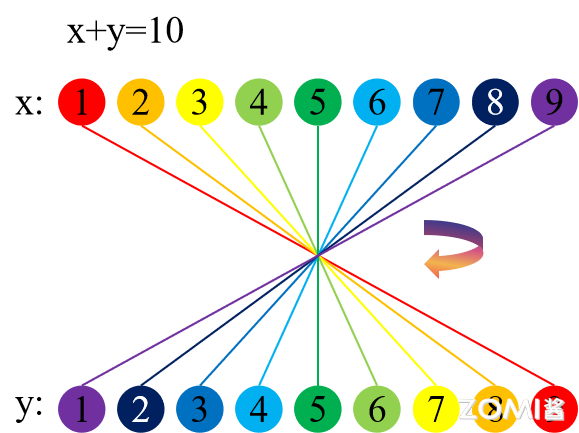 

2. ”积“的过程

当 $t$ 的取值变化时，$x,y$ 的取值约束在下图所示的斜率为 -1 的直线簇中。

定义：

$$
g(y)=f(x)=\begin{cases}0,x<0.5\\1,-0.5\leqslant x \leqslant0.5\\0,x>0.5\end{cases}
$$

下图（左）中 $t$ 的取值从上到下分别为-1，-0.5，0，0.5，1，令 $y=t-\tau,x=\tau$，左图中的红线为 $g(t-\tau)$ 的函数图像，蓝线为 $f(\tau)$ 的函数图像。黄色区域为不同 t 的取值条件下参与卷积的有效区间，黑色直线最右端的点的取值为卷积结果。

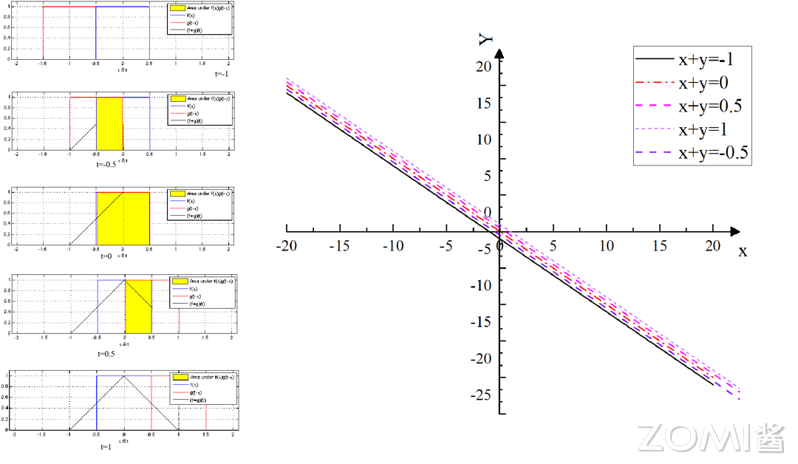 

总结来说，积分的本质为可理解为求和的极限，卷积中“积”的过程即为相应的函数相乘和求积分的过程。

### 具体例子

以信号处理的系统响应函数为例：

定义输入信号是 $f(t)$ ，随时间变化其数值保持不变。系统响应函数是 $g(t)$，图中的响应函数是随时间指数下降的，它的物理意义是说：如果在 $t=t_{1}$ 的时刻有一个输入，那么随着时间的流逝，这个输入将不断衰减。

 

由于信号 $f(t)$ 是连续输入的，也就是说，每个时刻都有新的信号进来。同时，该时刻前面的输入对后面仍有影响，该影响以 $g(t)$ 的形式衰减。如下图所示，在 $t_{2}$ 时刻，系统的输入既包括 $t_{2}$ 时刻的新信号，也包括 $t_{1}$ 时刻衰减后的响应（黄色框中的红色虚线点）。所以可以推知，系统最终输出的是所有之前输入信号的累积效果。

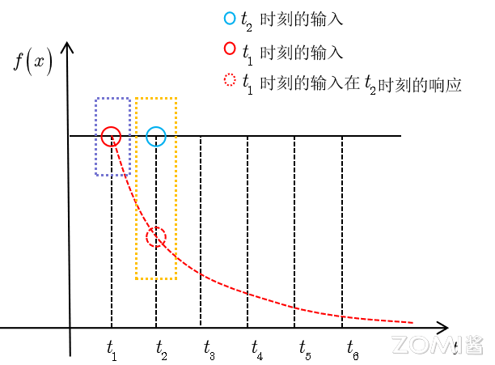 

如下图(左)所示，由于信号的响应随时间衰减，我们假定每个时刻的新信号产生的响应的影响范围为 5 个等距时间段 $T$，即在 $t_{0}$ 产生的新信号的响应影响至 $t_{5}$ 时刻。那么在 $T=t_{5}$ 时刻，输出结果跟图中绿色框的区域整体有关。

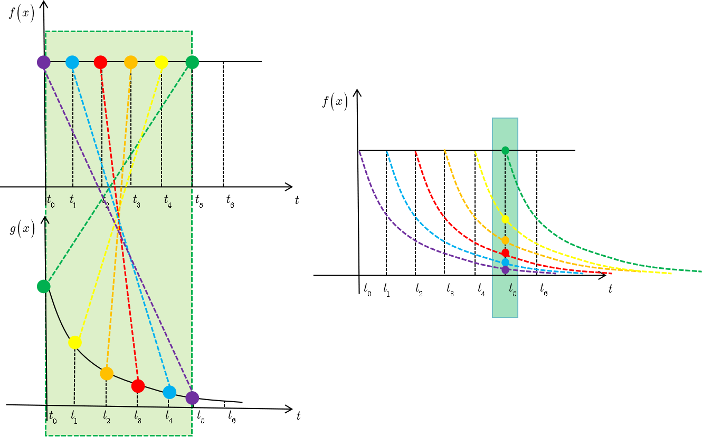 

其中，$f(t_{5})$ 因为是刚输入的，所以其输出结果应该是 $f(t_{5})g(t_{0})$，而时刻 $t_{4}$ 的输入 $f(t_{4})$，只经过了 1 个时间单位的衰减，所以产生的输出应该是 $f(t_{4})g(t_{1})$，如此类推，即图中虚线所描述的关系。这些对应点相乘然后累加，就是 $T=t_{5}$ 时刻的输出信号值，这个结果也是 $f$  和 $g$ 两个函数在 $T=t_{5}$ 时刻的卷积值。

从上图来看 $f$ 和 $g$ 这种对应关系并不直观，因此对 $g$ 关于 $y$ 轴对称变换一下，变为 $g(-t_{i})$，变换后 $f$ 和 $g$ 的对应关系如下图所示。

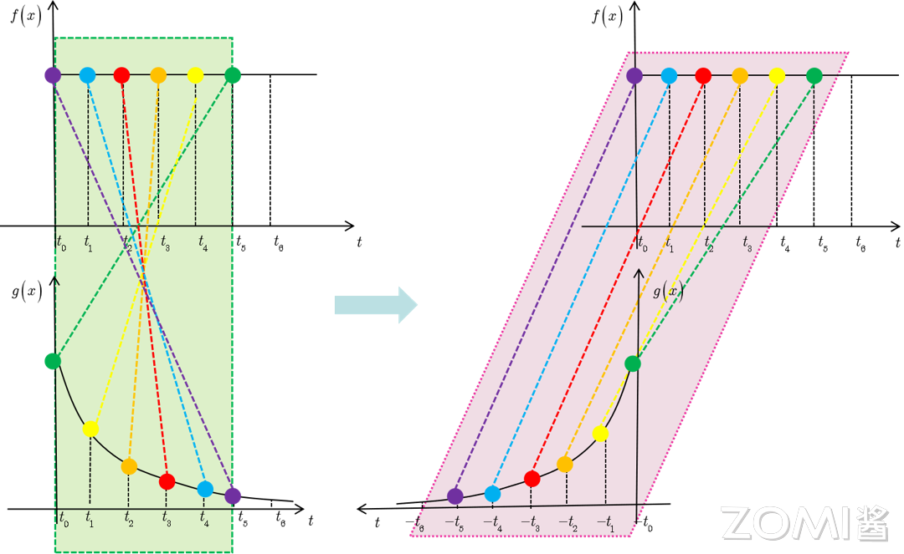 

进一步，将 $g(-t_{i})$ 图像右移 $T$ 个时间单位，得到 $g(T-t_{i})$：

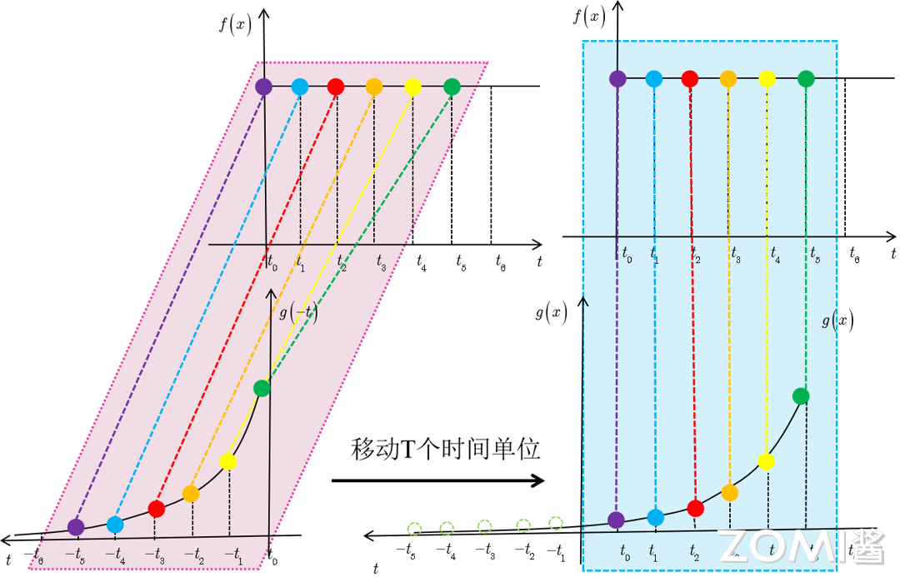 

这样我们就得到了 $f*g(T)=\int f(t)g(T-t)dt$ 的直观的图示表达。

一般来讲，当我们用计算机处理数据时，时间会被离散化，传感器会定期地反馈数据。所以在上述例子中，假设传感器每秒反馈一次测量结果是比较现实的。这样，时刻 $t_{i}$ 只能取整数值，如果假设 $g$ 和 $f$ 都定义在整数时刻 $t_{i}$ 上，就可以定义上述条件下离散形式的卷积：

$$
h(T)=(f*g)(T)=\sum_{i=0}^{i=T} f(t_{i})g(T-t_{i})
$$

### 卷积的性质

卷积满足以下的数学定律和具体的性质：

1. 交换律：$f * g = g * f$；
2. 结合律：$(f * g) * h = f * (g * h)$；
3. 分配律：$f * (g + h) = f * g + f * h$；
4. 单位响应：存在一个函数 $\delta$，使得 $f * \delta = f$。

> 其中 $\delta$ 是狄拉克 $\delta$ 函数（连续）或单位脉冲函数（离散）。

### 卷积物理意义

卷积的物理意义取决于它所应用的具体领域。在不同的领域中，卷积可以代表不同的物理过程。

1. 信号处理

在信号处理领域，卷积的物理意义通常与系统的响应有关。假设我们有一个输入信号 $f(t)$（例如，一个音频信号）和一个系统对该信号的响应 $g(t)$（系统的输出）。系统的响应 $g(t)$ 可以是理想的，也可以是实际测量得到的。

当输入信号 $f(t)$ 通过系统时，系统的输出 $h(t)$ 可以通过卷积 $f∗g$ 来计算。这里的卷积表示系统对输入信号的累积响应。具体来说，$h(t)$ 在任意时刻 $t$ 的值是输入信号 $f(t)$ 与系统响应 $g(t)$ 在过去所有时刻的加权叠加。权重由系统响应 $g$ 决定，反映了系统对不同时刻输入信号的“记忆”。

例如，如果一个系统对输入信号的响应是滞后的，那么输出信号 $h(t)$ 将是输入信号 $f(t)$ 的平滑版本，其中 $g(t)$ 决定了平滑的程度。

2. 图像处理

在图像处理中，卷积通常用于滤波和特征提取。在这种情况下，图像可以被视为二维信号 $f(x,y)$，其中 $x$ 和 $y$ 分别是图像的水平和垂直坐标。卷积核 $g(x,y)$ 是一个小的权重矩阵，它在图像上滑动，计算每个像素点的加权平均值。

这个过程的物理意义是将图像的每个像素点与其周围的像素点进行比较，通过加权平均来确定这个像素点的新值。卷积核 $g$ 的设计决定了这种比较的方式，例如，边缘检测卷积核会突出显示图像中强度变化明显的区域，从而检测出边缘。

3. 概率论

在概率论中，两个独立随机变量的联合概率密度函数的卷积给出了它们的和的概率密度函数。这背后的物理意义是，如果你有两个随机过程，它们分别产生随时间变化的概率密度函数，那么这两个过程叠加后的新过程的概率密度函数可以通过卷积原来的两个概率密度函数来得到。

4. 其他物理系统

在其他物理系统中，卷积可以表示扩散过程、波的传播、材料的混合等。在这些情况下，卷积描述了一个物理量（如温度、压力、浓度等）随时间和空间的分布变化，它是通过系统中各个部分之间的相互作用和传播效应累积而成的。

总的来说，卷积的物理意义是将两个函数（或信号）通过一种特定的方式结合起来，产生一个新的函数，这个新函数在某种意义上代表了这两个函数的相互作用或混合。具体意义取决于应用领域和函数（信号）的物理含义。

### 离散卷积

从上文信号分析的部分中，我们得到离散形式的卷积公式：

$$
(f*g)(n)\triangleq\sum_{\mathbb{Z}^{n}}f(m)g(n-m)
$$

离散卷积是指将两个离散序列中的数，按照规则，两两相乘再相加的操作。

离散卷积可以看作矩阵的乘法，然而，这个矩阵的一些元素被限制为必须和另外一些元素相等。比如对于单变量的离散卷积，矩阵每一行中的元素都与上一行对应位置平移一个单位的元素相同。这种矩阵叫做 Toeplitz 矩阵。

将上述离散卷积公式拓展到二维空间即可得到神经网络中的卷积，可简写为：

$$
S(i,j)=(I^{*}K)(i,j)=\sum_{m}\sum_{n}I(m,n)K(i-m,j-n)
$$

其中：S 为卷积的输出，I 为卷积输入，K 为卷积核的尺寸。因为卷积是可交换的，我们可等价地写作：

$$
S(i,j)=(K^{*}I)(i,j)=\sum_{m}\sum_{n}I(i-m,j-n)K(m,n)
$$

对于二维的情况，卷积对应着一个双重分块循环矩阵。除了元素相等方面的限制之外，卷积通常对应着一个非常稀疏的矩阵。这是因为核的大小通常远小于输入图像的大小。任何一个使用矩阵乘法但是并不依赖于矩阵结构的特殊性质的神经网络算法，都适用于卷积计算，并且不需要对神经网络做出大的修改。

在卷积网络的术语中，卷积的第一个参数 $f$ 通常叫做输入(input)，第二个参数 $g$ 叫做核函数（kernel function）。输出有时被称为特征映射(feature map)。在机器学习的应用中，输入通常是多维数组的数据，而核通常是由学习算法优化得到的多维数组的参数。我们把这些多维数组叫做张量。因为在输入与核中的每一个元素都必须明确地分开存储，我们通常假设在存储了数值的有限点集以外，这些函数的值都为 0。这意味着在实际操作中，我们可以通过对有限个数组元素的求和来实现无限求和。

## CNN 卷积计算

当我们在神经网络的上下文中讨论卷积时，通常不是特指数学文献中所使用的那种标准的离散卷积运算。当提到神经网络中的卷积时，通常是指由多个并行卷积组成的计算。这是因为，虽然具有单个核的卷积可以作用在多个空间位置上，但它只能提取一种类型的特征。通常，我们希望网络的每一层能够在多个位置提取多种类型的特征。当处理图像时，我们通常把卷积的输入输出看作 3 维的张量 $[C,W,H]=[[·]_{W×H},[·]_{W×H},[·]_{W×H}]$，其中一个索引 $C$ 用于表明不同的通道（比如 RGB 三通道 $[R_{m×n},G_{m×n},B_{m×n}]$），另外两个索引 $W,H$ 标明在每个通道的空间坐标。软件实现通常使用批处理模式，所以实际上会使用 4 维的张量 $[N,C,W,H]$，第 4 维索引 $N$ 用于标明批处理中的不同实例。

卷积神经网络主要由卷积层、池化层和全连接层三个部分构成。其中，卷积层是卷积神经网络的核心部分，它通过对输入图像进行卷积操作来提取图像的特征。卷积层的输入通常是一个多通道的（例如多通道图像），每个通道代表一个特征，卷积层的输出也是多通道的，其中每个通道表示一个不同的特征。池化层用于降低特征图的空间分辨率，并增强模型对输入图像的平移不变性和鲁棒性。全连接层通常用于将卷积层和池化层提取的特征进行分类或回归。它的输入是一维向量，其输出的维度与任务的分类数或回归值的维度相同。

如下图所示, 神经网络中的卷积计算过程可描述为：$3 * 3$ 的卷积核在 $8 * 8$ 的图像上进行滑动，每次滑动时，都把卷积核和对应位置的元素进行相乘再求和。青色区域为其感受野。

 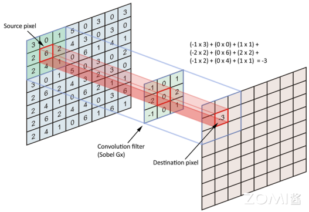 

### 名词解释

卷积的操作过程中涉及到多个专业名词和不同的计算方式，如 Padding、Stride、Channel、Kernel 等，下面将深入介绍不同名词之间的关系和表达含义。

1. **填充（Padding）**：防止图像边缘信息丢失，在输入图像的周围添加额外的行/列，通常用“0”来进行填充。其作用为使卷积后图像分辨率不变，方便计算特征图尺寸的变化，弥补边界。

填充背后的数学原理是这样的，如果我们有一个 $n×n$ 的图像，用 $k×k$ 的卷积核做卷积，那么输出的大小就是 $(n-k+1)×(n-k+1)$。这样的话会有两个缺点：

  - 第一个缺点是每次做卷积操作，图像就会缩小，在经过多层卷积后，得到的图像就会非常小；

  - 第二个缺点是在角落或者边缘区域的像素点在输出中采用较少，卷积核遍历时只经过一次，而其他区域的像素点可能会计算多次。

针对以上两个问题，我们采用的方法就是填充。假设填充的行/列数为 $p$，因为我们在周围都填充了一个像素点，输出也就变成了 $(n+2p-k+1)×(n+2p-k+1)$。

Padding 通常有 3 种方法：Valid 方式、Same 方式和自定义 Padding。

**Valid 方式**

Valid 意为不填充，这样的话，输入为 $n×n$ 的图像，用 $k×k$ 的卷积核卷积，最终得到 $(n-k+1)×(n-k+1)$ 的输出。

**Same 方式**

Same 意为填充后输出大小和输入大小一致。根据原始输入计算得到的输出尺寸 $n-k+1$，填充 $p$ 行/列后，公式变为 $n+2p-k+1$。令 $n+2p-k+1=n$，使得输出和输入大小相等，解得 $p=(k-1)/2$。这就产生了两种情况。若 $k$ 为奇数，可以直接根据公式计算得到 $p$；若 $k$ 为偶数，则只能进行不对称填充（比如左边填充多一点，右边填充少一点）以保证输出尺寸不变。

**自定义方式**

自定义意为填充自定义的行/列数。定义 $w$ 为图的宽，$h$ 为图的高，其生成的特征图大小的计算公式为：

$$
F_{out}^{h}=\left[\frac{F_{in_h}-k_{h}+2 p_{h} }s\right]+1
$$

$$
F_{out}^{w}=\left[\frac{F_{in_w}-k_{w}+2 p_{w} }s\right]+1
$$

2. **步长（Stride）**：步长是指卷积核在每一次卷积操作中滑动的距离。步长的大小可以影响输出数据的大小，也可以影响特征提取能力和计算复杂度。当步长增大时，输出数据的尺寸会减小，特征提取能力会变弱，但计算速度会加快。

我们可以把 Stride 的过程看作对全卷积函数输出的下采样，如果想在输出的每个方向上每隔 $s$ 个像素进行采样，或者说在图像中卷积核的滑动距离为 $s$，那么这个过程可用公式描述为：

$$
S(i,j)=(K^{*}I)(i,j)=\sum_{m}\sum_{n}I((i-1)×s+m,(j-1)×s+n)K(m,n)
$$

3. **通道数（Channel）**：通道数也称为深度或特征图数量，是指卷积神经网络中每一层输出的特征图数量。通道数的大小直接影响了卷积神经网络的特征提取能力和计算复杂度。通过增加通道数，可以增强卷积神经网络的特征提取能力，但也会增加计算复杂度。

4. **卷积核（Kernel）**：是具有可学习参数的算子，用于对输出图像进行特征提取，输出通常为特征图。每一个卷积核代表一种模式/特征，有几个卷积核就有几张特征图，一个卷积核都对应一个特征图。在机器学习中，卷积核的参数是由反向传播/梯度下降算法计算更新，非人工设置。其特点为：1）卷积核每次仅连接 K×K 区域，K×K 是卷积核的尺寸；2）卷积核参数重复使用（参数共享），在图像上滑动。

5. **特征图（Feature Map）**：输出特征图的尺寸的计算公式为如下所示：

其中：S 为卷积的输出，I 为卷积输入，K 为卷积核的尺寸。

### 朴素卷积过程

为了更好地理解后续的示例，现将卷积神经网络 CNN 的每层的相关参数定义为：

> H：图片高度 hight；
>
> W：图片宽度 width；
>
> C：原始图片通道数 channel；
>
> N：卷积核个数 Number of Kernel；
>
> K：卷积核高宽大小 Kernel Size；
>
> P：图像边扩充大小 Padding；
>
> S：卷积核窗口滑动的步长 Stride。

定义 $P=0,S=1$，以 $N=6$ 个卷积核对一张 $W=5,H=5,C=1$ 的图片进行卷积的过程为例，其经过的步骤为：

1. 一个卷积核覆盖的 $K×K=3×3$ 的区域，对应位置的数据相乘后相加。

2. 每个卷积核均对 1 所述区域做乘加操作，并在不同通道(Channel)对应位置相加（本例中每个卷积核的通道数 $C=1$），得到的结果为特征图上相应位置的数值。

$$
f_{out}(i,j)=\sum_{C=0}^{1}\sum_{m=0}^{3}\sum_{n=0}^{3}I(i+m,j+n)K(m,n,C)
$$

1,2 步骤的过程如下图所示。

 

3. 每个卷积核在图像上从左到右，从上到下滑动，依次计算特征图中的每一个像素点。根据特征图大小的计算公式，可知 $W_{f_{out}}=H_{f_{out}}=3$；本例中有 $N=6$ 个卷积核，输出 6 张特征图。

$$
f_{out}^{l}(i,j)
$$

$$
i=0,1,……,W_{f_{out}}-1;J=0,1,……,H_{f_{out}}-1;l=1,2,……,6;
$$

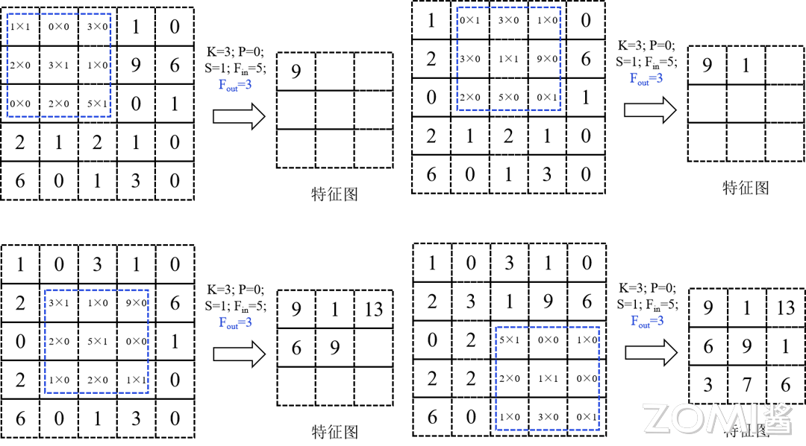 

每滑动一次，计算得到第 $l$ 个特征图上的一个像素点，如上图所示。其滑动的总次数即为特征图的像素点数量。

若有多个通道(假设 $C=3$)，则每个通道的 $(i.j)$ 位置的值对应相加得到最终结果：

$$
f_{out}^{l}(i,j)=f_{out}^{l}(i,j)_{C1}+f_{out}^{l}(i,j)_{C2}+f_{out}^{l}(i,j)_{C3}
$$

在卷积神经网络的层与层之间进行计算的时候，在 1,2 步骤之后，往往需要加偏置量 $b$ ，以打破卷积神经网络的平移不变性，增强神经网络的拟合能力：

$$
f_{out}^{l}(i,j)=f_{out}^{l}(i,j)_{C1}+f_{out}^{l}(i,j)_{C2}+f_{out}^{l}(i,j)_{C3}+b
$$

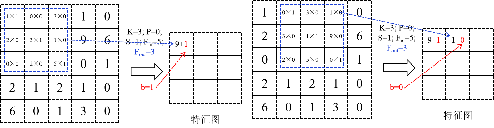 

在卷积操作中卷积核是可学习的参数，其参数的更新由梯度下降算法确定。经过上面的介绍，可知每层卷积的参数量为 $C×K×K×N$。卷积层的参数较少，这也是由卷积层的**局部连接**和**共享权重**特性所决定。

**局部连接**：每个神经元仅与输入神经元的一块区域连接，这块局部区域称作感受野（receptive field）。在图像卷积操作中，即神经元在空间维度（spatial dimension，即在图像平面滑动区域）是局部连接，但在深度（通道方面的计算）上是全部连接。这种局部连接保证了学习后的卷积核能够对于局部的输入特征有最强的响应。

**权重共享**：计算同一个输出特征图时采用的卷积核是共享的，即一个卷积核在输入图像上滑动，产生一张特征图。该特征图的每个像素点都是由上述卷积核在输入图像上滑动卷积计算产生。这样可以很大程度上减少参数。在卷积层，通常采用多个卷积核提取不同特征，单个卷积核的不同通道之间权重不共享（比如 RGB 有三通道，每个通道的权重参数相互独立）。另外，偏置参数对同一个卷积核的各个参数共享。

### 计算复杂度分析

1. 时间复杂度

CNN 的时间复杂度主要取决于卷积层的计算量。对于单个卷积层，其时间复杂度可以表示为

$$
O(f_{in}^{2}× C_{in}× C_{out} × K^{2})
$$

其中 $f_{in}$ 是输入特征图的尺寸，$C_{in}$ 和 $C_{out}$ 分别是输入和输出通道数，$K$ 是卷积核的边长。这个公式表明，时间复杂度由与输入特征图的大小、输入通道数、输出通道数以及卷积核的大小完全确定。

对于整个 CNN，时间复杂度是所有卷积层时间复杂度的累加。因此，减少卷积层的数量或降低每个卷积层的计算量都可以有效降低 CNN 的时间复杂度。例如，可以通过使用更小的卷积核、减少卷积层的通道数或采用更高效的卷积算法来优化 CNN 的性能。

> 在本节的后续小节会为大家介绍卷积的优化算法。

2. 空间复杂度

空间复杂度（访存量），严格来讲包括两部分：总参数量 + 各层输出特征图。

- 参数量：模型所有带参数的层的权重参数总量（即模型体积，下式第一个求和表达式，其中 $C_{l}$ 为本层的输出通道数，对于第 $l$ 个卷积层来说，本层的 $C_{in}$ 就是上一层的输出通道数 $C_{l-1}$，$D$ 为总的卷积层数）

- 特征图：模型在实时运行过程中每层所计算出的输出特征图大小（下式第二个求和表达式）

$$
O(\sum_{l=1}^DK_l^2\cdot C_{l-1}\cdot C_l+\sum_{l=1}^Df_l^2\cdot C_l)
$$

因此，空间复杂度与总层数、每层输入和输出通道数以及卷积核的大小有关。

优化 CNN 的空间复杂度通常通过减少模型的参数数量来实现。例如，可以采用卷积核分解的方法，将一个较大的卷积核分解为多个较小的卷积核，从而减少模型的参数数量。此外，还可以通过剪枝、量化等方法来进一步降低模型的复杂度。

### pytorch 卷积实现

首先定义 padding 模式。

``` python
def get_padding(inputs, ks, mode="SAME"):
    """
    Return padding list in different modes.
    params: inputs (input array)
    params: ks (kernel size) [p, q]
    return: padding list [n,m,j,k]
    """

    pad = None
    if mode == "FULL":
        pad = [ks[0] - 1, ks[1] - 1, ks[0] - 1, ks[1] - 1]
    elif mode == "VALID":
        pad = [0, 0, 0, 0]
    elif mode == "SAME":
        pad = [(ks[0] - 1) // 2, (ks[1] - 1) // 2,
               (ks[0] - 1) // 2, (ks[1] - 1) // 2]
        if ks[0] % 2 == 0:
            pad[2] += 1
        if ks[1] % 2 == 0:
            pad[3] += 1
    else:
        print("Invalid mode")
    return pad
```

确定了输入尺寸、卷积核尺寸、Padding 以及 Stride，输出的尺寸就被确定下来。之后利用这些参数计算特征图的大小，并定义卷积。

```python
def conv(inputs, kernel, stride, mode="SAME"):
    # 确定卷积核的尺寸
    ks = kernel.shape[:2]
    
    # get_padding 确定 padding 的模式和数值
    pad = get_padding(inputs, ks, mode="SAME")
    padded_inputs = np.pad(inputs, pad_width=((pad[0], pad[2]), (pad[1], pad[3]), (0, 0)), mode="constant")
	  
    # 得到输入图像的尺寸和通道数
    height, width, channels = inputs.shape
    
    # 确定输出特征图的尺寸
    out_width = int((width + pad[0] + pad[2] - ks[0]) / stride + 1)
    out_height = int((height + pad[1] + pad[3] - ks[1]) / stride + 1)
    outputs = np.empty(shape=(out_height, out_width))
    
    # 进行卷积计算
    for r, y in enumerate(range(0, padded_inputs.shape[0]-ks[1]+1, stride)):
        for c, x in enumerate(range(0, padded_inputs.shape[1]-ks[0]+1, stride)):
            outputs[r][c] = np.sum(padded_inputs[y:y+ks[1], x:x+ks[0], :] * kernel)
    return outputs
```

## 卷积优化手段

### Tensor 运算

张量（Tensor）是标量、矢量、矩阵等概念的总称与拓展，是机器学习领域的基础数据结构。程序中的张量是一个多维数组的数据结构。

```C++
#define MAX_DIM 6

struct Tensor {
    // 维度信息
    size_t dim[MAX_DIM];
    uint8_t num_dim;

    // 数据信息
    float* data;
    size_t num_data;
};
```

0 维张量，就是一个数。1 维张量等同于一个向量。2 维张量对应一个矩阵。3 维张量则是一个立方体。

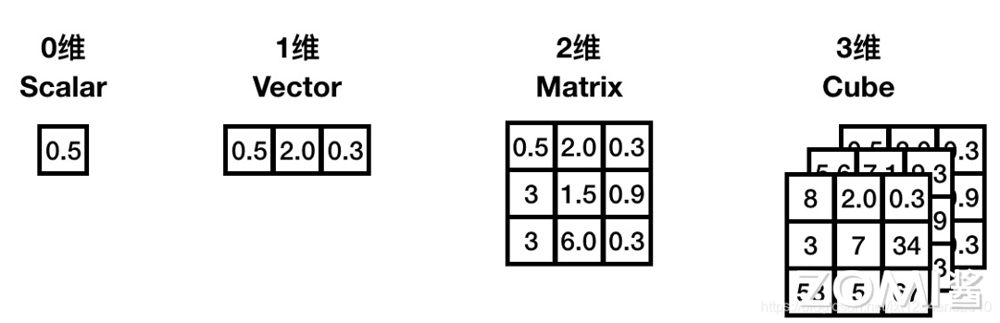 

张量集到张量集的映射称为张量计算。用编程语言来说，输入是若干张量，输出也是若干个张量，并且无副作用（参考函数式编程）的函数称之为张量计算。

张量有 “维度” 和 “数据” 两个组成要素，张量计算，也就包含维度与数据这两个组成要素的处理。比如矩阵乘法 C = MatMul(A, B)，首先是根据输入的两个张量 A, B 确定 C 的维度，然后根据 A 和 B 的数据再去计算 C 的数据。具体一些可参考下面的代码：

```C++
Tensor* MatMul(Tensor* A, Tensor* B) {
    Tensor* C = new Tensor;
    // 计算维度
    C->num_dim = 2;
    C->dim[0] = A->dim[0];
    C->dim[1] = B->dim[1];

    // 分配内存
    C->data = malloc(C->dim[0]*C->dim[1]*sizeof(float));

    // 计算数据
    Matrix::multi(C, A, B);
    return C;
}
```

### Tensor 内存布局

NHWC 和 NCHW 是卷积神经网络(cnn)中广泛使用的数据格式。它们决定了多维数据，如图像、点云或特征图如何存储在内存中。

> NHWC(样本数，高度，宽度，通道)：这种格式存储数据通道在最后，是 TensorFlow 框架或者大部分推理引擎的默认格式；
>
> NCHW(样本数，通道，高度，宽度)：通道位于高度和宽度尺寸之前，经常与 PyTorch 一起使用。

### Tensor 卷积运算

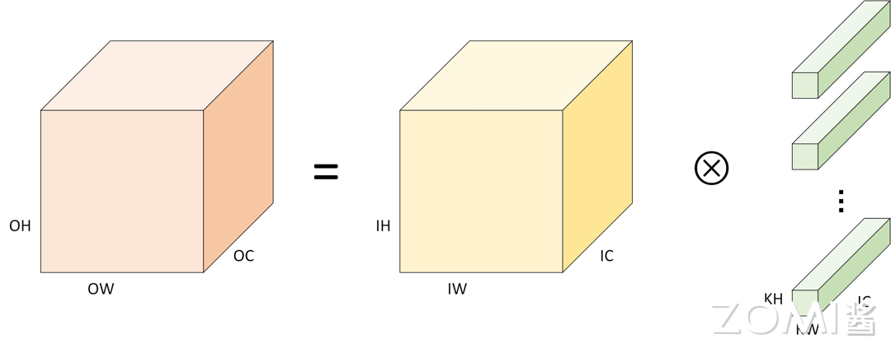 

当中张量的内存布局为 NHWC 时，卷积计算相应的伪代码如下。其中外三层循环遍历输出 C 的每个数据点，对于每个输出数据都需要经由内三层循环累加求和得到（点积）。

```C++
for (int oh = 0; oh < OH; oh++) {
  for (int ow = 0; ow < OW; ow++) {
    for (int oc = 0; oc < OC; oc++) {
    //OH,OW,OC 为输出图像的尺寸和通道数，ow,oh,oc 为输入图像当前像素点的坐标和通道序号
      C[oh][ow][oc] = 0;
      for (int kh = 0; kh < KH, kh++){
        for (int kw = 0; kw < KW, kw++){
          for (int ic = 0; ic < IC, ic++){
          //KW,KH,IC 分别为第 i 个卷积核的尺寸和通道数，卷积核的通道数 IC 应与输入图像的通道数相匹配
            C[oh][ow][oc] += A[oh+kh][ow+kw][ic] * B[kh][kw][ic];
            //表示在输入图像的 ic 通道下 ow,oh 位置开始进行卷积计算，ow+kh 表示在 ow 处右移 kh 个位置
            //+=操作表示不同通道下的乘加结果求和，应“简单卷积过程”小节下步骤 3 的第二个公式
          }
        }
      }
    }
  }
}
```

和矩阵乘的优化方法类似，我们也可针对该计算进行向量化、并行化、循环展开的基本的优化操作。

## 小结与思考

- 卷积操作是深度学习中用于提取特征的关键数学运算，涉及两个函数的元素乘积与累加。

- 卷积在不同领域具有不同的物理意义，如信号处理中的系统响应和图像处理中的特征提取。

- 优化卷积计算对于提高神经网络模型效率至关重要，包括算法、内存访问、汇编和调度优化。

- 张量运算和内存布局（如 NHWC 与 NCHW）对卷积性能有显著影响，是实现高效卷积计算的关键策略。

## 本节视频

<html>
<iframe src="https://player.bilibili.com/player.html?isOutside=true&aid=395040992&bvid=BV1No4y1e7KX&cid=1027996262&p=1&as_wide=1&high_quality=1&danmaku=0&t=30&autoplay=0" width="100%" height="500" scrolling="no" border="0" frameborder="no" framespacing="0" allowfullscreen="true"> </iframe>
</html>

<html>
<iframe src="https://player.bilibili.com/player.html?isOutside=true&aid=651712557&bvid=BV1Ze4y1c7Bb&cid=1003817481&p=1&as_wide=1&high_quality=1&danmaku=0&t=30&autoplay=0" width="100%" height="500" scrolling="no" border="0" frameborder="no" framespacing="0" allowfullscreen="true"> </iframe>
</html>
