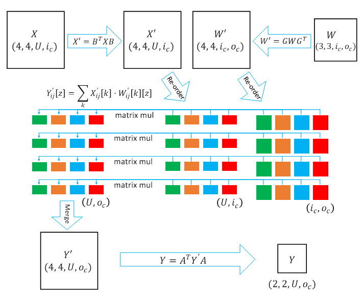

<!--Copyright © ZOMI 适用于[License](https://github.com/chenzomi12/AISystem)版权许可-->

# 推理内存布局

从前文的简单介绍中，我们提到了可以从内存布局上对推理引擎的Kernel进行优化，接下来，我们将先介绍CPU和GPU的基础内存知识，NCHWX内存排布格式以及详细展开描述MNN这个针对移动应用量身定制的通用高效推理引擎中通过数据内存重新排布进行的内核优化。

## 内存

CPU内存主要架构图如下图所示，其中比较关键的是有主存，以及其上的多级缓存架构，CPU运行的速度太快，相对而言内存的读写速度就非常慢。如果CPU每次都要等内存操作完成，才可以继续后续的操作，那效率会非常低下。由此设计出了多级缓存架构，缓存级别越小，越靠近CPU，同样也意味着速度越快，但是对应的容量越少。

当CPU需要取数据时，如果通过索引得知缓存中没有该数据，那么此时CPU需要从RAM主存中先获取数据，然后将该数据及其临近数据加载到Cache缓存中，以便利用访问局部性提升访问命中率。当然多级缓存也会带来问题，即数据同步问题，当出现多核和乱序时，如何保证数据同步也需要提供一种内存屏障的规则。

GPU内存主要架构图如下图所示，在主缓存等主要架构上，与CPU没太多的区别，也是多级缓存架构，其调度执行模式主要是按照SIMT模式进行，由许多 SM 组成。

SM（Streaming Multiprocessors）：可以理解为一个 GPU 计算单元的小集合，好比多核 CPU 的一个核 —— 但 CPU 的一个核一般运行一个线程，而 SM 能够运行多个轻量线程，每一个 SM 有自己的 Wrap scheduler 、寄存器（Register）、指令缓存、L1缓存、共享内存。Wrap scheduler：运算规划器，可以理解为运算时一个 warp 抓一把线程扔进了 cores 里面进行计算。

GPU互相之间一般是通过PCIe桥直接传输数据，或者是通过NVLink这种专用的超高速数据传输通道来传输数据。

## NCHWX

在推理引擎中，或者底层Kernel层实际上为了更加适配到DSA或者ASIC专用芯片会使用NCHWX内存排布格式，那么下面我们来详细了解一下NCHWX数据排布格式。

由于典型的卷积神经网络随着层数的增加，其特征图在下采样后的长和宽逐渐减小，但是通道数随着卷积的过滤器的个数不断增大是越来越大的，经常会出现通道数为128，256等很深的特征图。这些很深的特征图与过滤器数很多的卷积层进行运算的运算量很大。为了充分利用有限的矩阵计算单元，进行了通道维度的拆分是很有必要的。根据不同数据结构特点，常见的有分别对Channel维进行了Channel/4，Channel/32和Channel/64的拆分，下图为NCHWX的物理存储结构。

具体来说，先取Channel方向的数据，按照NCHW4来进行举例，先取17/13/X，再取W方向的数据，再取H方向的数据。

由于典型的卷积神经网络随着层数的增加，其特征图在下采样后的长和宽逐渐减小，但是通道数随着卷积的过滤器的个数不断增大是越来越大的，经常会出现通道数为 128，256 等很深的特征图。这些很深的特征图与过滤器数很多的卷积层进行运算的运算量很大。

为了充分利用有限的矩阵计算单元，进行了通道维度的拆分是很有必要的。根据不同数据结构特点，常见的有分别对 Channel 维进行了 Channel/4，Channel/32 和 Channel/64 的拆分，下图为 NCHWX 的物理存储结构。具体来说，先取 Channel 方向的数据，按照 NCHW4 来进行举例，先取 17/13/X，再取 W 方向的数据，再取 H 方向的数据。

## MNN

MNN 是一个轻量级的深度学习端侧推理引擎，核心解决深度神经网络模型在端侧推理运行问题，涵盖深度神经网络模型的优化、转换和推理。

其对WinoGrad卷积计算进行内核优化，重新排布了其数据格式，下面我们来进行详细介绍。

### WinoGrad卷积计算

首先我们先给出针对WinoGrad二维卷积计算的公式：

$$
\begin{align}
Y = A^T[[GWG^T]\odot[B^XB]]A
\end{align}
$$

其中，$W$ 为 $r \times r$ 的卷积核，$X$ 为 $(m + r -1) \times (m + r -1)$ 的图像块。

可以看出Hadamard 积是 Winograd 卷积中必不可少的步骤（见上公式）。但它存在内存访问耗时较长的问题，拖累了整个计算过程。

事实上，对Hadamard 积的求和可以转换为点积。

将多个点积组合在一起可以得到矩阵乘法，这是并行性和分摊内存访问开销的不错的方式。

通过这种方式，我们在数据布局重新排序的基础上将 Hadamard 积转换为矩阵乘法。

MNN在WinoGrad卷积计算优化中使用的数据排布格式为NC4HW4。它将 4个数据元素拆分为一个单元，为张量创建一个新维度。4个元素连续放置在内存中，以便利用 CPU 中的矢量寄存器在单个指令（即 SIMD）中计算这4个数据。

MNN中数据重新排布后，对WinoGrad卷积的计算如下图所示：

我们看数据格式重新排布后的重要计算公式：

$$
\begin{align}
Y’_{ij}[z] = \sum_kX’_{ij}[k]\ast W’_{ij}[k][z]
\end{align}
$$

令参与计算的X’矩阵与W’矩阵以及中间矩阵Y’的前两个维度都为4。

CPU 中的矢量寄存器在单个指令中能够一次计算4组在内存中连续存储的数据，一个指令就可以计算4次matrix mul，充分利用了SIMD的并行计算能力。

总结一下，MNN对数据格式进行 NC4HW4 重排后，可以充分利用 ARM CPU 指令集的特性，实现对卷积等操作进行加速；同时可以较少 cache miss，提高内存命中率。

当然，对于较大的 feature 特征图，如果其 channel 不是 4 的倍数，则会导致补充 0 过多，导致内存占用过高，同时也相应的增加计算量。

## 小结

在本节中我们介绍了

1.CPU 和 GPU 内存中都有重要的多级缓存架构，来保证 CPU/GPU 核要访问内存时，不用每次都等内存操作完成，才可以继续后续的操作，可以从缓存中读取。

2.NCHWX 的格式能够更好的适配SIMT，为了充分利用有限的矩阵计算单元，进行了通道维度的拆分，还对Cache更友好，减少Cache未命中的概率；Kernel实现层面易进行Padding，减少边界分支判断，代码逻辑简单。

3.MNN中针对WinoGrad卷积计算进行内核优化，重新排布了其数据格式为NC4HW4，CPU 中的矢量寄存器在单个指令中能够一次计算4组在内存中连续存储的数据，充分利用了SIMD的并行计算能力。

## 本节视频

<html>
<iframe src="https://player.bilibili.com/player.html?isOutside=true&aid=352822140&bvid=BV1eX4y1X7mL&cid=1034535797&p=1&as_wide=1&high_quality=1&danmaku=0&t=30&autoplay=0" width="100%" height="500" scrolling="no" border="0" frameborder="no" framespacing="0" allowfullscreen="true"> </iframe>
</html>
