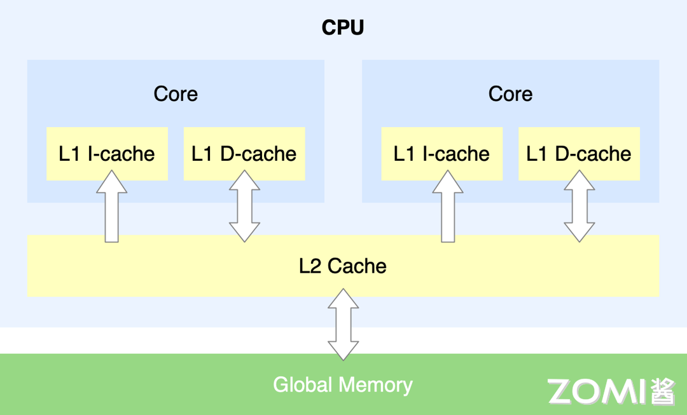
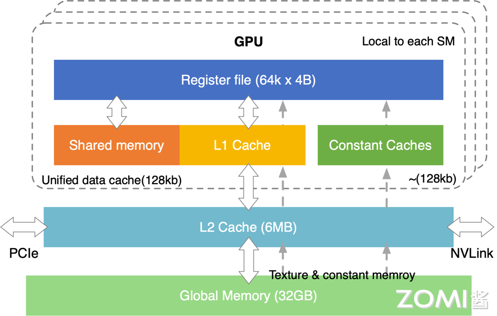
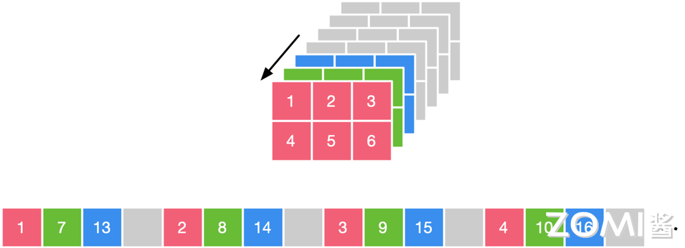

<!--Copyright © ZOMI 适用于[License](https://github.com/chenzomi12/AISystem)版权许可-->

# 推理内存布局

从前文的简单介绍中，我们提到了可以从内存布局上对推理引擎的Kernel进行优化，接下来，我们将从内存，内存布局方面采用的多种经典方法来详细介绍。

## 系统内存

CPU内存主要架构图如下图所示，其中比较关键的是有主存，以及其上的多级缓存架构，CPU运行的速度太快，相对而言内存的读写速度就非常慢。如果CPU每次都要等内存操作完成，才可以继续后续的操作，那效率会非常低下。由此设计出了多级缓存架构，缓存级别越小，越靠近CPU，同样也意味着速度越快，但是对应的容量越少。当CPU需要取数据时，如果通过索引得知缓存中没有该数据，那么此时CPU需要从RAM主存中先获取数据，然后将该数据及其临近数据加载到Cache缓存中，以便利用访问局部性提升访问命中率。当然多级缓存也会带来问题，即数据同步问题，当出现多核和乱序时，如何保证数据同步也需要提供一种内存屏障的规则。

GPU内存主要架构图如下图所示，在主缓存等主要架构上，与CPU没太多的区别，也是多级缓存架构，其调度执行模式主要是按照SIMT模式进行，由许多 SM 组成。SM（Streaming Multiprocessors）：可以理解为一个 GPU 计算单元的小集合，好比多核 CPU 的一个核 —— 但 CPU 的一个核一般运行一个线程，而 SM 能够运行多个轻量线程，每一个 SM 有自己的 Wrap scheduler 、寄存器（Register）、指令缓存、L1缓存、共享内存。Wrap scheduler：运算规划器，可以理解为运算时一个 warp 抓一把线程扔进了 cores 里面进行计算。GPU互相之间一般是通过PCIe桥直接传输数据，或者是通过NVLink这种专用的超高速数据传输通道来传输数据。

### 内存对齐

如下图所示，右侧代表着数据，左侧代表着内存的多个地址，数据存放在内存的某个地址中。内存对齐指的是数据元素按照一定的规则在空间上排列，而不是顺序的一个接一个的排放。数据在内存中存储时相对于起始地址的偏移量是数据大小的整数倍，称为自然对齐，相对应的通过编译器或语言的指令强制变量按照特定的对齐方式存储，称为强制对齐。

内存对齐的原因：从硬件的层面来看，虽然数据在内存中是按照字节进行存储，但是处理器从内存中读取数据是通过总线通讯，总线默认传输的是字，即处理器按照字节块的方式读取内存，举个例子，比如32位系统从内存中以4字节为粒度进行读取，64位系统从内存中以8字节为粒度进行读取，所以当在处理器上进行未对齐的地址访问时，处理器将读取多个字，还有些处理器平台不支持访问任意地址上的任意数据。

详细的举例子展开来讲，以4字节存取粒度的处理器为例，如上图所示，我们现在要读取一个int变量，其有4个字节，假如没有内存对齐机制，将一个int放在地址为1的位置，那么我们需要读取的有地址1234，具体操作时首先需要从地址0开始读取，然后取其较高的三位123，剔除首字节0，第二次从地址4开始读取，然后只取其较低的一位4，之后将两个数据合并，总体上来说，如果有内存对齐，如下图所示，我们只需读取一次，而没有内存对齐机制，将导致访问请求数据所需的内存事务数增加至2倍。

总结一下，现代处理器上的内存子系统仅限于以其字大小的粒度和对齐方式访问内存。下面我们来总结一下内存中字粒度访问和内存对齐的原因。

原因一为速度问题，现代处理器具有多个级别的高速缓存，数据必须通过这些缓存；支持单字节读取将使内存子系统的吞吐量与执行单元的吞吐量紧密地绑定，会消耗大量CPU资源，成为瓶颈。CPU 总是以其字的大小进行内存读取，进行未对齐的内存访问时，处理器将读取多个字，需要读取变量所跨越内存的所有字，同时进行处理。将导致访问请求数据所需要的内存事务增加2倍。

原因二为原子性，CPU 可以在一个对齐的内存字上操作，意味着没有指令可以中断该操作。这对于许多无锁数据结构和其他并发范式的正确性至关重要。除此之外，内存对齐还可以用于优化缓存和SIMD指令，内存对齐有助于利用缓存行的特性。缓存通常以固定大小的缓存行存储数据，如果数据按照缓存行对齐，可以最大程度地减少对内存的访问次数，提高缓存的命中率。对齐的内存访问对于使用 SIMD指令集的操作更为重要。这些指令集通常要求数据在内存中按照一定的对齐方式排列，以便能够一次性处理多个数据。

## Tensor内存布局

Tensor是神经网络中的一个基本数据结构，可以看作是一个多维数组，其在内存中排布为按字节存储。他的重要属性有形状和基本数据类型，形状能够决定张量的维度，以及各个维度的数量组成方式。基本数据类型决定了其每个元素占用内存的字节数，以及存在的方式。其在内存中索引占据的范围由其形状决定。

零维张量只有一个数，一维张量有多个数，二维张量是一个矩阵，也是用来表达一个黑白图片常用的，三维张量常用于表达彩色图片，四维张量常用于表达多张彩色图片，五维六维等一般是因为硬件方便处理等原因对维度再次进行了分割。

在深度学习领域中，多维数据通过多维数组存储，比如卷积神经网络的特征图通常用四维数组保存：四个维度分别为“N”batch批量大小，一般指图像数量，“C”channels特征图通道数，“H”height特征图的高度，和“W”width特征图的宽度。比如自然语言领域，数据通常用三维数组保存，三个维度分别为“N”batch批量大小，“S”sequece句子数量，“W”word单词数量。

在计算机内存里存储的时候，是线性的存储，根据排列顺序的区别，行为主序的称为行优先存储，列为主序的称为列优先存储。

行优先存储和列优先存储并没有绝对的好坏关系，相对比较通用的结论是：对于行优先遍历的，使用行优先存储，对于列优先遍历的，使用列优先存储。相邻操作访存地址应该尽可能接近。通常根据这个原则去排布数据能够得到较优的访存。这是由缓存的结构决定的。这个原则被称为访存的空间局部性，也即相近的代码（指令）最好访问相邻的数据，这样硬件能够提供更好的性能。

## NCHW

如下图所示，这个例子中的图片分为红绿蓝三个通道，假设我们使用的是"NCHW"的数据排布方式，这里我们先将各方向的定义在这个图中详细说明，1 2 3这个方向为W，1 4这个方向为H，1 7 13这个方向为C，N方向只有一个图片，暂时不讨论，"NCHW"的数据排布方式，是先取W方向的数据，即123，再取H方向的数据，即123 456，再取C方向的数据，即123456 789/10/11/12 13/14/15/16/17/18，在计算机中存储时即为图示下侧的序列，简单地来说，也就是先在一个通道中，按照W方向/H方向存储数据，接着再到剩余通道中按同样方式存储数据，其突出特点是同一个通道的数值连续排布，更适合需要对每个通道单独运算的操作，如 MaxPooling最大池化操作，"NCHW"的计算时需要的存储更多，一次存储对应一个通道的数据，适合GPU运算，正好利用了GPU内存带宽较大并且并行性强的特点，其访存与计算的控制逻辑相对简单。

如下图所示，按照"NCHW"的数据排布方式，我们的目标是计算灰度值，那么我们需要先将通道一的数据加载进内存，乘以0.299，然后每次计算都可能需要加载一整个完整通道的数据，通道二所有数据值乘以 0.587，通道三所有数据值乘以 0.114，最后将三个通道结果相加得到灰度值，三个操作是独立的，可以在GPU上并行完成。

## NHWC

同样的图片，假设我们使用的是"NHWC"的数据排布方式，按照上文定义的方向，我们先取C方向的数据，即17/13，再取W方向的数据，即17/13 28/14 39/15，再取H方向的数据，即17/13 28/14 39/15 4/10/16 5/11/17 6/12/18，在计算机中存储时即为上所图示下侧的序列，简单地来说，先把不同通道中同一位置的元素存储，再按照W方向/H方向按照同样方式存储数据，其突出特点为不同通道中的同一位置元素顺序存储，因此更适合那些需要对不同通道的同一数据做某种运算的操作，比如“Conv1x1”1x1卷积操作。"NHWC"更适合多核CPU运算，CPU的内存带宽相对较小，每个像素计算的时延较低，临时空间也很小，有时计算机采取异步的方式边读边算来减小访存时间，计算控制灵活且复杂。

如下图所示，按照"NHWC"的数据排布方式，我们的目标是计算灰度值，假设我们现在有3个cpu的核，那么就可以通过3个核分别并行处理这三个通道的同一位置元素，最后进行累加得到灰度值。

### 框架对NCHW与NHWC的默认选择

常用的深度学习框架中默认使用NCHW的有caffe、NCNN、pytorch、mxnet等，默认使用NHWC的有tensorflow、openCV等，设置非默认排布格式只需要修改一些参数即可。

## NCHWX

由于典型的卷积神经网络随着层数的增加，其特征图在下采样后的长和宽逐渐减小，但是通道数随着卷积的过滤器的个数不断增大是越来越大的，经常会出现通道数为128，256等很深的特征图。这些很深的特征图与过滤器数很多的卷积层进行运算的运算量很大。为了充分利用有限的矩阵计算单元，进行了通道维度的拆分是很有必要的。根据不同数据结构特点，常见的有分别对Channel维进行了Channel/4，Channel/32和Channel/64的拆分，下图为NCHWX的物理存储结构。具体来说，先取Channel方向的数据，按照NCHW4来进行举例，先取17/13/X，再取W方向的数据，再取H方向的数据。

NCHWX 的格式能够更好的适配SIMT，其中Cuda的DP4A模块计算时执行两个4元素向量A(int8)和B(int8)（每个向量包含存储在32位字中的4个单字节值）之间的向量点积，将结果存储为32位整数，这个过程与NCHW4十分适配，一次正好取出4个元素进行计算。为了最大化CUDA的Tensor core计算单元的卷积算子的吞吐，NCHW32和NCHW64分别针对int8和int4数据类型进行计算,对Cache更友好，减少Cache未命中的概率；Kernel实现层面易进行Padding，减少边界分支判断，代码逻辑简单。

## 小结

在本节中我们介绍了

1.CPU和GPU内存中都有重要的多级缓存架构，来保证CPU/GPU核要访问内存时，不用每次都等内存操作完成，才可以继续后续的操作，可以从缓存中读取。

2.张量在内存中的数据布局排布方式相当多，常见的有行优先存储和列优先存储，我们应该根据硬件特点来选择其数据排布方式能够优化性能。

3.卷积神经网络的特征图通常用四维数组保存，有两种常见的数据排布方式，"NHWC"更适合多核 CPU 运算，"NCHW"更适合在 GPU 上并行完成。

3.NCHWX 的格式能够更好的适配SIMT，为了充分利用有限的矩阵计算单元，进行了通道维度的拆分，还对Cache更友好，减少Cache未命中的概率；Kernel实现层面易进行Padding，减少边界分支判断，代码逻辑简单。

## 本节视频

<html>
<iframe src="https://www.bilibili.com/video/BV1eX4y1X7mL/?vd_source=2f45292201835520d512b8f7c607b1fd" width="100%" height="500" scrolling="no" border="0" frameborder="no" framespacing="0" allowfullscreen="true"> </iframe>
</html>
