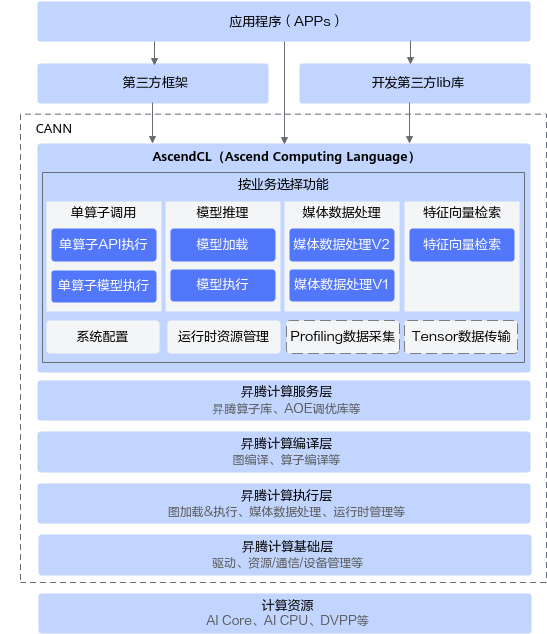
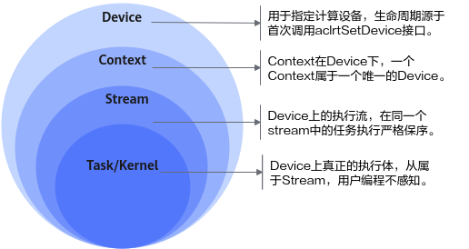
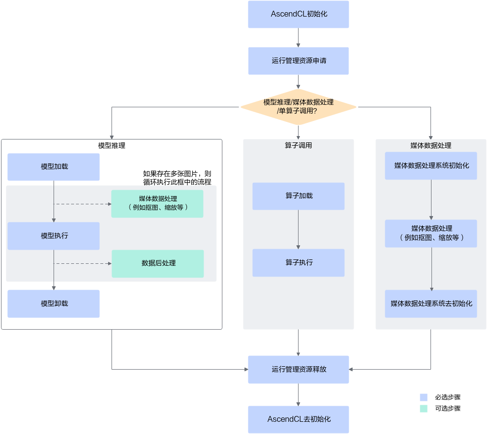

<!--适用于[License] (https://github.com/chenzomi12/AISystem/blob/main/LICENSE)版权许可-->

# 推理引擎示例：AscendCL

本节参考文献：昇腾社区CANN开发者文档

## AscendCL是什么？
AscendCL（Ascend Computing Language）是一套用于在昇腾平台上开发深度神经网络应用的C语言API库，提供运行资源管理、内存管理、模型加载与执行、算子加载与执行、媒体数据处理等API，能够实现利用昇腾硬件计算资源、在昇腾CANN平台上进行深度学习推理计算、图形图像预处理、单算子加速计算等能力。简单来说，就是统一的API框架，实现对所有资源的调用。其中，计算资源层是昇腾AI处理器的硬件算力基础，主要完成神经网络的矩阵相关计算、完成控制算子/标量/向量等通用计算和执行控制功能、完成图像和视频数据的预处理，为深度神经网络计算提供了执行上的保障。

### AscendCL的优势
- 高度抽象：算子编译、加载、执行的API归一，相比每个算子一个API，AscendCL大幅减少API数量，降低复杂度。
- 向后兼容：AscendCL具备向后兼容，确保软件升级后，基于旧版本编译的程序依然可以在新版本上运行。
- 零感知芯片：一套AscendCL接口可以实现应用代码统一，多款昇腾AI处理器无差异。

### AscendCL的应用场景
- 开发应用：用户可以直接调用AscendCL提供的接口开发图片分类应用、目标识别应用等。
- 供第三方框架调用：用户可以通过第三方框架调用AscendCL接口，以便使用昇腾AI处理器的计算能力。
- 供第三方开发lib库：用户还可以使用AscendCL封装实现第三方lib库，以便提供昇腾AI处理器的运行管理、资源管理等能力。

## 基本概念

| 概念                 | 描述                                                         |
| -------------------- | ------------------------------------------------------------ |
| 同步/异步            | 本文中提及的同步、异步是站在调用者和执行者的角度：若在调用AscendCL接口后**不等待**Device侧的任务执行完成再返回，则表示调度是**异步**的；若在调用AscendCL接口后**需等待**Device侧的任务执行完成再返回，则表示调度是**同步**的。 |
| 进程/线程            | 本文中提及的进程、线程，若无特别注明，则表示Host上的进程、线程。 |
| Host                 | Host指与Device相连接的X86服务器、ARM服务器，会利用Device提供的NN（Neural-Network ）计算能力，完成业务。 |
| Device               | Device指安装了昇腾AI处理器的硬件设备，利用PCIe接口与Host侧连接，为Host提供NN计算能力。若存在多个Device，多个Device之间的内存资源不能共享。 |
| Context              | Context作为一个容器，管理了所有对象（包括Stream、Event、设备内存等）的生命周期。不同Context的Stream、不同Context的Event是完全隔离的，无法建立同步等待关系。Context分为两种：默认Context：调用[aclrtSetDevice](https://www.hiascend.com/document/detail/zh/canncommercial/80RC1/apiref/appdevgapi/aclcppdevg_03_0038.html)接口指定用于运算的Device时，系统会自动隐式创建一个默认Context，一个Device对应一个默认Context，默认Context不能通过[aclrtDestroyContext](https://www.hiascend.com/document/detail/zh/canncommercial/80RC1/apiref/appdevgapi/aclcppdevg_03_0052.html)接口来释放。显式创建Context：**推荐，**在进程或线程中调用[aclrtCreateContext](https://www.hiascend.com/document/detail/zh/canncommercial/80RC1/apiref/appdevgapi/aclcppdevg_03_0051.html)接口显式创建一个Context。 |
| Stream               | Stream用于维护一些异步操作的执行顺序，确保按照应用程序中的代码调用顺序在Device上执行。基于Stream的kernel执行和数据传输能够实现Host运算操作、Host与Device间的数据传输、Device内的运算并行。Stream分两种：默认Stream：调用[aclrtSetDevice](https://www.hiascend.com/document/detail/zh/canncommercial/80RC1/apiref/appdevgapi/aclcppdevg_03_0038.html)接口指定用于运算的Device时，系统会自动隐式创建一个默认Stream，一个Device对应一个默认Stream，默认Stream不能通过[aclrtDestroyStream](https://www.hiascend.com/document/detail/zh/canncommercial/80RC1/apiref/appdevgapi/aclcppdevg_03_0064.html)接口来释放。显式创建Stream：**推荐，**在进程或线程中调用[aclrtCreateStream](https://www.hiascend.com/document/detail/zh/canncommercial/80RC1/apiref/appdevgapi/aclcppdevg_03_0060.html)接口显式创建一个Stream。 |
| Event                | 支持调用AscendCL接口同步Stream之间的任务，例如同一个Device上的多个任务。例如，若stream2的任务依赖stream1的任务，想保证stream1中的任务先完成，这时可创建一个Event，并将Event插入到stream1，在执行stream2的任务前，先同步等待Event完成。 |
| AIPP                 | AIPP（Artificial Intelligence Pre-Processing）用于在AI Core上完成图像预处理，包括色域转换（转换图像格式）、图像归一化（减均值/乘系数）和抠图（指定抠图起始点，抠出神经网络需要大小的图片）等。AIPP区分为静态AIPP和动态AIPP。您只能选择静态AIPP或动态AIPP方式来处理图片，不能同时配置静态AIPP和动态AIPP两种方式。静态AIPP：模型转换时设置AIPP模式为静态，同时设置AIPP参数，模型生成后，AIPP参数值被保存在离线模型（*.om）中，每次模型推理过程采用固定的AIPP预处理参数（无法修改）。如果使用静态AIPP方式，多Batch情况下共用同一份AIPP参数。动态AIPP：模型转换时设置AIPP模式为动态，每次模型推理前，根据需求，在执行模型前设置动态AIPP参数值，然后在模型执行时可使用不同的AIPP参数。如果使用动态AIPP方式，多Batch可使用不同的AIPP参数。 |
| 动态Batch/动态分辨率 | 在某些场景下，模型每次输入的batch size或分辨率是不固定的，如检测出目标后再执行目标识别网络，由于目标个数不固定导致目标识别网络输入BatchSize不固定。动态Batch：用户执行推理时，其batch size是动态可变的。动态分辨率: 用户执行推理时，每张图片的分辨率H*W是动态可变的。 |
| 动态维度（ND格式）   | 为了支持Transformer等网络在输入格式的维度不确定的场景，需要支持ND格式下任意维度的动态设置。ND表示支持任意格式，当前N<=4。 |
| 通道                 | 在RGB色彩模式下，图像通道就是指单独的红色R、绿色G、蓝色B部分。也就是说，一幅完整的图像，是由红色绿色蓝色三个通道组成的，它们共同作用产生了完整的图像。同样在HSV色系中指的是色调H，饱和度S，亮度V三个通道。 |
| 标准形态             | 指Device做为EP，通过PCIe配合主设备（X86、ARM等各种服务器）进行工作，此时Device上的CPU资源仅能通过Host调用，相关推理应用程序运行在Host。Device只为服务器提供NN计算能力。 |
| EP模式               | 以昇腾 AI 处理器的PCIe的工作模式进行区分，如果PCIe工作在从模式，则称为EP模式。 |
| RC模式               | 以昇腾 AI 处理器的PCIe的工作模式进行区分，如果PCIe工作在主模式，可以扩展外设，则称为RC模式。 |

### Device、Context、Stream之间的关系

- Device，用于指定计算设备。
- - Device的生命周期源于首次调用aclrtSetDevice接口。
- - 每次调用aclrtSetDevice接口，系统会进行引用计数加1；调用aclrtResetdevice接口，系统会进行引用计数减1。
- - 当引用计数减为零时，在本进程中Device上的资源不可用。
- Context，在Device下，一个Context一定属于一个唯一的Device。
- - Context分隐式创建和显式创建。
- - 隐式创建的Context（即默认Context），生命周期始于调用aclrtSetDevice接口，终结于调用aclrtResetdevice接口使引用计数为零时。隐式Context只会被创建一次，调用aclrtSetDevice接口重复指定同一个Device，只增加隐式创建的Context的引用计数。
- - 显式创建的Context，生命周期始于调用aclrtCreateContext接口，终结于调用aclrtDestroyContext接口。
- - 若在某一进程内创建多个Context（Context的数量与Stream相关，Stream数量有限制，请参见aclrtCreateStream），当前线程在同一时刻内只能使用其中一个Context，建议通过aclrtSetCurrentContext接口明确指定当前线程的Context，增加程序的可维护性。
- - 进程内的Context是共享的，可以通过aclrtSetCurrentContext进行切换。
- Stream，是Device上的执行流，在同一个stream中的任务执行严格保序。
- - Stream分隐式创建和显式创建。
- - 每个Context都会包含一个默认Stream，这个属于隐式创建，隐式创建的stream生命周期同归属的Context。
- - 用户可以显式创建stream，显式创建的stream生命周期始于调用aclrtCreateStream，终结于调用aclrtDestroyStream接口。显式创建的stream归属的Context被销毁或生命周期结束后，会影响该stream的使用，虽然此时stream没有被销毁，但不可再用。
- Task/Kernel，是Device上真正的任务执行体。

### 线程、Context、Stream之间的关系
- 一个用户线程一定会绑定一个Context，所有Device的资源使用或调度，都必须基于Context。
- 一个线程中当前会有一个唯一的Context在用，Context中已经关联了本线程要使用的Device。
- 可以通过aclrtSetCurrentContext进行Device的快速切换。
- 一个线程中可以创建多个Stream，不同的Stream上计算任务是可以并行执行；多线程场景下，推荐每个线程创建一个Stream，线程之间的Stream在Device上相互独立，每个Stream内部的任务是按照Stream下发的顺序执行。
- 多线程的调度依赖于运行应用的操作系统调度，多Stream在Device侧的调度，由Device上调度组件进行调度。

### 一个进程内多个线程间的Context切换
- 一个进程中可以创建多个Context，但一个线程同一时刻只能使用一个Context。
- 线程中创建的多个Context，线程缺省使用最后一次创建的Context。
- 进程内创建的多个Context，可以通过aclrtSetCurrentContext设置当前需要使用的Context。

### 默认Context和默认Stream使用场景
- Device上执行操作下发前，必须有Context和Stream，这个Context、Stream可以显式创建，也可以隐式创建。隐式创建的Context、Stream就是默认Context、默认Stream。
默认Stream作为接口入参时，直接传NULL。

- 默认Context不允许用户执行aclrtGetCurrentContext或aclrtSetCurrentContext操作，也不允许执行aclrtDestroyContext操作。
- 默认Context、默认Stream一般适用于简单应用，用户仅仅需要一个Device的计算场景下。多线程应用程序建议全部使用显式创建的Context和Stream。

### 多线程、多Stream的性能考虑
- 线程调度依赖运行的操作系统，Stream上下发了任务后，Stream的调度由Device的调度单元调度，但如果一个进程内的多Stream上的任务在Device存在资源争抢的时候，性能可能会比单Stream低。
- 当前昇腾AI处理器有不同的执行部件，如AI Core、AI CPU、Vector Core等，对应使用不同执行部件的任务，建议多Stream的创建按照算子执行引擎划分。
- 单线程多Stream与多线程多Stream（一个进程中可以包含多个线程，每个线程中一个Stream）性能上哪个更优，具体取决于应用本身的逻辑实现，一般来说前者性能略好，原因是相对后者，应用层少了线程调度开销。

## 基本开发流程
调用AscendCL接口，可开发包含模型推理、媒体数据处理、单算子调用等功能的应用，这些功能可以独立存在，也可以组合存在。下图给出了使用AscendCL接口开发AI应用的整体接口调用流程。

上图根据应用开发中的典型功能抽象出主要的接口调用流程，例如，如果模型对输入图片的宽高要求与用户提供的源图不一致，则需要媒体数据处理，将源图裁剪成符合模型的要求；如果需要实现模型推理的功能，则需要先加载模型，模型推理结束后，则需要卸载模型；如果模型推理后，需要从推理结果中查找最大置信度的类别标识对图片分类，则需要数据后处理。

1. AscendCL初始化。
   调用aclInit接口实现初始化AscendCL。
2. 运行资源管理申请。
   申请运行管理资源（Device、Context、Stream等）的具体流程。
3. 模型推理/单算子调用/媒体数据处理。
-  模型推理
   a. 模型加载：模型推理前，需要先将对应的模型加载到系统中。注意加载模型前需要有适配昇腾AI处理器的离线模型。
   b. （可选）媒体数据处理：可实现JPEG图片编/解码、视频解码、抠图/图片缩放/格式转换等功能。
   c. 模型执行：使用模型实现图片分类、目标识别等推理功能。
   d. （可选）数据后处理：处理模型推理的结果，此处根据用户的实际需求来处理推理结果，例如用户可以将获取到的推理结果写入文件、从推理结果中找到每张图片最大置信度的类别标识等。
   e. 模型卸载：调用aclmdlUnload接口卸载模型。
-     算子调用
   如果AI应用中不仅仅包括模型推理，还有数学运算（例如BLAS基础线性代数运算）、数据类型转换等功能，也想使用昇腾的算力，直接通过AscendCL接口加载并执行单个算子，省去模型构建、训练的过程，相对轻量级，又可以使用昇腾的算力。另外，自定义的算子，也可以通过单算子调用的方式来验证算子的功能。
4. 运行管理资源释放。
   所有数据处理都结束后，需要依次释放运行管理资源。
5. AscendCL去初始化。
   调用aclFinalize接口实现AscendCL去初始化。

## 小结

AscendCL作为华为Ascend系列AI处理器的软件开发框架，为用户提供了强大的编程支持。通过AscendCL，开发者可以更加高效地进行AI应用的开发和优化，从而加速AI技术在各个领域的应用和落地。AscendCL的易用性和高效性，使得它成为开发AI应用的重要工具之一。

更多AscendCL相关内容，请参考昇腾社区文档：https://www.hiascend.com/zh/document
