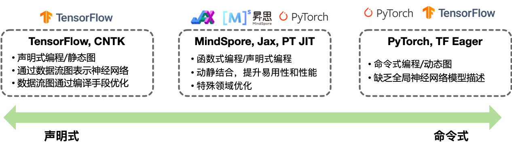
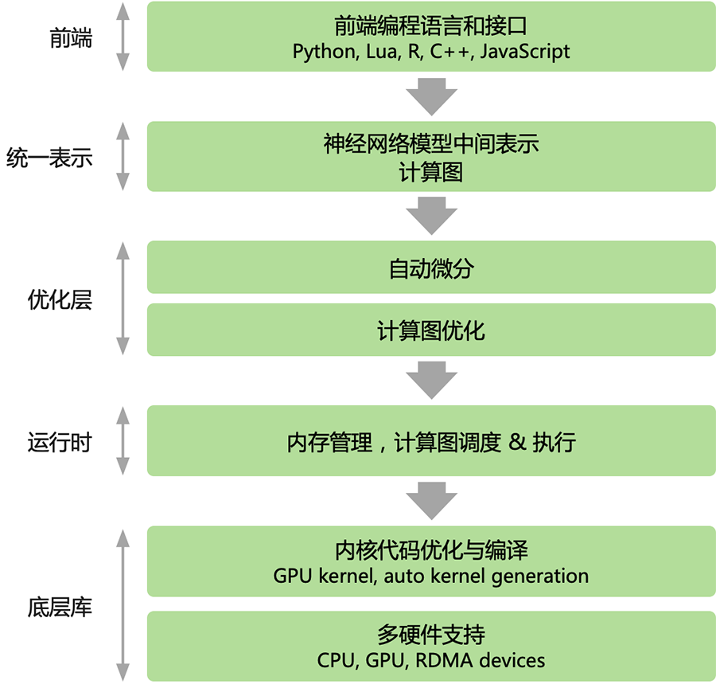

<!--Copyright © ZOMI 适用于[License](https://github.com/chenzomi12/DeepLearningSystem)版权许可-->

# 框架编程范式

编程范式、编程范型、或程式設計法（Programming paradigm），是指软件工程中的一类典型的编程风格。常见的编程范型有：函数式编程、命令式编程、声明式编程、面向对象编程等等，编程范式提供并决定了开发者对程序执行的看法。在开发者使用 AI 框架进行编程的过程中，主要使用到的编程范式主要有2种：1）声明式编程与2）命令式编程。



本节将会深入展开和介绍两种不同的编程范式对AI框架整体架构设计的影响，以及目前主流的 AI 框架在编程范式之间的差异。

## 程序开发的编程范式

- 命令式编程（Imperative）：详细的命令机器怎么（How）去处理一件事情以达到想要的结果（What）

- 声明式编程（Declarative）：只告诉想要的结果（What），机器自己摸索执行过程（How）

### 编程与编程范式

编程是开发者编定程序的中文简称，就是让计算机代码解决某个问题，对某个计算体系规定一定的运算方式，使计算体系按照该计算方式运行，并最终得到相应结果的过程。

为了使计算机能够理解人的意图，我们就必须将需解决的问题的思路、方法和手段通过计算机能够理解的形式告诉计算机，使得计算机能够根据人的指令一步一步去工作，完成某种特定的任务。这种人和计算体系之间交流的过程称为编程。

### 命令式编程

命令式编程（Imperative programming）是一种描述计算机所需作出的行为的编程典范，几乎所有计算机的硬件工作都是命令式的。

其步骤可以分解为：首先，必须将带解决问题的解决方案抽象为一系列概念化的步骤。然后通过编程的方法将这些步骤转化成程序指令集（算法），而这些指令按照一定的顺序排列，用来说明如何执行一个任务或解决一个问题。这意味着，开发者必须要知道程序要完成什么，并且告诉计算机如何进行所需的计算工作，包括每个细节操作。简而言之，就是把计算机看成一个善始善终服从命令的装置。

所以在命令式编程中，把待解问题规范化、抽象为某种算法是解决问题的关键步骤。其次，才是编写具体算法和完成相应的算法实现问题的正确解决。

目前开发者接触到的命令式编程主要以硬件控制程序、执行指令为主。AI 框架中 PyTorch 则主要使用了命令式编程的方式。

下面的代码实现一个简单的声明式编程的过程：创建一个存储结果的集合变量 results，并遍历数字集合 collection，判断每个数字大于 5 则添加到结果集合变量 results 中。上述过程需要告诉计算机每一步如何执行。

```Python
results = []

def fun(collection):
    for num in collection:
        if num > 5:
            results.append(num)
```

### 声明式编程

声明式编程（Declarative programming）是一种编程范式，与命令式编程相对立。它描述目标的性质，让计算机明白目标，而非流程。声明式编程不用告诉计算机问题领域，从而避免随之而来的副作用。而命令式编程则需要用算法来明确的指出每一步该怎么做。

> 副作用：在计算机科学中，函数副作用（Side Effects）指当调用函数时，除了返回可能的函数值之外，还对主调用函数产生附加的影响。例如修改全局变量（函数外的变量），修改参数，向主调方的终端、管道输出字符或改变外部存储信息等。

声明式编程透过函数、推论规则或项重写（term-rewriting）规则，来描述变量之间的关系。它的语言运行器（编译器或解释器）采用了一个固定的算法，以从这些关系产生结果。

目前开发者接触到的声明式编程语言主要有：括数据库查询语言（SQL，XQuery），正则表达式，逻辑编程，函数式编程等。在AI框架领域中以 TensorFlow1.X 为代表，就使用了声明式编程。

以常用数据库查询语言 SQL 为例，其属于较为明显的一种声明式编程的例子，其不需要创建变量用来存储数据，告诉计算机需要查询的目标即可：

```SQL
>>> SELECT * FROM collection WHERE num > 5
```

### 函数式编程

函数式编程（Functional Programming）函数式编程本质上也是一种编程范式，其在软件开发的工程中避免使用共享状态（Shared State）、可变状态（Mutable Data）以及副作用。即将计算机运算视为函数运算，并且避免使用程序状态以及易变对象，理论上函数式编程是声明式的，因为它不使用可变状态，也不需要指定任何的执行顺序关系。

其核心是只使用纯粹的数学函数编程，函数的结果仅取决于参数，而没有副作用，就像 I/O 或者状态转换。程序通过组合函数（function composition）的方法构建。整个应用由数据驱动，应用的状态在不同纯函数之间流动。与命令式编程的面向对象编程而言，函数式编程其更偏向于声明式编程，代码更加简洁明了、更可预测，并且可测试性也更好。因此实际上可以归类为属于声明式编程的其中一种特殊范型。

函数式编程最重要的特点是“函数第一位”（First Class），即函数可以出现在任何地方，比如可以把函数作为参数传递给另一个函数，不仅如此你还可以将函数作为返回值。以 Python 代码为例：

```Python
def fun_add(a, b, c):
    return a + b + c

def fun_outer(fun_add, *args, **kwargs):
    print(fun_add(*args, **kwargs))

def fun_innter(*args):
    return args

if __name__ == '__main__':
    fun_outer(fun_innter, 1, 2, 3)
```

## AI框架的编程范式

主流AI框架，无论PyTorch还是Tensorflow都使用都以Python为主的高层次语言为前端，提供脚本式的编程体验，后端用更低层次的编程模型和编程语言开发。后端高性能可复用模块与前端深度绑定，通过前端驱动后端方式执行。AI框架为前端开发者提供声明式（declarative programming）和命令式（imperative programming）两种编程范式。


:width:`500px`

在主流的 AI 框架中，TensorFlow 提供了声明式编程体验，PyTroch 提供了命令式的编程体验。但两种编程模型之间并不存在绝对的边界，multi-stage 编程和及时编译（Just-in-time, JIT）技术能够实现两种编程模式的混合。随着 AI 框架引入更多的编程模式和特性，例如 TensorFlow Eager模式 和 PyTorch JIT 的加入，主流 AI 框架都选择了通过支持混合式编程以兼顾两者的优点。

### 命令式编程

在命令式编程模型下，前端 Python 语言直接驱动后端算子执行，表达式会立即被求值，又被称作define-by-run。开发者编写好神经网络模型的每一层，并编写训练过程中的每一轮迭代需要执行的计算任务。在程序执行的时候，系统会根据 Python 语言的动态解析性，每解析一行代码执行一个具体的计算任务，因此称为**动态计算图（动态图）**。

命令式编程的优点是方便调试，灵活性高，但由于在执行前缺少对算法的统一描述，也失去了编译期优化的机会。

相比之下，命令式编程对数据和控制流的静态性限制很弱，方便调试，灵活度极高。缺点在于，网络模型程序在执行之前没有办法获得整个计算图的完整描述，从而缺乏缺乏在编译期的各种优化手段。

以 PyTorch 其编程特点为即时执行，它属于一种声明式的编程风格。下面使用 PyTorch 实现一个简单的2层神经网络模型并训练：

```Python 
import numpy as np
import pandas as pd
from sklearn.model_selection import train_test_split
import torch
import torch.nn as nn
import torch.optim as optim

# 导入数据
data = pd.read_csv('mnist.csv')
X = data.iloc[:, 1:].values
y = data.iloc[:, 0].values

# 分割数据集
X_train, X_test, y_train, y_test = train_test_split(X, y, test_size=0.2)

# 将数据转换为张量
X_train = torch.tensor(X_train, dtype=torch.float)
X_test = torch.tensor(X_test, dtype=torch.float)
y_train = torch.tensor(y_train, dtype=torch.long)
y_test = torch.tensor(y_test, dtype=torch.long)

# 定义模型
class Net(nn.Module):
    def __init__(self):
        super(Net, self).__init__()
        self.fc1 = nn.Linear(784, 128)
        self.fc2 = nn.Linear(128, 10)
        
    def forward(self, x):
        x = self.fc1(x)
        x = self.fc2(x)
        return x

model = Net()

# 定义损失函数和优化器
criterion = nn.CrossEntropyLoss()
optimizer = optim.Adam(model.parameters())

# 训练模型
for epoch in range(5):
    # 将模型设为训练模式
    model.train()
    
    # 计算模型输出
    logits = model(X_train)
    loss = criterion(logits, y_train)
```

### 声明式编程

在声明式编程模型下，前端语言中的表达式不直接执行，而是构建起一个完整前向计算过程表示，对数据流图经过优化然后再执行，又被称作define-and-run。即开发者定义好整体神经网络模型的前向表示代码，因为整体定义好神经网络模型，因此在 AI 框架的后端会把网络模型编译成 **静态计算图（简称：静态图）** 来执行。

执行方式比较直接：前端开发者写的 Python 语言中的表达式不直接执行；首先会利用 AI 框架提供的 API 定义接口构建一个完整前向计算过程表示。最后对数计算图经过优化然后再执行。

AI 框架采用声明式编程的优点在于：

1. 执行之前得到整个程序（整个神经网络模型）的描述

2. 在真正运行深度学习之前能够执行编译优化算法

3. 能够实现极致的性能优化

缺点也较为明显：

1. 数据类型和控制流受到 AI 框架中的 API 对神经网络有限定义而约束

2. 因为神经网络的独特性需要 AI 框架预定义对应的概念（DSL），造成不方便调试、灵活性低

以 Google 的 TensorFlow1.X 为代表的编程特点包括：计算图(Computational Graphs)、会话（Session）、张量(Tensor)，其作为一种典型声明式编程风格。下面使用 TensorFlow 实现一个隐层的全连接神经网络，优化的目标函数是预测值和真实值的欧氏距离。该实现使用基本的 Tensorflow 操作来构建一个计算图，然后多次执行这个计算图来训练网络。

```Python
import tensorflow as tf
import numpy as np

# 首先构建计算图

# N是batch大小；D_in是输入大小。
# H是隐单元个数；D_out是输出大小。
N, D_in, H, D_out = 64, 1000, 100, 10

# 输入和输出是placeholder，在用session执行graph的时候
# 我们会feed进去一个batch的训练数据。
x = tf.placeholder(tf.float32, shape=(None, D_in))
y = tf.placeholder(tf.float32, shape=(None, D_out))

# 创建变量，并且随机初始化。 
# 在Tensorflow里，变量的生命周期是整个session，因此适合用它来保存模型的参数。
w1 = tf.Variable(tf.random_normal((D_in, H)))
w2 = tf.Variable(tf.random_normal((H, D_out)))
```

接着为Forward阶段，计算模型的预测值y_pred。注意和PyTorch不同，这里不会执行任何计算，而只是定义了计算，后面用session.run的时候才会真正的执行计算。

```Python
h = tf.matmul(x, w1)
h_relu = tf.maximum(h, tf.zeros(1))
y_pred = tf.matmul(h_relu, w2)

# 计算loss 
loss = tf.reduce_sum((y - y_pred) ** 2.0)

# 计算梯度
grad_w1, grad_w2 = tf.gradients(loss, [w1, w2])
```

使用梯度下降来更新参数。assign同样也只是定义更新参数的操作，不会真正的执行。在Tensorflow里，更新操作是计算图的一部分，而在PyTorch里，因为是动态的”实时“的计算，所以参数的更新只是普通的Tensor计算，不属于计算图的一部分。

```Python
learning_rate = 1e-6
new_w1 = w1.assign(w1 - learning_rate * grad_w1)
new_w2 = w2.assign(w2 - learning_rate * grad_w2)

# 计算图构建好了之后，我们需要创建一个session来执行计算图。
with tf.Session() as sess:
	# 首先需要用session初始化变量 
	sess.run(tf.global_variables_initializer())
	
	# 创建随机训练数据
	x_value = np.random.randn(N, D_in)
	y_value = np.random.randn(N, D_out)
	for _ in range(500):
		# 用session多次的执行计算图。每次feed进去不同的数据。
		# 这里是模拟的，实际应该每次feed一个batch的数据。
		# run的第一个参数是需要执行的计算图的节点，它依赖的节点也会自动执行，
		#　因此我们不需要手动执行forward的计算。
		# run返回这些节点执行后的值，并且返回的是numpy array
		loss_value, _, _ = sess.run([loss, new_w1, new_w2],
				feed_dict={x: x_value, y: y_value})
		print(loss_value)
```

### 函数式编程

不管是JAX 还是 MindSpore 都使用了函数式编程的范式，其在高性能计算、科学计算、分布式方面有着独特的优势。

其中 JAX 是作为 GPU/TPU 的高性能并行计算的框架，与普通 AI 框架相比其核心是对神经网络计算和数值计算的融合，接口上兼容 NumPy、Scipy 等 Python 原生数据科学库，在此基础上扩展分布式、向量化、高阶求导、硬件加速，其编程风格采用了函数式编程，主要体现在无副作用、Lambda闭包等。而华为推出的 MindSpore 框架，其函数式可微分编程架构，可以让开发者聚焦机器学习模型数学的原生表达。

## 本节总结

- 本节回顾了深度学习在不同AI框架的不同编程方式

- 了解了什么是声明式编程和命令式编程以及其具体区别

- 猜测未来以命令式编程提升易用性为主，结合声明式编程的优化方式相融合

## 本节视频

<html>
<iframe src="https://player.bilibili.com/player.html?aid=346272310&bvid=BV1gR4y1o7WT&cid=911448346&page=1&as_wide=1&high_quality=1&danmaku=0&t=30&autoplay=0" width="100%" height="500" scrolling="no" border="0" frameborder="no" framespacing="0" allowfullscreen="true"> </iframe>
</html>
