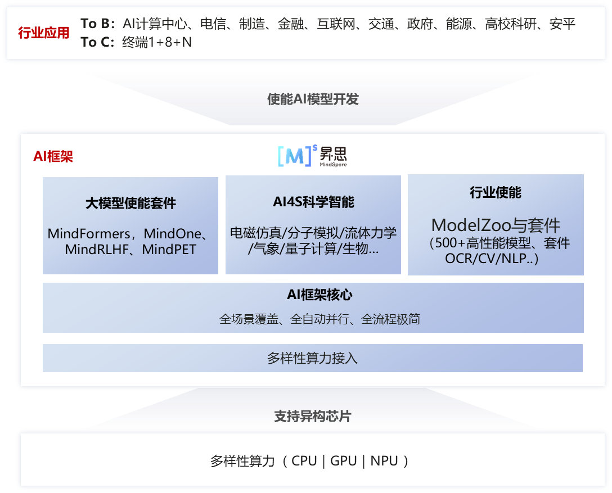
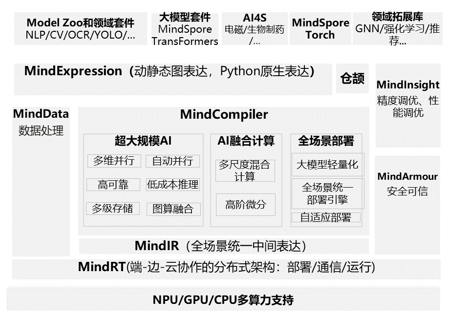
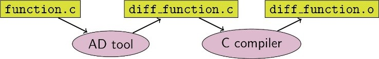
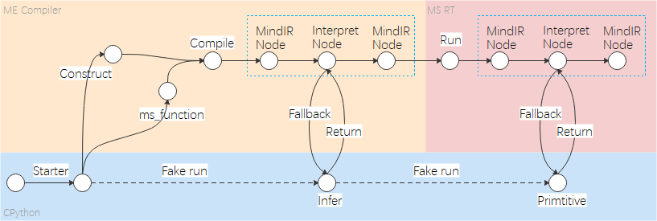
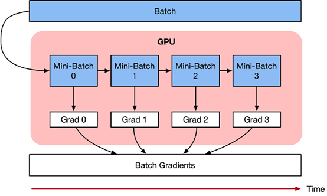
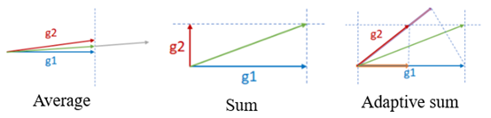
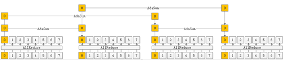

# 昇思 MindSore 关键特性

本节将会介绍华为自研AI框架昇思MindSpore，这是一个面向全场景设计的AI计算框架，旨在为AI算法研究和生产部署提供一个统一、高效、安全的平台。接下来，将详细阐述MindSpore的定位、架构、特性、以及其在端边云全场景下的应用和优势。

## MindSpore 基本介绍

###  MindSpore定位

昇思MindSpore是面向“端-边-云”全场景设计的AI框架，旨在弥合AI算法研究与生产部署之间的鸿沟。在算法研究阶段，为开发者提供动静统一的编程体验以提升算法的开发效率；生产阶段，自动并行可以极大加快分布式训练的开发和调试效率，同时充分挖掘异构硬件的算力；在部署阶段，基于“端-边-云”统一架构，应对企业级部署和安全可信方面的挑战。开源以来，秉持全场景协同、全流程极简、全架构统一三大价值主张，致力于增强开发易用性、提升原生支持大模型和AI+科学计算的体验。” 向上使能AI模型创新，对下兼容多样性算力（NPU、GPU、CPU）。



### 昇思MindSpore架构

昇思MindSpore整体架构分为四层（如图 1所示）：

- **模型层**，为开发者提供开箱即用的功能，该层主要包含预置的模型和开发套件，以及图神经网络（GNN）、深度概率编程等热点研究领域拓展库；

- **表达层（MindExpression）**，为开发者提供AI模型开发、训练、推理的接口，支持开发者用原生Python语法开发和调试神经网络，其特有的动静态图统一能力使开发者可以兼顾开发效率和执行性能，同时该层在生产和部署阶段提供全场景统一的C++接口；

- **编译优化（MindCompiler）**，作为AI框架的核心，以全场景统一中间表达（MindIR）为媒介，将前端表达编译成执行效率更高的底层语言，同时进行全局性能优化，包括自动微分、代数化简等硬件无关优化，以及图算融合、算子生成等硬件相关优化；

- **运行时**，按照上层编译优化的结果对接并调用底层硬件算子，同时通过“端 - 边 - 云”统一的运行时架构， 支持包括联邦学习在内的“端 - 边 - 云”AI 协同。



## 昇思MindSpore特性

昇思MindSpore为开发者提供Python等语言的编程范式。借助基于源码转换，开发者可以使用原生Python控制语法和其他一些高级API，如元组（Tuple）、列表（List）和Lambda表达。

### 前端编程

昇思MindSpore提供面向对象和面向函数的编程范式。开发者可以基于nn.cell类派生定义所需功能的AI网络或网络的某一层（layer），并可通过对象的嵌套调用的方式将已定义的各种layer进行组装，完成整个AI网络的定义。同时开发者也可以定义一个可被昇思MindSpore源到源编译转换的Python纯函数，通过昇思MindSpore提供的函数或装饰器，将其加速执行。

下面分别介绍昇思MindSpore支持的三类编程范式及其简单示例。

#### 面向对象编程

面向对象编程（Object-oriented programming，OOP），是指一种将程序分解为封装数据及相关操作的模块（类）而进行的编程方式，对象为类（class）的实例。面向对象编程将对象作为程序的基本单元，将程序和数据封装其中，以提高软件的重用性、灵活性和扩展性，对象里的程序可以访问及经常修改对象相关联的数据。

在一般的编程场景中，代码（code）和数据（data）是两个核心构成部分。面向对象编程是针对特定对象（Object）来设计数据结构，定义类（Class）。类通常由以下两部分构成，分别对应了code和data：

- 方法（Methods）
- 属性（Attributes）

对于同一个Class实例化（instantiation）后得到的不同对象而言，方法和属性相同，不同的是属性的值。不同的属性值决定了对象的内部状态，因此OOP能够很好地进行状态管理。

下面为Python构造简单类的示例：

```python
class Sample:  #class declaration

    def __init__(self, name):  # class constructor (code)
        self.name = name  # attribute (data)

    def set_name(self, name):  # method declaration (code)
        self.name = name  # method implementation (code)
```

对于构造神经网络来说，首要的组件就是网络层（Layer），一个神经网络层包含以下部分：

- Tensor操作（Operation）
- 权重（Weights）

此二者恰好与类的Methods和Attributes一一对应，同时权重本身就是神经网络层的内部状态，因此使用类来构造Layer天然符合其定义。此外，我们在编程时希望使用神经网络层进行堆叠，构造神经网络，使用OOP编程可以很容易地通过Layer对象组合构造新的Layer类。

下面为使用昇思MindSpore构造神经网络类的示例：

```python
from mindspore import nn, Parameter
from mindspore.common.initializer import initializer


class Linear(nn.Cell):

    def __init__(self, in_features, out_features,
                 has_bias):  # class constructor (code)
        super().__init__()
        self.weight = Parameter(
            initializer('normal', [out_features, in_features],
                        mindspore.float32), 'weight')  # layer weight (data)
        self.bias = Parameter(
            initializer('zeros', [out_features], mindspore.float32),
            'bias')  # layer weight (data)

    def construct(self, inputs):  # method declaration (code)
        output = ops.matmul(inputs, self.weight.transpose(
            0, 1))  # tensor transformation (code)
        output = output + self.bias  # tensor transformation (code)
        return output
```

除神经网络层的构造使用面向对象编程范式外，昇思MindSpore支持纯面向对象编程方式构造神经网络训练逻辑，此时神经网络的正向计算、反向传播、梯度优化等操作均使用类进行构造。下面是纯面向对象编程的示例：

```python
import mindspore  
import mindspore.nn as nn  
from mindspore import value_and_grad  
  
 
class TrainOneStepCell(nn.Cell):  
  
    def __init__(self, network, optimizer):  
        super().__init__()  
        self.network = network  
        self.optimizer = optimizer  
        self.grad_fn = value_and_grad(self.network, None,  
                                      self.optimizer.parameters)  
  
    def construct(self, *inputs):  
        loss, grads = self.grad_fn(*inputs)  
        self.optimizer(grads)  
        return loss  

network = nn.Dense(5, 3)  
loss_fn = nn.BCEWithLogitsLoss()  
network_with_loss = nn.WithLossCell(network, loss_fn)  
optimizer = nn.SGD(network.trainable_params(), 0.001)  
trainer = TrainOneStepCell(network_with_loss, optimizer) 
```

此时，不论是神经网络及其训练过程均使用继承nn.Cell的类进行管理，可以方便地作为计算图进行编译加速。

#### 函数式编程

函数式编程（Functional programming）是一种将计算机运算视为函数运算，并且避免使用程序状态以及可变对象的编程范式。

在函数式编程中，函数被视为一等公民，这意味着它们可以绑定到名称（包括本地标识符），作为参数传递，并从其他函数返回，就像任何其他数据类型一样。这允许以声明性和可组合的风格编写程序，其中小功能以模块化方式组合。

函数式编程有时被视为纯函数式编程的同义词，是将所有函数视为确定性数学函数或纯函数的函数式编程的一个子集。当使用一些给定参数调用纯函数时，它将始终返回相同的结果，并且不受任何可变状态或其他副作用的影响。

函数式编程有两个核心特点，使其十分符合科学计算的需要：

- 编程函数语义与数学函数语义完全对等。
- 确定性，给定相同输入必然返回相同输出。无副作用。

由于确定性这一特点，通过限制副作用，程序可以有更少的错误，更容易调试和测试，更适合形式验证。下面是使用函数式编程的示例：

```python
import mindspore.numpy as mnp
from mindspore import grad

grad_tanh = grad(mnp.tanh)
print(grad_tanh(2.0))
# 0.070650816

print(grad(grad(mnp.tanh))(2.0))
print(grad(grad(grad(mnp.tanh)))(2.0))
# -0.13621868
# 0.25265405
```

配合函数式编程范式的需要，昇思MindSpore提供了多种函数变换接口，涵盖包括自动微分、自动向量化、自动并行、即时编译、数据下沉等功能模块，下面简单进行介绍：

- 自动微分：grad、value_and_grad，提供微分函数变换功能；
- 自动向量化：vamp，用于沿参数轴映射函数fn的高阶函数；
- 自动并行：shard，函数式算子切分，指定函数输入/输出Tensor的分布策略；
- 即时编译：jit，将Python函数编译为一张可调用的MindSpore图；
- 数据下沉：data_sink，对输入的函数进行变换，获得可使用数据下沉模式的函数。

基于上述函数变换接口，在使用函数式编程范式时可以快速高效地使用函数变换实现复杂的功能。

#### 融合编程

下面是函数式+面向对象融合编程的典型过程：

- 用类构建神经网络；
- 实例化神经网络对象；
- 构造正向函数，连接神经网络和损失函数；
- 使用函数变换，获得梯度计算（反向传播）函数；
- 构造训练过程函数；
- 调用函数进行训练。

下面是函数式+面向对象融合编程的简单示例：

```python
# Class definition  
class Net(nn.Cell):  
    def __init__(self):  
        ......  
    def construct(self, inputs):  
        ......  
  
# Object instantiation  
net = Net() # network  
loss_fn = nn.CrossEntropyLoss() # loss function  
optimizer = nn.Adam(net.trainable_params(), lr) # optimizer  
  
# define forward function  
def forword_fn(inputs, targets):  
    logits = net(inputs)  
    loss = loss_fn(logits, targets)  
    return loss, logits  
  
# get grad function  
grad_fn = value_and_grad(forward_fn, None, optim.parameters, has_aux=True)  
  
# define train step function 
def train_step(inputs, targets):  
     # get values and gradients  
    (loss, logits), grads = grad_fn(inputs, targets) 
    optimizer(grads) # update gradient  
    return loss, logits  
  
for i in range(epochs):  
    for inputs, targets in dataset():  
        loss = train_step(inputs, targets) 
```

如上述示例，在神经网络构造时，使用面向对象编程，神经网络层的构造方式符合AI编程的习惯。在进行前向计算和反向传播时，昇思MindSpore使用函数式编程，将前向计算构造为函数，然后通过函数变换，获得grad_fn，最后通过执行grad_fn获得权重对应的梯度。

通过函数式+面向对象融合编程，既保证了神经网络构建的易用性，同时提高了前向计算和反向传播等训练过程的灵活性，是昇思MindSpore推荐的默认编程范式。

#### 函数式微分编程

目前主流的AI框架有三种自动微分技术：

- 基于静态计算图的转换：在编译时将网络转换为静态数据流图，然后将链式规则转换为数据流图，实现自动微分。

- 基于动态计算图的转换：以算子重载的方式记录前向执行时网络的操作轨迹，然后将链式规则应用到动态生成的数据流图中，实现自动微分。

- 基于源码的转换：该技术是从函数式编程框架演化而来，对中间表达（程序在编译过程中的表达形式），以即时（Just-In-Time，JIT）编译的形式进行自动微分变换，支持复杂的流程控制场景、高阶函数和闭包。基于源码转化的自动微分如图所示。
 


昇思MindSpore开发了一种新的策略，即基于源码转换的自动微分。一方面，它支持流程控制的自动微分，因此构建像PyTorch这样的模型非常方便。另一方面，昇思MindSpore可以对神经网络进行静态编译优化，从而获得良好的性能。

昇思MindSpore自动微分的实现可以理解为对程序本身进行符号微分，因为MindSpore IR是函数式的中间表达，它与基本代数中的复合函数有直观的对应关系，只要已知基础函数的求导公式，就能推导出由任意基础函数组成的复合函数的求导公式。MindSpore IR中每个原语操作可以对应为基础代数中的基础函数，这些基础函数可以构建更复杂的流程控制。

### 动静统一

传统AI框架主要有2种编程执行形态，静态图模式和动态图模式。静态图模式会基于开发者调用的框架接口，在编译执行时先生成神经网络的图结构，然后再执行图中涉及的计算操作。静态图模式能有效感知神经网络各层算子间的关系情况，基于编译技术进行有效的编译优化以提升性能。

但传统静态图需要开发者感知构图接口，组建或调试网络比较复杂，且难于与常用Python库、自定义Python函数进行穿插使用。动态图模式，能有效解决静态图的编程较复杂问题，但由于程序按照代码的编写顺序执行，系统难于进行整图编译优化，导致相对性能优化空间较少，特别面向DSA等专有硬件的优化比较难于使能。

昇思MindSpore由于基于源码转换机制构建神经网络的图结构。因此相比传统的静态图模式，能有更易用的表达能力。同时也能更好的兼容动态图和静态图的编程接口，比如面向控制流，动态图可以直接基于Python的控制流关键字编程。而静态图需要基于特殊的控制流算子编程或者需要开发者编程指示控制流执行分支。这导致了动态图和静态图编程差异大。

而昇思MindSpore的源码转换机制，可基于Python控制流关键字，直接使能静态图模式的执行，使得动静态图的编程统一性更高。同时开发者基于昇思MindSpore的接口，可以灵活的对Python代码片段进行动静态图模式控制。即可以将程序局部函数以静态图模式执行而同时其他函数按照动态图模式执行。从而使得在与常用Python库、自定义Python函数进行穿插执行使用时，开发者可以灵活指定函数片段进行静态图优化加速，而不牺牲穿插执行的编程易用性。

#### 静态编译机制

昇思MindSpore框架在静态图模式下，先将Python代码编译成静态计算图，然后执行静态计算图。通过MindCompiler编译器将Python代码的AST表示转换成ANF范式的MindIR表示，并基于MindIR表示展开编译优化和自动微分处理。MindIR是一种基于图表示的函数式IR，从函数式编程规定来看，它跟Python语言命令式编程是有所区别的，开发者编写程序时需要遵循昇思MindSpore静态图语法支持，语法使用存在约束限制。

JIT Fallback是从静态图的角度出发考虑静动统一。通过JIT Fallback特性，静态图可以支持尽量多的动态图语法，使得静态图提供接近动态图的语法使用体验，从而实现动静统一。JIT Fallback特性主要作用于MindCompiler编译器，应用于图模式场景下的Python语法解析和支持，将纯底层算子执行的计算图改造成，开发者的Python代码和算子执行交替混合执行的计算图。主要过程如下：



JIT Fallback特性主要作用于MindCompiler编译器的实现，应用于图模式场景下的Python语法解析和支持，将纯底层算子执行的计算图改造成，开发者的Python代码和算子执行交替混合执行的计算图。主要过程包括：

1. 检测不支持语法。在图编译阶段，识别检测出图模式不支持的Python语法。

2. 生成解释节点。针对不支持的Python语法，将相关语句保留下来，生成解释节点，并将解释节点转换为ANF IR表示。

3. 推导和执行解释节点。解释节点有两种执行方式：编译时运行和运行时运行。解释节点是在编译时进行推导的，一般而言，解释节点尽量在编译时执行，另一种方式则是在运行时执行。

#### 动静混合编程

在昇思MindSpore中，称动态图模式为PyNative模式，因为代码使用Python解释器在该模式下运行。在动态图模式下，框架按照Python执行模型的所有算子，为每个算子生成计算图，并将计算图传递给后端进行前向计算。在完成前向计算的同时，根据前向算子所对应的反向传播源码，转换成单算子反向图，最终在完成整体模型的前向计算后，生成模型对应的完整反向图,并传递给后端进行执行。

由于编译器能获得静态图的全局信息，所以静态图在大多数情况下都表现出更好的运行性能。而动态图可以保证更好的易用性，使开发者能够更加方便地构建和修改模型。为了同时支持静态图和动态图，大多数先进的训练框架需要维护两种自动微分机制，即基于Tape的自动微分机制和基于图的自动微分机制。

### 端边云全场景

昇思MindSpore是训推一体的AI框架，同时支持训练和推理等功能。同时昇思MindSpore支持CPU、GPU、NPU等多种芯片，并且在不同芯片上提供统一的编程使用接口以及可生成在多种硬件上加载执行的离线模型。按照实际执行环境和业务需求，提供多种规格的版本形态，支持部署在云端、服务器端、手机等嵌入式设备端以及耳机等超轻量级设备端上的部署执行。

#### 轻量化推理

轻量化推理是将训练好的模型部署到运行环境中进行推理的过程，模型部署的过程中需要解决训练模型到推理模型的转换，硬件资源对模型的限制，模型推理的时延、功耗、内存占用等指标对整个系统的影响以及模型的安全等一系列的问题。

- 模型完成训练后，需要将模型及参数持久化成文件，不同的训练框架导出的模型文件中存储的数据结构不同，这给模型的推理系统带来了不便。推理系统为了支持不同的训练框架的模型，需要将模型文件中的数据转换成统一的数据结构。此外，在训练模型转换成推理模型的过程中，需要进行一些如算子融合、常量折叠等模型的优化以提升推理的性能。

- 推理模型部署到不同的场景，需要满足不同的硬件设备的限制，例如，在具有强大算力的计算中心或数据中心的服务器上可以部署大规模的模型，而在边缘侧服务器、个人电脑以及智能手机上，力和内存则相对有限，部署的模型的规模就相应地要降低。在超低功耗的微控制器上，则只能部署非常简单的机器学习模型。此外，不同硬件对于不同数据类型（如float32、float16、bfloat16、int8等）的支持程度也不相同。为了满足这些硬件的限制，在有些场景下需要对训练好的模型进行压缩，降低模型的复杂度或者数据的精度，减少模型的参数，以适应硬件的限制。

- 模型部署到运行环境中执行推理，推理的时延、内存占用、功耗等是影响开发者使用的关键因素，优化模型推理的方式有两种，一是设计专有的机器学习的芯片，相对于通用的计算芯片，这些专有芯片一般在能效比上具有很大的优势。二是通过软硬协同最大程度地发挥硬件的能力。对于第二种方式，以CPU为例，如何切分数据块以满足cache大小，如何对数据进行重排以便计算时可以连续访问，如何减少计算时的数据依赖以提升硬件流水线的并行，如何使用扩展指令集以提升计算性能，这些都需要针对不同的CPU架构进行设计和优化。

#### 联邦学习

随着 AI 的飞速发展，大规模和高质量的数据对模型的效果和用户的体验都变得越来越重要。与此同时，数据的利用率成为了制约了 AI 的进一步发展的瓶颈。隐私、监管和工程等问题造成了设备与设备之间的数据不能共享，进而导致了数据孤岛问题的出现。为了解决这一难题，联邦学习（Federated Learning，FL）应运而生。联邦学习的概念最早在2016年被提了出来。在满足用户隐私保护、数据安全和政府法规的要求下，联邦学习能有效地使用多方机构的数据进行机器学习建模。

MindSpore Federated是华为昇思MindSpore提出的一款开源联邦学习框架，支持千万级无状态终端设备商用化部署，在用户数据留存在本地的情况下，使能全场景智能应用。MindSpore Federated专注于大规模参与方的横向联邦的应用场景，使参与联邦学习的各用户在不共享本地数据的前提下共建AI模型。MindSpore Federated主要解决隐私安全、大规模联邦聚合、半监督联邦学习、通信压缩和跨平台部署等联邦学习在工业场景部署的难点。

### 极致性能

昇思MindSpore基于编译技术，提供了丰富的硬件无关优化，如IR融合、代数化简、常数折叠、公共子表达式消除等。同时昇思MindSpore针对NPU、GPU等不同硬件，也提供各种硬件优化能力，从而更好的发挥硬件的大规模计算加速能力。

昇思MindSpore除了提供传统AI框架常用优化，还提供了一些比较有特色的技术。

#### 图算融合

昇思MindSpore等主流AI计算框架对开发者提供的算子通常是从开发者可理解、易使用角度进行定义。每个算子承载的计算量不等，计算复杂度也各不相同。但从硬件执行角度看，这种天然的、基于开发者角度的算子计算量划分，并不高效，也无法充分发挥硬件资源计算能力。主要体现在：

1. 计算量过大、过复杂的算子，通常很难生成切分较好的高性能算子，从而降低设备利用率；

2. 计算量过小的算子，由于计算无法有效隐藏数据搬移开销，也可能会造成计算的空等时延，从而降低设备利用率；

3. 硬件Device通常为多核、众核结构，当算子shape较小或其它原因引起计算并行度不够时，可能会造成部分核的空闲，从而降低设备利用率。特别是基于专用处理器架构（Domain Specific Architecture，后文简称DSA）的芯片对这些因素更为敏感。如何最大化发挥硬件算力性能的同时使算子也能具备较好的易用性，一直以来是一个很大的挑战。

在AI框架设计方面，目前业界主流采用图层和算子层分层的实现方法。图层负责对计算图进行融合或重组，算子层负责将融合或重组后的算子编译为高性能的可执行算子。

图层通常采用基于Tensor的High-Level IR的处理和优化，算子层则采用基于计算指令的Low-Level IR进行分析和优化。 这种人为分层处理显著增加了图、算两层进行协同优化的难度。昇思MindSpore在过去几年的技术实践中，采用了图算融合的技术来较好的解决了这个问题。

#### Ascend加速

昇腾芯片上集成了AICORE、AICPU和CPU。其中，AICORE负责大型Tensor Vector运算，AICPU负责标量运算，CPU负责逻辑控制和任务分发。

Host侧CPU负责将图或算子下发到昇腾芯片。昇腾芯片由于具备了运算、逻辑控制和任务分发的功能，所以不需要与Host侧的CPU进行频繁的交互，只需要将计算完的最终结果返回给Host侧，实现整图下沉到Device执行，避免Host-Device频繁交互，减小了开销。

为了充分使用昇腾芯片硬件功能，打造极致性能，昇思MindSpore提供了整图下沉功能，目的是减少Host-Device交互开销，有效的提升训练与推理的性能。

昇思MindSpore构建的图包含数据图和计算图，通过将数据图下沉和计算图下沉的方式，减少Host-Device交互开销。且结合循环下沉可以实现多个Step下沉，进一步减少Host和Device的交互次数。

#### 梯度累积

梯度累积是一种将训练神经网络的数据样本按Batch size拆分为几个小Batch的方式，然后按顺序进行计算。

神经网络模型由许多相互连接的神经网络单元所组成，在所有神经网络层中，样本数据会不断向前传播。在通过所有层后，网络模型会输出样本的预测值，通过损失函数然后计算每个样本的损失值（误差）。神经网络通过反向传播，去计算损失值相对于模型参数的梯度。最后这些梯度信息用于对网络模型中的参数进行更新。

梯度累积只计算神经网络模型，并不及时更新网络模型的参数，同时在计算的时候累积得到的梯度信息，最后统一使用累积的梯度来对参数进行更新。

$$
\text{accumulated} = \sum_{i=0}^{N} \text{grad}_i
$$


在不更新模型变量的时候，实际上是把原来的数据Batch size分成几个小的Mini-Batch，每个step中使用的样本实际上是更小的数据集。

在N个step内不更新变量，使所有Mini-Batch使用相同的模型变量来计算梯度，以确保计算出来得到相同的梯度和权重信息，算法上等价于使用原来没有切分的Batch size大小一样。即：

$$
\theta_i = \theta_{i-1} - \text{lr} \sum_{i=0}^{N} \text{grad}_i
$$

最终在上面步骤中累积梯度会产生与使用全局Batch size大小相同的梯度总和。
 


#### 自适应梯度求和

与传统的分布式训练中的梯度更新不同，自适应梯度求和考虑到梯度的方向。在网络训练初期，不同batch获得的梯度更新方向基本是平行的，但是随着训练进行，梯度更新方向趋向于正交。而且网络的不同层梯度更新的正交性差异也是比较大的。
 


以两个训练节点为例，梯度的更新原理如下：

$$
\begin{aligned}
w' &= w_0 - \alpha \left[ \left( 1 - \frac{(g_2^T \cdot g_1)}{2 \cdot \| g_1 \|^2} \right) g_1 + \left( 1 - \frac{(g_2^T \cdot g_1)}{2 \cdot \| g_2 \|^2} \right) g_2 \right] \\
 &= w_0 - \alpha \cdot \text{Adasum}(g_1, g_2)
\end{aligned}
$$

其中，g1是训练节点1的梯度，g2是训练节点2的梯度。当训练节点拓展到n（n=2x,x=1,2,3⋯）个时，采用递归的方式来对问题进行分解，递归公式如下：

$$
\begin{aligned}
\text{Adasum}(g_{[0,n]}) &= \text{Adasum}\left( \text{Adasum}(g_{[0,n/2]}), \text{Adasum}(g_{[n/2,n]}) \right)
\end{aligned}
$$

从上述公式中可见，论文中是对梯度更新，考虑到优化器（optimizer）对梯度的操作不一定满足线性转换，因此优化为对经过optimizer后的网络权重差值（delta weights）做adasum操作。

另外，在实际应用过程中，为了优化通信开销，通常会采取Adasum和传统Reducesum混合的执行方式，如下图所示：
 


## 小结与思考

- 昇思MindSpore是华为推出的全场景AI计算框架，通过统一架构支持端、边、云的AI算法研究与部署，简化开发流程，并提升效率与性能。

- MindSpore的架构由模型层、表达层、编译优化层和运行时组成，实现了从高级API到硬件算子的全栈优化，保证了执行效率。

- 该框架支持面向对象和函数式编程范式，以及动静态图统一编程，提供了灵活性和易用性，同时保持高性能。

- MindSpore在端边云全场景下的应用包括轻量化推理、联邦学习、图算融合和Ascend加速等技术，以极致性能满足不同硬件和场景需求。