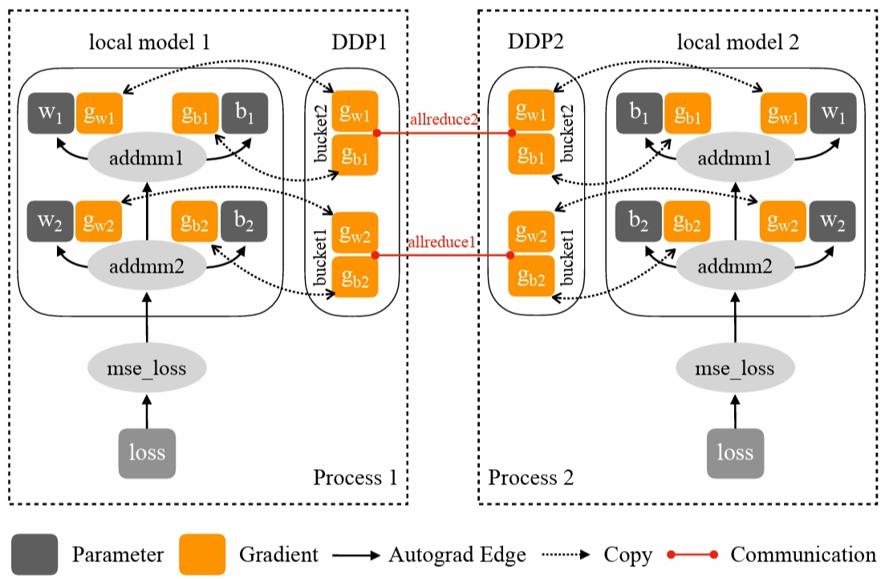

<!--适用于[License](https://github.com/chenzomi12/AISystem/blob/main/LICENSE)版权许可-->

# 数据并行

**数据并行**$^{[1]}$是一种将原本在单一设备上进行的数据训练过程，扩展到多个设备并行计算，以达到理想情况下设备数量倍率加速效果的并行算法。数据并行的方式和扩展有很多种，例如：**数据并行（DP）**、**分布式数据并行（DDP）**、**完全分片的数据并行（ZeRO）**$^{[2]}$、**异步的数据并行**、**弹性训练**$^{[3]}$等。

本章重点介绍其中的最简单的数据并行，分为**数据并行（DP）** 和**分布式数据并行（DDP）** 两种模式，更多的数据并行拓展内容如**完全分片的数据并行（ZeRO）** 将在后文中优化器部分介绍，有关**弹性训练**的部分我们会单独使用一小节进行介绍。

相比数据并行，尽管分布式数据并行实现更为复杂，但在选择数据并行算法时，我们仍应优先考虑分布式数据并行。简单来说，它更高效、更易优化，且可以很好地与其他并行算法相结合。

> **设备**：这里代指 NVIDIA GPU。NVIDIA GPU 属于 SPMD（Single Program Multiple Data）架构，即所有处理单元执行相同的程序代码。**一般由一个主机线程或进程来控制单块 GPU 设备**。在 PyTorch 中，由于 Python 的 GIL（Global Interpreter Lock）限制，通常采用多进程方式。

## 数据并行（DP）

数据并行只能在单台机器上运行，采用单进程、多线程方式，将原本在单一设备上进行的数据训练过程，扩展到多个设备并行训练。在某一设备上随机初始化模型和优化器后，就可进行数据并行的训练，算法可分为三个步骤：

- **前向传播**：将 mini-batch 数据平均分配到每个设备上。接下来进行分布式初始化，将模型和优化器复制到每个设备上，保证各设备的模型、优化器完全相同。初始化完成后，各设备根据分配到的数据和模型同时进行前向传播。
- **损失计算与反向传播**：前向传播完成后，每个设备分别计算模型损失并进行反向传播。得到梯度后，将梯度传递到某一设备进行累加，更新模型的参数和优化器状态。更新后的模型参数和优化器将会在下一轮的前向传播中被复制到每个设备上。


:width:`650px`

但由于数据并行相对来说还不够完善，造成了许多性能的浪费。如在**语言层面**，使用作为最热门的深度学习开发语言 Python，在数据并行中采用的单进程、多线程并行方式往往受到 GIL（全局解释器锁）限制，CPU 的性能瓶颈使得多线程不能良好的利用多设备的资源。另外在**算法层面**，全局的梯度累积和参数更新发生在一个设备上，会出现明显的单个设备利用率更高，其他设备空闲的情况，造成了资源的浪费。同时如果在数据并行中的 mini-batch 设置过小，将导致设备内并行度不足，从而降低训练速度；在通信开销的影响下，甚至可能出现比单设备慢的情况。

## 分布式数据并行（DDP）

分布式数据并行与数据并行类似，但针对数据并行的缺点做了许多改进，并拥有良好的的扩展性，如完全分片的数据并行（ZeRO）就是基于分布式数据并行的内存高效扩展版本。具体来说，分布式数据并行**引入了多进程**的并行方式，这避免了开发语言层面 Python GIL 的限制，也将并行规模扩展到多台网络连接的机器，进一步扩大分布式规模和效率；同时，针对通信做了大量优化，如**使用分桶 Ring-AllReduce 算法做集合通信**，具体细节将在**集合通信**章节展开。分布式数据并行的各设备负载也更均衡，没有单独在某一个设备上工作的情况。

### DDP 基本流程

在分布式数据并行中，程序会启动设备数量个进程，每个进程单独启动一个主训练脚本副本。在开始时，主进程将模型从设备 0 复制到其余设备一次，保证各设备的模型、优化器完全相同，接下来是分布式数据并行的训练过程：

- **前向传播**：每个设备将分别拿到一块完整且不同的 mini-batch 数据，各设备根据分配到的数据同时进行前向传播。
- **损失计算与反向传播**：前向传播完成后，每个设备分别计算模型损失并进行反向传播与梯度更新。值得注意的是，分布式数据并行中反向传播和梯度更新的过程是同时进行的——一旦某些局部梯度准备就绪，它们就会在所有过程中取平均值（默认是使用分桶 Ring-AllReduce 算法做集合通信），然后使用全局梯度更新模型参数和优化器状态。我们将在下一部分具体介绍有关**计算与通信的重叠**的内容。梯度的一致性可确保各设备的模型保持一致，避免使用其他模型的梯度进行参数更新而导致收敛问题。在**异步的数据并行**中，我们还将会接着讨论模型不一致的情况，这将会带来一定的收敛问题，但是可以使整个迭代过程更快，同时设备的利用率更高。

```python
import os
import torch
import torch.nn as nn
import torch.optim as optim
import torch.distributed as dist
import torch.multiprocessing as mp
from torch.nn.parallel import DistributedDataParallel as DDP
import torchvision.datasets
import torchvision.models
import torchvision.transforms as T

def setup(rank, world_size):
    os.environ['MASTER_ADDR'] = 'localhost'
    os.environ['MASTER_PORT'] = '12355'

    # initialize the process group
    dist.init_process_group('nccl', rank=rank, world_size=world_size)

def cleanup():
    dist.destroy_process_group()

transform = T.Compose([
    T.Resize(224),  
    T.ToTensor(),  
    T.Normalize((0.5, 0.5, 0.5), (0.5, 0.5, 0.5))
])  

def demo_basic(rank, world_size):

    print(f'Running basic DDP example on rank {rank}.')
    setup(rank, world_size)

    dataset = torchvision.datasets.CIFAR10(root='./data', train=True, download=True, transform=transform)
    train_loader = torch.utils.data.DataLoader(dataset, batch_size=1, shuffle=True, num_workers=4)

    # create model and move it to GPU with id rank
    model = torchvision.models.resnet50(weights=True).to(rank)
    ddp_model = DDP(model, device_ids=[rank])

    loss_fn = nn.CrossEntropyLoss()
    optimizer = optim.SGD(ddp_model.parameters(), lr=0.001)

    for data in train_loader:
        inputs, labels = data[0].to(rank), data[1].to(rank)
        optimizer.zero_grad()
        outputs = ddp_model(inputs)
        loss_fn(outputs, labels).backward()
        optimizer.step()

    cleanup()

def run_demo(demo_fn, world_size):
    mp.spawn(demo_fn,
             args=(world_size,),
             nprocs=world_size,
             join=True)

if __name__ == '__main__':
    run_demo(demo_basic, 2)
```

### DDP 前向传播

接下来我们来看 Pytorch2.0 $^{[4]}$中分布式数据并行具体的实现方式，这里我们先不涉及 Pytorch2.0 或 torchdynamo 引入的编译部分，**分布式系统的编译优化**将在一个单独的章节中进行介绍。首先我们看看 DDP 的**初始化**与**前向传播**，以及在这个过程中是如何**维护模型一致性**的。

模型的一致性要求每次进行的前向传播每个进程的参数需要相同。它依赖于 torch.nn.Module 类和 DistributedDataParallel 类，在 PyTorch 中，所有的模型都会继承 Module 类（包括分布式数据并行类 DistributedDataParallel）。其中我们需要关注的是 Module 类中的两个类变量 `_parameters` 和 `_buffers`，`_parameters` 是指网络的参数，`_buffers`不是参数，但也是会被持久化保存的数据，如 BatchNorm 中的 mean 和 variance。

```python
# torch.nn.modules.py
class Module:
    ...
    _parameters: Dict[str, Optional[Parameter]]
    _buffers: Dict[str, Optional[Tensor]]
    ...
```

DDP 在构建时，会同步各个进程的模型参数，包括`_parameters` 和 `_buffers`以达到模型的一致性。

```python
# torch.nn.parallel.distributed.py 
class DistributedDataParallel(Module, Joinable):
    ...
    def __init__(
        ...
        # Sync params and buffers. Ensures all DDP models start off at the same value.
        _sync_module_states(
            module=self.module,
            process_group=self.process_group,
            broadcast_bucket_size=self.broadcast_bucket_size,
            src=0,
            params_and_buffers_to_ignore=self.parameters_to_ignore,
        )
        ...
```

同时，在每次网络传播开始前，DDP 也都会同步进程之间的 `buffer`，维持状态的统一。

```python
# torch.nn.parallel.distributed.py 
class DistributedDataParallel(Module, Joinable):
    ...
    def forward(self, *inputs, **kwargs):
        ...
        # Sync params and buffers. Ensures all DDP models start off at the same value.
        _sync_module_states(
            module=self.module,
            process_group=self.process_group,
            broadcast_bucket_size=self.broadcast_bucket_size,
            src=0,
            params_and_buffers_to_ignore=self.parameters_to_ignore,
        )
        ...
```

### DDP 计算与通信的重叠

在分布式数据并行（DDP）中，一项重要的优化是在反向传播过程中同时进行参数更新，这一过程也被称为计算与通信的重叠。在分布式训练中，每个进程通常会在完成当前网络反向传播的同时进行梯度更新，以隐藏通信延迟。在部分梯度计算完成后，即可立即进行通信，一般通过钩子函数来实现。在通信的同时也会继续计算梯度，这样就无需等待所有计算完成后再集中进行通信，也不必在计算完成后等待通信完成，从而将通信过程覆盖到计算时间内，充分利用设备，提高了设备使用率。


:width:`650px`

这里我们同样使用 Pytorch2.0 进行举例。在此过程中涉及到钩子函数 `hook`、参数桶 `bucket` 和归约管理器 `reducer` 三个关键部分。

钩子函数 `hook` 是在 `torch.Tensor` 上实现的，每次计算相对于张量的梯度时都会调用该钩子。通过钩子函数，当张量梯度计算完成后，就可以立即进行集合通信。需要注意的是，虽然 DDP 的关键代码是用 C++ 实现的，但在 C++ 和 Python 代码中，`Tensor` 都提供了相似的 hook 接口，实现了类似的功能。

```python
# torch._tensor.py
class Tensor(torch._C._TensorBase):
    ...
    def register_hook(self, hook):
        r"""Registers a backward hook.

        The hook will be called every time a gradient with respect to the
        Tensor is computed. 
        ...
```

Pytorch 使用归约管理器 `reducer` 在反向传播期间进行梯度同步。为提高通信效率，`reducer` 将参数梯度组织到多个桶 `buckets` 中，并对每个桶进行集合通信（可通过在 DDP 构造函数中设置 `bucket_cap_mb` 参数来配置桶大小）。其中参数梯度到桶的映射，在构造时基于桶大小限制和参数大小确定。模型参数按照给定模型 `Model.parameters()` 的大致相反顺序分配到桶中（使用相反顺序的原因是 DDP 期望在反向传播时以大致相同的顺序准备好梯度）。示例图展示了一个场景，其中 $g_{w2}$ 和 $g_{b2}$ 在 bucket1 中，另外两个梯度在 bucket2 中。虽然这种假设可能不总是成立，一旦发生，将损害 DDP 反向传播的速度，因为 reducer 无法在最早可能的时间启动通信。除了分桶，reducer 在构造阶段为每个参数注册了 autograd 钩子，在反向传播时当梯度准备就绪时触发这些钩子。Pytorch 使用 `_ddp_init_helper` 函数，进行参数的 `reducer` 的初始化以及参数的装桶。

```python
# torch.nn.parallel.distributed.py 
class DistributedDataParallel(Module, Joinable):
    ...
    def __init__(
        ...
        # Builds reducer.
        self._ddp_init_helper(
            parameters,
            expect_sparse_gradient,
            param_to_name_mapping,
            static_graph,
        )
        ...
    ...
    def _ddp_init_helper(
        self,
        parameters,
        expect_sparse_gradient,
        param_to_name_mapping,
        static_graph,
    ):
        """
        Initialization helper function that does the following:
        (1) bucketing the parameters for reductions
        (2) resetting the bucketing states
        (3) registering the grad hooks
        (4) Logging construction-time DDP logging data
        (5) passing a handle of DDP to SyncBatchNorm Layer
        """
        ...
```

如果一个参数在前向传播中没有被使用，当前参数的桶会在反向传播时永远等待缺失的梯度。如果设置了 `find_unused_parameters` 为 True，DDP 会分析来自本地模型的输出，从而确定在模型的子图上运行反向传播时哪些参数参与了计算。DDP 通过从模型输出遍历 autograd 图来找出未使用的参数，并将其标记为可供 reduce。在反向传播期间，reducer 只会等待未就绪的参数，但它仍会对所有桶进行 reduce 操作。将参数梯度标记为就绪不会帮助 DDP 跳过桶，但会防止其在反向传播时永远等待缺失的梯度。值得注意的是，遍历 autograd 图会带来额外开销，因此只有在必要时才应将 `find_unused_parameters` 设置为 True。

由于反向传播的函数 `backward` 直接在损失张量上调用，这超出了 DDP 的控制范围。DDP 使用在构造时注册的 autograd 钩子来触发梯度同步。当一个梯度准备就绪时，相应的 DDP 钩子会被触发，DDP 将标记该参数梯度为就绪可供 reduce。当一个桶中的所有梯度都准备就绪时，reducer 将在该桶上启动异步 allreduce 操作以计算所有进程中梯度的平均值。当所有桶都就绪时，reducer 将阻塞等待所有 allreduce 操作完成。完成后，平均梯度将被写入所有参数的 `param.grad` 字段。因此，在反向传播之后，不同 DDP 进程上相同的参数其 `grad` 字段应该是相同的。在之后的优化器步骤中，所有 DDP 进程上的模型副本可以保持同步，因为它们都从同一个状态开始，并且在每次迭代中具有相同的平均梯度。

### DDP 性能分析

我们使用 torch.profiler.profile 对 DDP 的过程进行性能分析。

| Configuration | GPU Summary |
| --- | --- |
| Number of Worker(s): 2 | Name: Tesla V100-SXM2-16GB |
| Device Type: GPU | Compute Capability: 7.0 |

设备使用了两张 V100-SXM2-16GB 并使用 NV-Link 连接。


:width:`650px`

从 torch.profiler.profile 对 ResNet50 的性能分析结果可以看到，计算与通信的重叠几乎覆盖了整个反向传播的过程（反向传播的计算时间约为前向传播的两倍，图中重叠的部分约为只计算部分的两倍，只通信的部分可以忽略不记）


:width:`650px`

同样，在追踪视图中可以看到，反向传播的主要函数 `autograd::engine::evaluate_function:ConvolutionBackward0` 与集合通信的函数 `nccl:all_reduce` 执行是重叠的。

DDP 反向传播中计算与通信的重叠导致无需等待所有计算完成后再集中进行通信，也不必在计算完成后等待通信完成，提高了设备使用率。

## 异步的数据并行

前面的介绍都是基于**同步的数据并行**的，同步的数据并行特别适用于计算资源相对均衡的情况。在同步数据并行中，每个设备都处理数据的一个子集，并独立地计算梯度。在每次迭代中，所有设备都将它们的梯度汇总，并通过一致的规则来更新模型参数。这样，所有设备上的模型都保持一致，不会出现不同步的情况。由于所有设备在每个训练步骤中都执行相同的更新操作，模型的收敛性更容易得到保证。且所有设备都参与到梯度更新的计算中，整体计算效率也相对较高。此外，同步数据并行还易于实现，因为所有设备的操作都是同步的，不需要复杂的同步机制。


:width:`650px`

但是同步数据并行也有一些局限性。当集群中的某些设备性能较差或者出现故障时，整体的训练效率会受到影响，所有设备都需要等待最慢的设备完成计算。又或是当设备数量过多时，集合通信的时间可能会成为训练的瓶颈，从而限制整体的扩展性。

**异步的数据并行**可以在一定程度上解决这些问题。在异步数据并行中，不同设备的计算过程相互独立，不再需要等待其他设备完成计算。每个设备都按照自己的速度进行前向和反向传播，随时将计算得到的梯度更新到模型参数中。这样，快速的设备不再受到慢速设备的影响，整体计算效率得到提高。

异步数据并行的优点之一是它可以充分利用集群中每个设备的计算能力，快速的设备不会受到慢速设备的影响，从而提高了整体的训练速度。此外，由于每个设备都独立地进行计算和参数更新，异步数据并行也具有较好的扩展性，能够适应不同规模的集群和不同数量、类型的设备。


:width:`650px`

但是异步数据并行也存在一些挑战。由于计算过程是异步的，可能会出现梯度更新之间的竞争条件，需要采取一些机制来解决，如：**参数服务器**$^{[5]}$。同时由于计算过程不再同步，模型的收敛性可能会受到影响，需要通过调整学习率或者采用一些优化算法来弥补。

## 数据并行的开源实现

- [DeepSpeed](https://github.com/microsoft/DeepSpeed)：微软推出的分布式训练框架
- [Megatron-LM](https://github.com/NVIDIA/Megatron-LM)：英伟达推出的分布式训练框架  
- [ColossalAI](https://github.com/hpcaitech/ColossalAI)：潞晨科技推出的分布式训练框架
- [Horovod](https://github.com/horovod/horovod)：LF AI & Data Foundation 推出的分布式训练框架 
- [BytePS](https://github.com/bytedance/byteps)：字节跳动推出的分布式训练框架
- [PyTorch](https://pytorch.org/tutorials/intermediate/ddp_tutorial.html)、[TensorFlow](https://tensorflow.google.cn/guide/distributed_training?hl=zh-cn) 提供的数据并行接口

## 参考文献

[1] Li S, Zhao Y, Varma R, et al. Pytorch distributed: Experiences on accelerating data parallel training[J]. arXiv preprint arXiv:2006.15704, 2020.

[2] Rajbhandari S, Rasley J, Ruwase O, et al. Zero: Memory optimizations toward training trillion parameter models[C]//SC20: International Conference for High Performance Computing, Networking, Storage and Analysis. IEEE, 2020: 1-16.

[3] The Horovod Authors. (2019). Elastic Horovod
. Retrieved from https://horovod.readthedocs.io/en/stable/elastic_include.html.

[4] The Pytorch Authors. (2024). Getting Started with Distributed Data Parallel. Retrieved from https://pytorch.org/tutorials/intermediate/ddp_tutorial.html.

[5] Li M, Zhou L, Yang Z, et al. Parameter server for distributed machine learning[C]//Big learning NIPS workshop. 2013, 6(2).

## 本节视频

<html>
<iframe src="https:&as_wide=1&high_quality=1&danmaku=0&t=30&autoplay=0" width="100%" height="500" scrolling="no" border="0" frameborder="no" framespacing="0" allowfullscreen="true"> </iframe>
</html>
