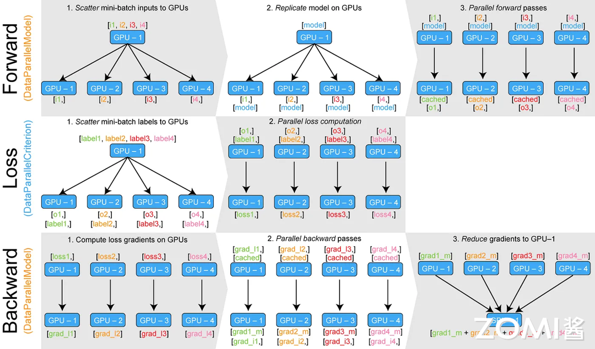
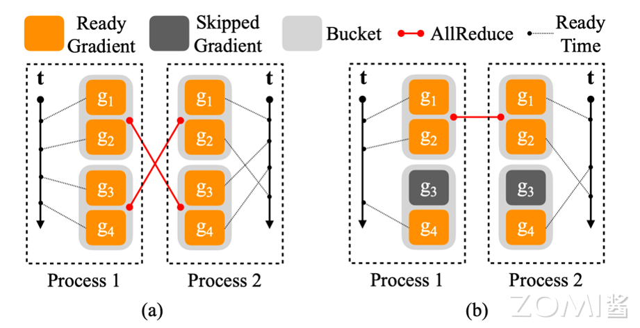
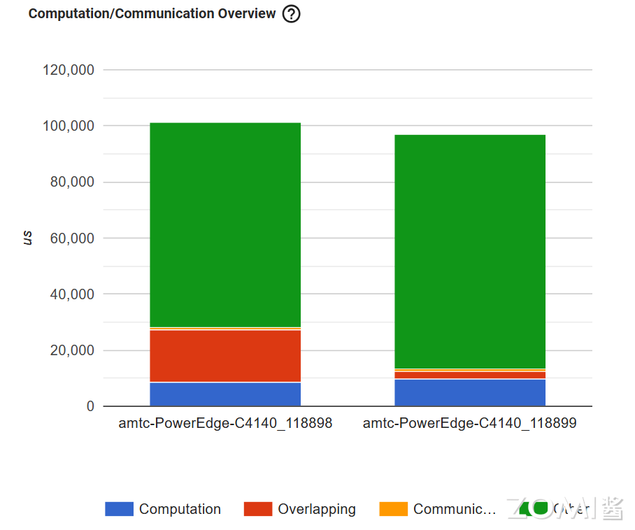
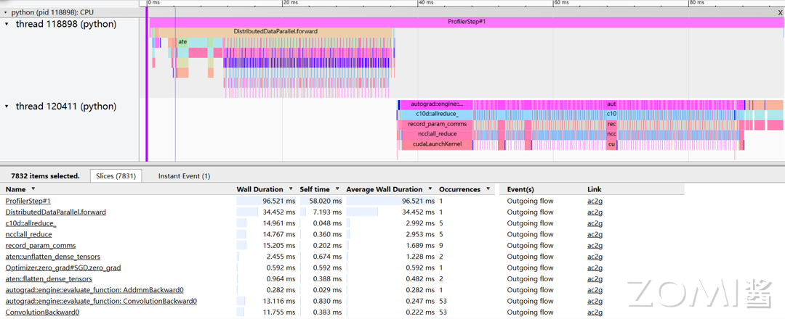
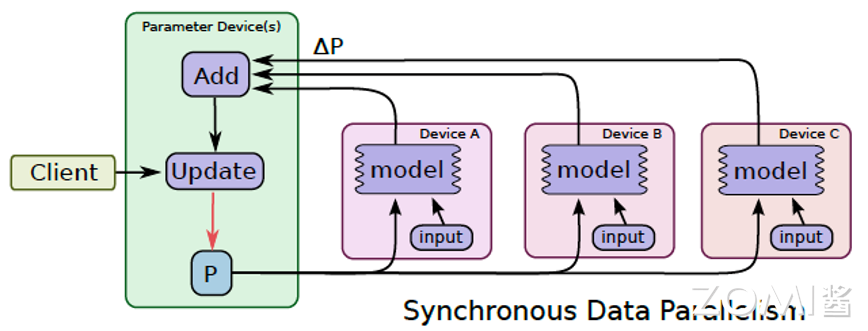
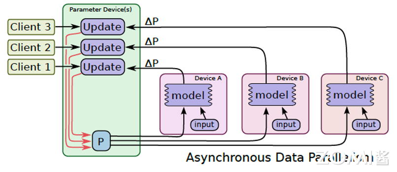
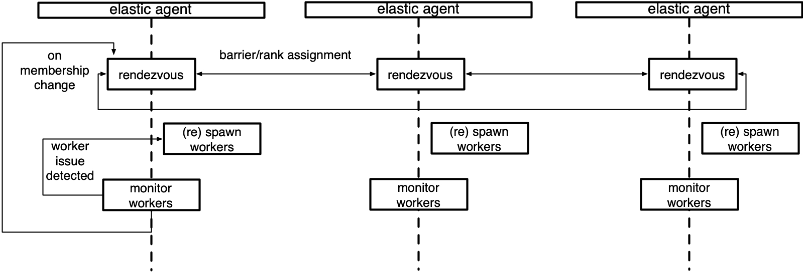

<!--适用于[License](https://github.com/chenzomi12/AISystem/blob/main/LICENSE)版权许可-->

# 数据并行(DONE)

**数据并行**是一种广泛应用于分布式 AI 系统中的技术，旨在通过将数据集划分为多个子集并在不同计算节点上并行处理这些子集，以提高计算效率和速度。在大规模机器学习和深度学习训练过程中，数据并行可以显著加快模型训练速度，减少训练时间，提升模型性能。大部分的数据并行模型中，每个计算节点都会接收到完整的模型副本，但处理不同的数据子集。通过这种方法，计算任务可以被分摊到多个节点上，从而显著提高处理速度和效率。

数据并行的实现方式多种多样，按照同步方式进行分类，包括**同步数据并行**和**异步数据并行**。同步数据并行要求所有计算节点在每一轮迭代后同步其参数，确保模型的一致性。而异步数据并行则允许节点独立进行计算和参数更新，从而减少等待时间，但也可能带来参数不一致的问题。按照实现方式进行分类，包括**数据并行**、**分布式数据并行**、**完全分片的数据并行**、**异步的数据并行**、**弹性数据并行**以及**参数服务器**。在本节中，集中关注与 PyTorch 框架相结合的数据并行算法。

## DP 与 DDP

### 数据并行 DP

数据并行（Data Parallelism, DP）的核心思想是将大规模的数据集分割成若干个较小的数据子集，并将这些子集分配到不同的 NPU 计算节点上，每个节点运行相同的模型副本，但处理不同的数据子集。在每一轮训练结束后，各节点会将计算得到的梯度进行汇总，并更新模型参数。这样，每个节点都能在下一轮训练中使用更新后的模型参数，从而保证整个模型在所有节点上保持一致。

数据并行只能在单台机器上运行，采用单进程、多线程的实现方式，将原本在 NPU0 上进行的数据训练过程，扩展到多个 NPU 并行训练。在某 NPU 上随机初始化模型和优化器后，就可进行数据并行的训练，算法主要分为下面两个步骤：

- **前向传播**：将 mini-batch 数据平均分配到每个 NPU 上。接下来进行分布式初始化，将模型和优化器复制到每个 NPU 上，保证各 NPU 的模型、优化器完全相同。初始化完成后，各 NPU 根据分配到的数据和模型同时进行前向传播。

- **损失计算与反向传播**：前向传播完成后，每个 NPU 分别计算模型损失并进行反向传播。得到梯度后，将梯度传递到某 NPU 进行累加，更新模型的参数和优化器状态。更新后的模型参数和优化器将会在下一轮的前向传播中被复制到每个 NPU 上。

如图所示，不断上述步骤重复进行，直到模型收敛或者达到预定的训练轮数。



但由于数据并行相对来说还不够完善，造成了许多性能的浪费。如在**语言层面**，使用作为最热门的深度学习开发语言 Python，在数据并行中采用的单进程、多线程并行方式往往受到 GIL（全局解释器锁）限制，CPU 的性能瓶颈使得多线程不能良好的利用 NPU 集群的资源。

另外在**算法层面**，全局的梯度累积和参数更新发生在一个 NPU 上，会出现明显的单个 NPU 利用率更高，其他 NPU 空闲的情况，造成了资源的浪费。同时如果在数据并行中的 mini-batch 设置过小，将导致 NPU 内并行度不足，从而降低训练速度；在通信开销的影响下，甚至可能出现比单 NPU 慢的情况。

### 分布式数据并行 DDP

分布式数据并行（Distributed Data Parallel, DDP）是数据并行的一种高级形式，它综合了多种优化，是当前应用最广的并行算法之一，通常用于大型 NPU AI 集群和 AI 系统中。DDP 在每个 NPU 上创建一个模型副本，并在每个训练步骤结束时，通过高效的梯度聚合和参数同步机制，确保模型的一致性。

除此以外，DDP 针对数据并行的缺点做了许多改进，并拥有良好的的扩展性，如：完全分片的数据并行就是基于分布式数据并行的内存高效扩展版本。具体来说，分布式数据并行使用了**多进程**的实现方式，这避免了开发语言层面 Python GIL 的限制，也将并行规模扩展到多台网络连接的机器，进一步扩大分布式规模和效率；同时，针对通信做了大量优化，如使用**Ring AllReduce 算法**和**延迟隐藏技术**进行高效的集合通信。分布式数据并行的各 NPU 负载也更均衡，没有单独在某一个 NPU 上工作的情况。

#### DDP 基本流程

在分布式数据并行中，程序会启动设备数量个进程，每个进程单独启动一个主训练脚本副本。在开始时，主进程将模型从设备 NPU0 复制到其余 NPU 一次，保证各 NPU 的模型、优化器完全相同，接下来是分布式数据并行的训练过程：

- **前向传播**：每个 NPU 将分别拿到一块完整且不同的 mini-batch 数据，各 NPU 根据分配到的数据同时进行前向传播。

- **损失计算与反向传播**：前向传播完成后，每个 NPU 分别计算模型损失并进行反向传播与梯度更新。值得注意的是，分布式数据并行中反向传播和梯度更新的过程是同时进行的，即一旦某些局部梯度准备就绪，它们就会在所有过程中取平均值（默认是使用 Ring-AllReduce 算法做集合通信），然后使用全局梯度更新模型参数和优化器状态。

> 将在后续内容具体介绍有关**计算与通信的重叠**的内容。梯度的一致性可确保各 NPU 的模型保持一致，避免使用其他模型的梯度进行参数更新而导致收敛问题。
>
> 在**异步的数据并行**中，还将会接着讨论模型不一致的情况，这将会带来一定的收敛问题，但是可以使整个迭代过程更快，同时 NPU 的利用率更高。

上述步骤重复进行，直到模型收敛或者达到预定的训练轮数。

## DDP 实现分析

数据并行是分布式训练中最基础和常见的并行算法。本节将重点介绍分布式数据并行（DDP）在 PyTorch 中的简单实现示例，并对数据并行的各个关键步骤如前向传播、反向传播、梯度更新等进行详细分析，以更深入地理解数据并行的实现原理和具体执行步骤。

下面在分布式环境下使用 2 个 NPU 训练简单网络的完整例子。

首先需要导入了实现分布式数据并行训练所需的库。包括 PyTorch 的核心库 `torch`、神经网络模块 `torch.nn`、优化器模块 `torch.optim`、分布式启动模块 `torch.distributed` 和多进程模块 `torch.multiprocessing`：

```python
import os
import torch
import torch.nn as nn
import torch.optim as optim
import torch.distributed as dist
import torch.multiprocessing as mp
from torch.nn.parallel import DistributedDataParallel as DDP
```

首先指使用 `dist.init_process_group` 初始化进程组。`example` 函数实现了分布式数据并行训练的主要逻辑。该函数首先加载模型并将其复制到当前进程的 NPU 上，并使用 `torch.nn.parallel.DistributedDataParallel` 将其封装为分布式数据并行模型，同步不同进程的参数。

对于每个数据，该函数将首先把数据移动到当前 NPU，然后前向传播计算模型输出，基于损失函数计算损失值并反向传播计算梯度，最后使用优化器更新模型参数。

```python
def example(rank, world_size):
    # create default process group
    dist.init_process_group("nccl", rank=rank, world_size=world_size)
    # create local model
    model = nn.Linear(10, 10).to(rank)
    # construct DDP model
    ddp_model = DDP(model, device_ids=[rank])
    # define loss function and optimizer
    loss_fn = nn.MSELoss()
    optimizer = optim.SGD(ddp_model.parameters(), lr=0.001)

    # forward pass
    outputs = ddp_model(torch.randn(20, 10).to(rank))
    labels = torch.randn(20, 10).to(rank)
    # backward pass
    loss_fn(outputs, labels).backward()
    # update parameters
    optimizer.step()

def main():
    world_size = 2
    mp.spawn(example,
        args=(world_size,),
        nprocs=world_size,
        join=True)

if __name__=="__main__":
    # Environment variables which need to be
    # set when using c10d's default "env"
    # initialization mode.
    os.environ["MASTER_ADDR"] = "localhost"
    os.environ["MASTER_PORT"] = "29500"
    main()
```

作为分布式的启动函数，`main` 利用 `torch.multiprocessing.spawn` 启动指定数量的进程，并在每个进程中运行传入的函数。在主程序入口处，`main` 被调用并传入了 `example` 函数和进程数 2，因此实现了在 2 个 NPU 上进行分布式数据并行训练。在真实环境中，还会使用 `DataLoader` 和 `DistributedSampler` 进行高效的分布式数据加载。接下来进行系统的分析。

### DDP 前向传播

接下来来看 PyTorch2.0 中分布式数据并行具体的实现方式，这里先不涉及 PyTorch2.0 或 torchdynamo 引入的编译部分。首先看看 DDP 的**初始化**与**前向传播**，以及在这个过程中是如何**维护模型一致性**的。

模型的一致性要求每次进行的前向传播每个进程的参数需要相同。它依赖于 `torch.nn.Module` 类和 `DistributedDataParallel` 类，在 PyTorch 中，所有的模型都会继承 `Module` 类（包括分布式数据并行类 `DistributedDataParallel`）。

其中需要关注的是 `Module` 类中的两个类变量 `_parameters` 和 `_buffers`。`_parameters` 是指网络的参数，`_buffers`不是参数，但也是会被持久化保存的数据，如 BatchNorm 中的 mean 和 variance。

```python
# torch.nn.modules.py
class Module:
    ...
    _parameters: Dict[str, Optional[Parameter]]
    _buffers: Dict[str, Optional[Tensor]]
    ...
```

DDP 在构建时，会通过 `_sync_module_states` 同步各个进程的模型参数，包括`_parameters` 和 `_buffers`以达到模型的一致性。

```python
# torch.nn.parallel.distributed.py 
class DistributedDataParallel(Module, Joinable):
    ...
    def __init__(
        ...
        # Sync params and buffers. Ensures all DDP models
        # start off at the same value.
        _sync_module_states(
            module=self.module,
            process_group=self.process_group,
            broadcast_bucket_size=self.broadcast_bucket_size,
            src=0,
            params_and_buffers_to_ignore=self.parameters_to_ignore,
        )
        ...
```

同时，在每次网络传播开始前，DDP 也都会通过 `_sync_module_states` 同步进程之间的 `buffer`，维持状态的统一。

```python
# torch.nn.parallel.distributed.py 
class DistributedDataParallel(Module, Joinable):
    ...
    def forward(self, *inputs, **kwargs):
        ...
        # Sync params and buffers. Ensures all DDP models start off at the same value.
        _sync_module_states(
            module=self.module,
            process_group=self.process_group,
            broadcast_bucket_size=self.broadcast_bucket_size,
            src=0,
            params_and_buffers_to_ignore=self.parameters_to_ignore,
        )
        ...
```

### DDP 计算通信重叠

在分布式数据并行中，一项重要的优化是在反向传播过程中同时进行参数更新，这一过程也被称为计算与通信的重叠。在分布式训练中，每个进程通常会在完成当前网络反向传播的同时进行梯度更新，以隐藏通信延迟。

如图所示，在部分梯度计算完成后，即可立即进行通信，一般通过钩子函数来实现。在通信的同时也会继续计算梯度，这样就无需等待所有计算完成后再集中进行通信，也不必在计算完成后等待通信完成，从而将通信过程覆盖到计算时间内，充分利用 AI 集群，提高了 AI 集群使用率。



这里同样使用 PyTorch2.0 进行举例。在此过程中涉及到钩子函数 `hook`、参数桶 `bucket` 和归约管理器 `reducer` 三个关键部分。

钩子函数 `hook` 是在 `torch.Tensor` 上实现的，每次计算相对于张量的梯度时都会调用该钩子。通过钩子函数，当张量梯度计算完成后，就可以立即进行集合通信。需要注意的是，虽然 DDP 的关键代码是用 C++ 实现的，但在 C++ 和 Python 代码中，`Tensor` 都提供了相似的 hook 接口，实现了类似的功能。

```python
# torch._tensor.py
class Tensor(torch._C._TensorBase):
    ...
    def register_hook(self, hook):
        r"""Registers a backward hook.

        The hook will be called every time a gradient with respect to the
        Tensor is computed. 
        ...
```

PyTorch 使用归约管理器 `reducer` 在反向传播期间进行梯度同步。为提高通信效率，`reducer` 将参数梯度组织到多个桶 `buckets` 中，并对每个桶进行集合通信（可通过在 DDP 构造函数中设置 `bucket_cap_mb` 参数来配置桶大小）。

其中参数梯度到桶的映射，在构造时基于桶大小限制和参数大小确定。模型参数按照给定模型 `Model.parameters()` 的大致相反顺序分配到桶中（使用相反顺序的原因是 DDP 期望在反向传播时以大致相同的顺序准备好梯度）。

示例图展示了一个场景，其中 $g_{w2}$ 和 $g_{b2}$ 在 bucket1 中，另外两个梯度在 bucket2 中。虽然这种假设可能不总是成立，一旦发生，将损害 DDP 反向传播的速度，因为 reducer 无法在最早可能的时间启动通信。

除了分桶，reducer 在构造阶段为每个参数注册了 autograd 钩子，在反向传播时当梯度准备就绪时触发这些钩子。PyTorch 使用 `_ddp_init_helper` 函数，进行参数的 `reducer` 的初始化以及参数的装桶。

```python
# torch.nn.parallel.distributed.py 
class DistributedDataParallel(Module, Joinable):
    ...
    def __init__(
        ...
        # Builds reducer.
        self._ddp_init_helper(
            parameters,
            expect_sparse_gradient,
            param_to_name_mapping,
            static_graph,
        )
        ...
    ...
    def _ddp_init_helper(
        self,
        parameters,
        expect_sparse_gradient,
        param_to_name_mapping,
        static_graph,
    ):
        """
        Initialization helper function that does the following:
        (1) bucketing the parameters for reductions
        (2) resetting the bucketing states
        (3) registering the grad hooks
        (4) Logging construction-time DDP logging data
        (5) passing a handle of DDP to SyncBatchNorm Layer
        """
        ...
```

如果一个参数在前向传播中没有被使用，当前参数的桶会在反向传播时永远等待缺失的梯度。如果设置了 `find_unused_parameters` 为 True，DDP 会分析来自本地模型的输出，从而确定在模型的子图上运行反向传播时哪些参数参与了计算。DDP 通过从模型输出遍历计算图来找出未使用的参数，并将其标记为可供 reduce。

在反向传播期间，reducer 只会等待未就绪的参数，但它仍会对所有桶进行 reduce 操作。将参数梯度标记为就绪不会帮助 DDP 跳过桶，但会防止其在反向传播时永远等待缺失的梯度。值得注意的是，遍历计算图会带来额外开销，因此只有在必要时才应将 `find_unused_parameters` 设置为 True。

由于反向传播的函数 `backward` 直接在损失张量上调用，这超出了 DDP 的控制范围。DDP 使用在构造时注册的 autograd 钩子来触发梯度同步。当一个梯度准备就绪时，相应的 DDP 钩子会被触发，DDP 将标记该参数梯度为就绪可供 reduce。

当一个桶中的所有梯度都准备就绪时，reducer 将在该桶上启动异步 allreduce 操作以计算所有进程中梯度的平均值。当所有桶都就绪时，reducer 将阻塞等待所有 allreduce 操作完成。

完成后，平均梯度将被写入所有参数的 `param.grad` 字段。因此，在反向传播之后，不同 DDP 进程上相同的参数其 `grad` 字段应该是相同的。在之后的优化器步骤中，所有 DDP 进程上的模型副本可以保持同步，因为它们都从同一个状态开始，并且在每次迭代中具有相同的平均梯度。

### DDP 数据加载

所使用的 `DataLoader` 是一个迭代器，在加载 `__iter__` 方法时，会根据进程数量选择对应的迭代器并赋值给类变量 `_iterator`，迭代器种类分为 `_SingleProcessDataLoaderIter` 和 `_MultiProcessingDataLoaderIter`，其中 `_MultiProcessingDataLoaderIter` 负责多进程的数据读取。

```python
# torch.utils.dat.dataLoader.py
class DataLoader(Generic[T_co]):
    ...
    def __iter__(self) -> '_BaseDataLoaderIter':
        ...
        if self.persistent_workers and self.num_workers > 0:
            if self._iterator is None:
                self._iterator = self._get_iterator()
            else:
                self._iterator._reset(self)
            return self._iterator
        else:
            return self._get_iterator()
    ...
    def _get_iterator(self) -> '_BaseDataLoaderIter':
        if self.num_workers == 0:
            return _SingleProcessDataLoaderIter(self)
        else:
            self.check_worker_number_rationality()
            return _MultiProcessingDataLoaderIter(self)
```

在获取数据时，这些迭代器会调用使用 `_reset` 初始化 sampler，然后通过 `_next_data` 方法获取数据。

```python
    ...
    def __next__(self) -> Any:
        with torch.autograd.profiler.record_function(self._profile_name):
            if self._sampler_iter is None:
                # TODO(https://github.com/PyTorch/PyTorch/issues/76750)
                self._reset()  # type: ignore[call-arg]
            data = self._next_data()
            ...
```

在 `_MultiProcessingDataLoaderIter` 中，会加载多个进程，主进程负责维护一个索引队列（index_queue），工作进程从索引队列中获取数据索引，然后从数据集中加载数据并进行预处理。处理后的数据被放入结果队列（worker_result_queue）中，供主进程使用。

```python
# torch.utils.data.dataLoader.py
class _MultiProcessingDataLoaderIter(_BaseDataLoaderIter):
    def __init__(self, loader):
        ...
        for i in range(self._num_workers):
            # No certainty which module multiprocessing_context is
            # type: ignore[var-annotated]
            index_queue = multiprocessing_context.Queue()  
            # Need to `cancel_join_thread` here!
            # See sections (2) and (3b) above.
            index_queue.cancel_join_thread()
            w = multiprocessing_context.Process(
                target=_utils.worker._worker_loop,
                args=(self._dataset_kind, self._dataset, index_queue,
                        self._worker_result_queue, self._workers_done_event,
                        self._auto_collation, self._collate_fn, self._drop_last,
                        self._base_seed, self._worker_init_fn, i, self._num_workers,
                        self._persistent_workers, self._shared_seed))
            w.daemon = True
            w.start()
            self._index_queues.append(index_queue)
            self._workers.append(w)
        ...
```

其中每一个进程都运行 `_worker_loop` 函数，从 `index_queue` 中获取 `index`，而后从 `Dataset` 中获取对应的数据。

```python
# torch.utils.data._utils.worker.py
def _worker_loop(dataset_kind, dataset, index_queue, data_queue, done_event,
                 auto_collation, collate_fn, drop_last, base_seed, init_fn, worker_id,
                 num_workers, persistent_workers, shared_seed):
    ...
        while watchdog.is_alive():
            try:
                r = index_queue.get(timeout=MP_STATUS_CHECK_INTERVAL)
            except queue.Empty:
                continue
            ...
            idx, index = r
            ...
            try:
                data = fetcher.fetch(index)
            except Exception as e:
                if isinstance(e, StopIteration) and dataset_kind == _DatasetKind.Iterable:
                    data = _IterableDatasetStopIteration(worker_id)
                    # Set `iteration_end`
                    #   (1) to save future `next(...)` calls, and
                    #   (2) to avoid sending multiple `_IterableDatasetStopIteration`s.
                    iteration_end = True
                else:
                    # It is important that we don't store exc_info in a variable.
                    # `ExceptionWrapper` does the correct thing.
                    # See NOTE [ Python Traceback Reference Cycle Problem ]
                    data = ExceptionWrapper(
                        where=f"in DataLoader worker process {worker_id}")
            data_queue.put((idx, data))
```

值得注意的是，每当处理完一个 batch，就需要调用 `_process_data` 将一个待处理的 batch 放入 `_index_queue` 中等待某个进程来处理。这可以使得，在使用当前批次的数据进行训练时，同时加载下一个批次的数据，而不需要在下一次迭代开始使再进行数据的加载，将数据加载的等待时间大大缩减。

```python
# torch.utils.data.dataLoader.py
class _MultiProcessingDataLoaderIter(_BaseDataLoaderIter):
    def _next_data(self):
        while True:
            ...
            # Check if the next sample has already been generated
            if len(self._task_info[self._rcvd_idx]) == 2:
                data = self._task_info.pop(self._rcvd_idx)[1]
                return self._process_data(data)

    def _process_data(self, data):
        self._rcvd_idx += 1
        self._try_put_index()
        if isinstance(data, ExceptionWrapper):
            data.reraise()
        return data
```

如果设置了 pin_memory=True，则主进程会启动一个内存固定线程，该线程从结果队列中获取数据，并使用 `_pin_memory_loop` 将其复制到 NPU 内存中。复制后的数据被放入数据队列中，供主进程使用。

```python
# torch.utils.data.dataLoader.py
class _MultiProcessingDataLoaderIter(_BaseDataLoaderIter):
    def __init__(self, loader):
        ...
            pin_memory_thread = threading.Thread(
                target=_utils.pin_memory._pin_memory_loop,
                args=(self._worker_result_queue, self._data_queue,
                      current_device,
                      self._pin_memory_thread_done_event, self._pin_memory_device))
```

在分布式环境下，通过 `DistributedSampler` 可以获取到基于 NPU 索引的数据切分，这样就确保了每个 NPU 可以拿到不同的数据。

```python
# torch.utils.data.distributed.py
class DistributedSampler(Sampler[T_co]):
    def __iter__(self) -> Iterator[T_co]:
        if self.shuffle:
            # deterministically shuffle based on epoch and seed
            g = torch.Generator()
            g.manual_seed(self.seed + self.epoch)
            indices = torch.randperm(len(self.dataset), generator=g).tolist()
        else:
            indices = list(range(len(self.dataset)))
        ...

        # subsample
        indices = indices[self.rank:self.total_size:self.num_replicas]
        assert len(indices) == self.num_samples

        return iter(indices)
```

### DDP 性能分析

使用 `torch.profiler.profile` 对 DDP 的过程进行性能分析。只需要对训练的循环进行简单嵌套，就能得到清晰的具体分析结果。

| Configuration | GPU Summary |
| --- | --- |
| Number of Worker(s): 2 | Name: Tesla V100-SXM2-16GB |
| Device Type: GPU | Compute Capability: 7.0 |

这里使用了两张 V100-SXM2-16GB 作为设备并使用 NV-Link 连接，通过 CIFAR10 训练 ResNet50 网络。



从 `profile` 对 ResNet50 的性能分析结果可以看到，计算与通信的重叠几乎覆盖了整个反向传播的过程（反向传播的计算时间约为前向传播的两倍，图中重叠的部分约为只计算部分的两倍，只通信的部分可以忽略不记）



同样，在追踪视图中，可以看到反向传播的主要计算函数 `autograd::engine::evaluate_function:ConvolutionBackward0` 与集合通信的函数 `nccl:all_reduce` 执行是重叠的。

DDP 反向传播中计算与通信的重叠导致无需等待所有计算完成后再集中进行通信，也不必在计算完成后等待通信完成，提高了 AI 集群的使用率。

## 异步数据并行

前面的介绍都是基于**同步的数据并行**，同步的数据并行特别适用于计算资源相对均衡的情况。在同步数据并行中，每个 NPU 都处理数据的一个子集，并独立地计算梯度。在每次迭代中，所有 NPU 都将它们的梯度汇总，并通过一致的规则来更新模型参数。这样，所有 NPU 上的模型都保持一致，不会出现不同步的情况。

由于所有 NPU 在每个训练步骤中都执行相同的更新操作，模型的收敛性更容易得到保证。且所有 NPU 都参与到梯度更新的计算中，整体计算效率也相对较高。此外，同步数据并行还易于实现，因为所有 NPU 的操作都是同步的，不需要复杂的同步机制。



但是同步数据并行也有一些局限性。当集群中的某些 NPU 性能较差或者出现故障时，整体的训练效率会受到影响，所有 NPU 都需要等待最慢的 NPU 完成计算。又或是当 NPU 数量过多时，集合通信的时间可能会成为训练的瓶颈，从而限制整体的扩展性。

**异步的数据并行（Asynchronous Data Parallelism, ADP）** 可以在一定程度上解决这些问题。在异步数据并行中，不同 NPU 的计算过程相互独立，不再需要等待其他 NPU 完成计算。每个 NPU 都按照自己的速度进行前向和反向传播，随时将计算得到的梯度更新到模型参数中。这样，快速的 NPU 不再受到慢速 NPU 的影响，整体计算效率得到提高。异步数据并行的步骤为：



- **前向传播**：将 mini-batch 数据平均分配到每个 NPU 上。接下来进行分布式初始化，将模型和优化器复制到每个 NPU 上，保证各 NPU 的模型、优化器完全相同。初始化完成后，各 NPU 根据分配到的数据和模型同时进行前向传播。

- **损失计算与反向传播**：前向传播完成后，每个 NPU 分别计算模型损失并进行反向传播。得到梯度后，各 NPU 将自己的梯度发送到主进程。主进程接收到多个梯度后，进行梯度累加和平均，根据累加后的梯度更新模型参数。

> 由于是异步更新，不需要等待所有 NPU 都完成计算后再进行更新，这样快速的 NPU 可以频繁更新参数，而慢速的 NPU 则不影响整体更新进度。

- **参数更新**：主进程将更新后的模型参数广播给各个 NPU 。每个 NPU 接收到更新后的参数后，进行下一轮的训练。

上述步骤重复进行，直到模型收敛或者达到预定的训练轮数。

异步数据并行的优点之一是它可以充分利用集群中每个 NPU 的计算能力，快速的 NPU 不会受到慢速 NPU 的影响，从而提高了整体的训练速度。此外，由于每个 NPU 都独立地进行计算和参数更新，异步数据并行也具有较好的扩展性，能够适应不同规模的集群和不同数量、类型的 NPU 。

但是异步数据并行也存在一些挑战。由于计算过程是异步的，可能会出现梯度更新之间的竞争条件，需要采取一些机制来解决，如：**参数服务器**。同时由于计算过程不再同步，模型的收敛性可能会受到影响，需要通过调整学习率或者采用一些优化算法来弥补。

## 弹性数据并行

弹性训练是一种分布式机器学习训练方法，旨在提高系统在动态环境中的容错性和灵活性。其核心理念是通过动态调整训练过程中的资源分配和任务调度，以应对节点故障、资源变化等不可预测的情况，从而保证训练过程的连续性和高效性。弹性训练主要通过以下方法实现其目标：

1. **动态调度**：系统根据当前资源状况动态分配任务，并在资源变化时进行重新调度。这种方法能够有效利用可用资源，提高训练效率。

2. **检查点机制**：在训练过程中定期保存模型状态和训练进度，以便在故障发生时能够从最近的检查点继续训练，减少因故障导致的训练时间损失。

3. **故障检测和恢复**：系统持续监控各个节点的状态，及时检测故障并采取相应的恢复措施，如重新启动失败的任务或重新分配资源。这种机制保证了训练过程的鲁棒性。

PyTorch 提供了 Torchelastic 组件，用于支持分布式训练过程中的弹性调度和故障恢复。它使得在大规模分布式训练环境中，可以动态调整参与训练的节点数量，并在节点发生故障时进行自动恢复，从而提高训练过程的鲁棒性和效率。Torchelastic 包括 Elastic Agent 服务器、Rendezvous 等组件。

### Elastic Agent 服务器

Elastic Agent 是 Torch Elastic 的控制面板。它是一个进程，负责启动和管理底层的工作进程。其主要职责包括：

1. **与分布式 Torch 的集成**：启动工作进程，并提供所有必要信息，使其能够成功且轻松地调用 `torch.distributed.init_process_group()` 进行分布式环境管理。

2. **故障恢复**：监控工作进程，一旦检测到工作进程失败或不健康，立即终止所有工作进程并重新启动。

3. **弹性调度**：响应成员变化，重新启动包含新成员的工作进程。

最简单的 Agent 部署在每个节点上，管理本地进程。更高级的 Agent 可以远程启动和管理工作进程。Agent 可以完全去中心化，根据其管理的工作进程独立做出决策，也可以通过与其他管理同一作业的 Agent 协作，做出集体决策。

下图是一个管理本地工作进程组的 Agent 的示意图。每个 Agent 都会管理多个 Worker，并运行一个 Rendezvous 模块，用于在分布式环境中实现节点的同步和发现，阻塞会持续到至少 Min 个 Elastic Agent 加入后返回。

当有新的节点加入或现有节点退出时（即成员变更），Rendezvous 过程会重新开始。Rendezvous 过程包括两个关键步骤：屏障操作（barrier）和排名分配（rank assignment）。屏障操作确保所有节点在达到最小节点数量之前都处于等待状态，并在达到最大节点数量后立即完成。排名分配则为每个节点分配一个唯一的 rank，确保每个节点在分布式训练中的 rank 是明确的。



Elastic Agent 持续监控本地的工作进程状态。如果检测到任何工作进程失败或不健康，Elastic Agent 会立即终止所有工作进程，并重新启动。这一过程通过重新启动（respawn）工作进程来实现，确保训练任务的持续进行。

监控工作进程的健康状态是一个持续的过程，Elastic Agent 不断检查工作进程的状态，并在必要时触发故障恢复机制。

Elastic Agent 还具备弹性调度功能。它能够动态调整参与训练的节点数量，响应成员变更，重新启动包含新成员的工作进程。这样，即使在训练过程中有节点故障或新增节点，Elastic Agent 也能够及时调整，保证训练过程的鲁棒性和灵活性。

### Rendezvous 功能

在 Torch Distributed Elastic 中，Rendezvous 是一种功能，结合了分布式同步原语和节点发现。它用于在分布式训练作业中聚集节点，确保所有节点对节点列表及其角色达成一致，并一致决定何时开始或恢复训练。Rendezvous 的关键功能有：

1. **Barrier**：执行 Rendezvous 的节点将阻塞，直到至少达到最小节点数量为止。这意味着 Barrier 的大小不固定。达到最小节点数量后，会有一个额外的等待时间，以防止过快完成，可能排除同时尝试加入的其他节点。如果达到最大节点数量，Rendezvous 会立即完成。若在指定时间内未达到最小节点数量，Rendezvous 将失败，以释放部分分配的作业资源。

2. **排他性**：确保在任何时候只有一个节点组存在（对于同一作业）。新的节点若试图晚加入，只能宣布等待，直到现有的 Rendezvous 被销毁。

3. **一致性**：Rendezvous 完成后，所有成员将同意作业成员和各自的角色。角色由一个整数表示，称为 rank，范围在 0 到 world size 之间。需要注意的是，rank 不是固定的，同一节点在下一次（重新）Rendezvous 中可以分配不同的 rank。

4. **故障恢复**：在 Rendezvous 过程中容忍节点故障。如果在加入 Rendezvous 和其完成之间发生进程崩溃（或失去网络连接等），将自动进行重新 Rendezvous。若节点在完成 Rendezvous 后故障，将由 Torch Distributed Elastic 的 train_loop 处理，并触发重新 Rendezvous。

5. **共享键值存储**：Rendezvous 完成后，将创建并返回一个共享键值存储，实现 `torch.distributed.Store` API。此存储仅在已完成的 Rendezvous 成员间共享，用于初始化作业控制和数据平面所需的信息交换。

Torch Distributed Elastic 提供了 `DynamicRendezvousHandler` 类，实现上述 Rendezvous 机制。它是一种与后端无关的类型，需在构造时指定特定的 `RendezvousBackend` 实例。Torch 分布式用户可以实现自己的后端类型，或使用 PyTorch 提供的实现：

1. **C10dRendezvousBackend**：使用 C10d 存储（默认 TCPStore）作为 Rendezvous 后端。其主要优势是不需要第三方依赖（如 etcd）来建立 Rendezvous。
2. **EtcdRendezvousBackend**：取代了旧的 `EtcdRendezvousHandler` 类。将 `EtcdRendezvousBackend` 实例传递给 `DynamicRendezvousHandler` 功能等同于实例化 `EtcdRendezvousHandler`。

以下是使用 `DynamicRendezvousHandler` 的示例代码：

```python
store = TCPStore("localhost")

backend = C10dRendezvousBackend(store, "my_run_id")

rdzv_handler = DynamicRendezvousHandler.from_backend(
    run_id="my_run_id",
    store=store,
    backend=backend,
    min_nodes=2,
    max_nodes=4
)
```

下面是描述 Rendezvous 工作流程的状态图。


1. **Version Counter**：在流程开始时，Rendezvous 机制会创建一个版本号（如果不存在则创建初始值为“0”）。这个版本号由 /rdzv/version_counter 跟踪，并使用原子操作 fetch-add(1) 来确保版本号的唯一性和一致性。当新的节点加入或现有节点重新启动时，版本号会递增，从而标识新的 Rendezvous 过程。

2. **Active Version**：初始状态为非存在状态（non-existent），表示当前没有活跃的 Rendezvous。当版本号更新后，状态切换为活跃版本（active version），并记录在 /rdzv/active_version。这个活跃版本标识了当前正在进行的 Rendezvous 实例。

3. **Setup**：当达到最小工作节点数（min_workers）时，Rendezvous 进入设置（setup）阶段，并切换到临时状态（ephemeral）。这个阶段确保有足够的节点参与训练，使得训练过程能够顺利进行。

4. **Join Phase**：在加入阶段（join phase），节点开始加入当前的 Rendezvous。此时，Rendezvous 处于 joinable 状态，允许新的节点加入。每个节点加入后，参与者列表（participants）会更新，记录当前已加入的节点。例如，当第一个节点加入时，参与者列表为 [0]；当第二个节点加入时，列表更新为 [0, 1]；以此类推。这个阶段会持续到达到最大工作节点数（max_workers）或最后调用超时（last-call timeout）。

5. **Confirm Phase**：当达到最大工作节点数或最后调用超时时，Rendezvous 进入确认阶段（confirm phase），状态变为 frozen。在这个阶段，参与者列表和保活键（keep-alives）被记录，以确保所有已加入节点的状态一致。每次更新后，参与者和保活键列表会逐步更新，直到所有节点都达到 frozen 状态。

6. **Final State**：在最终状态（final state），Rendezvous 被认为是有效的。所有参与者和保活键被记录在案，确保训练过程的一致性和稳定性。如果有晚加入的节点，它们会增加 num_pending，表示正在等待下一次机会加入训练。这些晚加入的节点不会立即参与当前的训练，而是等待现有的 Rendezvous 完成。

### 弹性数据并行实现

弹性数据并行和数据并行的启动方式一致，但有以下区别：

1. 无需手动传递 `RANK`、`WORLD_SIZE`、`MASTER_ADDR` 和 `MASTER_PORT`。

2. 确保在脚本中包含 `load_checkpoint(path)` 和 `save_checkpoint(path)` 逻辑。当任何数量的工作进程失败时，会使用相同的程序参数重新启动所有工作进程，因此您会丢失最近一次检查点之前的所有进度（见 elastic launch）。

以下是一个训练脚本的示例，它在每个 epoch 上进行检查点操作，因此在失败时最坏情况下会丢失一个完整 epoch 的训练进度。

```python
def main():
    args = parse_args(sys.argv[1:])
    state = load_checkpoint(args.checkpoint_path)
    initialize(state)

    torch.distributed.init_process_group(backend=args.backend)

    for i in range(state.epoch, state.total_num_epochs):
        for batch in iter(state.dataset):
            train(batch, state.model)

        state.epoch += 1
        save_checkpoint(state)
```

可以通过 torchrun 启动分布式和弹性训练，在启动弹性作业时，需要在至少 MIN_SIZE 节点和最多 MAX_SIZE 节点上运行以下命令。

```bash
torchrun --nnodes=MIN_SIZE:MAX_SIZE \
    --nproc-per-node=TRAINERS_PER_NODE \
    --max-restarts=NUM_ALLOWED_FAILURES_OR_MEMBERSHIP_CHANGES \
    --rdzv-id=JOB_ID \
    --rdzv-backend=c10d \
    --rdzv-endpoint=HOST_NODE_ADDR \
    YOUR_TRAINING_SCRIPT.py (--arg1 ... train script args...)
```

## 小结与思考

- 数据并行技术通过在多个计算节点上分割数据集和并行处理来提升神经网络模型训练的效率。

- 分布式数据并行（DDP）是数据并行的高级形式，使用多进程方法避免 Python GIL 限制，支持跨机器扩展，并通过 Ring AllReduce 算法优化通信。

- PyTorch 的 DDP 使得在多个 NPU 上实现分布式训练变得简单，通过自动梯度聚合和参数同步，提高了训练的可扩展性和效率。

- 弹性数据并行通过动态资源管理、检查点保存和自动故障恢复，增强了分布式训练的鲁棒性和灵活性，PyTorch 的 Torchelastic 组件支持这些特性，使得训练作业能适应节点变化和故障情况。

## 本节视频

<html>
<iframe src="https://player.bilibili.com/player.html?isOutside=true&aid=474695172&bvid=BV1JK411S7gL&cid=925108558&p=1&as_wide=1&high_quality=1&danmaku=0&t=30&autoplay=0" width="100%" height="500" scrolling="no" border="0" frameborder="no" framespacing="0" allowfullscreen="true"> </iframe>
</html>
