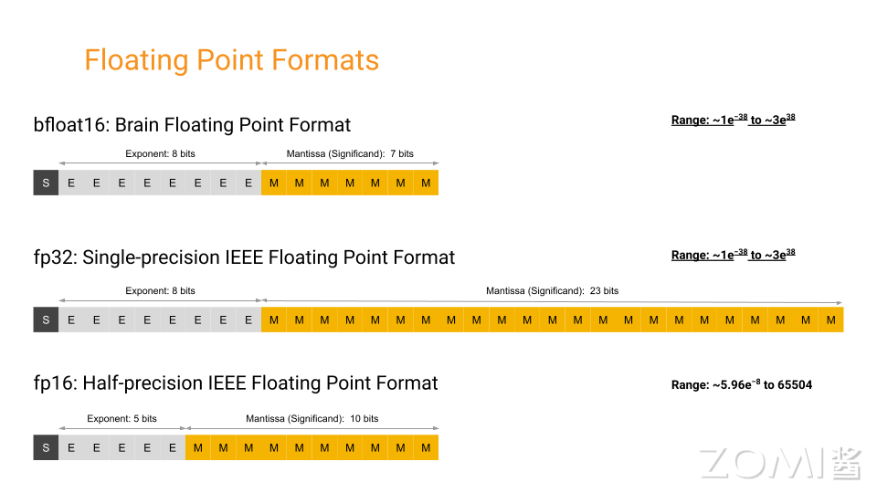
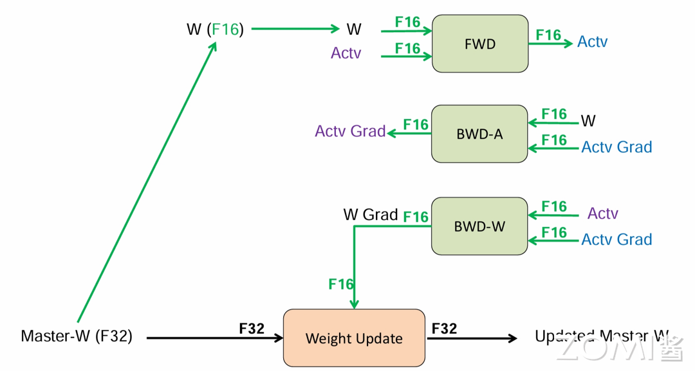
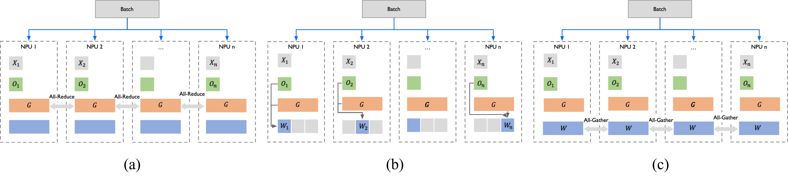
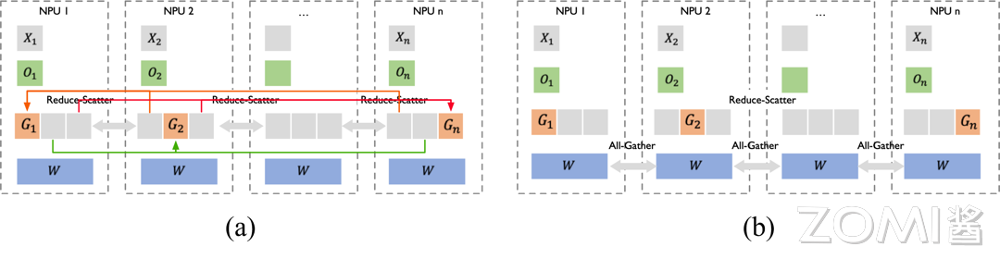
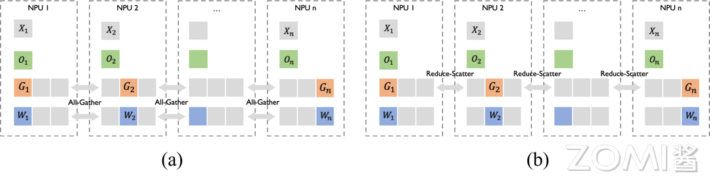
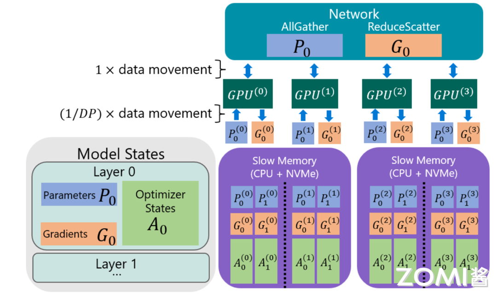

<!--适用于[License](https://github.com/chenzomi12/AISystem/blob/main/LICENSE)版权许可-->

# 数据并行(DONE)

上一节内容介绍了通用的数据并行和分布式数据并行，主要是对神经网络模型的输入数据 mini-batch 进行分布式处理。并且讨论了同步数据并行和异步数据并行的差异点，深入到 PyTorch AI 框架的弹性数据并行是如何实现与处理的。在本节内容中，将会重点关注 AI 框架中如何实现针对权重数据、优化器数据和梯度数据进行分布式并行，并在 PyTorch 框架的具体实现方案。

## 前置知识

在介绍针对权重数据、优化器数据和梯度数据进行分布式数据并行的算法 FSDP 前，需要一些前置知识，如何执行混精度训练和对显存消耗进行估算，以帮助更好地理解完全分片数据并行算法 FSDP。

### 精度格式

在深度学习中，常用的精度格式包括 **FP32**、**FP16**、**BF16** 和 **TF32**。



- **FP16**：同样是 IEEE 754 标准下的半精度浮点格式。随着深度学习的发展，FP16 逐渐取代了 FP32 的地位。因为相较于 FP32，更低的精度并不会对神经网络的性能产生重大影响。额外的精度不会带来任何好处，反而会更慢、占用更多内存并降低通信速度。FP16 通常用于混合精度训练（MindSpore/PyTorch）。也用于训练后量化，以加快推理速度。其他用于量化的格式还有整数 INT8（8 位整数）、INT4（4 位）甚至 INT1（二进制值）。

- **BF16**：谷歌最初开发的另一种 16 位格式被称为 "Brain Floating Point Format"，简称 "bfloat16"。这个名字源于 "谷歌大脑"（谷歌 Brain），谷歌大脑是谷歌的一个人工智能研究小组，这种格式就是在这个小组构思出来的。最开始是被使用在谷歌芯片 TPU 中，后被广泛使用在 GPU、NPU 等 AI 芯片中。由于具有更多的指数位，常被用于处理 FP16 的溢出问题。

- **FP32**：这种格式在很长一段时间内都是深度学习的主力，它是 IEEE 754 标准下的单精度浮点数。长期以来，它一直是神经网络计算的标准类型。长期以来，神经网络中的权重、激活和其他值都默认用 FP32 表示。

- **TF32**：这是一种十分特殊的格式（无需显示设置，而是自动执行），它将 FP32 数据截断为 TF32 进行计算，然后再转换回 FP32。这一创新的最大优势在于编译器只需在 AI 编译层提供支持。其他代码部分则可以继续使用动态范围相同但精度较高的 FP32，无需进行修改。TF32 的快速插入性使得利用 AI 计算加速核心的速度成为可能，而无需过多修改现有代码。

TF32 采用与 FP16 相同的 10 位尾数，这满足了人工智能工作负载的精度要求，并且使用了与 FP32 相同的 8 位指数，因此具有相同的数值范围。从技术上讲，它可以视为一种 19 位格式，也可以视为扩展精度的 BF16。

TF32 的优势在于其格式与 FP32 相同。当使用 TF32 进行计算时，输入 FP32 操作数的尾数从 23 位舍入到 10 位，然后进行精确乘法运算，最后以正常的 FP32 格式进行累加。相比之下，FP16 和 BF16 等格式需要更多工作，因为它们涉及不同的位布局。尽管如此，也值得使用这些不同搞得精度格式，因为它们可以减少内存带宽、存储和计算位数，从而提升执行速度。

```python
torch.backends.npu.matmul.allow_tf32 = True
torch.backends.npu.matmul.allow_16 = True
```

### 混精训练

在当今大模型训练的背景下，混合精度训练已然成为一种备受推崇的普遍做法。通过采用混合精度训练，能够将训练速度显著提升数倍，而又不会对模型的整体性能产生重大影响。在数据科学领域，精度一直是评判的重要考量因素——在传统的科学计算领域，人们通常追求较高的精度，如 FP128 或 FP64 等。

然而，在深度学习中，所面临的实际上是一个高维函数拟合（或近似）的优化问题，因此并不需要过于精确的数值表示，且使用低精度将会带来显著的计算速度提升。

在深度学习中，使用 FP16 训练有时会出现下溢出的问题：FP16 的有效的动态范围约为 ${5.96e}^{-8} \sim 65504$，在训练后期，例如激活函数的梯度会非常小，甚至在梯度乘以学习率后，值会更加小。由于 FP16 的精度范围有限，过小的梯度可能导致更新无效，这个时候就需要使用混精度训练。

混精度训练可以分为两个部分：**半精度** 和 **权重备份**，如图所示，这里使用 FP16 和 FP32 来举例。在训练开始时，准备两套模型状态，其中一套为 FP32 类型（优化器状态和模型参数），另一套为 FP16 类型（模型参数），在前向传播、反向传播时，都使用 FP16 类型的模型参数进行计算；而在参数更新时，将梯度成与学习率 $\eta$ 相乘，更新到 FP32 类型的模型状态上，在新一轮的训练中，再次将 FP32 类型的模型拷贝为 FP16 类型的模型。这个过程就是**混精度训练**。



由于在计算密集的前向传播、反向传播中，使用了 FP16 进行计算，与单精度相比，训练的速度会大幅度提升。另外，由于激活值在训练过程中占用内存的很大部分，使用 FP16 储存激活值在大批量训练时也会节省内存。同时，在分布式环境下使用 FP16 梯度通信量也会降低。

为了获得最佳性能，在混精度中需要额外选择合适的批量大小。通常建议使用 2 的幂次方作为批量大小，并与输入/输出神经元的数量相匹配，通常为 8 的倍数，但也可能更高，具体取决于所使用的硬件和模型的数据类型。

而在 FSDP 中，可以通过在 torch 中指定 `fpSixteen` 进行混精度的自动配置。

```python
fpSixteen = MixedPrecision(
    param_dtype=torch.float16,
    # Gradient communication precision.
    reduce_dtype=torch.float16,
    # Buffer precision.
    buffer_dtype=torch.float16,
)

bfSixteen = MixedPrecision(
    param_dtype=torch.bfloat16,
    # Gradient communication precision.
    reduce_dtype=torch.bfloat16,
    # Buffer precision.
    buffer_dtype=torch.bfloat16,
)

model = FSDP(model,
       auto_wrap_policy=t5_auto_wrap_policy,
       mixed_precision=bfSixteen)
```

### 损失缩放

解决 FP16 下溢问题的另一个方法是损失缩放（Loss Scale）。刚才提到，训练到了后期，梯度（特别是激活函数平滑段的梯度）会特别小，FP16 表示容易产生下溢现象。为了解决梯度过小的问题，需要对损失进行缩放，由于链式法则的存在，损失的缩放也会作用在梯度上。

缩放过后的梯度，就会平移到 FP16 有效的展示范围内。不过缩放并非对于所有网络而言都是必须的，而缩放的取值为也会特别大，一般在 8 - 32k 之间。在 PyTorch 中，可以通过这样的方式实现自动损失缩放：

```python
from torch.cuda.amp import GradScaler, autocast
scaler = GradScaler()

with autocast():
    output = model(input)
    loss = loss_fn(output, target)

scaler.scale(loss).backward()
scaler.step(optimizer)
scaler.update()
```

其中这种损失缩放的方式是动态的，每当梯度溢出时候减少损失缩放规模，并且间歇性地尝试增加损失规模，从而实现在不引起溢出的情况下使用最高损失缩放因子，更好地恢复精度。

**动态损失缩放**的算法会从比较高的缩放因子开始（如 $2^{24}$），然后开始进行训练，并在迭代中检查数是否会溢出（Infs/Nans）；如果没有梯度溢出，则不调整缩放因子，继续进行迭代；如果检测到梯度溢出，则缩放因子会减半，重新确认梯度更新情况，直到参数不出现在溢出的范围内；在训练的后期，loss 已经趋近收敛稳定，梯度更新的幅度往往小了，这个时候可以允许更高的损失缩放因子来再次防止数据下溢。

### 内存消耗估算

在神经网络模型的训练中，合理估算和管理内存消耗是非常重要的。的内存存储主要分为两大块：**模型状态（Model States）** 和**剩余状态（Residual States）**。

1. **模型状态**指和模型本身相关的，必须存储的内容，具体包括：

- 优化器状态（Optimizer States）：Adam 优化算法中的 Momentum 和 Variance；

- 梯度（Gradients）：模型梯度 G；

- 参数（Parameters）：模型参数 W；

2. **剩余状态**是并非模型必须的，但在训练过程中会额外产生的内容，具体包括：

- 激活值（Activation）：在反向传播过程中使用链式法则计算梯度时会用到。有了它算梯度会更快，但它不是必须存储的，因为可以通过重新前向传播来计算；

- 临时存储（Temporary Buffers）: 例如把梯度发送到某个 NPU 上进行 All-Reduce 时产生的存储；

- 碎片化的存储空间（Unusable Fragment Memory）：虽然总存储空间是够的，但是如果取不到连续的存储空间相关的请求也会失败。对这类空间浪费可以通过内存整理来解决。

拿 FP32 与 FP16 的混合精度训练举例，假设模型的参数量是 $\Phi$，那么模型状态所消耗的空间为：

<center>
| Model States                 | Size (Byte) |
|-- |--- |
| FP32 Parameters              | 4$\Phi$   |
| FP32 Adam Optimizer Momentum | 4$\Phi$   |
| FP32 Adam Optimizer Variance | 4$\Phi$   |
| FP16 Gradients               | 2$\Phi$   |
| FP16 Parameters              | 2$\Phi$   |
| Total                        | 16$\Phi$  |
</center>

而由于剩余状态和具体模型架构有关，因此需要具体分析。

接下来基于 Transformer 的架构进行具体分析，因为所有参数超过 10 亿的 SOTA 模型都遵循这一架构。分析假设使用 Adam 优化器进行混合精度训练，因为此优化器是训练基于 Transformer 的大模型较为常用。

**模型状态**：模型状态由优化器状态、梯度和参数组成。基于 Transformer 的模型中的参数总数主要取决于隐藏维度 （$hd$）和 Transformer 层数（$nl$）。Transformer 块中的几乎所有参数都来自每个块内的四个线性层，其大小分别为：（$hd$,$3hd$）、（$hd$,$hd$）、（$hd$,$4hd$）和（$4hd$,$hd$）。因此，基于 Transformer 的模型中的总参数可以近似为：

$$
12 × nl × hd^2
$$

**剩余状态**：剩余状态主要是指激活内存，它取决于模型结构、批量大小（$bsz$）和序列长度（$seq$），而且可能相当大。不过激活所需的内存可以通过激活检查点（activation checkpointing）大大减少，假设 $ci$ 是两个激活检查点之间的 Transformer 块数，$bsz × seq × hd$ 是每个 Transformer 块的输入大小，激活检查点所需的内存估计为：

$$
2 × bsz × seq × hd × nl / ci
$$

**激活工作内存**：激活工作内存是反向传播过程中所需的内存，用于在执行实际反向传播之前重新计算激活。是两个连续激活检查点之间的激活量。例如，如果为每个 Transformer 块创建一个激活检查点，那么内存就是每个 Transformer 块的总激活量。其字节数约为：

$$
bsz × seq × ci × (16 × hd + 2 × attn\_heads × seq)
$$

**模型状态工作内存**：模型状态工作内存是指在将所有模型状态卸载到 CPU 或 NVMe 之后，对模型中最大的单个算子执行前向或后向传播所需的 NPU 内存最小量。这大约是由模型中该算子的参数和梯度的大小决定的，因为必须至少有足够的内存来保存向后传播的参数及其梯度。Transformer 的最大的算子是将隐藏状态从 $h$ 转换为 $4h$ 的线性层。该线性层的参数和梯度的大小为：

$$
4 × hd × 4hd
$$

## 完全分片数据并行 FSDP

完全分片数据并行（Fully Sharded Data Parallel，FSDP）在分布式 AI 系统中具有重要地位，不仅能提高并行效率，还能减少显式内存消耗，这两方面的优势为模型的大规模训练带来了显著的好处。

值得注意的是，并行效率和内存消耗之间存在着密切关联关系，降低内存占用可以使使用更大的并行度，进而提升整体的并行加速效果。完全分片数据并行是基于零冗余优化器（ZeRO）的具体在 AI 框架中的实现，主要的实现有微软的 **Deepspeed** 和 Meta 的 **Fairscale**，其中 Fairscale 被集成到 PyTorch 中，并作为 FSDP 实现基础。在本内容将从零冗余优化器的常用技术入手，深入剖析如何降低内存开销并提高训练效率。

在数据并行中，每个 NPU 都需要保存一份完整的参数（模型状态和剩余状态），而不是所有的参数在训练的整个过程中都会被使用到，而是在特定的阶段中（某个层的前向或反向传播），因此可以在不需要使用的时候将它转移到其他地方节省内存空间。

ZeRO 有两套优化方案：

- ZeRO-DP，旨在减少模型状态的内存占用；

- ZeRO-R，旨在减少剩余状态内存消耗。

后面将详细阐述这些优化及其背后的算法原理，这些优化使 ZeRO 能够在保持高效的同时减少内存占用。

### ZeRO-DP

ZeRO-DP 对模型状态进行切分，具体来说，每个 NPU 都只会会存储 $\frac{1}{N_d}$ 的模型状态（其中 $N_d$ 为并行度），在需要时通过集合通信 All-Gather 获取参数。ZeRO-DP 保留了数据并行训练（DP）的高效率，同时实现了模型并行（MP）的内存效率优势。

由于数据并行的模型状态在所有数据并行进程中冗余存储，因此内存效率低下，但数据并行具有更高的计算粒度和更低的通信量，从而具有更高的训练效率。模型并行的通信开销很大，因此可扩展性比数据并行低，但模型并行对模型状态进行分区，获得了较高的内存效率。

ZeRO-DP 对模型状态进行分区而不是复制它们，并使用动态通信调度最小化通信量。通过这样做，ZeRO-DP 随着数据并行程度的增加线性减少模型在每块 NPU 的内存占用，同时保持通信量接近默认数据并行的通信量，从而保持效率。ZeRO-DP 有三个主要优化阶段，分别对应于优化器状态、梯度和参数的划分，在累积启用时：

1. **优化状态分区**（Partition optimizer states，$P_{os}$）：又称为 ZeRO-1，将优化器状态按并行度均匀分区，每个进程只需存储 $\frac{1}{N_d}$ 的优化器状态（其中 $N_d$ 为并行度）。这可将内存消耗减少到 1 / 4，且无额外通信开销。

2. **添加梯度分区**（Partition gradients，$P_{os+g}$）：又称为 ZeRO-2，在优化器状态分区的基础上，对梯度也进行分区。每个进程只需存储用于更新自身参数分区所需的梯度。这可减少 8 倍的内存消耗，且无额外通信开销。

3. **添加参数分区**（Partition parameters，$P_{os+g+p}$）：又称为 ZeRO-3，在优化器状态和梯度分区的基础上，对参数也进行分区。每个进程只存储自身的参数分区，在前向反向传播时需要从其他进程收集所需的参数分区。这会使通信量增加约 50%，但可以实现与并行度 $N_d$ 成正比的内存减少。


通过这三个阶段的优化，ZeRO-DP 最终能够在保持数据并行高效的同时，将每个 NPU 的内存消耗降低至 $\frac{1}{N_d}$ 的水平，使得利用少量硬件资源训练万亿参数等超大模型成为可能，接下来进行每个阶段的详细介绍。这里假设模型使用混精度训练，模型参数量为 4$\Psi$。

#### ZeRO-1 内存分析

根据之前的介绍知道，优化器状态是训练过程中 NPU 内存中的主要保存内容，但只有在参数更新的时候会被用到。ZeRO-1 的核心思想是将优化器状态分布到多个 NPU 上，减少每个 NPU 所需的显存，在需要参数更新时进行聚合。



1. **数据分片（a）**：从优化器状态分片开始，将优化器状态分成 N 份，每个 NPU 保存一份分片，并将训练批次数据（batch data）分成 N 份，每个 NPU 处理一份数据。
   
2. **前向与后向计算（b）**：每个 NPU 执行一步前向（forward）和后向（backward）计算，得到局部梯度 $G_i$。

3. **梯度聚合（b）**：对各个 NPU 上的局部梯度 $G_i$ 执行 All-Reduce 操作，得到完整梯度 $G$。这一步的单个 NPU 的通信量为 $2\Phi$。

4. **权重更新（c）**：使用完整梯度 $G$ 和优化器状态更新权重 $W$。每个 NPU 保存一部分权重 $W$，并通过 All-Gather 操作从其他 NPU 获取更新后的部分权重，完成权重更新。此时的单个 NPU 通信量为 $\Phi$。

在 $P_{os}$ 阶段，将 Adam 优化器状态根据数据并行维度 $N_d$ 分成等份。每个 NPU 只需存储和更新总优化器状态的 $1/N_d$，并更新对应参数。

通过分片和聚合操作，显存占用从 $4\Psi + K\Psi$ 降低到 $4\Psi + K\Psi / N_d$。当 $N_d$ 很大时，显存占用接近于 $4\Psi$，带来约 4 倍显存节约。

#### ZeRO-2 内存分析

ZeRO-2 在 ZeRO-1 的基础上进一步优化，通过对梯度（Grad）也进行切分，减少显存占用并提高通信效率。



1. **数据分片**：从优化器状态和梯度分片开始，将优化器状态和梯度分成 N 份，每个 NPU 保存一份分片，并将训练批次数据（batch data）分成 N 份，每个 NPU 处理一份数据。

2. **前向与后向计算**：每个 NPU 执行一步前向（forward）和后向（backward）计算，得到局部梯度 $G_i$。

3. **梯度分片与聚合**：对各块 NPU 上的局部梯度 $G_i$ 执行 Reduce-Scatter 操作，确保每个 NPU 只维护自己负责的梯度部分。比如，NPU 1 负责维护梯度 $G_1$，其他 NPU 只需要将 $G_1$ 对应位置的梯度发送给 NPU 1。聚合完毕后，NPU 1 释放无用的显存部分，单卡通信量为 $\Phi$。

4. **权重更新**：每个 NPU 使用自身维护的梯度 $G_i$ 和优化器状态 $O_i$ 更新相应的权重 $W_i$。

5. **权重聚合**：对权重 $W_i$ 执行 All-Gather 操作，将其他 NPU 的权重 $W_i$ 同步至完整权重 $W$，单卡通信量为 $\Phi$。

在 $P_{os+g}$ 阶段，梯度与优化器强相关，因此优化器可以更新其独立的梯度参数。更新梯度参数时使用 Reduce-Scatter 操作，梯度参数更新后立即释放。具体实现中使用分桶（Bucket）技术，将梯度分到不同的桶中并在桶上进行 Reduce-Scatter 操作。

通过移除梯度和优化器状态冗余，显存占用从 $4\Psi + K\Psi$ 降低到 $2\Psi + K\Psi / N_d$。当 $N_d$ 很大时，显存占用接近于 $2\Psi$，带来约 8 倍显存节约。

#### ZeRO-3 内存分析

ZeRO-3 在 ZeRO-1 和 ZeRO-2 的基础上进一步优化，通过对优化器状态、梯度和权重进行全面切分，最大化显存节约，这种优化使得训练超大模型成为可能。



1. **数据分片**：对优化器状态、梯度和权重进行全面切分，每个 NPU 保存一份分片，将训练批次数据（batch data）分成 N 份，每块 NPU 处理一份数据。

2. **前向计算**：在前向计算过程中，对权重 $W$ 执行 All-Gather 操作，从各 NPU 获取分布在不同 NPU 上的权重，得到完整的权重 $W$。不属于自身的权重 $W_{others}$ 被抛弃，单卡通信量为 $\Phi$。

3. **后向计算**：在后向计算过程中，再次对权重 $W$ 执行 All-Gather 操作，取回完整权重，并抛弃不属于自身的部分 $W_{others}$，单卡通信量为 $\Phi$。

4. **梯度聚合**：后向计算得到各自的梯度 $G_i$ 后，对梯度 $G_i$ 执行 Reduce-Scatter 操作，从其他 NPU 聚合自身维护的梯度 $G_i$。聚合操作结束后，立刻抛弃不是自己维护的梯度，单卡通信量为 $\Phi$。

5. **权重更新**：每块 NPU 只保存其权重参数 $W_i$，由于只维护部分参数 $W_i$，因此无需对 $W_i$ 执行 All-Reduce 操作。

在 $P_{os+g+p}$ 阶段，优化器状态、梯度和权重均进行划分。在前向和后向计算过程中，通过广播从其他 NPU 中获取参数，减少每块 NPU 中的显存占用。通过移除梯度、优化器状态和权重的冗余，将显存占用从 $4\Psi + K\Psi$ 降低到 $(4\Psi + K\Psi)/ N_d$。

这种方法通过增加通信开销，以通信换显存，使得显存占用与 $N_d$ 成正比。显存占用的优化带来了 1.5 倍单卡通信量的增加。

### ZeRO-R

除了优化模型状态（优化器状态、梯度和参数）的内存利用率，ZeRO 还专门针对剩余状态（如激活数据、临时缓冲区和内存碎片等）进行了优化，以进一步减少内存开销。ZeRO-R 对剩余状态进行了切分和优化，主要包括以下几个策略:

1. **分区激活检查点**（Partitioned Activation Checkpointing，$P_{a}$）：解决了模型并行时激活内存冗余的问题。在模型并行中，每个 NPU 需要保存完整的输入激活数据才能计算自己分到的模型部分。ZeRO-R 将激活检查点按模型并行度 $N_m$ 进行分区，每个 NPU 只需存储 $\frac{1}{N_m}$ 的激活检查点。在需要时通过 All-Gather 操作重构出完整激活数据，从而按 $N_m$ 的比例减少激活内存。在极端情况下，当模型规模很大时，ZeRO-R 甚至可以将分区后的激活检查点卸载到 CPU 内存（$P_{a+cpu}$），再次降低 NPU 内存占用，代价是额外的 Host-Device 通信开销。该策略在大模型训练时会自动开启，以保证足够的 NPU 内存用于计算。

2. **恒定大小的缓冲区**（Constant Size Buffer，$C_{b}$）：一些操作如 All-reduce 需要将张量拼成连续的临时缓冲区，使用恒定大小的缓冲区来避免临时缓冲区随着模型大小的增加而爆炸，同时使它们足够大以保持效率。

3. **内存碎片化整理**（Memory Defragmentation，$M_{d}$）：在训练过程中，由于激活检查点、梯度等张量生命周期的差异，会产生大量内存碎片。ZeRO-R 通过预分配和动态管理这些张量的内存，减少了内存碎片和内存分配器的开销，提高了内存利用率。

通过以上优化策略，ZeRO-R 很好地补充和完善了 ZeRO-DP 优化模型状态内存的功能。两者相结合，ZeRO 优化器能最大限度减少大模型训练的内存占用，为未来万亿参数级别的神经网络模型铺平了道路。

#### ZeRO-Infinity

ZeRO-Infinity 是 ZeRO 的扩展，可以将深度学习训练扩展到前所未有的规模。具体来说它突破了 NPU 内存壁垒的限制，并使得能够训练具有数万亿个参数的模型成为可能，这是迄今为止最先进系统所无法企及的量级。

此外，它为训练具有一千万亿个参数的模型铺平了道路——充分利用系统的全部内存容量，利用 NPU、CPU 和 Non-Volatile Memory Express（NVMe）等所有异构内存组件的能力。



在 ZeRO-Infinity 中，参数从较慢的内存源（如 CPU 和 NVMe）无缝迁移到 NPU，其中它们被合并为完整的层。梯度计算完成后，这些参数被聚合、重新分区，然后重新卸载回较慢的内存组件。其中内存资源的编排确保了最佳利用和最小的开销。这种创新的方法不仅克服了 NPU 内存的常规限制，而且提升了分布式框架的可扩展性。

## FSDP 简单实现

和 DDP 一样，可以通过简单的嵌套使用 ZeRO 优化器来实现 FSDP。将模型的参数、梯度和优化器状态分片，从而显著减少单个 NPU 的内存占用，实现更大模型的训练。

以下是一个简单的代码示例，展示了如何使用 `torch.distributed.fsdp` 中的 `FullyShardedDataParallel`（FSDP）类来实现完全分片数据并行：

```python
import torch
from torch.distributed.fsdp import FullyShardedDataParallel as FSDP

torch.cuda.set_device(device_id)
sharded_module = FSDP(my_module)

optim = torch.optim.Adam(sharded_module.parameters(), lr=0.0001)
x = sharded_module(x, y=3, z=torch.Tensor([1]))

loss = x.sum()
loss.backward()
optim.step()
```

首先设置当前的 NPU，然后将 `my_module` 包装成一个 FSDP 模块。这会将模型的参数、梯度和优化器状态在多个 NPU 之间进行分片，从而减少每个 NPU 上的内存占用。

再来看一个更详细的例子，使用 `fsdp_main` 函数，用于分布式训练 T5 模型。函数通过 `setup_model` 函数加载模型和分词器，并设置分布式训练的相关环境变量，包括 `local_rank`、`rank` 和 `world_size`。

在数据集和数据加载器设置之后，通过 `functools.partial` 函数部分应用了 `transformer_auto_wrap_policy`，并指定 `T5Block` 为要自动包装的变压器层。这一步的目的是定义一个自动包装策略，用于后续的模型分片和并行处理。

接下来，定义了 `sharding_strategy` 变量，并将其设为 `ShardingStrategy.SHARD_GRAD_OP`。这表示使用 Zero2 分片策略，如果要使用 Zero3 策略，可以将其设为 `FULL_SHARD`。

分片策略决定了在分布式训练中如何管理和分配模型参数，以优化内存使用和计算性能。

为了支持混精度训练（bf16），如果当前 CUDA 版本和 NCCL 版本支持 bf16，并且 CUDA 版本大于或等于 11.0，那么 `bf16_ready` 变量为 `True`，并将 `mp_policy` 设为 `bfSixteen`。否则，`mp_policy` 设为 `None`，默认使用 fp32（单精度）训练。

在模型仍在 CPU 上时，代码将模型传入 `FSDP`（Fully Sharded Data Parallel）模块，配置自动包装策略、混合精度策略（`mixed_precision`），以及当前 NPU ID（`device_id`）。这一步是将模型转换为分布式训练的模式，以便在多个 NPU 之间分片和并行计算。

```python
def fsdp_main(args):
    model, tokenizer = setup_model("t5-base")

    local_rank = int(os.environ['LOCAL_RANK'])
    rank = int(os.environ['RANK'])
    world_size = int(os.environ['WORLD_SIZE'])

    # Set dataset and dataloader here
    
    t5_auto_wrap_policy = functools.partial(
        transformer_auto_wrap_policy,
        transformer_layer_cls={
            T5Block,
        },
    )
    sharding_strategy: ShardingStrategy = ShardingStrategy.SHARD_GRAD_OP #for Zero2 and FULL_SHARD for Zero3
    torch.cuda.set_device(local_rank)

    bf16_ready = (
    torch.version.cuda
    and torch.cuda.is_bf16_supported()
    and LooseVersion(torch.version.cuda) >= "11.0"
    and dist.is_nccl_available()
    and nccl.version() >= (2, 10)
    )

    if bf16_ready:
        mp_policy = bfSixteen
    else:
        mp_policy = None # defaults to fp32

    # model is on CPU before input to FSDP
    model = FSDP(model,
        auto_wrap_policy=t5_auto_wrap_policy,
        mixed_precision=mp_policy,
        #sharding_strategy=sharding_strategy,
        device_id=torch.cuda.current_device())

    optimizer = optim.AdamW(model.parameters(), lr=args.lr)
    scheduler = StepLR(optimizer, step_size=1, gamma=args.gamma)

    for epoch in range(1, args.epochs + 1):
        train_accuracy = train(args, model, rank, world_size, train_loader, optimizer, epoch, sampler=sampler1)
        scheduler.step()
```

当然，如果需要更简单而全面的配置，可以通过 `deepspeed` 库进行便捷的 ZeRO 配置。

## ZeRO 通信分析

无论是零冗余优化，还是卸载到 CPU 和 NVMe 内存，一个关键问题是，它们有限的带宽是否会影响训练效率。很自然地会问是否在用通信量来换取内存效率。换句话说，与标准 DP 方法相比，ZeRO 驱动的 DP 方法的通信量是多少？

### ZeRO-DP

最先进的 All-Reduce 实现采用两步法，第一步是 Reduce-Scatte 操作，一个是 All-Gather 操作，每个流程的总数据移动量为 $\Psi$ 个元素（对于 $\Psi$ 个元素的数据）。因此，标准 DP 在每个训练步骤中会产生 2$\Psi$ 次数据移动。

通过梯度分区（$P_{os+g}$），每个进程只存储更新相应参数分区所需的梯度部分。因此，ZeRO 只需要对梯度先进行 Reduce-Scatte 操作，产生的通信量为 $\Psi$。在每个进程更新完自己负责的参数分区后，会执行一次 All-Gather，从所有数据并行进程中收集所有更新的参数。这也会产生 $\Psi$ 的通信量。因此，每个训练步骤的总通信量为 $\Psi$+$\Psi$= 2$\Psi$，与标准 DP 相同。

在参数分区（$P_{os+g+p}$）后，每个数据并行进程只存储其更新的参数。因此，在前向传播过程中，它需要接收所有其他分区的参数。不过，这可以通过流水线操作来避免内存开销——在对模型中与特定分区对应的部分进行前向传播计算之前，负责该分区的数据并行进程可以向所有数据并行进程广播权重。一旦该分区的前向传播计算完成，参数就可以被丢弃。

因此，总通信量为 $\Psi × N_d / N_d = \Psi$。通过在整个前向传播中通过 All-gather 传播参数已重新获取参数，并在使用完参数后将其丢弃。而在后向传播时，需要以相反的顺序再次进行参数获取。参数的通信为 2$\Psi$，在参数更新时只需要执行一个 Reduce-Scatte 操作，通信量为 $\Psi$，因此总通信量是 3$\Psi$，是标准 DP 的 1.5 倍。

### ZeRO-R

ZeRO-R 的通信开销取决于模型大小、检查点策略和模型并行（MP）策略。与标准模型并行相比（其中没有对激活进行分区），ZeRO-R$P_{a}$ 的通信开销通常不到标准模型并行的十分之一。

在使用激活检查点的 Megatron-LM 中，每个 Transformer 块在前向传播中执行两次大小为 $batch × seq × length × hidden\_dim$ 的 All-Reduce 操作，然后在反向传播中再执行两次。在使用激活检查点的 ZeRO-R 中，每个前向重计算激活之前需要执行一个额外的 All-Gather 操作。

通常情况下，对于每个 Transformer 块的输入激活进行检查点，因此每个 Transformer 块需要一个 All-Gather 操作。因此，ZeRO-R$P_{a}$ 的通信开销为 $seq\_length × hidden\_dim$，仅增加不到 10%。

当 MP 与 DP 一起使用时，ZeRO-R$P_{a}$ 可以将数据并行通信量减少一个数量级，而模型并行通信量只增加 10%，并且当数据并行通信是性能瓶颈时，可以显着提高效率。通过模型并行可以减少数据并行的内存消耗，从而可以成比例地增加批处理大小。

对于大模型，MP 可以增加到单节点最大 NPU 数量，从而可以将批处理大小增加多达 NPU 数据量的倍数。数据并行训练的通信量与批处理大小成反比，由于 $P_{a}$ 导致批处理大小增加一个数量级，可能会导致数据并行通信量减少一个数量级。

如果应用 $P_{a+cpu}$，则分区激活检查点会被卸载到 CPU，将激活内存需求减少到接近零，但与 $P_{a}$ 相比，往返 CPU 内存的数据移动增加了 2 倍。如果 DP 通信量是主要瓶颈，由于批处理大小较小，$P_{a+cpu}$ 也可以通过增加批处理大小来提高效率，只要 CPU 数据传输开销小于 DP 通信量开销。

#### ZeRO-Infinity

可以使用**峰值计算吞吐量（$peak_{tp}$）**、**数据移动带宽（$bw$）** 及其**算术强度（$ait$）** 来估算 ZeRO-Infinity 
的训练效率，因为它还涉及到了 NPU 之间的数据移动。

工作负载的**算术强度（AIT）** 是总计算量与计算所需数据量之间的比率。它描述了每次数据移动所需的计算量。AIT 越高，意味着对数据移动带宽的要求越低，因为每加载一个数据，加速器就能完成更多计算。

$$
ait = \frac{total\_computation}{total\_data\_movement}
$$

因此的效率可以大致估算为：

$$
\begin{aligned}

compute\_time 
&= \frac{total\_computation}{peak_{tp}} \\

communication\_time 
&= \frac{total\_data\_movement}{bw} \\
&= \frac{total\_computation}{ait × bw} \\

efficienc𝑦 
&= \frac{compute\_time}{compute\_time+communication\_time} \\
&= \frac{ait × bw}{ait × bw + peak_{tp}}

\end{aligned}
$$

同样以 Transformer 为例：每次迭代的总计算量可以由参数数量、序列长度和批量大小估算，即对于前向传播为 $2 × bsz × seq × params$，反向传播的成本大约是正向传播的两倍。因此可以估算计算量：

$$
computation\_per\_iter = 2 × 4 × bsz × seq × parameters = 2 × 4 × 12 × bsz × seq × nl × hd^2
$$

在前向和反向传播期间，模型参数必须从源位置加载到 NPU 寄存器至少两次（前向传播期间和实际后向传播期间），导致 2 次的数据移动。在存在激活检查点的情况下，可以在向后传递过程中额外加载一次参数以进行重新计算。

此外，梯度必须至少从 NPU 寄存器存储到其最终位置一次。因此，假设参数和梯度存储在相同的最终位置，则前向和后向传递期间的总数据移动将为 $4 × parameters$，即 $2 × 4 × parameters$（以字节为单位）。因此参数和梯度的 ait 为：

$$
seq × bsz
$$

在优化器迭代期间，必须至少读取一次优化器状态，​​并且必须至少写入一次优化器状态。因此，总数据移动量为 $2 × optimizer_states$，大约为 $2 × 16 × parameters$ 字节。因此，在完整的训练迭代期间，优化器状态的 ait 为：

$$
seq × bsz/4
$$

在前向传播期间，激活检查点必须保存到其最终位置，并且必须在后向传播期间获取。因此，激活检查点的总数据移动量（以字节为单位）为 $2 × total\_activation\_checkpoints\_in\_b𝑦tes$，带入之间计算的激活检查点大小，可以得到总数据移动量 $4 × nl/ci × hd × seq × bsz$。所以激活检查点的 ait 为：

$$
24 × hd × ci
$$

模型状态和激活检查点对带宽的要求大不相同。前者只取决于**批量大小和序列长度**，而后者只取决于**激活检查点的频率和模型的隐藏维度大小**。在实际中，参数和梯度的带宽超过 70 GB/s，即使是最小的批处理量，也能实现超过 50% 的效率。在这种带宽下，数据移动理论上可以与计算完全重叠，从而实现 100% 的效率。与参数和梯度相比，优化器状态需要高出近 4 倍的带宽才能达到 50% 的效率。

此外，优化器状态在前向和后向传播结束时更新，不能与计算重叠。因此，它们需要更大的带宽来保持整个 DL 工作负载的效率。例如，在每个 NPU 的批处理量为 2 的情况下，要达到 90% 的效率，需要近 1.5 TB/s 的有效带宽，甚至超过了 NPU 内存带宽。启用激活检查点后，即使隐藏大小为 2K，2 GB/s 的微薄带宽也能维持 50% 以上的效率。当隐藏大小超过 8K 时，带宽需求降至 1 GB/s 以下。

## 小结与思考

- FSDP 通过在多个 NPU 间分片模型的权重、梯度和优化器状态，显著降低了单个 NPU 上的内存占用，使得训练更大模型成为可能。

- ZeRO 技术通过优化器状态、梯度和参数的分区，以及将激活检查点卸载到 CPU 或 NVMe 内存，进一步提升了内存效率，支持了大模型的训练。

- ZeRO-Infinity 作为 ZeRO 的扩展，智能地在 NPU、CPU 和 NVMe 等异构内存组件之间迁移参数，消除了 NPU 内存限制，为训练高达万亿参数的模型提供了可能。

- 尽管 ZeRO 技术增加了通信开销，但通过精心设计的通信策略和利用现代硬件的高带宽，可以保持训练效率，同时实现内存效率和计算性能的平衡。

## 本节视频

<html>
<iframe src="https://player.bilibili.com/player.html?isOutside=true&aid=474695172&bvid=BV1JK411S7gL&cid=925108558&p=1&as_wide=1&high_quality=1&danmaku=0&t=30&autoplay=0" width="100%" height="500" scrolling="no" border="0" frameborder="no" framespacing="0" allowfullscreen="true"> </iframe>
</html>
