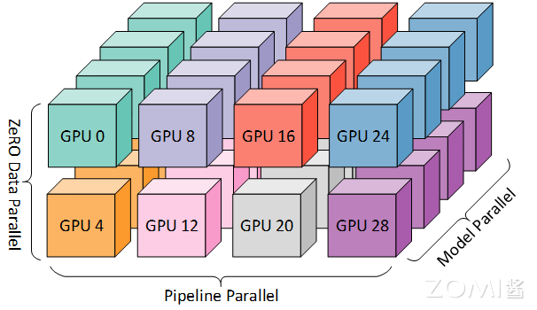
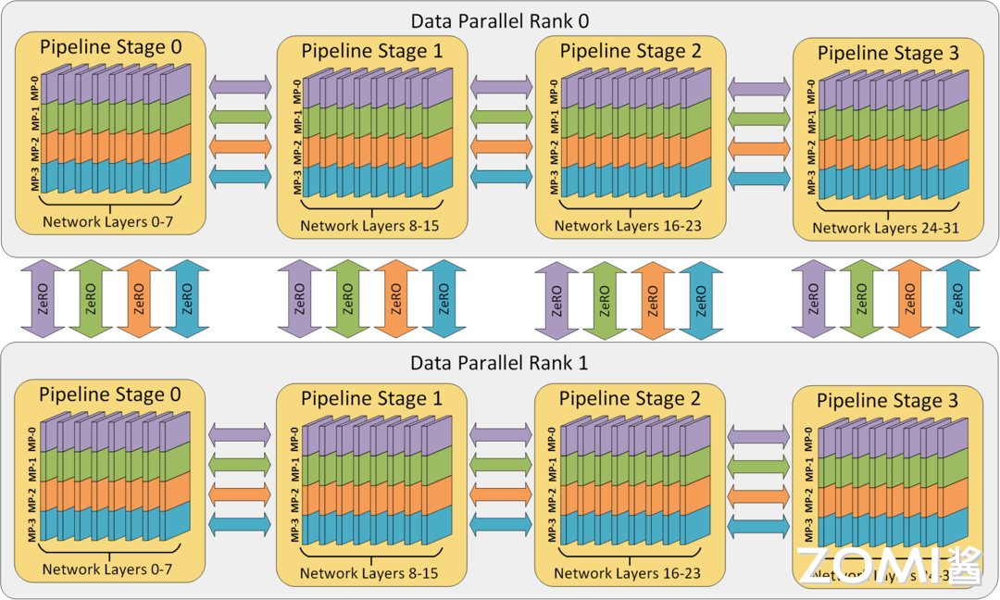

# 混合并行

混合并行（HybridParallel）是一种用于分布式计算的高级策略，它结合了数据并行和模型并行的优势，以更高效地利用计算资源，解决深度学习中的大规模模型训练问题。混合并行不仅能提高计算效率，还能在有限的硬件资源下处理更大的模型和数据集。在深度学习中，数据并行和模型并行各自有其适用的场景和局限性。数据并行适用于训练样本较多而模型较小的情况，通过将数据集分割成多个子集并在不同的设备上同时训练来提高训练速度。而模型并行则适用于模型较大无法单独放入一个设备内存的情况，通过将模型切分成不同的部分分别在多个设备上进行计算。混合并行通过将这两种并行方式结合，加速计算和处理超大规模模型，从而在各种硬件条件下实现高效的深度学习模型训练。现主流的混合并行为 3D 混合并行，但由于他们一般都在大规模分布式深度学习训练框架中使用，如：Deepspeed 和 Colossal AI，而不是深度学习框架，因此只进行简单讨论。


:width:`650px`

混合并行是由多个并行方式组合而成的：

- **数据并行**：将数据集分割成多个子集，在多个设备上分别处理这些子集。这种方式能显著提高数据处理速度，但需要确保子集之间处理结果一致。

- **张量并行**：将模型的不同部分分配给不同的设备进行处理。这种方式能充分利用各种设备的计算能力，但需要注意设备之间的通信开销。

- **流水线并行**：将模型按层分割成若干块，每块都交给一个设备进行处理。这种方式能提高设备的利用率，但需要确保流水线中各阶段正确传递中间结果。

## 3D 混合并行 DP+PP+TP

3D 混合并行是一种在深度学习训练中常用的混合并行策略，它将数据并行、模型并行和流水线并行三种并行方式结合起来，以优化资源利用率和训练效率。这种策略尤其适用于处理大规模的深度学习模型。由于每个维度至少需要 2 个 GPU，因此在这里至少需要 8 个 GPU 才能实现完整的 3D 并行。


:width:`650px`

数据、模型和流水线并行各自在提高内存和计算效率方面发挥特定作用。

- **内存效率**：模型的层被分为流水线阶段，每个阶段的层通过模型并行进一步划分。这种 2D 组合同时减少了模型、优化器和激活函数消耗的内存。然而，我们不能无限制地分割模型，否则会因通信开销而限制计算效率。

- **计算效率**：为了让 Worker 数量在不牺牲计算效率的情况下超越模型和流水线并行，我们使用 ZeRO 驱动的数据并行（ZeRO-DP）。ZeRO-DP 不仅通过优化器状态分区进一步提高了内存效率，还通过利用拓扑感知映射，使 GPU 数量的扩展具有最小的通信开销。

- **拓扑感知 3D 映射**：3D 并行中的每个维度都被仔细映射到 Worker 上，通过利用两个关键的架构属性实现最大计算效率。

通过流水线和模型并行，数据并行组通信的梯度大小线性减少，因此总通信量比纯数据并行减少。此外，每个数据并行组在一部分本地 Worker 之间独立且并行地执行通信。因此，数据并行通信的有效带宽通过通信量减少和本地化及并行性的结合而得到放大。

模型并行是三种策略中通信开销最大的，所以优先将模型并行组放置在一个节点中，以利用较大的节点内带宽。其次，流水线并行通信量最低，因此在不同节点之间调度流水线，这将不受通信带宽的限制。最后，若张量并行没有跨节点，则数据并行也不需要跨节点；否则数据并行组也需要跨节点。

值得注意的是 ZeRO，它是 DP 的超级可伸缩增强版，我们在完全分片的数据并行一节中已经讨论过了。通常它是一个独立的功能，不需要 PP 或 TP。但它也可以与 PP、TP 结合使用。当 ZeRO-DP 与 PP (以及 TP) 结合时，它通常只启用 ZeRO 阶段 1，只对优化器状态进行分片（ZeRO 阶段 2 还会对梯度进行分片，阶段 3 也对模型权重进行分片）。虽然理论上可以将 ZeRO 阶段 2 与流水线并行一起使用，但它会对性能产生不良影响。每个 micro batch 都需要一个额外的 reduce-scatter 通信来在分片之前聚合梯度，这会增加潜在的显著通信开销。根据流水线并行的性质，一般会使用小的 micro batch ，并把重点放在算术强度 (micro batch size) 与最小化流水线气泡 (micro batch 的数量) 两者间折衷。因此，增加的通信开销会损害流水线并行。

## 使用 Torch RPC 实现 DP+PP

我们可以使用 Torch RPC 实现 DP+PP 的简单实现。我们需要初始化 RPC 框架，以便在不同设备之间进行远程过程调用。代码中使用 `rpc.init_rpc` 来启动 RPC 框架，并配置了 `TensorPipeRpcBackendOptions` 以支持不同的传输和通道方式。这里，`tmpfile` 用于指定初始化方法。

```python
# In 'run_worker'
    ntokens = len(vocab) # the size of vocabulary
    emsize = 4096 # embedding dimension
    nhid = 4096 # the dimension of the feedforward network model in ``nn.TransformerEncoder``
    nlayers = 8 # the number of ``nn.TransformerEncoderLayer`` in ``nn.TransformerEncoder``
    nhead = 16 # the number of heads in the Multihead Attention models
    dropout = 0.2 # the dropout value

    from torch.distributed import rpc
    tmpfile = tempfile.NamedTemporaryFile()
    rpc.init_rpc(
        name="worker",
        rank=0,
        world_size=1,
        rpc_backend_options=rpc.TensorPipeRpcBackendOptions(
            init_method="file://{}".format(tmpfile.name),
            # Specifying _transports and _channels is a workaround and we no longer
            # will have to specify _transports and _channels for PyTorch
            # versions >= 1.8.1
            _transports=["ibv", "uv"],
            _channels=["cuda_ipc", "cuda_basic"],
        )
    )

    # Number of GPUs for model parallelism.
    num_gpus = 2
    partition_len = ((nlayers - 1) // num_gpus) + 1

    # Add encoder in the beginning.
    tmp_list = [Encoder(ntokens, emsize, dropout).cuda(2 * rank)]
    module_list = []

    # Add all the necessary transformer blocks.
    for i in range(nlayers):
        transformer_block = TransformerEncoderLayer(emsize, nhead, nhid, dropout)
        if i != 0 and i % (partition_len) == 0:
            module_list.append(nn.Sequential(*tmp_list))
            tmp_list = []
        device = i // (partition_len)
        tmp_list.append(transformer_block.to(2 * rank + device))

    # Add decoder in the end.
    tmp_list.append(Decoder(ntokens, emsize).cuda(2 * rank + num_gpus - 1))
    module_list.append(nn.Sequential(*tmp_list))

    # Need to use 'checkpoint=never' since as of PyTorch 1.8, Pipe checkpointing
    # doesn't work with DDP.
    from torch.distributed.pipeline.sync import Pipe
    chunks = 8
    model = Pipe(torch.nn.Sequential(
        *module_list), chunks = chunks, checkpoint="never")

    # Initialize process group and wrap model in DDP.
    from torch.nn.parallel import DistributedDataParallel
    import torch.distributed as dist
    os.environ['MASTER_ADDR'] = 'localhost'
    os.environ['MASTER_PORT'] = '29500'
    dist.init_process_group(
                backend="nccl", rank=rank, world_size=world_size)
    model = DistributedDataParallel(model)

    def get_total_params(module: torch.nn.Module):
        total_params = 0
        for param in module.parameters():
            total_params += param.numel()
        return total_params

    print_with_rank('Total parameters in model: {:,}'.format(get_total_params(model)))
```

我们定义并行化模型的结构。模型包含一个编码器、多个 Transformer 编码层和一个解码器。我们将这些模块分配到不同的 GPU 上，以实现模型并行。首先，计算每个 GPU 上分配的层数 `partition_len`，然后创建模型的各个部分并将其移动到相应的设备上。接下来使用 `Pipe` 模块将模型进行流水线并行化。这里，我们将模型划分为 8 个块，并设置 `checkpoint` 为 "never" 以兼容数据并行（DDP）。然后，我们初始化进程组，并使用 `DistributedDataParallel`（DDP）包装模型，实现数据并行。进程组的初始化需要指定主节点的地址和端口。最后，我们定义一个函数来计算模型的总参数数量，并打印结果。

## 使用 Torch Device Mesh 实现 DP+PP

数据并行（Data Parallelism, DP）和模型并行（Model Parallelism, MP）是两种常见的方法。下面介绍如何使用 Torch Device Mesh 实现数据并行和流水线并行（Pipeline Parallelism, PP）的结合，以提升训练效率和模型性能。

首先，我们通过 init_device_mesh 初始化一个二维设备网格（Device Mesh）。在这个示例中，我们在 64 个 GPU 上进行训练，其中每 8 个 GPU 进行一次数据并行，另外 8 个 GPU 进行一次张量并行（Tensor Parallelism, TP）。这样构建的二维网格包含两个维度：数据并行维度（dp）和张量并行维度（tp）。

```python
from torch.distributed.device_mesh import init_device_mesh
from torch.distributed.tensor.parallel import ColwiseParallel, RowwiseParallel, parallelize_module
from torch.distributed.fsdp import FullyShardedDataParallel as FSDP

# i.e. 2-D mesh is [dp, tp], training on 64 GPUs that performs 8 way DP and 8 way TP
mesh_2d = init_device_mesh("cuda", (8, 8))
tp_mesh = mesh_2d["tp"] # a submesh that connects intra-host devices
dp_mesh = mesh_2d["dp"] # a submesh that connects inter-host devices

model = Model(...)

tp_plan = {...}

# apply Tensor Parallel intra-host on tp_mesh
model_tp = parallelize_module(model, tp_mesh, tp_plan)
# apply FSDP inter-host on dp_mesh
model_2d = FSDP(model_tp, device_mesh=dp_mesh, use_orig_params=True, ...)
```

我们定义模型，并创建一个张量并行计划（Tensor Parallel Plan），该计划指示模型的哪些部分需要并行化，具体配置可以参考上一节使用 Device Mesh 进行张量并行的内容。通过 `parallelize_module` 函数，我们可以在 `tp_mesh` 上应用张量并行，从而在主机内实现模型的并行化。在 `dp_mesh` 上应用完全分片数据并行（Fully Sharded Data Parallel, FSDP）。FSDP 通过自动分片和重组模型参数，进一步优化跨主机的模型训练。通过将 `model_tp` 传递给 `FSDP`，就可以进行简单的 DP+PP 并行了。

## 本节视频

<html>
<iframe src="https:&as_wide=1&high_quality=1&danmaku=0&t=30&autoplay=0" width="100%" height="500" scrolling="no" border="0" frameborder="no" framespacing="0" allowfullscreen="true"> </iframe>
</html>
