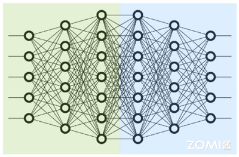
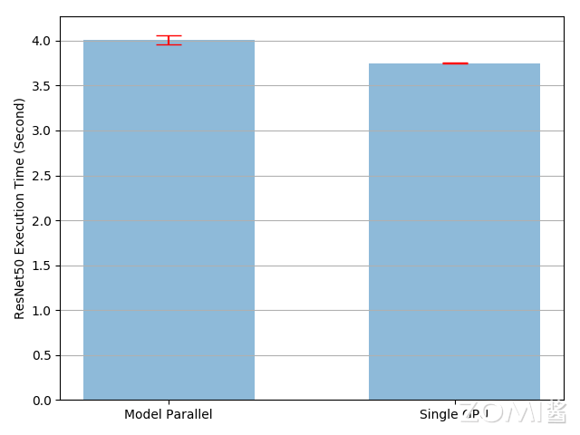
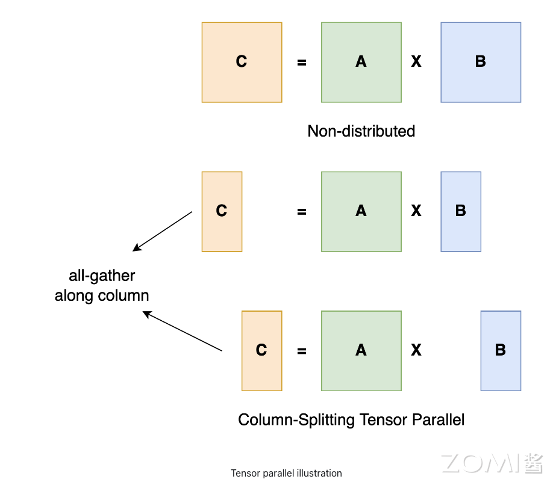
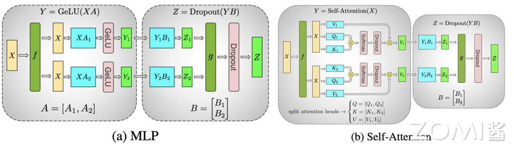
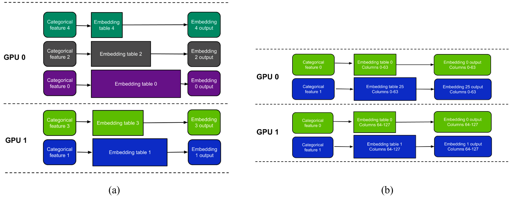
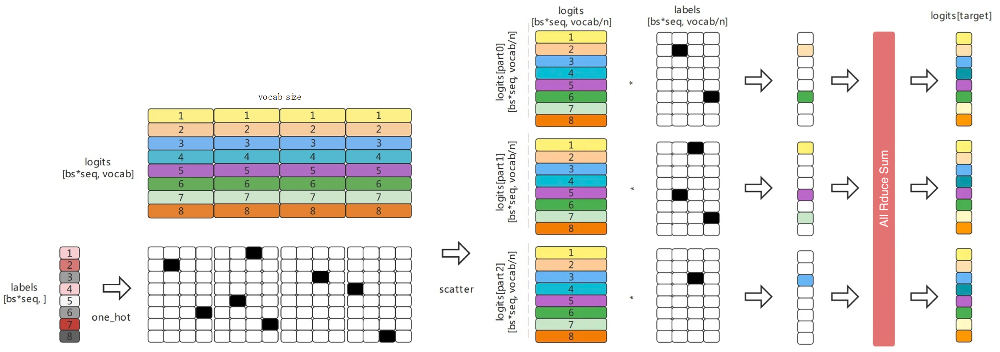

<!--适用于[License](https://github.com/chenzomi12/AISystem/blob/main/LICENSE)版权许可-->

# 张量并行

在大模型的训练中，单个设备往往无法满足计算和存储需求，因此需要借助分布式训练技术。其中，模型并行（Model Parallelism, MP）是一种重要的方法。模型并行的基本思想是将模型的计算任务拆分到不同的设备上执行，以提高训练效率和处理更大规模的模型。下面将重点介绍模型并行中的张量并行。

## 朴素张量并行

张量并行广泛应用于分布式训练技术。之前的部分已经解释了如何使用数据并行在多个设备上训练神经网络；这种方法一般来说将相同的模型复制到所有设备，每个设备消耗不同部分的输入数据。虽然这可以显著加速训练过程，但在某些情况下模型过大无法放入单个设备时，这种方法并不奏效。

本节展示了如何通过使用**朴素张量并行**解决这个问题。与数据并行相反，张量并行将单个模型拆分到不同的设备上，而不是在每个设备上复制整个模型（具体来说，假设一个模型 `m` 包含 6 层：使用数据并行时，每个设备将拥有这 6 层的副本，而使用张量并行在两个设备上时，每个设备只拥有 3 层）。



来看一个简单的张量并行的例子：

```python
from torchvision.models.resnet import ResNet, Bottleneck

num_classes = 1000

class ModelParallelResNet50(ResNet):
    def __init__(self, *args, **kwargs):
        super(ModelParallelResNet50, self).__init__(
            Bottleneck, [3, 4, 6, 3], num_classes=num_classes, *args, **kwargs)

        self.seq1 = nn.Sequential(
            self.conv1, self.bn1, self.relu,
            self.maxpool, self.layer1,self.layer2
        ).to('npu:0')

        self.seq2 = nn.Sequential(
            self.layer3, self.layer4, self.avgpool,
        ).to('npu:1')
        self.fc.to('npu:1')

    def forward(self, x):
        x = self.seq2(self.seq1(x).to('npu:1'))
        return self.fc(x.view(x.size(0), -1))
```

上面的代码展示了如何将 `torchvision.models.resnet50()` 分解到两个设备，将每个块放置在不同的设备上，并移动输入和中间输出以匹配层设备。思路是继承现有的 `ResNet` 模块，并在构造过程中将层分配到两个设备。然后，重写 `forward` 方法，通过移动中间输出连接两个子网络。

朴素张量并行实现解决了模型过大无法放入单个设备的问题。然而，你可能已经注意到，如果模型能够放入单个设备，朴素张量并行将比在单个设备上运行更慢。这是因为在任何时候，只有一个设备在工作，而另一个设备处于空闲状态。当中间输出需要从 `npu:0` 复制到 `npu:1` 时，性能会进一步恶化。



实际上朴素张量并行实现的执行时间比现有的单设备实现慢 `7%`。因此，可以得出结论，跨设备复制张量的开销约为 7%。仍有改进的空间，因为知道在整个执行过程中有一个设备是空闲的。一种选择是进一步将每个批次分成流水线的分片，这样当一个分片到达第二个子网络时，下一个分片可以进入第一个子网络。这样，两个连续的分片可以在两个设备上并行运行。

朴素朴素张量并行的优点在于实现相对简单，不需要复杂的通信和同步机制。然而，这种方法的缺点也很明显：**如果模型的各部分计算量不均衡，可能会导致某些设备的利用率很低，从而影响整体训练效率。**此外，对于依赖较强的模型结构，简单的朴素张量并行也可能难以实现。

## 张量并行

张量并行（Tensor Parallelism，TP）是一种更细粒度的模型并行方法，它将单层内部的参数和计算任务拆分到不同的设备上执行，这种方法特别适合于具有大量参数的大规模模型。它最初是在 Megatron-LM 论文中提出的，它是一种高效的模型并行技术，可用于训练大型 Transformer 模型。

通过张量并行，可以将矩阵乘法等计算操作的矩阵按行或按列切分，然后在不同设备上并行执行部分计算，最后通过集合通信操作合并结果。张量并行可以分为 MatMul 并行、Transformer 并行、Embedding 并行、Cross Entropy Loss 并行。

其中序列并行（Sequence Parallel，SP）也是张量并行的一种变体，它在序列维度上对 nn.LayerNorm 或 RMSNorm 进行分割，以进一步节省训练过程中的激活内存。当模型变得越来越大时，激活内存就会成为瓶颈，因此在张量并行训练中，通常会将序列并行应用于 LayerNorm 或 RMSNorm 层。

张量并行的主要挑战在于如何切分参数和计算任务，以保证计算的一致性和通信的高效性。例如，在进行矩阵乘法时，必须确保各设备上的部分结果在数学上是一致的。此外，通信开销也是一个重要考虑因素，需要在计算和通信之间找到平衡点，以达到最佳性能。

### MatMul 并行

矩阵乘法（MatMul）是深度学习中最常见的操作之一。在张量并行中，可以将矩阵按列或者按行切分，然后在不同设备上并行执行部分计算。以矩阵乘法 $A \times B = C$ 为例，假设将矩阵 $B$ 按列切分成 $B_1$ 和 $B_2$，分别存储在设备 1 和设备 2 上。在这种情况下，设备 1 和设备 2 可以分别计算 $B_1 \times A$ 和 $B_2 \times A$，最终通过合并结果得到 $C$。



### Transformer 并行

在 Transformer 模型中，主要包括多层感知机（MLP）和自注意力（Self-Attention）模块，它们的计算本质上也是矩阵乘法。对于 MLP 模块，可以将输入矩阵 $X$ 和权重矩阵 $A$ 按列切分，不同设备分别计算一部分乘积，然后合并结果。对于自注意力模块，可以将查询（Query）、键（Key）和值（Value）矩阵按列切分，不同设备分别计算注意力得分和加权求和，最后合并结果。



对于多层感知机（MLP），对 A 采用列切割，对 B 采用行切割，在初始时使用函数 f 复制 X，结束时使用函数 g 通过 All-Reduce 汇总 Z，这样设计的原因是，尽量保证各设备上的计算相互独立，减少通信量。对 A 来说，需要做一次 GELU 计算，而 GELU 函数是非线形的，$GeLU(X + Y) \not = GeLU(X) + GeLU(Y)$，对 A 采用列切割，那每块设备就可以继续独立计算了。

对于自注意力（Self-Attention）对三个参数矩阵 Q K V，按照列切割。对线性层 B，按照行切割，切割的方式和 MLP 层基本一致。

需要注意的是在使用 dropout 时两个设备独立计算，第一个 dropout 在初始化时需要用不同的随机种子，这样才等价于对完整的 dropout 做初始化，然后再切割。最后一个 dropout 需要用相同的随机种子，保证一致性。

### Embedding 并行

在大型 Transformer 模型中（如：LLM），词嵌入的并行处理是一种有效的技术，可以减轻单个设备的内存负担并提高计算效率，通常有两种主要的切分方式：表切分（Table-wise split）和列切分（Column-wise split）。



- 表切分模式（a）下，每个设备存储部分的嵌入表。例如：每个嵌入表对应一个类别特征，每个设备存储一部分嵌入表。设备 1 存储嵌入表 0，设备 2 存储嵌入表 1，依此类推。在这种模式下，每个设备只处理它存储的嵌入表对应的类别特征。这个方法的优点是每个设备只需处理和存储一部分数据，减少了单个设备的内存负担。

- 列切分模式（b）下，每个设备存储每个嵌入表的一部分列。例如：将嵌入表按列切分，每个设备存储不同的列范围。设备 1 存储嵌入表 0 的 0 到 63 维度，设备 2 存储嵌入表 0 的 64 到 127 维度，依此类推。在这种模式下，每个设备处理它存储的部分列，并行计算所有嵌入表的部分结果。然后通过 All-Gather 操作将各部分结果汇总，得到完整的嵌入输出。

表切分模式适用于类别特征较多的场景，每个类别特征的嵌入表较小。而列切分模式适用于单个嵌入表较大的场景，每个嵌入表的列数较多。

### Cross Entropy Loss 并行

Cross Entropy Loss 并行用于在计算损失函数时节省内存和通信，因为模型输出通常非常大。在 Cross Entropy Loss 并行中，当模型输出在（通常是巨大的）词汇维度上进行分片时，可以高效地计算交叉熵损失，而无需将所有模型输出聚集到每一个设备上。这不仅大大减少了内存消耗，还通过减少通信开销和并行分片计算提高了训练速度。



Cross Entropy Loss 并行可以分为以下几步：

1. 数据拆分：将 logits (input) 按照 vocab 维度进行拆分，同时将不同部分分发到各设备，labels (target) 需要先进行 one hot 操作，然后 scatter 到各个设备上；

2. input(logits) 最大值同步：input(logits) 需要减去其最大值后求 softmax，All Reduce (Max) 操作保证了获取的是全局最大值，有效防止溢出；

3. exp sum 与 softmax 计算：exp sum 即 softmax 计算中的分母部分，All Reduce (Max) 操作保证了获取的是全局的和；

4. 计算 Loss：input (logits) 与 one_hot 相乘并求和，得到 label 位置值 im ，并进行 all_reduce (Sum) 全局同步，最后计算 log softmax 操作并加上负号，得到分布式交叉熵的损失值 loss。

## DeviceMesh 实现 TP

可以通过 PyTorch DeviceMesh 进行多维度并行的实现。

PyTorch 的张量并行应用程序接口（PyTorch Tensor Parallel APIs）提供了一套模块级原语，用于为模型的各个层配置分片功能。它利用 PyTorch DTensor 进行分片张量封装，DeviceMesh 抽象进行设备管理和分片。它们分为：

- ColwiseParallel 和 RowwiseParallel：以列或行方式对 Linear 和 Embedding 层进行分片。

- SequenceParallel：在 LayerNorm 和 Dropout 上执行分片计算。

- PrepareModuleInput 和 PrepareModuleOutput：通过正确的通信操作配置模块输入输出分片布局。

由于 Tensor Parallel 会将单个张量分片到一组设备上，因此需要先建立分布式环境。Tensor Parallelism 是一种单程序多数据（SPMD）分片算法，类似于 PyTorch DDP/FSDP，它通常在一台主机内工作。

下面尝试初始化一个 8 NPU 的张量并行：

```python
# run this via torchrun: torchrun --standalone --nproc_per_node=8 ./tp_tutorial.py
import torch.nn.functional as F
from torch.distributed.tensor.parallel import loss_parallel
from torch.distributed.device_mesh import init_device_mesh
from torch.distributed.tensor.parallel import (
    parallelize_module,
    ColwiseParallel,
    RowwiseParallel,
    PrepareModuleInput,
    SequenceParallel,
)

tp_mesh = init_device_mesh("cuda", (8,))

layer_tp_plan = {
    # Now the input and output of SequenceParallel has Shard(1) layouts,
    # to represent the input/output tensors sharded on the sequence dimension
    "attention_norm": SequenceParallel(),
    "attention": PrepareModuleInput(
        input_layouts=(Shard(1),),
        desired_input_layouts=(Replicate(),),
    ),
    "attention.wq": ColwiseParallel(),
    "attention.wk": ColwiseParallel(),
    "attention.wv": ColwiseParallel(),
    "attention.wo": RowwiseParallel(output_layouts=Shard(1)),
    "ffn_norm": SequenceParallel(),
    "feed_forward": PrepareModuleInput(
        input_layouts=(Shard(1),),
        desired_input_layouts=(Replicate(),),
    ),
    "feed_forward.w1": ColwiseParallel(),
    "feed_forward.w2": RowwiseParallel(output_layouts=Shard(1)),
    "feed_forward.w3": ColwiseParallel(),
}

model = parallelize_module(
    model,
    tp_mesh,
    {
        "tok_embeddings": RowwiseParallel(
            input_layouts=Replicate(),
            output_layouts=Shard(1),
        ),
        "norm": SequenceParallel(),
        "output": ColwiseParallel(
            input_layouts=Shard(1),
            # use DTensor as the output
            use_local_output=False,
        ),
    },
)

pred = model(input_ids)
with loss_parallel():
    # assuming pred and labels are of the shape [batch, seq, vocab]
    loss = F.cross_entropy(pred.flatten(0, 1), labels.flatten(0, 1))
    loss.backward()
```

这里使用 `init_device_mesh` 函数初始化设备网格 `tp_mesh`。这个网格指定了将使用 8 个 NPU 进行并行计算。

定义一个 `layer_tp_plan` 字典，指定了模型中各层的并行化策略。通过 `parallelize_module` 函数，可以并行化模型，指定 `tok_embeddings` 层进行行并行化，设置对输入进行复制，输出为分片布局（非本地输出）；且对 `norm` 层进行序列并行化。

在前向传播过程中，通过并行化的模型计算预测值 `pred`。在 `loss_parallel` 上下文中，进行张量并行交叉熵损失计算，并执行反向传播以计算梯度。

## 小结与思考

- 张量并行（Tensor Parallelism, TP）是模型并行的一种细粒度形式，特别适用于参数众多的大规模模型，通过将矩阵乘法等操作的矩阵在不同设备上进行切分和并行计算，然后合并结果来实现。

- 使用 DeviceMesh 和 DTensor，PyTorch 提供了一套 API 来实现多维度并行，适用于不同层的模型并行化策略，如 ColwiseParallel、RowwiseParallel 和 SequenceParallel，以及张量并行交叉熵损失的计算。

## 本节视频

<html>
<iframe src="https://player.bilibili.com/player.html?isOutside=true&aid=987335832&bvid=BV1vt4y1K7wT&cid=925108818&p=1&as_wide=1&high_quality=1&danmaku=0&t=30&autoplay=0" width="100%" height="500" scrolling="no" border="0" frameborder="no" framespacing="0" allowfullscreen="true"> </iframe>
</html>
