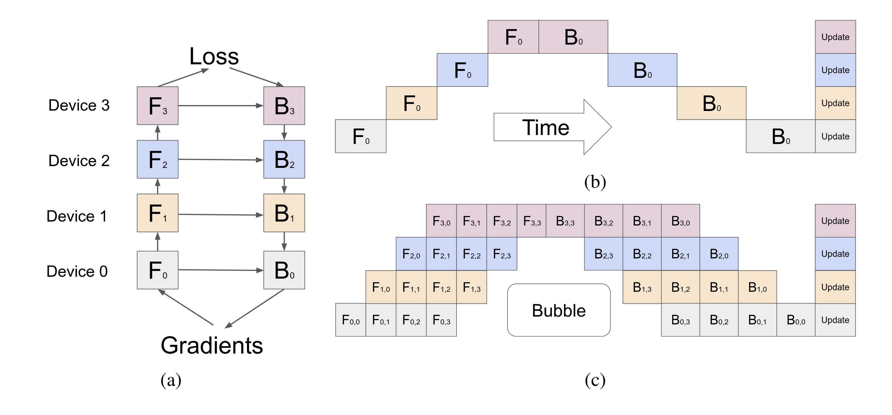
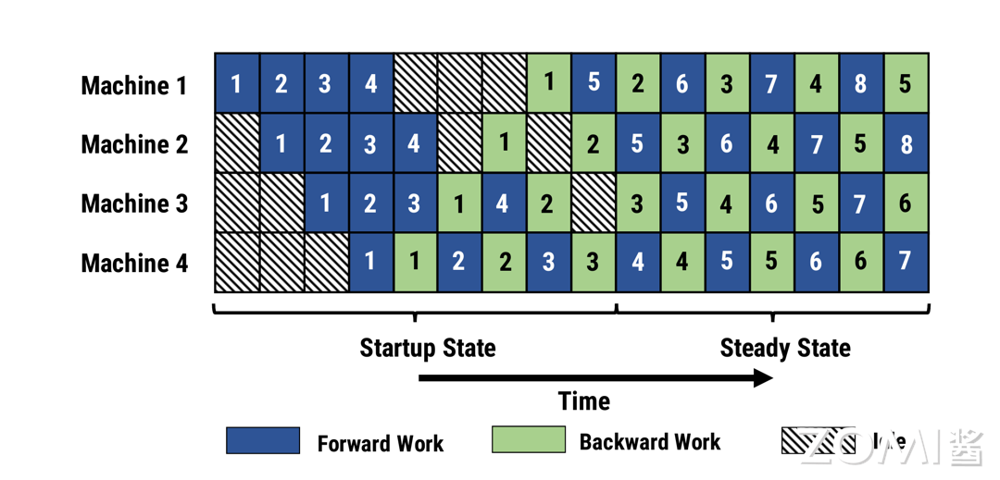
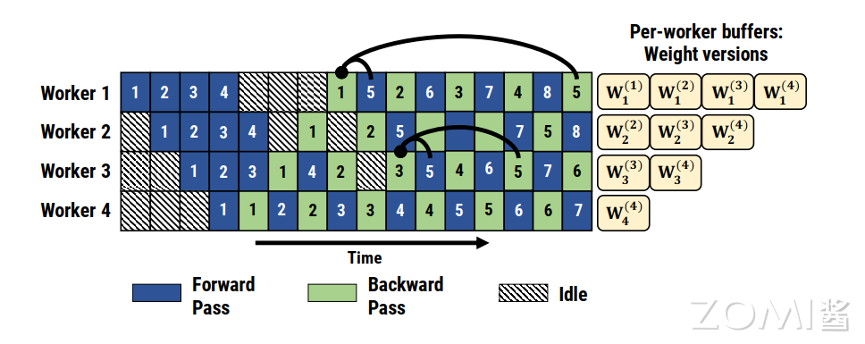
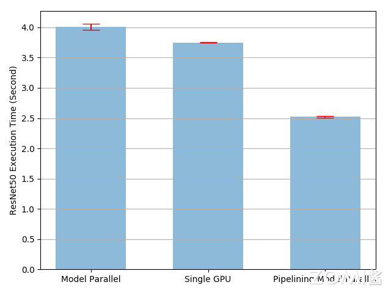

<!--适用于[License](https://github.com/chenzomi12/AISystem/blob/main/LICENSE)版权许可-->

# 流水并行(DONE)

在大模型的训练中，单个设备往往无法满足计算和存储需求，因此需要借助分布式训练技术。其中，模型并行（Model Parallelism, MP）是一种重要的方法。模型并行的基本思想是将模型的计算任务拆分到不同的设备上执行，以提高训练效率和处理更大规模的模型。模型并行主要分为朴素的模型并行、张量并行和流水线并行。下面将详细介绍模型并行中的流水并行。

## 流水线并行

流水线并行（Pipeline Parallelism，PP）是一种将模型的不同层（layer）按顺序分配到不同设备上的方法。不同于朴素的模型并行，流水线并行通过将输入数据切分成多个微批次（micro-batch），使得每个设备可以在处理完当前批次后立即处理下一个批次，从而提高设备利用率。

主要集中在 Gpipe 流水线并行和 PipeDream 流水线并行上（基于 F-then-B 策略与 1F1B 策略），不过还有很多优秀的流水线并行实现方式，例如：PipeDream-2BW、PipeDream-Flush、PipeDream-Megatron-LM 等，但他们一般都在大规模分布式深度学习训练框架中使用，如：Megatron-LM 和 Deepspeed，而不是深度学习框架，因此并不作为讨论范围。

### Gpipe 流水线并行

Gpipe 是一种用于加速神经网络模型训练的流水线并行技术。它通过将模型的计算任务分配到多个设备上，从而提高训练效率。通过流水线并行技术，前向传播和反向传播可以重叠执行，从而提高模型并行的训练速度。

在 Gpipe 中，模型被分割成多个阶段，每个阶段在不同的设备上执行。输入数据也被切分成多个微批次，每个设备同时处理不同的微批次，从而提高并行效率。此外，Gpipe 也可以使用重计算策略，在前向和反向传播过程中节省内存。



朴素模型并行设备视图（a）和时间视图（b）：在前向传播阶段，计算任务 $F_0$、$F_1$、$F_2$ 和 $F_3$ 分别在 Device 0、Device 1、Device 2 和 Device 3 上执行。这些任务依次进行，将数据从一个设备传递到下一个设备，最终在 Device 3 上完成前向传播。

在反向传播阶段，反向传播任务 $B_3$、$B_2$、$B_1$ 和 $B_0$ 依次在 Device 3、Device 2、Device 1 和 Device 0 上执行，梯度从最后一层传播回最初的层。所有设备完成反向传播后，梯度汇总并进行参数更新，将其称为 F-then-B 策略。这一过程确保了梯度能够正确传递并用于更新模型参数。

Gpipe 流水线并行（c）：由于设备间的依赖性，某些设备在等待其他设备完成任务时会产生空闲时间。在 Gpipe 流水线并行中，将前向传播和反向传播任务分成更细的粒度，如 $F_{i,j}$ 和 $B_{i,j}$（其中 $i$ 表示设备编号，$j$ 表示分段编号），称为微批量（micro-batch）。

通过这种方法，可以更好地平衡各设备的负载，减少空闲时间。然而，由于任务分段的传递顺序，某些设备在等待前一任务完成时会有空闲时间。这种空闲时间被称为“气泡”。通过优化分段和任务分配，可以最小化气泡的影响，提高整体效率。

Gpipe 流水线并行提供了多项显著优势。它可以高效地利用计算资源。通过将模型分段并分配到多个设备上，充分利用各设备的计算能力，从而提高整体计算效率。其次可以减少内存需求。由于模型被分段，每个设备只需要存储当前分段的参数和激活值。这显著降低了每个设备的内存需求，使得可以在内存较小的设备上训练大模型。在启动**激活检查点**后，通过在流水线反向传播时重新计算激活，可以进一步压缩内存需求。

### PipeDream 流水线并行

与 Gpipe 流水线并行一样，PipeDream 流水线并行也是一种用于加速神经网络模型训练的流水线并行技术。它通过将模型的计算任务分配到多个机器上，交错执行前向传播和后向传播，从而提高训练效率。

与 Gpipe 流水线并行不同的是，PipeDream 流水线并行在做完一次 micro-batch 的前向传播之后，就立即进行 micro-batch 的后向传播，然后释放资源，那么就可以让其他 stage 尽可能早的开始计算，将其称为 1F1B 策略，这也是微软 Deepspeed 框架使用的流水线并行策略。交错执行的策略，使前向传播和后向传播任务交替进行，最大化地利用了每个设备的计算资源，减少了空闲时间，提高了整体效率。

然而，这也增加了任务调度的复杂性，需要更复杂的管理机制来协调设备之间的数据传递和任务分配。同时异步的流水线也会带来收敛的困难。



PipeDream 流水线并行是异步的，每个 Worker 在执行前向传播和后向传播时，都会使用对应的权重版本。例如，Worker 1 在执行任务 1 时使用权重版本 $ W_1^{(1)} $，在执行任务 5 时使用权重版本 $ W_1^{(2)} $。

在前向传播和后向传播完成后，权重会进行异步更新。例如，Worker 1 在执行任务 5 时，会将更新后的权重版本 $ W_1^{(2)} $ 传递给 Worker 2，Worker 2 再根据新的权重版本进行计算。



此外，PipeDream 还扩展了 1F1B，对于使用数据并行的 stage，采用轮询（round-robin）的调度模式将任务分配在同一个 stage 的各个设备上，保证了一个小批次的数据的前向传播计算和后向传播计算发生在同一台机器上，这就是 1F1B-RR（one-forward-noe-backward-round-robin）。

流水线并行的主要挑战在于如何处理设备之间的数据依赖和通信延迟。在实际应用中，通常需要结合数据并行、张量并行和流水线并行等多种方法，以最大化训练效率和模型规模。例如，可以在同一设备内使用张量并行，在不同设备间使用数据并行和流水线并行，从而充分利用硬件资源，提高整体训练性能。

## Gpipe 流水并行实现

### 朴素实现

为了实现 Gpipe 的流水线并行，需要注意以下几点。首先是模型分段。将大模型分成多个子模型，每个子模型对应一个设备。子模型之间通过通信接口进行数据传递，以确保数据能够正确传输和处理。其次是任务调度。需要一个高效的调度机制来管理各设备上的任务执行顺序，确保前向传播和反向传播的顺利进行。

通过有效的任务调度，可以最大化地利用计算资源，减少设备的空闲时间。在训练过程中将数据中每 120 个图像组成的批次进一步划分为 20 图像分片，由于 PyTorch 异步启动 CUDA 操作，实现不需要生成多个线程来实现并发。

```python
class PipelineParallelResNet50(ModelParallelResNet50):
    def __init__(self, split_size=20, *args, **kwargs):
        super(PipelineParallelResNet50, self).__init__(*args, **kwargs)
        self.split_size = split_size

    def forward(self, x):
        splits = iter(x.split(self.split_size, dim=0))
        s_next = next(splits)
        s_prev = self.seq1(s_next).to('cuda:1')
        ret = []

        for s_next in splits:
            # A. ``s_prev`` runs on ``cuda:1``
            s_prev = self.seq2(s_prev)
            ret.append(self.fc(s_prev.view(s_prev.size(0), -1)))

            # B. ``s_next`` runs on ``cuda:0``, which can run concurrently with A
            s_prev = self.seq1(s_next).to('cuda:1')

        s_prev = self.seq2(s_prev)
        ret.append(self.fc(s_prev.view(s_prev.size(0), -1)))

        return torch.cat(ret)
```

需要注意的是，设备到设备的张量复制操作在源设备和目标设备上的当前流上同步。如果创建多个流，则必须确保复制操作正确同步。在复制操作完成之前写入源张量或读取/写入目标张量可能会导致未定义的行为。上述实现仅在源设备和目标设备上使用默认流，因此不需要额外的同步。



将输入流水线到模型并行 ResNet50 将训练过程加速约 `49%`。这仍然远低于理想的 100% 加速。不过仍有进一步加速训练过程的机会。例如，所有在 `cuda:0` 上的操作都放置在其默认流上。这意味着下一个分片的计算不能与 `prev` 分片的复制操作重叠。然而，由于 `prev` 和下一个分片是不同的张量，将一个的计算与另一个的复制操作重叠没有问题。

### RPC 实现

也可以使用 RPC 框架，实现流水线并行。分布式 RPC 框架提供了一套机制，用于多机模型训练，通过一系列原语实现远程通信，并提供高级 API 以自动处理跨多机的模型差异化。这个框架简化了在分布式环境中运行函数、引用远程对象以及在 RPC 边界间进行反向传播和参数更新的过程。分布式 RPC 框架主要包含以下四类 API：

1. 远程过程调用（RPC）：RPC 支持在指定目标节点上运行函数，并返回结果值或创建结果值的引用。主要有 **rpc_sync()** 同步调用、 **rpc_async()** 异步调用和 **remote()** 异步调用。

2. 远程引用（RRef）：RRef 是一个指向本地或远程对象的分布式共享指针，可以与其他节点共享，并自动处理引用计数。每个 RRef 只有一个所有者，对象仅存在于所有者节点。

3. 分布式自动梯度（Distributed Autograd）：分布式自动梯度将所有参与前向传播的节点的本地自动梯度引擎连接起来，并在反向传播时自动协调这些引擎以计算梯度。

4. 分布式优化器（Distributed Optimizer）：分布式优化器的构造函数接受一个 Optimizer 实例（例如 SGD、Adagrad 等）和一组参数 RRef，可以在每个不同的 RRef 所有者节点上创建一个 Optimizer 实例，并在运行 step() 时相应地更新参数。

下面的展示了如何使用 RPC 实现 ResNet50 模型流水线并行。首先定义两个模型碎片，并使用 RPC 将其分布到不同的设备上，每个碎片包括 ResNet50 的一部分。

```python
class ResNetShard(ResNetBase):
    def __init__(self, device, *args, **kwargs):
        super(ResNetShard, self).__init__(Bottleneck, 512, num_classes=num_classes, *args, **kwargs)
        self.device = device
        self.seq = nn.Sequential(
            self._make_layer(256, 6, stride=2),
            self._make_layer(512, 3, stride=2),
            nn.AdaptiveAvgPool2d((1, 1))
        ).to(self.device)
        self.fc = nn.Linear(512 * self._block.expansion, num_classes).to(self.device)

    def forward(self, x_rref):
        x = x_rref.to_here().to(self.device)
        with self._lock:
            out = self.fc(torch.flatten(self.seq(x), 1))
        return out.cpu()
```

使用 DistResNet50 将两个模型碎片组装在一起并实现了流水线并行逻辑。在构造函数中，两个分片分别放在两个不同的 RPC Worker 上，并保留两个模型部分的 RRef。前向函数将输入批次分割成多个微批次，以流水线方式处理这些微批次，并将结果合并为一个输出张量返回。

```python
class DistResNet50(nn.Module):
    def __init__(self, num_split, workers, *args, **kwargs):
        super(DistResNet50, self).__init__()
        self.num_split = num_split
        self.p1_rref = rpc.remote(workers[0], ResNetShard1, args=("cuda:0",) + args, kwargs=kwargs)
        self.p2_rref = rpc.remote(workers[1], ResNetShard2, args=("cuda:1",) + args, kwargs=kwargs)

    def forward(self, xs):
        out_futures = []
        for x in iter(xs.split(self.num_split, dim=0)):
            x_rref = RRef(x)
            y_rref = self.p1_rref.remote().forward(x_rref)
            z_fut = self.p2_rref.rpc_async().forward(y_rref)
            out_futures.append(z_fut)
        return torch.cat(torch.futures.wait_all(out_futures))

    def parameter_rrefs(self):
        remote_params = []
        remote_params.extend(self.p1_rref.remote().parameter_rrefs().to_here())
        remote_params.extend(self.p2_rref.remote().parameter_rrefs().to_here())
        return remote_params
```

准备随机输入和标签，并控制分布式后向传递和优化步骤。DistResNet50 模块的实例化指定每个批次的微批次数量，并提供两个 RPC Worker。主训练循环使用 dist_autograd 启动后向传递，并在优化步骤中提供 context_id。

```python
import os
import torch.multiprocessing as mp
import torch.distributed.autograd as dist_autograd
import torch.optim as optim
from torch.distributed.optim import DistributedOptimizer

def run_master(num_split):
    model = DistResNet50(num_split, ["worker1", "worker2"])
    loss_fn = nn.MSELoss()
    opt = DistributedOptimizer(optim.SGD, model.parameter_rrefs(), lr=0.05)
    
    for i in range(num_batches):
        print(f"Processing batch {i}")
        inputs = torch.randn(batch_size, 3, image_w, image_h)
        labels = torch.zeros(batch_size, num_classes).scatter_(1, one_hot_indices, 1)
        with dist_autograd.context() as context_id:
            outputs = model(inputs)
            dist_autograd.backward(context_id, [loss_fn(outputs, labels)])
            opt.step(context_id)

def run_worker(rank, world_size, num_split):
    os.environ['MASTER_ADDR'] = 'localhost'
    os.environ['MASTER_PORT'] = '29500'
    options = rpc.TensorPipeRpcBackendOptions(num_worker_threads=128)
    rpc.init_rpc("master" if rank == 0 else f"worker{rank}", rank=rank, world_size=world_size, rpc_backend_options=options)
    if rank == 0:
        run_master(num_split)
    rpc.shutdown()

if __name__ == "__main__":
    world_size = 3
    for num_split in [1, 2, 4, 8]:
        tik = time.time()
        mp.spawn(run_worker, args=(world_size, num_split), nprocs=world_size, join=True)
        tok = time.time()
        print(f"number of splits = {num_split}, execution time = {tok - tik}")
```

接下来定义所有进程的目标函数。主进程运行主逻辑，Worker 进程被动等待主进程命令。

### Pipe 实现

同样，可以使用 Pytorch 提供的 `torch.distributed.pipeline.sync` 的 `Pipe` 类来简单快捷的实现，Pipe 依赖于 RPC 来管理不同设备之间的通信。来看一个简单的示例：首先初始化 RPC（Remote Procedure Call）框架。初始化 RPC 框架时，设置了主节点的地址和端口，并调用 `torch.distributed.rpc.init_rpc` 函数来启动 RPC。

```python
from torch.distributed.pipeline.sync import Pipe

# Need to initialize RPC framework first.
os.environ['MASTER_ADDR'] = 'localhost'
os.environ['MASTER_PORT'] = '29500'
torch.distributed.rpc.init_rpc('worker', rank=0, world_size=1)
# Build pipe.
fc1 = nn.Linear(16, 8).cuda(0)
fc2 = nn.Linear(8, 4).cuda(1)
model = nn.Sequential(fc1, fc2)
model = Pipe(model, chunks=8)
input = torch.rand(16, 16).cuda(0)
output_rref = model(input)
```

接下来，构建一个简单的神经网络模型，并将其分布到不同的 GPU 上。在这个示例中，模型包含两个全连接层（fully connected layers）。第一个全连接层 `fc1` 被分配到 GPU 0 上，而第二个全连接层 `fc2` 被分配到 GPU 1 上。使用 Pipe 模块将模型并行化。`Pipe` 接受一个模型和 `chunks` 参数，其中 `chunks` 表示将输入数据分成多少块进行并行处理。在这里，将输入数据分成了 8 个块。

最后，创建一个随机输入张量，并将其分配到 GPU 0 上。调用 `model` 的前向函数时，Pipe 会自动处理不同设备之间的通信，并将输入数据通过模型的各个层进行计算。输出结果是一个 `RRef`（Remote Reference），指向计算结果所在的设备。

## 小结与思考

- 流水线并行（Pipeline Parallelism, PP）通过将模型的不同层顺序分配到不同设备上，并切分输入数据为多个微批次，以提高设备利用率和训练效率。

- Gpipe 和 PipeDream 是流水线并行的两种实现方式，Gpipe 通过分段和任务调度最小化设备空闲时间，而 PipeDream 采用 1F1B 策略异步更新权重，两者都旨在提升模型训练速度。

- PyTorch 提供了使用 RPC 和 Pipe 的流水线并行简单实现方法，通过分布式环境和自动化的通信处理，简化了模型并行化的实现过程，使得大模型训练更加高效。

## 本节视频

<html>
<iframe src="https://player.bilibili.com/player.html?isOutside=true&aid=732352702&bvid=BV1WD4y1t7Ba&cid=925111182&p=1&as_wide=1&high_quality=1&danmaku=0&t=30&autoplay=0" width="100%" height="500" scrolling="no" border="0" frameborder="no" framespacing="0" allowfullscreen="true"> </iframe>
</html>
