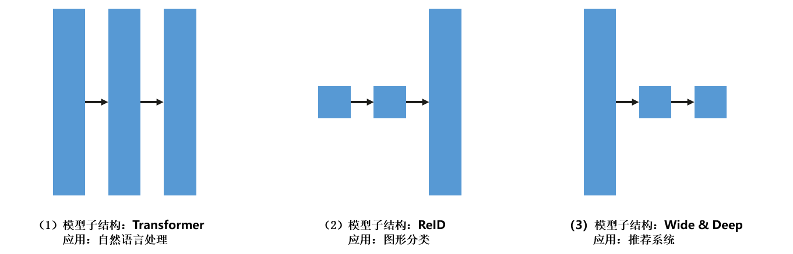
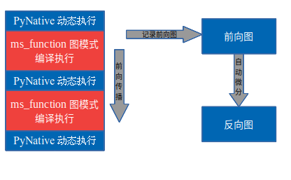
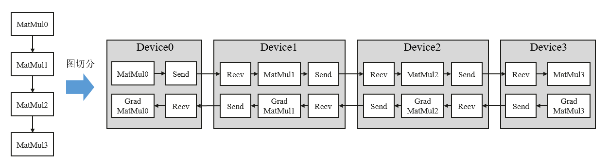
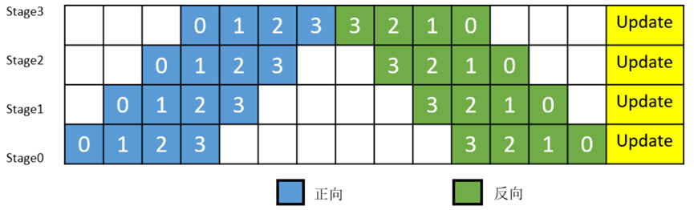
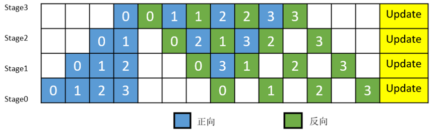
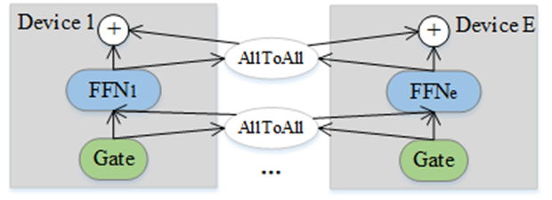
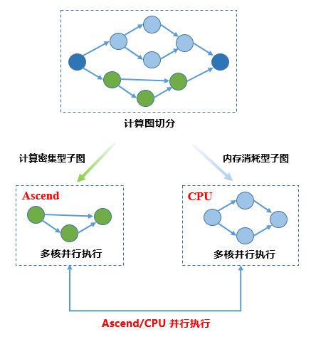

# 昇思MindSpore并行

本节将会介绍昇思MindSpore的并行训练技术，以及如何通过张量重排布和自动微分简化并行策略搜索，实现高效大模型训练。

## 大模型的带来

随着深度学习的发展，为了实现更高的准确率和更丰富的应用场景，训练数据集和神经网络模型的规模日益增大。特别是自然语言处理（Natural Language Processing，NLP）领域，数据集的范围从200MB到541TB不等。模型的尺寸也从BERT的3.4亿个参数，Transformer-xl的8亿个参数，GPT-2的150亿个参数，到SwitchTransformer的万亿参数，单独存储万亿模型的参数则需要占用TB级别空间。

主流的用于训练的加速器（GPU、TPU和Ascend）的内存仍然只有几十GB，因此，为了能够且高效地完成大模型训练，深度学习框架需要提供丰富的并行训练的能力，支持数据并行、模型并行、混合并行、流水线并行、异构训练和专家并行等技术。

### AI 框架的局限性

当前的主流框架（如TensorFlow、Caffe和MXNet）提供了一些基本的并行技术，其中大多数框架提供了算子级别切分、流水线并行或者优化器切分的功能，支持的并行维度和功能的完整度欠佳。

- 第一，这些框架通过手动的切分来切分神经网络模型来实现模型并行，配置难度非常大，对开发者的要求非常高，需要有丰富经验的专家来操作。实现混合并行（数据并行和模型并行同时进行）又极大增加了开发的复杂度。最近的研究成果提出了简化混合并行的方法，但这些方法在几个方面都存在局限性。

- 第二，随着目前模型规模拓展到了万亿级别，训练卡数的规模也上升到了千级，以往的算子级别切分的并行不能满足目前大模型的需求。在大集群训练中，由于模型切分导致的通信占比在整个迭代耗时中升高，需要引入流水线并行等计算来降低通信占比，提升模型训练效率。另外，混合专家（MoE）技术能够在提升模型规模的同时，较少的提升计算量，是目前的一种主流技术。

### MindSpore 大模型并行

昇思MindSpore的目标是提供完整的大模型训练落地流程。为了解决前后设备张量排布不一致的问题，在并行化策略搜索中引入了张量重排布（Tensor Redistribution，TR），这使输出张量的设备布局在输入到后续算子之前能够被转换。

但是，对于复杂大型模型的搜索并行策略，在考虑张量重排布时，需要克服的挑战主要有两个。首先，既然张量重排布将通信算子（例如AllGather）引入数据流图，那么如何像普通算子一样自动地对通信算子求导呢？对于每个相应的前向算子，都需要获取反向算子，用来更新可训练参数。目前的框架需要专家在反向阶段手动添加SEND和RECV源语来传递梯度，这对模型开发者来说是一项具有挑战性的工作，尤其是在模型比较复杂的情况下。

其次，随着张量重排布对策略空间的极大扩展，如何为复杂的大型模型高效地找到一个好的策略？在功能和效率方面，该算法需要为具有非线性结构的大模型快速找到一种策略。在性能方面，算法返回的策略应该会缩短端到端的训练时间。需要对运行成本进行仔细建模，这一过程也增加了人工成本。最后，如何解决万亿模型训练的实际问题，最大化的利用硬件算力，同时降低训练成本？

## MindSpore 并行策略

昇思MindSpore针对上述三个挑战，推出了完整的大模型训练解决方案。作为一种通用的技术方案，能够以较高效率实现万亿模型的训练。

第一，为了实现通信算子的自动微分，昇思MindSpore定义了通信算子的反向算子。例如，AllGather的反向算子为ReduceScatter。定义这些反向算子十分重要，因为Auto-diff过程可以一次性地区分整个前向图，而无须跳过任何算子，这也是为什么Auto-diff是Auto-parallel后面一步的原因。

针对第二个挑战，在同时考虑计算和通信开销的情况下，建立一个代价模型来选择一个好策略。为了快速地为复杂大图找到一个好策略，提出了几种方法：一种是支持多图操作的算法，将原始图转换成线性图；一种是策略分离机制，在保证返回解的精度的同时，有效地缩小搜索空间。例如，ResNet50在8台设备上搜索并行策略的时间在1s内，而返回的解决方案确实缩短了训练时间。例如，当模型较大（类的数量超过128K）时，返回的解决方案与原始数据并行策略相比减少了大约55%的训练时间。

第三，昇思MindSpore内置了多种并行技术，以易用的接口提供了混合并行、流水线并行、异构训练和优化器并行等技术，结合这些技术就可以较高的训练效率实现大模型训练。

```python
class Submodel(nn.Cell):

    def __init__(self, shape):
        super().__init__()
        self.bn = BatchNorm().shard(((4, 1), ))
        self.matmul = MatMul().shard(((1, 1), (1, 4)))
        self.W = Parameter(Tensor(shape), require_grad=True)

    def construct(self, X):
        Y = self.bn(X)
        Z = self.matmul(Y, self.W)
        return Z
```

### 算子级别并行

昇思MindSpore支持开发者指定的高级策略配置，称之为半自动并行（semi-auto-parallel）。在以上代码和图示中，展示了一个从数据到模型的并行转换的例子。该子模型的结构为BatchNorm算子后跟一个MatMul算子，广泛应用于ResNet、ReID等分类任务。在BatchNorm算子中，X按行拆分为四部分，数据可以并行，效率非常高。

在MatMul算子中，可学习参数的权重W被分成四部分，模型可以并行，由于参数数量较多，这部分的模型并行更有效。由于BatchNorm的输出布局与MatMul的输入布局不同，所以框架插入了一个张量重排布（该例中为AllGather和ConCat），这一过程对开发者是透明的。

开发者也不必关注哪个设备运行了模型的哪个部分，框架会自动安排。然而，不同的模型结构在每个算子中具有不同大小的参数，如下图三种广泛使用的子结构所示，并且它们使用于不同的切分策略。在下图 三种广泛使用的子结构 (3)中，将第一算子配置为模型并行，将后续算子配置为数据并行，也需要插入张量重排布，这样可以获得更好的性能。

在训练新模型时，多次配置shard，耗时耗力。在这种情况下，如果配置了自动并行，则不需要调用shard方法，该算法将找到一个有效的策略。例如，当ResNet中的分类数量超过130K时，算法返回的策略导致在50ms内训练一个迭代。相比之下，原始数据并行训练一次迭代超过111ms。



### 函数式算子切分

动态图支持语法更丰富，使用更为灵活，但是目前昇思MindSpore的动态图模式不支持自动并行的各种特性。借鉴Jax的pmap的设计理念，昇思MindSpore设计了函数式算子切分功能，支持在动态图模式下，指定某一部分在图模式下以算子级并行的方式执行。

昇思MindSpore的动态图模式下，可以通过@jit的装饰符，指定某一段以图模式编译执行，在前向执行的同时，会将执行的算子、子图记录下来，前向执行完毕后，会对得到的整图进行自动微分得到反向图，具体流程如下图所示：



函数式算子切分沿用此模式，不同的是可以指定某一段在图模式的编译执行环节进行算子级模型并行。算子级并行是通过将网络模型中每个算子涉及到的张量进行切分，降低单个设备的内存消耗。

### 流水线并行

流水线（Pipeline）并行是将神经网络中的算子切分成多个阶段（Stage），再把阶段映射到不同的设备上，使得不同设备去计算神经网络的不同部分。流水线并行适用于模型是线性的图结构。能够降低模型训练过程中的通信量，极大的提升集群的训练性能。



如图所示，将4层MatMul的网络切分成4个阶段，分布到4台设备上。正向计算时，每台机器在算完本台机器上的MatMul之后将结果通过通信算子发送（Send）给下一台机器，同时，下一台机器通过通信算子接收（Receive）上一台机器的MatMul结果，同时开始计算本台机器上的MatMul；反向计算时，最后一台机器的梯度算完之后，将结果发送给上一台机器，同时，上一台机器接收最后一台机器的梯度结果，并开始计算本台机器的反向。

简单地将模型切分到多设备上并不会带来性能的提升，因为模型的线性结构到时同一时刻只有一台设备在工作，而其它设备在等待，造成了资源的浪费。为了提升效率，流水线并行进一步将小批次（mini-batch）切分成更细粒度的微批次（micro-batch），在微批次中采用流水线式的执行序，从而达到提升效率的目的，如下图所示。将小批次切分成4个微批次，4个微批次在4个组上执行形成流水线。微批次的梯度汇聚后用来更新参数，其中每台设备只存有并更新对应组的参数。其中白色序号代表微批次的索引。



昇思MindSpore支持流水线并行，并对执行序进行了调整，来达到更优的内存管理。如下图所示，在第0 MicroBatch的正向执行完后立即执行其反向，这样做使得第0 MicroBatch的中间结果的内存得以更早地（相较于上图）释放，进而确保内存使用的峰值比上图的方式更低。



### MoE并行

混合专家（MoE）能够在引入较少的计算量同时扩充模型参数量，在模型中，每一个MoE层都包含多个独立的FFN，并且包含一个路由装置用于将每个输入数据分配到FFN。传统的数据并行和模型并行在处理MoE这种结构时，其存储和通信的效率都较为低下。一种高效的实现方式是，将Gate函数的计算并行化，同时将多个FFN分配到每台设备上（通常是均匀的分配），每台设备得到一个或多个FFN。每台设备的负责的参数量有效地下降了。

若训练数据经过Gate计算后路由到本台设备负责的FFN，那么其直接传递给本台设备的FFN。如果路由到其他设备的FFN，那么会经过AllToAll通信，将训练数据发送到目的设备；同样地，在经过FFN计算后，数据需再次经过AllToAll通信，把相应的结果路由回原设备。下图中展示了每个设备只有一个FFN的并行执行情况。

当每条训练数据仅会路由到较少FFN时，这种并行方式会非常有效，因为大大降低了内存使用，同时产生的通信量是较小的。



### 异构并行训练

异构并行训练方法通过将占用内存较大的参数存储于Host内存，解决单卡上无法存储完整模型的问题。通过分析图上算子内存占用和计算密集度，将内存消耗巨大或适合CPU逻辑处理的算子切分到CPU子图，将内存消耗较小计算密集型算子切分到硬件加速器子图，框架协同不同子图进行网络训练，使得处于不同硬件且无依赖关系的子图能够并行进行执行的过程。目前昇思MindSpore最多可以支持单机8卡训练和推理千亿模型，极大的降低训练卡所需的资源。



## 小结与思考

- 昇思MindSpore引入张量重排布（Tensor Redistribution）技术，自动解决设备间张量布局不一致问题，简化并行策略搜索，并支持混合并行、流水线并行等高级并行技术。

- 该框架通过自动微分技术，定义了通信算子的反向算子，如AllGather的反向算子ReduceScatter，实现通信算子的自动微分，从而简化并行训练过程。

- 昇思MindSpore支持算子级别并行和半自动并行配置，允许开发者通过高级策略配置实现数据并行和模型并行，同时自动插入必要的张量重排布操作，提高并行效率。

- 针对大模型训练，昇思MindSpore提供了如MoE并行、异构并行训练等解决方案，优化存储和通信效率，实现单机多卡训练千亿级参数模型的能力。
