# 通信原语

众所周知，当将神经网络的训练并行化到集群中不同的节点时，必须选择如何将不同的计算操作分配到集群中可用的节点，再如何同步各节点计算结果数据，这些都离不开对分布式集群的通信进行操作。本文主要介绍通信原语操作相关原理。

## 介绍

在分布式训练时，当网络模型的参数量越来越大，单台服务器已经放不下整个模型，我们需要将计算图进行跨节点或者跨卡的切分，如下图所示，将一个整个计算图切分并放到不同的服务器中。

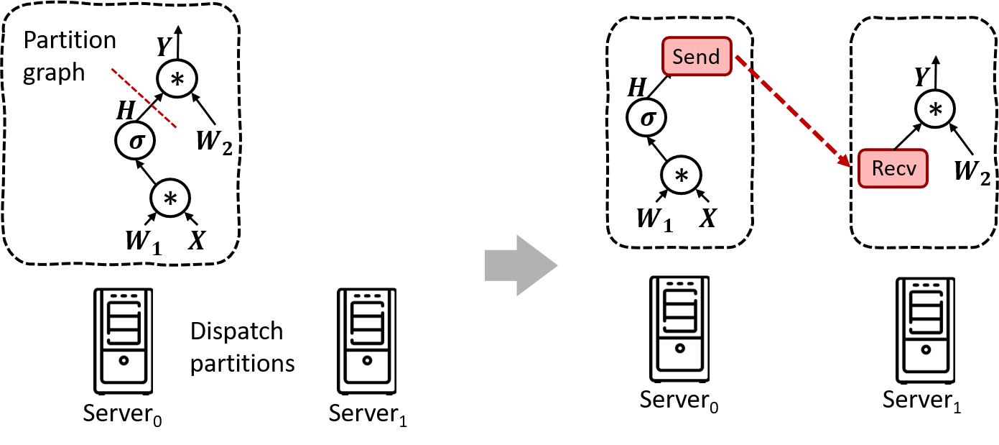

现在的大模型参数已经达到百亿或者千亿级别，当我们进行分布式训练时，需要将模型切分到非常多的服务器中，进行张量并行、数据并行、流水线并行等操作。比如我们现在将一个大网络模型切分成5个小网络模型并放置在5个不同的服务器中，不管是选用哪些并行方式，每个小的模型之间是有相互依赖的，这样就需要进行跨卡、跨节点、跨网络对通信交换数据，进行同步。

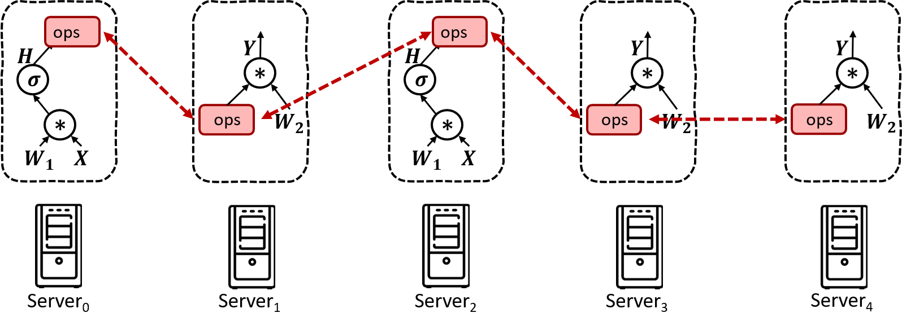

那么在实际分布式训练过程中怎么进行数据同步呢？这里是一个利用pytorch框架训练网络模型的例子，run函数中定义了一个网络模型和优化器，训练一共迭代十次，每次在对梯度进行聚合的时候，都需要调用average_gradients函数。

```python
""" Distributed Synchronous SGD Example """
def run(rank, size):
    torch.manual_seed(1234)
    train_set, bsz = partition_dataset()
    model = Net()
    optimizer = optim.SGD(model.parameters(),
    					  lr=0.01, momentum=0.5)

    num_batches = ceil(len(train_set.dataset) / float(bsz))
    for epoch in range(10):
        epoch_loss = 0.0
        for data, target in train_set:
            optimizer.zero_grad()
            output = model(data)
            loss = F.nll_loss(output, target)
            epoch_loss += loss.item()
            loss.backward()
			average_gradients(model)
            optimizer.step()
    	print('Rank ', dist.get_rank(), ', epoch ',
    		 epoch, ': ', epoch_loss / num_batches)
```

在average_gradients函数中，每次都需要all_reduce 操作，进行梯度聚合，跨卡或跨机同步数据，而这个all_reduce操作就是我们本章要介绍的通信原语操作之一。

```python
""" Gradient averaging. """
def average_gradients(model):
    size = float(dist.get_world_size())
    for param in model.parameters():
        dist.all_reduce(param.grad.data, op=dist.reduce_op.SUM)
        param.grad.data /= size
```

## 通信原语操作

集合通讯中包含多个sender和多个receiver，这些sender和receiver需要遵从一些通信原语算法进行数据传输，一般的通信原语包括broadcast、gather、all-gather、scatter、reduce、all-reduce、reduce-scatter、all-to-all等通信操作。下面将会分别介绍其具体含义。

### Broadcast

在集合通信中，如果某个节点想把自身的数据发送到集群中的其他节点，那么就可以使用广播Broadcast的操作。如图所示，圆圈表示分布式系统中的独立节点，一共4个节点，小方块则代表了数据，颜色相同表示数据一样。Broadcast代表广播行为，执行Broadcast时，数据从主节点0广播至其他各个指定的节点（0~3）。


Broadcast操作是将某节点的输入广播到其他节点上，分布式机器学习中常用于**网络参数的初始化**。如图中，从单个sender数据发送到其他节点上，将0卡大小为1xN的Tensor进行广播，最终每张卡输出均为[1xN]的矩阵

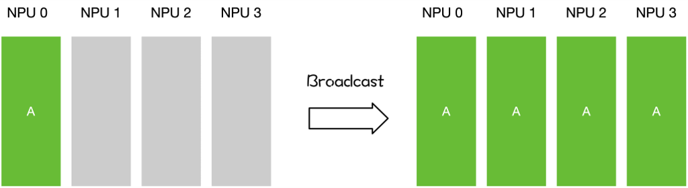

### Scatter

Scatter操作表示一种散播行为，将主节点的数据进行划分并散布至其他指定的节点。

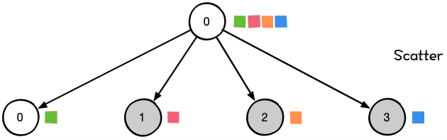

实际上，Scatter与Broadcast非常相似，都是一对多的通信方式，不同的是Broadcast的0号节点将相同的信息发送给所有的节点，而Scatter则是将数据的不同部分，按需发送给所有的节点。

如图所示，从单个sender数据发送到其他节点上。

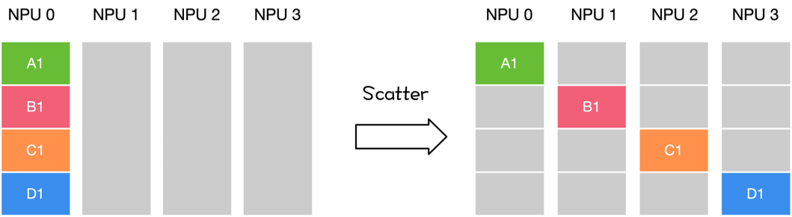

### Reduce

Reduce称为规约运算，是一系列简单运算操作的统称，细分可以包括：SUM、MIN、MAX、PROD、LOR等类型的规约操作。Reduce意为减少/精简，因为其操作在每个节点上获取一个输入元素数组，通过执行操作后，将得到精简的更少的元素。下面以Reduce sum为例子。

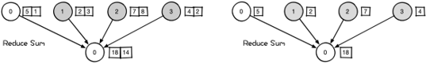

在NCCL中的Reduce，从多个sender那里接收数据，最终combine到一个节点上。

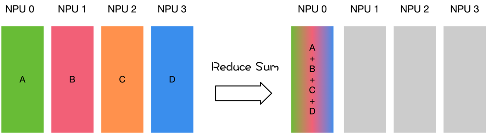

### Gather

Gather操作将多个sender上的数据收集到单个节点上，Gather可以理解为反向的Scatter。

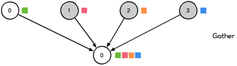

Gather操作会从多个节点里面收集数据到一个节点上面，而不是从一个节点分发数据到多个节点。这个机制对很多平行算法很有用，比如并行的排序和搜索。

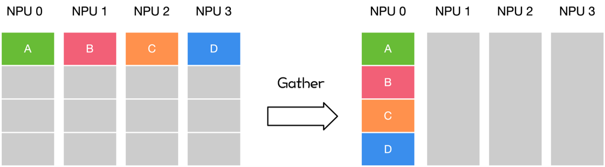

### All Reduce

Reduce是一系列简单运算操作的统称，All Reduce则是在所有的节点上都应用同样的Reduce操作。以All Reduce Sum为例。

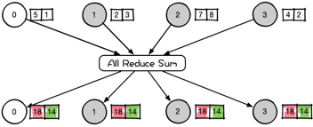

All Reduce操作可通过单节点上Reduce + Broadcast或者是Reduce-Scatter + All-Gather操作完成。在NCCL中的All Reduce中，实现了Ring和Double tree算法，每个节点都会从其他节点接收数据，最终合并和分发到每一个节点上。如下图，有四个NPU,每个NPU有自己的数据ABCD，经过All reduce sum 操作之后，每个NPU上都有A+B+C+D的总和值。

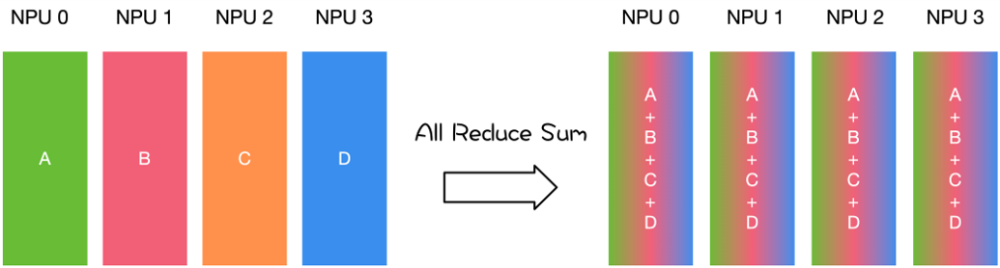

下面我们将All Reduce操作进行分解，如下图所示，All Reduce操作通过Reduce-Scatter + All-Gather 操作完成。

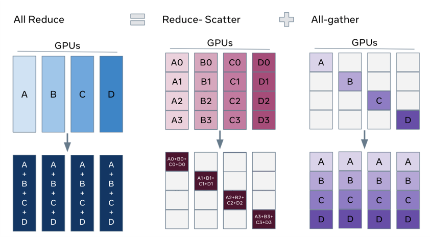

### All Gather

很多时候发送多个元素到多个节点也很有用，即在多对多通信模式的场景。这个时候就需要 All Gather操作。

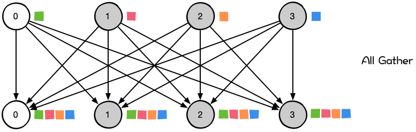

对于分发在所有节点上的一组数据来说，All Gather会收集所有数据到所有节点上。从最基础的角度来看，All Gather相当于一个Gather操作之后跟着一个Broadcast操作。下面的示意图显示了All Gather调用之后数据是如何分布的。

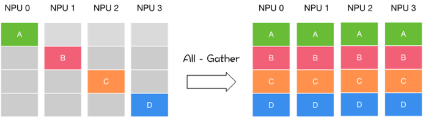

### Reduce Scatter

Reduce Scatter操作会将个节点的输入先进行求和，然后在第0维度按卡数切分，将数据分发到对应的卡上。

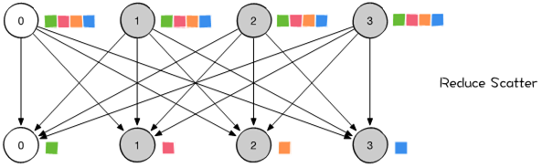

如下图，比如NPU0先将其他其他NPU的值reduce过来求和，之后再进行scatter操作，分发到对应的卡。

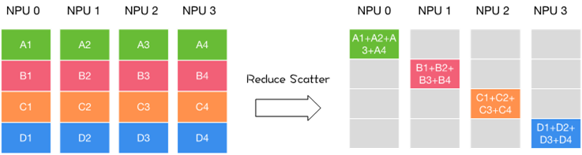

### All to All

All to All作为全交换操作，通过All to All通信，可以让每个节点都获取其他节点的值。在使用 All to All 时，每一个节点都会向任意一个节点发送消息，每一个节点也都会接收到任意一个节点的消息。每个节点的接收缓冲区和发送缓冲区都是一个分为若干个数据块的数组。All to All 的具体操作是：将节点i的发送缓冲区中的第j块数据发送给节点j，节点j将接收到的来自节点i的数据块放在自身接收缓冲区的第i块位置。

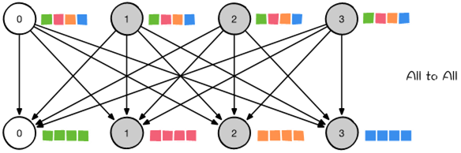

All to All 与 All Gather 相比较，区别在于：All Gather 操作中，不同节点向某一节点收集到的数据是完全相同的，而在 All to All 中，不同的节点向某一节点收集到的数据是不同的。在每个节点的发送缓冲区中，为每个节点都单独准备了一块数据。

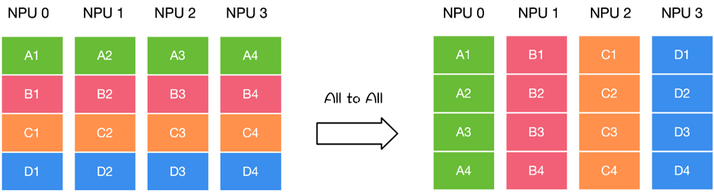

## 总结

本文主要介绍了各种通信原语的规则，主要包含一对多(Scatter/Broadcast)，多对一(Gather/Reduce)和多对多(All-gather、All-reduce、AlltoAll)三种方式，其中多对多方式可以由一对多和多对一的方式组合。这些原语在分布式训练时是非常重要的，在训练时，选择何时进行集合通信，选择哪种通信原语，都关乎到整个分布式训练系统的性能。

[本节视频](https://www.bilibili.com/video/BV1te4y1e7vz/)


