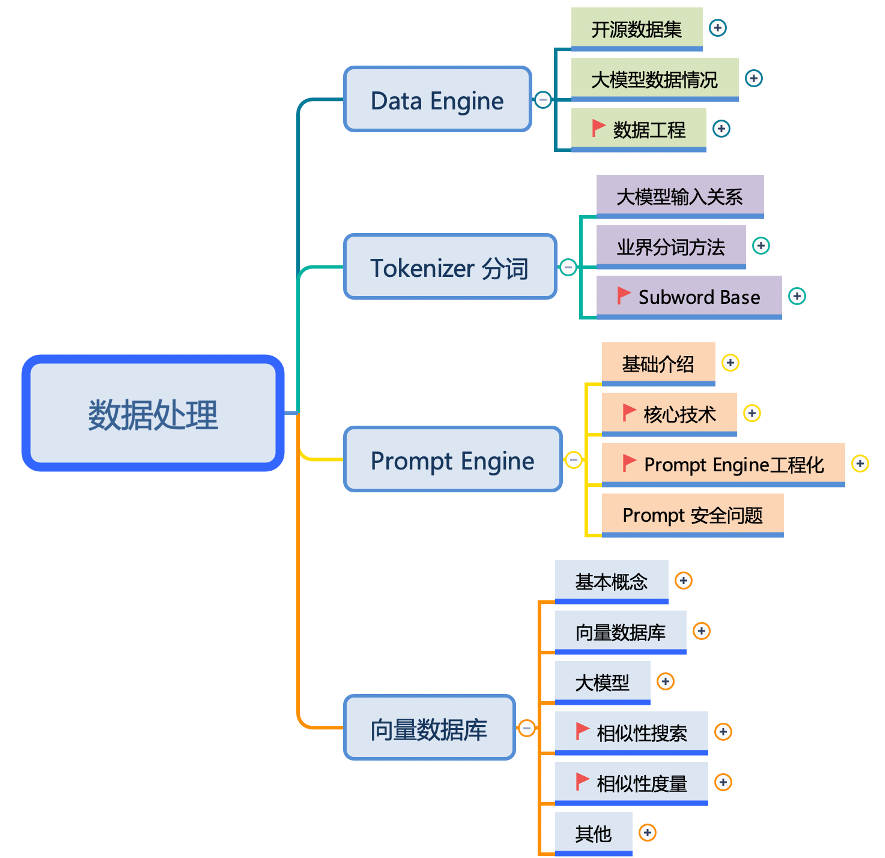

<!--Copyright © ZOMI 适用于[License](https://github.com/chenzomi12/DeepLearningSystem)版权许可-->

# 数据工程 Data Engine

《数据工程 Data Engine》最近 LLM 大模型开源社区研究热点开始从 Model Engineering 转移到 Data Engineering，越来越多人开始意识到数据质量、向量数据库、开源数据集、Prompt 等数据相关对大模型的重要性。

不过相对模型层面的研究 Data Engineering 其理论还不太成熟，例如：好数据的准确定义是什么？如何优化数据的结构组成？数据的优化目标是什么？对训练模型的影响是什么？因此对 Data Engineering 进行理论分析和研究可以帮助大模型更好地训练和学习。

## 内容大纲

> `PPT`和`字幕`需要到 [Github](https://github.com/chenzomi12/DeepLearningSystem) 下载，网页课程版链接会失效哦~
>
> 建议优先下载 PDF 版本，PPT 版本会因为字体缺失等原因导致版本很丑哦~

| 大纲 | 小节 | 链接|
|:--:|:--:|:--:|
| 向量数据库 | 01 大模型遇到 AI Agent | [slide](./01Introduction.pdf), [video](https://www.bilibili.com/video/BV11w411p7dW/) |
| 向量数据库 | 02 AI Agent 具体组成 | [slide](./02Component.pdf), [video](https://www.bilibili.com/video/BV11u4y1P73P/) |

## 备注

文字课程内容正在一节节补充更新，每晚会抽空继续更新正在 [AISys](https://chenzomi12.github.io/) ，希望您多多鼓励和参与进来！！！

文字课程开源在 [AISys](https://chenzomi12.github.io/)，系列视频托管[B 站](https://space.bilibili.com/517221395)和[油管](https://www.youtube.com/@ZOMI666/videos)，PPT 开源在[github](https://github.com/chenzomi12/DeepLearningSystem)，欢迎取用！！！

> 非常希望您也参与到这个开源项目中，B 站给 ZOMI 留言哦！
>
> 欢迎大家使用的过程中发现 bug 或者勘误直接提交代码 PR 到开源社区哦！
>
> 希望这个系列能够给大家、朋友们带来一些些帮助，也希望自己能够继续坚持完成所有内容哈！
