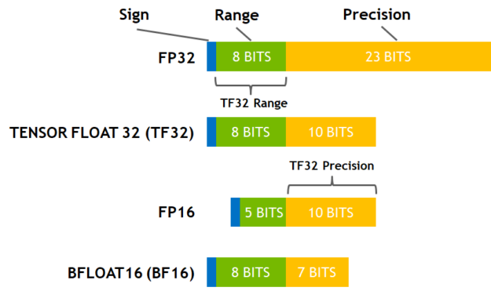
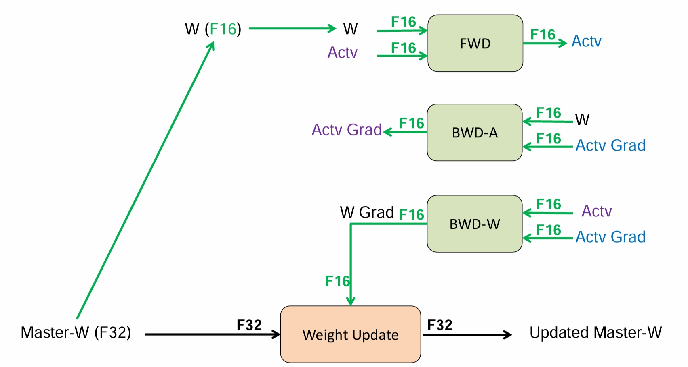

# 单设备高效训练

在学习分布式训练之前，我们需要了解一些单个设备高效训练的实用技术：**混精度训练**、**梯度检查点**，**特殊的优化器和架构**等等，他们可以通过优化内存利用率、加快训练速度或两者兼而有之来提高模型训练的效率。在拥有多块设备的机器上，这些方法仍然有效，此外，也可以结合分布式训练部分概述的其他方法对训练过程进行优化。

## 混精度训练

在当今大模型训练的背景下，混合精度训练已然成为一种备受推崇的普遍做法 [<sup>[1]</sup>](#ref1)。通过采用混合精度训练，我们能够将训练速度显著提升数倍，而又不会对模型的整体性能产生重大影响。在数据科学领域，精度一直是评判的重要考量因素——在传统的科学计算领域，人们通常追求较高的精度，如 FP128 或 FP64 等。然而，在深度学习中，我们所面临的实际上是一个高维函数拟合（或近似）的优化问题，因此并不需要过于精确的数值表示，且使用低精度将会带来显著的计算速度提升：在英伟达 A00 SXM 与英伟达 H00 SXM 中，FP16 浮点运算能力的理论峰值是 FP32 的近 30 倍。

<center>

| GPU 型号         | NVIDIA H100 SXM 80GB  | NVIDIA A100 SXM 80GB |
| - | -- | -- |
| FP32             | 67 TFLOPS            | 19.5 TFLOPS          |
| TF32 Tensor Core | 989 TFLOPS           | 312 TFLOPS           |
| FP16 Tensor Core | 1,979 TFLOPS         | 624 TFLOPS           |

</center>

### 常用精度

在深度学习中，常用的精度 [<sup>[2]</sup>](#ref2)包括 **FP32**、**FP16**、**BF16** 和 **TF32**。


**FP32**：这种格式在很长一段时间内都是深度学习的主力，它是 IEEE 754 标准下的单精度浮点数。长期以来，它一直是神经网络计算的标准类型。长期以来，神经网络中的权重、激活和其他值都默认用 FP32 表示。

**FP16**：同样是 IEEE 754 标准下的半精度浮点格式。随着深度学习的发展，FP16 逐渐取代了 FP32 的地位。因为相较于 FP32，更低的精度并不会对神经网络的性能产生重大影响。额外的精度不会带来任何好处，反而会更慢、占用更多内存并降低通信速度。FP16 通常用于混合精度训练（TensorFlow/PyTorch）。也用于训练后量化，以加快推理速度（TensorFlow Lite）。其他用于量化的格式还有整数 INT8（8 位整数）、INT4（4 位）甚至 INT1（二进制值）。

**BF16**：谷歌最初开发的另一种 16 位格式被称为 "Brain Floating Point Format"，简称 "bfloat16"。这个名字源于 "谷歌大脑"（谷歌 Brain），谷歌大脑是谷歌的一个人工智能研究小组，这种格式就是在这个小组构思出来的。最开始是被使用在谷歌芯片 TPU 中，后被广泛使用在 GPU 中。由于具有更多的指数位，常被用于处理 FP16 的溢出问题。



**TF32**：英伟达在 Ampere GPU 后引入的新数学模式，这是一种十分特殊的格式（无需显示设置，而是自动执行），它将 FP32 数据截断为 TF32 进行计算，然后再转换回 FP32。这一创新的最大优势在于编译器只需在最底层（即 CUDA 编译器内部）提供支持。其他代码部分则可以继续使用动态范围相同但精度较高的 FP32，无需进行修改。TF32 的快速插入性使得利用 Tensor Core 的速度成为可能，而无需过多修改现有代码。

```python
# The flag below controls whether to allow TF32 on matmul. This flag defaults to False
# in PyTorch 1.12 and later.
torch.backends.cuda.matmul.allow_tf32 = True

# The flag below controls whether to allow TF32 on cuDNN. This flag defaults to True.
torch.backends.cudnn.allow_tf32 = True
```

TF32 采用与 FP16 相同的 10 位尾数，这满足了人工智能工作负载的精度要求，并且使用了与 FP32 相同的 8 位指数，因此具有相同的数值范围。从技术上讲，它可以视为一种 19 位格式，也可以视为扩展精度的 BF16。TF32 的优势在于其格式与 FP32 相同。当使用 TF32 进行计算时，输入 FP32 操作数的尾数从 23 位舍入到 10 位，然后进行精确乘法运算，最后以正常的 FP32 格式进行累加。TF32 Tensor Core 在 FP32 输入上运行并生成 FP32 结果，而不需要修改代码，而非矩阵操作则继续使用 FP32。相比之下，FP16 和 BF16 等格式需要更多工作，因为它们涉及不同的位布局。尽管如此，也值得使用这些格式，因为它们可以减少内存带宽，从而提升执行速度。

### 混精度训练

在深度学习中，使用 FP16 训练有时会出现下溢出的问题：FP16 的有效的动态范围约为 ${5.96e}^{-8} \sim 65504$，在训练后期，例如激活函数的梯度会非常小，甚至在梯度乘以学习率后，值会更加小。由于 FP16 的精度范围有限，过小的梯度可能导致更新无效——这个时候就需要我们使用混精度训练。混精度训练可以分为两个部分：**半精度** 和 **权重备份**，这里我们拿 FP16 和 FP32 来举例。在训练开始时，我们准备两套模型状态，其中一套为 FP32 类型（优化器状态和模型参数），另一套为 FP16 类型（模型参数），在前向传播、反向传播时，我们都使用 FP16 类型的模型参数进行计算；而在参数更新时，我们将梯度成与学习率 $\eta$ 相乘，更新到 FP32 类型的模型状态上，在新一轮的训练中，我们再次将 FP32 类型的模型拷贝为 FP16 类型的模型。这个过程就是**混精度训练**。由于在计算密集的前向传播、反向传播中，我们使用了半精度进行计算，与单精度相比，训练的速度会大幅度提升。另外，由于激活值在训练过程中占用内存的很大部分，使用 FP16 储存激活值在大批量训练时也会节省内存。同时，在分布式环境下使用 FP16 梯度通信量也会降低。



为了获得最佳性能，在混精度中我们需要额外选择合适的批量大小。通常建议使用 2 的幂次方作为批量大小，并与输入/输出神经元的数量相匹配，通常为 8 的倍数，但也可能更高，具体取决于所使用的硬件和模型的数据类型。英伟达为全连接层提供了关于输入/输出神经元计数和批量大小选择的建议。根据数据类型和硬件的不同，tensor Core 的要求也不尽相同。以 FP16 数据类型为例，通常建议使用 8 的倍数作为批量大小，除非是在 A100 GPU 上，在这种情况下应使用 64 的倍数。这是因为 GPU 对 FP16 数据的并行计算方式决定的。GPU 通常会以 128 位（16 个字节）为一组同时处理多个 FP16 数据。为了保证计算效率，张量在内存中的排布需要与 GPU 的计算方式相匹配，即维度需要是 8 的整数倍。

### 损失缩放 （Loss Scale）

解决 FP16 下溢问题的另一个方法是损失缩放（Loss Scale）。刚才提到，训练到了后期，梯度（特别是激活函数平滑段的梯度）会特别小，FP16 表示容易产生下溢现象。为了解决梯度过小的问题，我们需要对损失进行缩放，由于链式法则的存在，损失的缩放也会作用在梯度上。缩放过后的梯度，就会平移到 FP16 有效的展示范围内。不过缩放并非对于所有网络而言都是必须的，而缩放的取值为也会特别大，一般在 8 - 32k 之间。在 Pytorch 中，可以通过这样的方式实现自动损失缩放：

```python
from torch.cuda.amp import GradScaler, autocast
scaler = GradScaler()

with autocast():
    output = model(input)
    loss = loss_fn(output, target)

scaler.scale(loss).backward()
scaler.step(optimizer)
scaler.update()
```

其中这种损失缩放的方式是动态的，每当梯度溢出时候减少损失缩放规模，并且间歇性地尝试增加损失规模，从而实现在不引起溢出的情况下使用最高损失缩放因子，更好地恢复精度。

**动态损失缩放**的算法会从比较高的缩放因子开始（如 $2^{24}$），然后开始进行训练，并在迭代中检查数是否会溢出（Infs/Nans）；如果没有梯度溢出，则不调整缩放因子，继续进行迭代；如果检测到梯度溢出，则缩放因子会减半，重新确认梯度更新情况，直到参数不出现在溢出的范围内；在训练的后期，loss 已经趋近收敛稳定，梯度更新的幅度往往小了，这个时候可以允许更高的损失缩放因子来再次防止数据下溢。

## 内存消耗估算

在神经网络模型的训练中，合理估算和管理内存消耗是非常重要的。内存存储主要分为两大块：**模型状态（Model States）** 和**剩余状态（Residual States）**。

**模型状态**指和模型本身相关的，必须存储的内容，具体包括：

- 优化器状态（Optimizer States）：Adam 优化算法中的 Momentum 和 Variance

- 梯度（Gradients）：模型梯度 G

- 参数（Parameters）：模型参数 W

**剩余状态**是并非模型必须的，但在训练过程中会额外产生的内容，具体包括：

- 激活值（Activation）：在反向传播过程中使用链式法则计算梯度时会用到。有了它算梯度会更快，但它不是必须存储的，因为可以通过重新前向传播来计算。

- 临时存储（Temporary Buffers）: 例如把梯度发送到某个设备上进行 All-Reduce 时产生的存储。

- 碎片化的存储空间（Unusable Fragment Memory）：虽然总存储空间是够的，但是如果取不到连续的存储空间相关的请求也会失败。对这类空间浪费可以通过内存整理来解决。

拿 FP32 与 FP16 的混合精度训练举例，假设模型的参数量是 $\Phi$，那么模型状态所消耗的空间为：

<center>

| Model States                 | Size (Byte) |
|-- |--- |
| FP32 Parameters              | 4 $\Phi$    |
| FP32 Adam Optimizer Momentum | 4 $\Phi$    |
| FP32 Adam Optimizer Variance | 4 $\Phi$    |
| FP16 Gradients               | 2 $\Phi$    |
| FP16 Parameters              | 2 $\Phi$    |
| Total                        | 16 $\Phi$   |

</center>

而由于剩余状态和具体模型架构有关，因此需要具体分析。

接下来我们基于 Transformer 的架构进行具体分析，因为所有参数超过 10 亿的 SOTA 模型都遵循这一架构。分析假设使用 Adam 优化器进行混合精度训练，因为此配方是训练基于 Transformer 的模型的事实标准。

**模型状态**：模型状态由优化器状态、梯度和参数组成。基于 Transformer 的模型中的参数总数主要取决于隐藏维度 （$hd$）和 Transformer 层数（$nl$）。Transformer 块中的几乎所有参数都来自每个块内的四个线性层，其大小分别为：（$hd$, $3hd$）、（$hd$, $hd$）、（$hd$, $4hd$）和（$4hd$, $hd$）。因此，基于 Transformer 的模型中的总参数可以近似为：

$$
12 × nl × hd^2
$$

**剩余状态**：剩余状态主要是指激活内存，它取决于模型结构、批量大小（$bsz$）和序列长度（$seq$），而且可能相当大。不过激活所需的内存可以通过激活检查点（activation checkpointing）大大减少，我们假设 $ci$ 是两个激活检查点之间的 Transformer 块数，$bsz × seq × hd$ 是每个 Transformer 块的输入大小，激活检查点所需的内存估计为：

$$
2 × bsz × seq × hd × nl / ci
$$

**激活工作内存（AWM）**：激活工作内存是反向传播过程中所需的内存，用于在执行实际反向传播之前重新计算激活。是两个连续激活检查点之间的激活量。例如，如果我们为每个 Transformer 块创建一个激活检查点，那么内存就是每个 Transformer 块的总激活量。其字节数约为：

$$
bsz × seq × ci × (16 × hd + 2 × attn\_heads × seq)
$$

**模型状态工作内存（MSWM）**：模型状态工作内存是指在将所有模型状态卸载到 CPU 或 NVMe 之后，对模型中最大的单个算子执行前向或后向传播所需的 GPU 内存最小量。这大约是由模型中该算子的参数和梯度的大小决定的，因为必须至少有足够的内存来保存向后传播的参数及其梯度。Transformer 的最大的算子是将隐藏状态从 $h$ 转换为 $4h$ 的线性层。该线性层的参数和梯度的大小为：

$$
4 × hd × 4hd
$$

## 梯度检查点（Gradient Checkpointing）

在深度神经网络的训练过程中，为了计算权重的梯度，需要利用前向传播时保留的中间激活值。但是随着网络层数和输入尺寸的增加，存储所有中间激活值会消耗大量内存资源。梯度检查点 [<sup>[3]</sup>](#ref3)通过重新计算部分激活值来减少存储激活值所需的内存开销，从而使大型神经网络模型能够在有限的内存下进行训练。Turing-NLG 17.2B 和 GPT-3 175B 等大模型都是通过激活检查点训练出来的。

我们来详细分析一下激活值的重要性。以全连接层为例，设该层的输入为 $a$，权重为 $w$，偏置为 $b$，激活函数为 $f$，则前向传播计算为：

$$
y = f(z), z = w * a + b
$$

其中 $y$ 是该层的输出，也是向后传播的前向激活值。假设该层之后的损失函数为 $L$，根据链式法则，我们有:

$$
\frac{\partial L}{\partial w} 
= \frac{\partial L}{\partial y} * \frac{\partial y}{\partial z} * \frac{\partial z}{\partial w}
$$

1) $\frac{\partial L}{\partial y}$ 可以通过后续层传递回来
2) $\frac{\partial y}{\partial z}$ 则是该层激活函数 $f$ 对于输出 $y$ 的导数，可由输出 $y$ 和函数 $f$ 确定，如 $ReLU$ 函数 $\frac{\partial y}{\partial z} = 1(z>0)$  
3) $\frac{\partial z}{\partial w} = a$，即输入激活值 $a$

可以看到，计算权重梯度的关键之一就是利用了前向激活值 $a$

梯度检查点在前向传播时，不存储所有层的激活值，而是周期性地只存储部分关键层的输入输出。在反向传播计算梯度时，如果需要重新获取被丢弃的激活值，就利用存储的关键层输出，再次执行正向计算来重新计算出所需的激活值。这种方法的优点是能够有效节省内存，使得大模型可以在相对较小的设备上训练。缺点是它增加了一些额外的计算开销，因为需要重新计算部分激活值。梯度检查点通常与其他内存优化技术结合使用，例如梯度剪裁（Gradient Clipping）、混精度训练等，以充分利用有限的资源来训练大模型。

在 PyTorch 中实现梯度检查点时，它在前向传播时使用 `torch.no_grad()` 来告诉 PyTorch 不需要计算梯度，因为这些激活值会在反向传播时重新计算。

## 梯度累积

梯度累积是一种训练技巧，适用于内存受限的情况或者想要在小批量数据上模拟大批量数据的情况。在梯度累积中，模型参数的更新不是在每个批次上执行，而是在多个批次上累积梯度之后才执行一次更新操作。这样做的好处是可以减少内存的使用，允许使用更大的批量大小，从而提高模型的训练性能。梯度累积的实现方式十分简单，这是一个简单的例子：

```python
# 前向传播和反向传播
outputs = model(inputs)
loss = criterion(outputs, labels).backward()

# 梯度累积
if (i + 1) % accumulation_steps == 0:
    optimizer.step()
    optimizer.zero_grad()
```

梯度累积技巧的使用可以有效减少内存需求，这对于那些受到内存限制的环境尤其重要。特别是在大模型或者使用大批量数据进行训练时，内存的消耗往往会成为一个瓶颈。通过梯度累积，我们可以在每个批次上不进行参数更新，而是将梯度保存在缓冲区中，直到累积了足够数量的批次后再进行一次参数更新。这样一来，我们就可以在不增加内存消耗的情况下，使用更大的批量大小，从而提高模型的性能。

另外，减少通信是在分布式训练中常见的优化策略之一。在分布式训练中，不同设备之间需要频繁地传输参数和梯度信息，这涉及到网络通信，而网络通信往往是整个训练过程中的一个瓶颈。通过梯度累积，我们可以减少数据并行中参数更新的次数，从而减少了需要进行通信的频率。这样一来，可以大大降低网络通信的负载，减少通信时间，从而加快整个训练过程的速度。

## 优化器和特殊架构

优化器和特殊架构都旨在提高模型的性能和训练效率。优化器通过改进模型的训练过程，如调整学习率、优化梯度更新等，以加快模型的收敛速度和提高模型性能。而特殊架构则通过设计和功能上的创新，提高模型对特定类型数据的处理能力，减少计算资源的需求，从而提升模型的性能和训练速度。这里作为单设备的高效训练方法进行简单介绍，详细介绍将集中在分布式算法章节中进行。

### Adafactor 优化器

Adafactor 是一种为大规模分布式训练设计的优化器，由谷歌在 2018 年提出，它旨在解决在训练大模型时遇到的一些问题，如内存占用大、计算效率低等。Adafactor 优化器基于 Adam 优化器，但通过一些改进减少了内存和计算成本。Adafactor 的独特之处在于它不存储每个权重矩阵中每个元素的滚动平均值（Adam 中的 Momentum 和 Variance），而是保持了按行或按列的滚动平均值的总和，从而大大降低了内存消耗。与其他方法（梯度累积、梯度检查点和混合精度训练）相结合，在保持吞吐量的情况下，可以做到多达 3 倍的速度提升。然而，与 Adam 相比，Adafactor 在某些情况下可能收敛速度较慢。

### 8-bit Adam 优化器

8-bit Adam 是 Adam 优化算法的一种变体，其思想是在不牺牲模型性能的前提下减少内存占用和计算开销。与 Adafactor 不同，8-bit Adam 保留了完整的优化器状态，并对其进行量化处理，即以较低精度存储状态，并在优化时进行反量化。这种处理方式类似于混合精度训练的思想。

### 特殊架构

特殊架构能为计算提供极大的便利。最近的研究涌现出一些特殊的神经网络架构，它们专注于提升模型的收敛速度和训练速度。其中两个著名的架构是 Flash Attention 和混合专家 MoE，这些架构通过独特的结构和计算方式，旨在提高模型的性能、减少计算资源的需求，或增强模型对特定类型数据的处理能力。

## 本节视频

<html>
<iframe src="https:&as_wide=1&high_quality=1&danmaku=0&t=30&autoplay=0" width="100%" height="500" scrolling="no" border="0" frameborder="no" framespacing="0" allowfullscreen="true"> </iframe>
</html>
