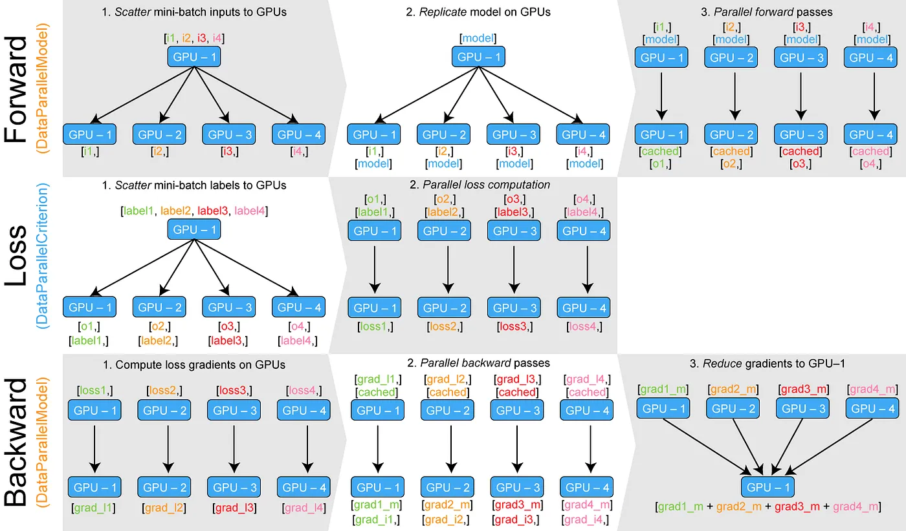

<!--适用于[License](https://github.com/chenzomi12/AISystem/blob/main/LICENSE)版权许可-->

# 数据并行

**数据并行** [[1]](#ref1) 是一种将原本在单一设备上进行的数据训练过程，扩展到多个设备并行计算，以达到理想情况下设备数量倍率加速效果的并行算法。数据并行的方式和扩展有很多种，例如：数据并行（DP）、分布式数据并行（DDP）、完全分片的数据并行（ZeRO） [[2]](#ref2)、异步的数据并行等。

本重点介绍其中最简单的数据并行，分为**数据并行（DP）**和**分布式数据并行（DDP）**两种模式。相比数据并行，尽管分布式数据并行实现更为复杂，但在选择数据并行算法时，我们仍应优先考虑分布式数据并行。简单来说，它更高效、更易优化，且可以很好地与其他并行算法相结合。更多的数据并行拓展内容如**完全分片的数据并行（ZeRO）** 将在后文中进行详细介绍。

## 数据并行（DP）

数据并行只能在单台机器上运行，采用单进程、多线程方式，将原本在单一设备上进行的数据训练过程，扩展到多个设备并行训练。在某一设备上随机初始化模型和优化器后，就可进行数据并行的训练，算法可分为三个步骤：

- **前向传播**：将 mini-batch 数据平均分配到每个设备上。接下来进行分布式初始化，将模型和优化器复制到每个设备上，保证各设备的模型、优化器完全相同。初始化完成后，各设备根据分配到的数据和模型同时进行前向传播。
- **损失计算与反向传播**：前向传播完成后，每个设备分别计算模型损失并进行反向传播。得到梯度后，将梯度传递到某一设备进行累加。
- **参数更新**：累加后的梯度用于更新模型参数和优化器状态，更新后的模型参数和优化器将会在下一轮的前向传播中被复制到每个设备上。

:width:`650px`

但由于数据并行相对来说还不够完善，造成了许多性能的浪费。如在**语言层面**，使用作为最热门的深度学习开发语言 Python，在数据并行中采用的单进程、多线程并行方式往往受到 GIL（全局解释器锁）限制，CPU 的性能瓶颈使得多线程不能良好的利用多设备的资源。另外在**算法层面**，全局的梯度累积和参数更新发生在一个设备上，会出现明显的单个设备利用率更高，其他设备空闲的情况，造成了资源的浪费。同时如果在数据并行中的 mini-batch 设置过小，将导致设备内并行度不足，从而降低训练速度；在通信开销的影响下，甚至可能出现比单设备慢的情况。

## 分布式数据并行（DDP）

分布式数据并行综合了多种优化，是当前应用最广的并行算法之一。它与数据并行类似，但针对数据并行的缺点做了许多改进，并拥有良好的的扩展性，如完全分片的数据并行（ZeRO）就是基于分布式数据并行的内存高效扩展版本。具体来说，分布式数据并行**引入了多进程**的并行方式，这避免了开发语言层面 Python GIL 的限制，也将并行规模扩展到多台网络连接的机器，进一步扩大分布式规模和效率；同时，针对通信做了大量优化，如**使用分桶 Ring-AllReduce 算法做集合通信**，具体细节将在**集合通信**章节展开。分布式数据并行的各设备负载也更均衡，没有单独在某一个设备上工作的情况。

### DDP 基本流程

在分布式数据并行中，程序会启动设备数量个进程，每个进程单独启动一个主训练脚本副本。在开始时，主进程将模型从设备 0 复制到其余设备一次，保证各设备的模型、优化器完全相同，接下来是分布式数据并行的训练过程：

- **前向传播**：每个设备将分别拿到一块完整且不同的 mini-batch 数据，各设备根据分配到的数据同时进行前向传播。
- **损失计算与反向传播**：前向传播完成后，每个设备分别计算模型损失并进行反向传播与梯度更新。值得注意的是，分布式数据并行中反向传播和梯度更新的过程是同时进行的——一旦某些局部梯度准备就绪，它们就会在所有过程中取平均值（默认是使用分桶 Ring-AllReduce 算法做集合通信），然后使用全局梯度更新模型参数和优化器状态。我们将在下一章节具体介绍有关**计算与通信的重叠**的内容。梯度的一致性可确保各设备的模型保持一致，避免使用其他模型的梯度进行参数更新而导致收敛问题。在**异步的数据并行**中，我们还将会接着讨论模型不一致的情况，这将会带来一定的收敛问题，但是可以使整个迭代过程更快，同时设备的利用率更高。

## 异步的数据并行

前面的介绍都是基于**同步的数据并行**的，同步的数据并行特别适用于计算资源相对均衡的情况。在同步数据并行中，每个设备都处理数据的一个子集，并独立地计算梯度。在每次迭代中，所有设备都将它们的梯度汇总，并通过一致的规则来更新模型参数。这样，所有设备上的模型都保持一致，不会出现不同步的情况。由于所有设备在每个训练步骤中都执行相同的更新操作，模型的收敛性更容易得到保证。且所有设备都参与到梯度更新的计算中，整体计算效率也相对较高。此外，同步数据并行还易于实现，因为所有设备的操作都是同步的，不需要复杂的同步机制。

:width:`650px`

但是同步数据并行也有一些局限性。当集群中的某些设备性能较差或者出现故障时，整体的训练效率会受到影响，所有设备都需要等待最慢的设备完成计算。又或是当设备数量过多时，集合通信的时间可能会成为训练的瓶颈，从而限制整体的扩展性。

**异步的数据并行**可以在一定程度上解决这些问题。在异步数据并行中，不同设备的计算过程相互独立，不再需要等待其他设备完成计算。每个设备都按照自己的速度进行前向和反向传播，随时将计算得到的梯度更新到模型参数中。这样，快速的设备不再受到慢速设备的影响，整体计算效率得到提高。

异步数据并行的优点之一是它可以充分利用集群中每个设备的计算能力，快速的设备不会受到慢速设备的影响，从而提高了整体的训练速度。此外，由于每个设备都独立地进行计算和参数更新，异步数据并行也具有较好的扩展性，能够适应不同规模的集群和不同数量、类型的设备。

:width:`650px`

但是异步数据并行也存在一些挑战。由于计算过程是异步的，可能会出现梯度更新之间的竞争条件，需要采取一些机制来解决，如：**参数服务器**[[3]](#ref3)。同时由于计算过程不再同步，模型的收敛性可能会受到影响，需要通过调整学习率或者采用一些优化算法来弥补。

## 数据并行的开源实现

- [DeepSpeed](https://github.com/microsoft/DeepSpeed)：微软推出的分布式训练框架
- [Megatron-LM](https://github.com/NVIDIA/Megatron-LM)：英伟达推出的分布式训练框架  
- [ColossalAI](https://github.com/hpcaitech/ColossalAI)：潞晨科技推出的分布式训练框架
- [Horovod](https://github.com/horovod/horovod)：LF AI & Data Foundation 推出的分布式训练框架 
- [BytePS](https://github.com/bytedance/byteps)：字节跳动推出的分布式训练框架
- [PyTorch](https://pytorch.org/tutorials/intermediate/ddp_tutorial.html)、[TensorFlow](https://TensorFlow.谷歌.cn/guide/distributed_training?hl=zh-cn) 提供的数据并行接口

## 参考文献

[1] Li S, Zhao Y, Varma R, et al. Pytorch distributed: Experiences on accelerating data parallel training[J]. arXiv preprint arXiv:2006.15704, 2020.

[2] Rajbhandari S, Rasley J, Ruwase O, et al. Zero: Memory optimizations toward training trillion parameter models[C]//SC20: International Conference for High Performance Computing, Networking, Storage and Analysis. IEEE, 2020: 1-16.

[3] Li M, Zhou L, Yang Z, et al. Parameter server for distributed machine learning[C]//Big learning NIPS workshop. 2013, 6(2).

## 本节视频

<html>
<iframe src="https:&as_wide=1&high_quality=1&danmaku=0&t=30&autoplay=0" width="100%" height="500" scrolling="no" border="0" frameborder="no" framespacing="0" allowfullscreen="true"> </iframe>
</html>
