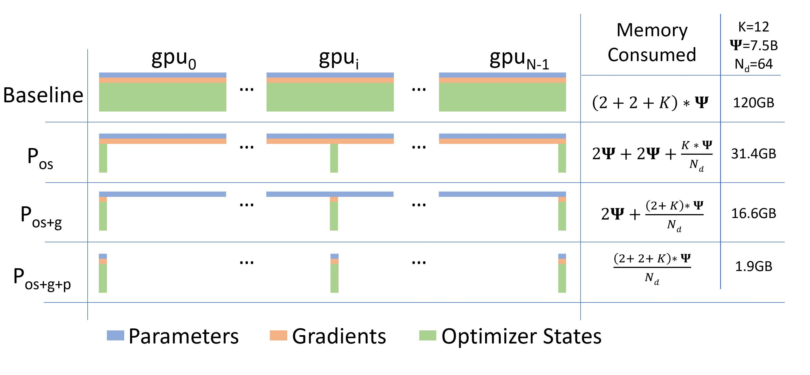
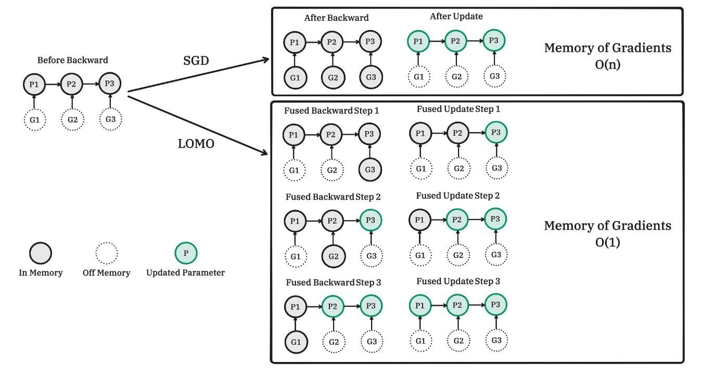

# 分布式优化器

**分布式优化器**在深度学习领域具有重要地位，不仅能提高并行效率，还能减少显式内存消耗，这两方面的优势为模型的大规模训练带来了显著的好处。值得注意的是，并行效率和内存消耗之间存在着密切关联关系，降低内存占用可以使我们使用更大的并行度，进而提升整体的并行加速效果。在本节中，我们将从零冗余优化的常用技术入手，深入剖析如何降低内存开销并提高训练效率。与此同时，我们还将拓展到最新的分布式优化器，如：低内存优化器（LOMO）等，以呈现分布式优化器发展的前沿动态。

## 零冗余优化器（Zero Redundancy Optimizer，ZeRO）

在数据并行（DP）中，每个设备都需要保存一份完整的参数（模型状态和剩余状态），而不是所有的参数在训练的整个过程中都会被使用到，而是在特定的阶段中（某个层的前向或反向传播），因此我们可以在不需要使用的时候将它转移到其他地方节省内存空间。ZeRO [[1]](#ref1)有两套优化方案：ZeRO-DP，旨在减少模型状态的内存占用。ZeRO-R，旨在减少剩余状态内存消耗。我们将详细阐述这些优化及其背后的启示，这些优化使 ZeRO 能够在保持高效的同时减少内存占用。

### ZeRO-DP

ZeRO-DP 对模型状态进行切分，具体来说，每个设备都只会会存储 $\frac{1}{N_d}$ 的模型状态（其中 $N_d$ 为并行度），在需要时通过集合通信 All-gather 获取参数。ZeRO-DP 保留了数据并行训练（DP）的高效率，同时实现了模型并行（MP）的内存效率优势。由于数据并行的模型状态在所有数据并行进程中冗余存储，因此内存效率低下，但数据并行具有更高的计算粒度和更低的通信量，从而具有更高的训练效率。模型并行的通信开销很大，因此可扩展性比数据并行低，但 MP 对模型状态进行分区，获得了较高的内存效率。ZeRO-DP 对模型状态进行分区而不是复制它们，并使用动态通信调度最小化通信量。通过这样做，ZeRO-DP 随着数据并行程度的增加线性减少模型在每块设备的内存占用，同时保持通信量接近默认数据并行的通信量，从而保持效率。

ZeRO-DP 有三个主要优化阶段，分别对应于优化器状态、梯度和参数的划分，在累积启用时：

1) **优化状态分区**（Partition optimizer states，$P_{os}$）：又称为 ZeRO-1，将优化器状态按并行度均匀分区，每个进程只需存储 $\frac{1}{N_d}$ 的优化器状态（其中 $N_d$ 为并行度）。这可将内存消耗减少到 1 / 4，且无额外通信开销。

2) **添加梯度分区**（Partition gradients，$P_{os+g}$）：又称为 ZeRO-2，在优化器状态分区的基础上，对梯度也进行分区。每个进程只需存储用于更新自身参数分区所需的梯度。这可减少 8 倍的内存消耗，且无额外通信开销。

3) **添加参数分区**（Partition parameters，$P_{os+g+p}$）：又称为 ZeRO-3，在优化器状态和梯度分区的基础上，对参数也进行分区。每个进程只存储自身的参数分区，在前向反向传播时需要从其他进程收集所需的参数分区。这会使通信量增加约 50%，但可以实现与并行度 $N_d$ 成正比的内存减少。

通过这三个阶段的优化，ZeRO-DP 最终能够在保持数据并行高效的同时，将每个设备的内存消耗降低至 $\frac{1}{N_d}$ 的水平，使得利用少量硬件资源训练万亿参数等超大模型成为可能。

### ZeRO-R

除了优化模型状态（优化器状态、梯度和参数）的内存利用率，ZeRO 还专门针对剩余状态（如激活数据、临时缓冲区和内存碎片等）进行了优化，以进一步减少内存开销。ZeRO-R 对剩余状态进行了切分和优化，主要包括以下几个策略:

1) **分区激活检查点**（Partitioned Activation Checkpointing，$P_{a}$）：解决了模型并行时激活内存冗余的问题。在模型并行中，每个设备需要保存完整的输入激活数据才能计算自己分到的模型部分。ZeRO-R 将激活检查点按模型并行度 $N_m$ 进行分区，每个设备只需存储 $\frac{1}{N_m}$ 的激活检查点。在需要时通过 All-gather 操作重构出完整激活数据，从而按 $N_m$ 的比例减少激活内存。在极端情况下，当模型规模很大时，ZeRO-R 甚至可以将分区后的激活检查点卸载到 CPU 内存（$P_{a+cpu}$），再次降低设备内存占用，代价是额外的主机-设备通信开销。该策略在大模型训练时会自动开启，以保证足够的设备内存用于计算。

2) **恒定大小的缓冲区**（Constant Size Buffer，$C_{b}$）：一些操作如 All-reduce 需要将张量拼成连续的临时缓冲区，使用恒定大小的缓冲区来避免临时缓冲区随着模型大小的增加而爆炸，同时使它们足够大以保持效率。

3) **内存碎片化整理**（Memory Defragmentation，$M_{d}$）：在训练过程中，由于激活检查点、梯度等张量生命周期的差异，会产生大量内存碎片。ZeRO-R 通过预分配和动态管理这些张量的内存，减少了内存碎片和内存分配器的开销，提高了内存利用率。

通过以上优化策略，ZeRO-R 很好地补充和完善了 ZeRO-DP 优化模型状态内存的功能。两者相结合，ZeRO 优化器能最大限度减少大模型训练的内存占用，为未来万亿参数级别的神经网络模型铺平了道路。

### ZeRO-Infinity

ZeRO-Infinity [[2]](#ref2)是 ZeRO 的扩展功能，可以将深度学习训练扩展到前所未有的规模。具体来说它突破了 GPU 内存壁垒的限制，并使得能够训练具有数万亿个参数的模型成为可能，这是迄今为止最先进系统所无法企及的量级。此外，它为训练具有一千万亿个参数的模型铺平了道路——充分利用系统的全部内存容量，利用 GPU、CPU 和 Non-Volatile Memory Express（NVMe）等所有异构内存组件的能力。

在 ZeRO-Infinity 中，参数从较慢的内存源（如 CPU 和 NVMe）无缝迁移到 GPU，其中它们被合并为完整的层。梯度计算完成后，这些参数被聚合、重新分区，然后重新卸载回较慢的内存组件。其中内存资源的编排确保了最佳利用和最小的开销。这种创新的方法不仅克服了 GPU 内存的常规限制，而且提升了分布式框架的可扩展性。

## ZeRO 通信分析

无论是零冗余优化，还是卸载到 CPU 和 NVMe 内存，一个关键问题是，它们有限的带宽是否会影响训练效率。我们很自然地会问是否在用通信量来换取内存效率。换句话说，与标准 DP 方法相比，ZeRO 驱动的 DP 方法的通信量是多少？

### ZeRO-DP

最先进的 All-reduce 实现采用两步法，第一步是 Reduce-scatte 操作，一个是 All-gather 操作，每个流程的总数据移动量为 $\Psi$ 个元素（对于 $\Psi$ 个元素的数据）。因此，标准 DP 在每个训练步骤中会产生 2 $\Psi$ 次数据移动。

通过梯度分区（$P_{os+g}$），每个进程只存储更新相应参数分区所需的梯度部分。因此，ZeRO 只需要对梯度先进行 Reduce-scatte 操作，产生的通信量为 $\Psi$。在每个进程更新完自己负责的参数分区后，会执行一次 All-gather，从所有数据并行进程中收集所有更新的参数。这也会产生 $\Psi$ 的通信量。因此，每个训练步骤的总通信量为 $\Psi$ + $\Psi$ = 2 $\Psi$，与标准 DP 相同。

在参数分区（$P_{os+g+p}$）后，每个数据并行进程只存储其更新的参数。因此，在前向传播过程中，它需要接收所有其他分区的参数。不过，这可以通过流水线操作来避免内存开销——在对模型中与特定分区对应的部分进行前向传播计算之前，负责该分区的数据并行进程可以向所有数据并行进程广播权重。一旦该分区的前向传播计算完成，参数就可以被丢弃。因此，总通信量为 $\Psi × N_d / N_d = \Psi$。我们通过在整个前向传播中通过 All-gather 传播参数已重新获取参数，并在使用完参数后将其丢弃。而在后向传播时，需要以相反的顺序再次进行参数获取。参数的通信为 2 $\Psi$，在参数更新时只需要执行一个 Reduce-scatte 操作，通信量为 $\Psi$，因此总通信量是 3 $\Psi$，是标准 DP 的 1.5 倍。

### ZeRO-R

ZeRO-R 的通信开销取决于模型大小、检查点策略和模型并行（MP）策略。与标准模型并行相比（其中没有对激活进行分区），ZeRO-R $P_{a}$ 的通信开销通常不到标准模型并行的十分之一。

在使用激活检查点的 Megatron-LM 中，每个 Transformer 块在前向传播中执行两次大小为 $batch × seq × length × hidden\_dim$ 的 All-reduce 操作，然后在反向传播中再执行两次。在使用激活检查点的 ZeRO-R 中，每个前向重计算激活之前需要执行一个额外的 All-gather 操作。通常情况下，对于每个 Transformer 块的输入激活进行检查点，因此每个 Transformer 块需要一个 All-gather 操作。因此，ZeRO-R $P_{a}$ 的通信开销为 $seq\_length × hidden\_dim$，仅增加不到 10%。

当 MP 与 DP 一起使用时，ZeRO-R $P_{a}$ 可以将数据并行通信量减少一个数量级，而模型并行通信量只增加 10%，并且当数据并行通信是性能瓶颈时，可以显着提高效率。通过模型并行可以减少数据并行的内存消耗，从而可以成比例地增加批处理大小。对于大模型，MP 可以增加到 16（DGX-2 节点上的 GPU 数量），从而可以将批处理大小增加多达 16 倍。数据并行训练的通信量与批处理大小成反比，由于 $P_{a}$ 导致批处理大小增加一个数量级，可能会导致数据并行通信量减少一个数量级。

如果应用 $P_{a+cpu}$，则分区激活检查点会被卸载到 CPU，将激活内存需求减少到接近零，但与 $P_{a}$ 相比，往返 CPU 内存的数据移动增加了 2 倍。如果 DP 通信量是主要瓶颈，由于批处理大小较小，$P_{a+cpu}$ 也可以通过增加批处理大小来提高效率，只要 CPU 数据传输开销小于 DP 通信量开销。

### ZeRO-Infinity

我们可以使用**峰值计算吞吐量（$peak_{tp}$）**、**数据移动带宽（$bw$）** 及其**算术强度（$ait$）** 来估算训练效率。

工作负载的**算术强度（AIT）** 是总计算量与计算所需数据量之间的比率。它描述了每次数据移动所需的计算量。AIT 越高，意味着对数据移动带宽的要求越低，因为每加载一个数据，加速器就能完成更多计算。

$$
ait = \frac{total\_computation}{total\_data\_movement}
$$

因此效率可以大致估算为：

$$
\begin{aligned}

compute\_time 
&= \frac{total\_computation}{peak_{tp}} \\

communication\_time 
&= \frac{total\_data\_movement}{bw} \\
&= \frac{total\_computation}{ait × bw} \\

efficienc𝑦 
&= \frac{compute\_time}{compute\_time+communication\_time} \\
&= \frac{ait × bw}{ait × bw + peak_{tp}}

\end{aligned}
$$

我们同样以 Transformer 为例：每次迭代的总计算量可以由参数数量、序列长度和批量大小估算，即对于前向传播为 $2 × bsz × seq × params$，反向传播的成本大约是正向传播的两倍。因此我们可以估算计算量：

$$
computation\_per\_iter = 2 × 4 × bsz × seq × parameters = 2 × 4 × 12 × bsz × seq × nl × hd^2
$$

在前向和反向传播期间，模型参数必须从源位置加载到 GPU 寄存器至少两次（前向传播期间和实际后向传播期间），导致 2 次的数据移动。在存在激活检查点的情况下，可以在向后传递过程中额外加载一次参数以进行重新计算。此外，梯度必须至少从 GPU 寄存器存储到其最终位置一次。因此，假设参数和梯度存储在相同的最终位置，则前向和后向传递期间的总数据移动将为 $4 × parameters$，即 $2 × 4 × parameters$（以字节为单位）。因此参数和梯度的 ait 为：

$$
seq × bsz
$$

在优化器迭代期间，必须至少读取一次优化器状态，​​并且必须至少写入一次优化器状态。因此，总数据移动量为 $2 × optimizer_states$，大约为 $2 × 16 × parameters$ 字节。因此，在完整的训练迭代期间，优化器状态的 ait 为：

$$
seq × bsz/4
$$

在前向传播期间，激活检查点必须保存到其最终位置，并且必须在后向传播期间获取。因此，激活检查点的总数据移动量（以字节为单位）为 $2 × total\_activation\_checkpoints\_in\_b𝑦tes$，带入我们之间计算的激活检查点大小，可以得到总数据移动量 $4 × nl/ci × hd × seq × bsz$。所以激活检查点的 ait 为：

$$
24 × hd × ci
$$

模型状态和激活检查点对带宽的要求大不相同。前者只取决于**批量大小和序列长度**，而后者只取决于**激活检查点的频率和模型的隐藏维度大小**。在实际中，参数和梯度的带宽超过 70 GB/s，即使是最小的批处理量，也能实现超过 50% 的效率。在这种带宽下，数据移动理论上可以与计算完全重叠，从而实现 100% 的效率。与参数和梯度相比，优化器状态需要高出近 4 倍的带宽才能达到 50% 的效率。此外，优化器状态在前向和后向传播结束时更新，不能与计算重叠。因此，它们需要更大的带宽来保持整个 DL 工作负载的效率。例如，在每个 GPU 的批处理量为 2 的情况下，要达到 90% 的效率，需要近 1.5 TB/s 的有效带宽，甚至超过了 GPU 内存带宽。启用激活检查点后，即使隐藏大小为 2K，2 GB/s 的微薄带宽也能维持 50% 以上的效率。当隐藏大小超过 8K 时，带宽需求降至 1 GB/s 以下。

## 低内存优化器（Low-Memory Optimization，LOMO）

LOMO（Low-Memory Optimization）[[3]](#ref3)是一种新型优化器，专为资源有限的大型语言模型（LLMs）全参数微调而设计。**核心思想是在计算梯度时立即更新参数，这样就不需要将梯度张量存储在内存中**。它通过在一步中融合梯度计算和参数更新，将梯度张量的内存使用降低到 O（1），显著减少了内存使用，使得在普通 GPU 上微调巨大模型成为可能。LOMO 结合了梯度归一化、损失缩放等技术，保证了训练过程的稳定性和效率。此外，LOMO 还支持与其他内存节省技术如激活检查点和混合精度训练相结合，进一步降低内存需求。在 SGD 优化器下，LOMO 训练的内存消耗与推理保持一致。

低内存优化器在 PyTorch 的反向传播中注入定制的钩子函数。定制的钩子函数会扫描所有参数，如果参数的 `.grad` 属性不为空，则更新参数，然后清除并释放 `.grad` 属性，保证了梯度的无储存。LOMO 优化器将梯度计算和参数更新合并为一步，减少了梯度张量的内存使用。这一创新方法使得只需存储一个参数的梯度，大幅降低内存使用。

## 本节视频

<html>
<iframe src="https:&as_wide=1&high_quality=1&danmaku=0&t=30&autoplay=0" width="100%" height="500" scrolling="no" border="0" frameborder="no" framespacing="0" allowfullscreen="true"> </iframe>
</html>
