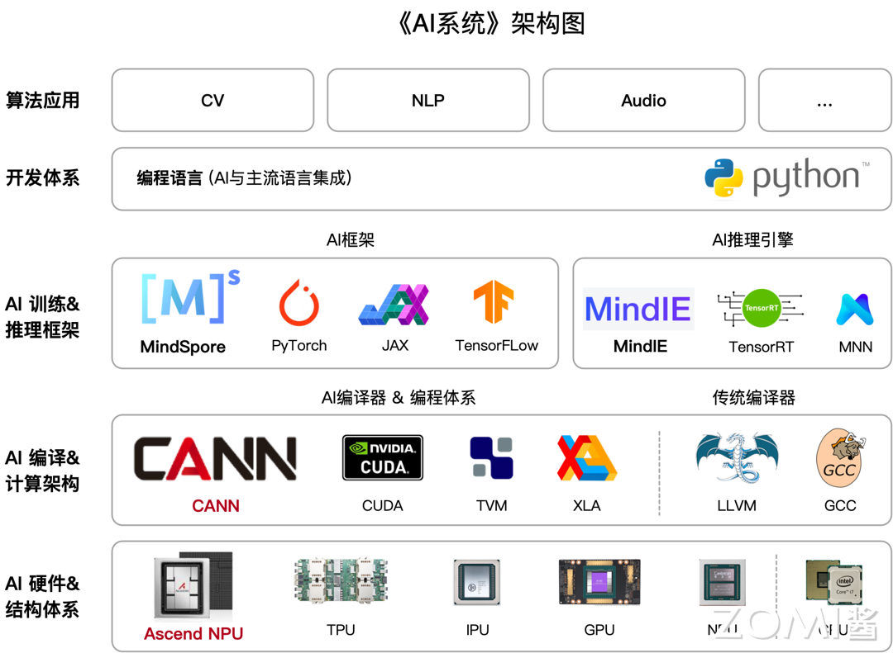
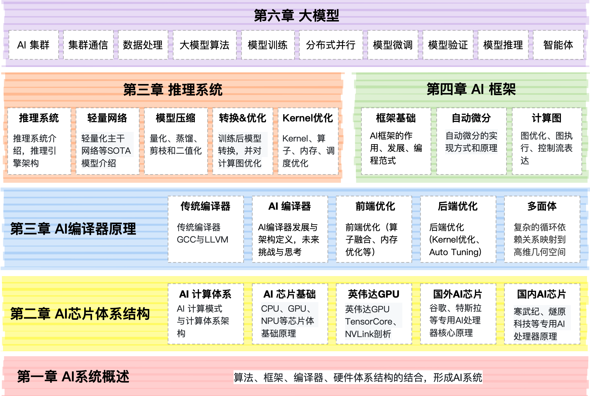

# AI System & AI Infra

大模型内容太多啦！！因此最新大模型的内容归档在 [AIFoundation](https://github.com/chenzomi12/AIFoundation/) https://github.com/chenzomi12/AIFoundation/ 上面，欢迎大家移步过去哦！！

--------------

文字课程内容正在一节节补充更新，尽可能抽空继续更新正在 [AISys](https://chenzomi12.github.io/) ，希望您多多鼓励和参与进来！！！

文字课程开源在 [AISys](https://chenzomi12.github.io/)，系列视频托管[B 站](https://space.bilibili.com/517221395)和[油管](https://www.youtube.com/@zomi6222/videos)，PPT 开源在[github](https://github.com/chenzomi12/AISystem)，欢迎取用！！！

## 课程背景

这个开源课程英文名字叫做**AI System(AISys)**，中文名字叫做**AI 系统**。

本开源课程主要是跟大家一起探讨和学习人工智能、深度学习的系统设计，而整个系统是围绕着 ZOMI 在工作当中所积累、梳理、构建 AI 系统全栈的内容。希望跟所有关注 AI 开源课程的好朋友一起探讨研究，共同促进学习讨论。

## 课程内容大纲

课程主要包括以下五大模块：

| 教程内容  | 简介   | 地址  |
| ------------------ | ------------------------------------------------------------ | ------------------------------------------------------------ |
| AI 系统全栈概述  | AI 基础知识和 AI 系统的全栈概述的AI 系统概述，以及深度学习系统的系统性设计和方法论，主要是整体了解 AI 训练和推理全栈的体系结构内容。 | [[Slides](./01Introduction/README.md)] |
| AI 芯片与体系架构   | 作为 AI 的硬件体系架构主要是指 AI 芯片，这里就很硬核了，从CPU、GPU 的芯片基础到 AI 芯片的原理、设计和应用场景范围，AI 芯片的设计不仅仅考虑针对 AI 计算的加速，还需要充分考虑到AI 的应用算法、AI 框架等中间件，而不是停留在天天喊着吊打英伟达和 CUDA，实际上芯片难以用起来。 | [[Slides](./02Hardware/README.md)] |
| AI 编程与计算架构  | 进阶篇介绍 AI 编程与计算架构，将站在系统设计的角度，思考在设计现代机器学习系统中需要考虑的编译器问题，特别是中间表达乃至后端优化。 | [[Slides](./03Compiler/README.md)]  |
| AI 推理系统与引擎  | 实际应用推理系统与引擎，讲了太多原理身体太虚容易消化不良，还是得回归到业务本质，让行业、企业能够真正应用起来，而推理系统涉及一些核心算法和注意的事情也分享下。 | [[Slides](./04Inference/README.md)]  |
| AI 框架核心技术  | 介绍 AI 框架核心技术，首先介绍任何一个 AI 框架都离不开的自动微分，通过自动微分功能后就会产生表示神经网络的图和算子，然后介绍 AI 框架前端的优化，还有最近很火的大模型分布式训练在 AI 框架中的关键技术。  | [[Slides](./05Framework/README.md)]  |

## 课程设立目的

本课程主要为本科生高年级、硕博研究生、AI 系统从业者设计，帮助大家：

1. 完整了解 AI 的计算机系统架构，并通过实际问题和案例，来了解 AI 完整生命周期下的系统设计。

2. 介绍前沿系统架构和 AI 相结合的研究工作，了解主流框架、平台和工具来了解 AI 系统。

## 课程部分

### **[一. AI 系统概述](./01Introduction/)**

| 编号  | 名称       | 具体内容      |
|:---:|:----- |:--- |
| 1      | [AI 系统](./01Introduction/) | 算法、框架、体系结构的结合，形成 AI 系统  |

### **[二. AI 芯片体系结构](./02Hardware/)**

| 编号  | 名称       | 具体内容      |
|:---:|:----- |:--- |
| 1      | [AI 计算体系](./02Hardware/01Foundation/) | 神经网络等 AI 技术的计算模式和计算体系架构  |
| 2      | [AI 芯片基础](./02Hardware/02ChipBase/)   | CPU、GPU、NPU 等芯片体系架构基础原理       |
| 3      | [图形处理器 GPU](./02Hardware/03GPUBase/)  | GPU 的基本原理，英伟达 GPU 的架构发展  |
| 4      | [英伟达 GPU 详解](./02Hardware/04NVIDIA/) | 英伟达 GPU 的 Tensor Core、NVLink 深度剖析 |
| 5      | [国外 AI 处理器](./02Hardware/05Abroad/)   | 谷歌、特斯拉等专用 AI 处理器核心原理  |
| 6      | [国内 AI 处理器](./02Hardware/06Domestic/)   | 寒武纪、燧原科技等专用 AI 处理器核心原理  |
| 7      | [AI 芯片黄金 10 年](./02Hardware/07Thought/)   | 对 AI 芯片的编程模式和发展进行总结  |

### **[三. AI 编译原理](./03Compiler/)**

| 编号  | 名称       | 具体内容      |
|:---:|:----- |:--- |
| 1      | [传统编译器](./03Compiler/01Tradition/)    | 传统编译器 GCC 与 LLVM，LLVM 详细架构  |
| 2      | [AI 编译器](./03Compiler/02AICompiler/)  | AI 编译器发展与架构定义，未来挑战与思考   |
| 3      | [前端优化](./03Compiler/03Frontend/)      | AI 编译器的前端优化(算子融合、内存优化等)  |
| 4      | [后端优化](./03Compiler/04Backend/)       | AI 编译器的后端优化(Kernel 优化、AutoTuning) |
| 5      | 多面体      | 待更 ing...      |
| 6      | [PyTorch2.0](./03Compiler/06PyTorch/) | PyTorch2.0 最重要的新特性：编译技术栈  |

### **[四. AI 推理系统](./04Inference/)**

| 编号  | 名称       | 具体内容      |
|:---:|:----- |:--- |
| 1      | [推理系统](./04Inference/01Inference/)  | 推理系统整体介绍，推理引擎架构梳理  |
| 2      | [轻量网络](./04Inference/02Mobilenet/)  | 轻量化主干网络，MobileNet 等 SOTA 模型介绍 |
| 3      | [模型压缩](./04Inference/03Slim/)       | 模型压缩 4 件套，量化、蒸馏、剪枝和二值化       |
| 4      | [转换&优化](./04Inference/04Converter/) | AI 框架训练后模型进行转换，并对计算图优化      |
| 5      | [Kernel 优化](./04Inference/05Kernel/) | Kernel 层、算子层优化，对算子、内存、调度优化  |

### **[五. AI 框架核心技术](./05Framework/)**

| 编号  | 名称       | 具体内容      |
|:---:|:----- |:--- |
| 1   | [AI 框架基础](./05Framework/01Foundation/) | AI 框架的作用、发展、编程范式    |
| 2   | [自动微分](./05Framework/02AutoDiff/)     | 自动微分的实现方式和原理       |
| 3   | [计算图](./05Framework/03DataFlow/)      | 计算图的概念，图优化、图执行、控制流表达  |

### 知识清单

## 备注

> 这个仓已经到达疯狂的 10G 啦（ZOMI 把所有制作过程、高清图片都原封不动提供），如果你要 git clone 会非常的慢，因此建议优先到  [Releases · chenzomi12/AISystem](https://github.com/chenzomi12/AISystem/releases) 来下载你需要的内容

> 非常希望您也参与到这个开源课程中，B 站给 ZOMI 留言哦！
> 
> 欢迎大家使用的过程中发现 bug 或者勘误直接提交代码 PR 到开源社区哦！
>
> 欢迎大家使用的过程中发现 bug 或者勘误直接提交 PR 到开源社区哦！
>
> 请大家尊重开源和 ZOMI 的努力，引用 PPT 的内容请规范转载标明出处哦！