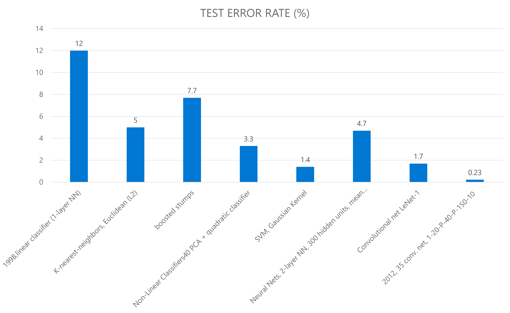
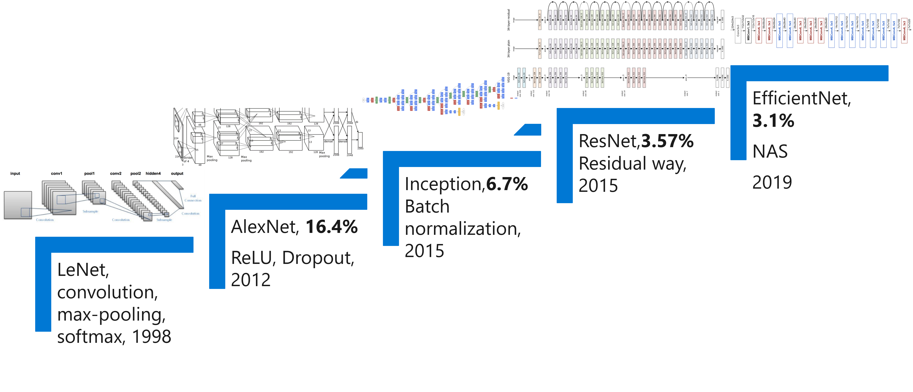
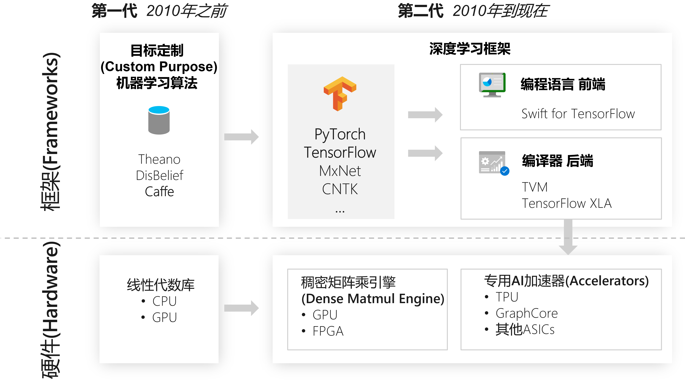
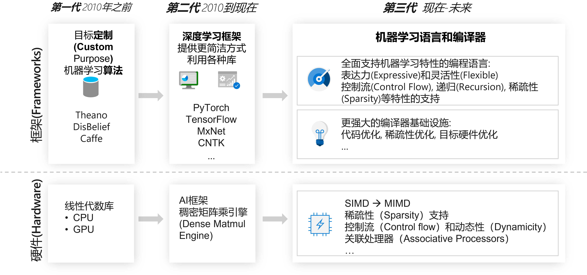

<!--Copyright © Microsoft Corporation. All rights reserved.
  适用于[License](https://github.com/microsoft/AI-System/blob/main/LICENSE)版权许可-->

# 1.2 算法，框架，体系结构与算力的进步

催生这轮人工智能热潮的原因有三个重要因素：大数据的积累、超大规模的计算能力支撑、机器学习尤其是深度学习算法都取得了突破性进展，本章我们将围绕以上重要的三方面因素展开。

本小节将围绕以下内容进行介绍：

- [1.2 算法，框架，体系结构与算力的进步](#12-算法框架体系结构与算力的进步)
  - [1.2.1 大数据和分布式系统](#121-大数据和分布式系统)
  - [1.2.2 深度学习算法的进步](#122-深度学习算法的进步)
  - [1.2.3 计算机体系结构和计算能力的进步](#123-计算机体系结构和计算能力的进步)
  - [1.2.4 计算框架的进步](#124-计算框架的进步)
  - [小结与讨论](#小结与讨论)
  - [参考文献](#参考文献)

## 1.2.1 大数据和分布式系统

随着数字化发展，信息系统和平台不断沉淀了大量数据。人工智能的算法是数据驱动（Data Driven）的方式解决问题，从数据中不断学习出规律和模型，进而完成预测任务。

互联网公司由于有海量的用户，大规模的数据中心，信息系统完善，所以可以较早沉淀出大规模数据，并应用人工智能技术，投入研发创新人工智能技术。

互联网服务和大数据平台给深度学习带来了大量的数据集。例如，以下几种服务中沉淀和形成了相应领域代表性的数据集：

- 搜索引擎（Search Engine）
  - 图像检索（Image Search）: ImageNet， Coco 等计算机视觉数据集
  - 文本检索（Text Search）: Wikipedia 等自然语言处理数据集
- 商业网站
  - 亚马逊， 淘宝: 推荐系统数据集， 广告数据集
- 其他互联网服务（Internet Services）
  - 对话机器人服务 XiaoIce, Siri, Cortana：问答数据集
- ...

互联网公司通过不断爬取互联网数据沉淀了大量数据，同时因为其有海量的用户，这些用户不断使用互联网服务，上传文字，图片，音频等数据，又积累了更为丰富的数据。这些数据随着时间的流逝和新业务功能的推出，数据量越来越大，数据模式越来越丰富。所以互联网公司较早的开发和部署了的大数据管理与处理平台。基于这些海量数据，互联网公司通过数据驱动的方式，训练人工智能模型 ，进而优化和提升业务用户体验（例如，点击率预测让用户获取感兴趣的信息），让更多的用户使用服务，进而形成循环。由于天然的随着业务发展遇到更多需要应用人工智能技术的实际场景和需求，相较于学术界，互联网公司作为工业界的代表，较早地将深度学习的发展推到了更加实用，落地的阶段，并不断投入研发推动人工智能算法与系统的不断演进和发展。

以表 1.2.1 中为例，同样是图像分类问题，从最开始数据规模较小的 MNIST[[1]](#mnist) 手写数字识别数据集其只有 6 万样本，10 个分类，到更大规模的 ImageNet，其有 1600 万样本，1000 个分类，再到互联网 Web 服务中沉淀了数亿量级的图像数据。海量的数据让人工智能问题变得愈发挑战的同时，实质性的促进了人工智能模型效果的提升，因为当前的以深度学习为核心的代表性人工智能算法，其本身是数据驱动的方式从数据中学习规律与知识，数据的质与量决定了模型的本身的天花板。

表 1.2.1 不同图像分类问题数据集的数据量

| MNIST | ImageNet | Web Images |
| ----- | -------- | ---------- |
| 6万样本  | 1600万样本  | 10亿量级图像样本  |
| 10分类  | 1000分类   | 开放分类       |

这些海量的数据集为深度学习系统的发展产生了以下的影响：

- 推动深度学习算法不断在指定任务上产生更高的准确度与更低的误差。让深度学习有更广泛的应用，进而产生商业价值，让工业界和学术界看到其应用潜力并投入更多资源进行研究。这样产生了针对深度学习的系统与硬件发展的用户基础，应用落地场景驱动力和研发资源投入。
- 海量的数据集让单机越来越难以完成深度学习模型的训练，进而产生了分布式训练和平台的需求，让传统的机器学习库不能满足相应的需求。
- 多样的数据格式和任务，产生了模型结构的复杂性，驱动框架或针对深度学习的程序语言需要有更灵活的表达能力对问题进行表达与映射。 
- 同时伴随着性能等需求得到满足，数据安全与模型安全问题挑战也变的日益突出。

综上所述，深度学习系统本身的设计相较于传统机器学习库有更多样的表达需求，更大规模和多样的数据集和更广泛的用户基础。

## 1.2.2 深度学习算法的进步

除了数据本身不断的沉淀，算法研究员和工程师不断设计新的算法和模型提升预测效果，深度学习算法和模型的预测效果不断取得突破性进展。但是新的算法和模型结构需要前端框架提供编程的表达力和灵活性，对执行层系统优化有可能会改变原有假设，进而产生了系统前端设计和执行过程优化新的挑战。

借下来我们从几个代表性数据集上看算法与模型的进步：

***1. 深度学习在已有数据集（MNIST数据集）上超越机器学习算法***

[MNIST](http://yann.lecun.com/exdb/mnist/)[[1]](#mnist) 手写数字识别数据库是一个大型手写数字图像数据集，在早期通常用于训练和研究各种图像分类的深度学习模型，由于其样本与数据规模较小，当前也常常用于教学或神经网络结构（NAS）搜索的研究。

我们可以观察图 1.2.1，了解不同的机器学习算法取得的效果。

图 1.2.1 MNIST数据集上各算法的测试误差百分比（Test Error %）

从图中可以观察到这样的趋势：

1998 年，一个简单的卷积神经网络可以取得和 SVM 取得的最好效果接近。

2012 年，一个深度卷积神经网络可以将错误率降低到 0.23% (2012)，这样的结果已经可以和人所达到的错误率 0.2% 非常接近。

深度学习模型在 MNIST[[1]](#mnist) 数据集上相比传统机器学习模型的表现，让研究者们看到了深度学习模型提升预测效果的潜力，进而不断尝试新的深度学习模型和更复杂的数据集上进行验证。

所以我们看到，深度学习算法在准确度和错误率上的效果提升，让不同应用场景上的问题取得突破进展或让领域研发人员看到相应潜力，是驱动不同行业不断投入研发深度学习的动力，

***2. 深度学习在公开数据集（ImageNet）上取得不断的突破***

随着每年 ImageNet 数据集上的新模型取得突破，我们看到新的深度学习模型结构和训练方式的潜力。通过图 1-2-2，我们观察到，更深的模型结构有潜力提升当前预测的效果。

图 1.2.2 更深和高效的深度学习模型结构在 ImageNet 数据集上的效果不断取得突破

从图中可以看到，1998 年的 Lenet，到 2012 年的 AlexNet，不仅效果提升，模型变大，同时引入了 GPU 训练，新的层（ReLU等）。到 2015 年的 Inception，模型的计算图进一步复杂，且有新的层被提出，错误率进一步降低到 6.7%。到 2015 年的 ResNet，模型层数进一步加深，甚至达到上百层。到 2019 年 NAS，模型设计逐渐朝着自动化的方式进行设计。

我们可以观察到，新的模型不断在以下方面演化进而提升效果：

- 更好的激活函数和层: ReLU，Batch Normalization 等。
- 更复杂更深的网络结构和更多的模型权重。 
- 更好的训练技巧: 正则化（Regularization），初始化（Initialization），学习方法（Learning Methods），自动化机器学习与模型结构搜索等。

这些可以取得更好的效果的技巧和设计，驱动者算法工程师与研究员不断投入设计新的模型，同时也要求深度学习系统不断提供新的算子（Operator）支持，算子优化，训练算法支持，进而驱动框架和编译器对前端，中间表达，和系统算法协同设计的演进和发展。

***3. 其他领域算法的进步***

除了我们看到的计算机视觉，深度学习在多个领域也取得了不俗的表现，并在当年取得超越原有方案的里程碑式的效果，后续方案不断在深度学习的方法上取得新的突破。

例如，在下面的领域中相关代表性工作： 

- 计算机视觉（Computer Vision）领域

例如：2015 年， ImageNet 数据集上 微软亚洲研究院（MSRA）研发的 Resnet[[2]](#resnet) 取得了5项第一，并又一次刷新了 CNN 模型在 ImageNet 上的历史。

- 自然语言处理（Natural Language Processing）领域

例如：2019 年，在斯坦福大学举办的 SQuAD（Stanford Question Answering Dataset）[[3]](#squad) 和 CoQA（Conversational Question Answering）[[4]](#coqa)挑战赛中，微软亚洲研究院（MSRA） 的 NLP 团队通过多阶段（Multi-Stage），多任务（Multi-Task）学习的方式取得第一。

- 语音识别（Speech Recognition）领域

例如：2016 年，微软研究院（MSR）提出的 Combined 模型[[5]](#combined)系统的在 NIST 2000[[6]](#nist2000) 数据集上错误率为 6.2%，超越之前报告的基准测试结果。

- 强化学习（Reinforcement Learning）领域

2016 年，Google DeepMind 研发的 AlphaGo[[7]](#alphago) 在围棋比赛中以 4:1 的高分击败了世界大师级冠军李世石。OpenAI 训练出了名为 OpenAI Five[[8]](#openaifive) 的 Dota 2 游戏智能体。2019 年 4 月，OpenAI Five 击败了一支 Dota 2 世界冠军战队，这是首个击败电子竞技游戏世界冠军的人工智能系统。

由于不同领域的输入数据格式不同，预测输出结果不同，数据获取方式不同，造成模型结构和训练方式产生非常多样的需求，各家公司和组织不断研发新的针对特定领域的框架或上层接口封装（例如，Facebook 推出的 Caffe 与 Torch 演化到 PyTorch，Google TensorFlow 及新推出的 JAX，工具与框架本身也是随着用户的模型构建与程序书写与部署需求不断演进。）以支持特定领域数据科学家快速验证和实现新的想法，工程化部署和批量训练成熟的模型。所以我们可以看到，由最开始 AlexNet 是作者直接通过 [CUDA](https://code.google.com/archive/p/cuda-convnet) 实现深度学习模型，到目前有通过 Python 语言灵活和轻松调用的框架，到大家习惯使用 Hugging Face 进行神经网络语言模型训练，背后是系统工程师贴合实际需求不断研发新的工具，并推动深度学习生产力提升的结果。所以即使作为系统工程师，也需要密切关注算法和应用的演进，才能紧跟潮流设计出贴合应用实际的工具与系统。

## 1.2.3 计算机体系结构和计算能力的进步

图 1.2.3 计算机体系结构和计算能力的进步

从 1960 年以来，计算机性能的增长主要来自摩尔定律，到二十世纪初大概增长了 $10^8$ 倍。但是由于摩尔定律的停滞，性能的增长逐渐放缓了。单纯靠工艺尺寸的进步，无法满足各种应用对性能的要求。

于是，人们就开始为应用定制专用芯片，通过消除通用处理器中冗余的功能部分，来进一步提高对特定应用的计算性能。
比如，图形图像处理器 GPU 就对图像类算法做专用加速。后来出现 GPGPU，也就是通用 GPU，对适合于抽象为单指令流多数据流（SIMD）的并行算法与工作负载都能起到不错的加速效果。

为了更高的性能，这些年人工智能芯片也大行其道。其中一个代表就是 Google TPU（Tensor Processing Unit）[[9]](#tpu)。通过对深度学习模型中的算子进行抽象，转换为矩阵乘法或非线性变换，根据专用负载特点进一步定制流水线化执行的脉动阵列（Systolic Array），进一步减少访存提升计算密度，提高了性能。除了算子层面驱动的定制，深度学习负载本身在算法层常常应用的稀疏性和量化等加速手段也逐渐被硬件厂商根据通用算子定制到专用加速器中（例如，英伟达推出的 Transformer Engine），在专用计算领域进一步协同优化加速。

通过定制化硬件，厂商又将处理器性能提升了大约 $10^5$ 量级。专有芯片的算力发展也逐渐逼或超越蜻蜓，老鼠和人脑的算力。

然而可惜的是，经过这么多年的发展，虽然处理器性能提升这么多，我们机器的数值运算能力早已是人类望尘莫及了，里面的程序仍然是人类指定的固定代码，智能程度还远远不及生物大脑。从智力程度来说，大约也就只相当于啮齿动物，距离人类还有一定距离。

我们可以看到随着硬件的发展，虽然算力逐渐逼近人脑，让深度学习取得了突破。但是我们也看到，计算力还是可能在短期内成为瓶颈，那么人工智能系统的性能下一代的出路在哪？我们在后面会看到，除了单独芯片的不断迭代进行性能放大（Scale Up），系统工程师不断设计更好的分布式计算系统将计算并行开来达到向外扩展（Scale Out），同时发掘深度学习的作业特点，如稀疏性等通过算法，系统硬件协同设计，进一步提升计算效率和性能。

## 1.2.4 计算框架的进步

算法工程师和研究员为了搭建深度学习模型，完成训练，部署推理，抛开其他需求，这其中都离不开深度学习框架的支持，例如：PyTorch，TensorFlow 等。框架对用户提供编程接口，隐藏硬件细节，同时将用户书写的深度学习程序进行编译优化并部署在设备上进行执行。在众多的人工智能系统中深度学习框架属于其中的核心系统，构建了算法工程师和底层硬件之间的桥梁。通过业界的开源社区发展和学术研究进展，我们观察到，深度学习框架大致经过以下的发展脉络。

***第一代框架***：

以 [Theano](https://en.wikipedia.org/wiki/Theano_(software))[[10]](#theano)，[Caffe](https://caffe.berkeleyvision.org/)[[11]](#caffe)，[DisBelief](https://research.google/pubs/pub40565/)[[12]](#disbelief) 为代表的第一代框架，其设计初衷为数值计算或特定机器学习问题算法而设计。例如，Caffe 设计之初主要为支持卷积神经网络，DisBelief[[12]](#disbelief) 只支持参数服务器模式在CPU集群训练特定的深度学习模型。（1）前端：例如，有的初代框架编程范式为通过[配置文件](https://caffe.berkeleyvision.org/tutorial/net_layer_blob.html)进行模型构建，框架将模型翻译成粗粒度的算子（例如，卷积层，池化层），并调用底层硬件提供的优化算子库（如NVIDIA cuDNN，CUDA）等进行高效执行。其特点是简单构建方便，但是灵活性不足，算子类型支持有限，用户直接书写配置文件也容易写出有缺陷（Bug）的程序，难以静态分析。还有些框架需要用户关注声明张量形状（Shape），用户开发代码量较高，容易出错，书写复杂模型工作量较大。（2）后端：另外一些原因是对更加灵活的模型分布式训练及部署模式支持有限。（3）生态：对某领域模型支持较好但其他领域模型动物园（Model Zoo）支持有限。

随着用户的模型构建需求和应用场景越来越灵活和多样化，逐渐衍生出应用更加广泛的第二代框架。

***第二代框架***：

以 [TenorFlow](https://github.com/tensorflow/tensorflow)[[13]](#tensorflow) 和 [PyTorch](https://github.com/pytorch/pytorch)[[17]](#pytorch) 为代表的第二代框架，目前是有最为广泛用户基础的计算框架。其中通常业界将框架按照编程范式分类两类：

- 声明式编程（Declarative programming）
  
  - 代表性框架：TensorFlow[[13]](#tensorflow)， Keras[[14]](#keras)， CNTK[[15]](#cntk)， Caffe2[[16]](#caffe2)
  - 特点：用户只需要表达模型结构和需要执行的任务，无需关注底层的执行流程，框架提供计算图优化，让用户无需关心底层优化细节，但是对用户来说不容易调试。

- 命令式编程（Imperative programming）
  
  - 代表性框架：PyTorch[[17]](#pytorch)， Chainer[[18]](#chainer)， DyNet[[19]](#dynet)
  - 特点：用户不仅表达模型结构，还需要表达执行步骤，并且按照每一步定义进行执行，由于无法像声明式编程获取完整计算图并优化后执行，所以难以提供全面的计算图优化，但是由于其简单易用，灵活性高，在模型研究人员中也有很高的用户基础，并不断在新的研究工作中被广泛使用，从而打下广泛的用户基础。

图 1.2.4 第一代框架到第二代框架的进步

第二代框架以 Python 语言作为前端语言，并结合使用 Numpy，Scipy 等数据处理库构建深度学习的程序。

虽然框架解决了大部分的问题，但是我们也可以看到，控制流，数据预处理等其他语言层的逻辑与深度学习模型计算图的割裂造成不便于统一编译与优化，除深度学习模型之外的库不方便卸载计算和利用 GPU 等专有硬件造成低效数据流水线，没有侧重面向方面设计造成运维负担较大等。同时 Python 语言本身特点是简单，但是并发支持效率不高，不利于静态优化与错误检测等，对大规模工程化实践不友好。由于以上问题造成在不断演化的深度学习研究与工程化对性能和稳定性越来越极致要求的趋势下现有编程方式扔有提升空间。目前也有趋势是提供静态语言前端（例如，Swift，Julia 等）从语言层提供静态程序分析，后端提供编译器（例如，TVM，TensorFlow XLA 等）进行编译优化尝试规避和解决当前框架已有的问题。

***第三代框架***:

我们除了设计框架解决当前的问题，还应该思考关注和设计下一代的框架支持未来的模型趋势。

图 1.2.3 第二代框架到第三代框架的发展趋势

- 框架应在有更加全面功能的编程语言前端下构建，并提供灵活性和表达力，例如：控制流（Control Flow）的支持，递归和稀疏性的原生表达与支持。这样才能应对大的（Large）、动态（Dynamic）的和自我修改（Self-Modifying）的深度学习模型趋势。我们无法准确预估深度学习模型在多年后会是什么样子，但从现在的趋势看，它们将会更大、更稀疏、结构更松散。下一代框架应该更好地支持像 [Pathways](https://blog.google/technology/ai/introducing-pathways-next-generation-ai-architecture/)[[20]](#pathways) 模型这样的动态模型，像预训练神经语言模型（NLM）或专家混合模型（MoE）这样的大型模型，以及需要与真实或模拟环境频繁交互的强化学习模型等多样的需求。

- 框架同时应该不断跟进并提供针对多样且新的硬件特性下的编译优化与运行时调度的优化支持。例如：单指令流多数据流（SIMD）到 多指令流多数据流（MIMD）的支持，稀疏性和量化的硬件内支持，异构与分布式计算，虚拟化支持，关联处理等。

## 小结与讨论

本章我们主要围绕深度学习系统的算法，框架与体系结构展开。对系统研究，除了理解上层深度学习算法，也需要理解底层的体系结构，并利用两者之前的巨大的优化空间进行抽象和权衡取舍选取最优解决方法。

请读者思考未来的深度学习框架和系统应该是怎样的？

## 参考文献

1. [Deng, L. (2012). The mnist database of handwritten digit images for machine learning research. IEEE Signal Processing Magazine, 29(6), 141–142.](http://yann.lecun.com/exdb/mnist/)

2. [K. He, X. Zhang, S. Ren and J. Sun, "Deep Residual Learning for Image Recognition," 2016 IEEE Conference on Computer Vision and Pattern Recognition (CVPR), 2016, pp. 770-778, doi: 10.1109/CVPR.2016.90.](https://ieeexplore.ieee.org/document/7780459)

3. [Rajpurkar, Pranav, et al. "Squad: 100,000+ questions for machine comprehension of text." arXiv preprint arXiv:1606.05250 (2016).](https://arxiv.org/abs/1606.05250)

4. [Reddy, Siva, Danqi Chen, and Christopher D. Manning. "Coqa: A conversational question answering challenge." Transactions of the Association for Computational Linguistics 7 (2019): 249-266.](https://arxiv.org/abs/1808.07042)

5. [Xiong, Wayne et al. “The microsoft 2016 conversational speech recognition system.” 2017 IEEE International Conference on Acoustics, Speech and Signal Processing (ICASSP) (2017): 5255-5259.](https://arxiv.org/abs/1609.03528)

6. [Przybocki, Mark, and Alvin Martin. 2000 NIST Speaker Recognition Evaluation LDC2001S97. Web Download. Philadelphia: Linguistic Data Consortium, 2001.](https://www.nist.gov/itl/iad/mig/speaker-recognition)

7. [Silver, D., Huang, A., Maddison, C. et al. Mastering the game of Go with deep neural networks and tree search. Nature 529, 484–489 (2016).](https://www.nature.com/articles/nature16961)

8. [Berner, Christopher, et al. "Dota 2 with large scale deep reinforcement learning." arXiv preprint arXiv:1912.06680 (2019).](https://arxiv.org/abs/1912.06680)

9. [Norman P. Jouppi, et al. 2017. In-Datacenter Performance Analysis of a Tensor Processing Unit. In Proceedings of the 44th Annual International Symposium on Computer Architecture (ISCA '17). Association for Computing Machinery, New York, NY, USA, 1–12. ](https://arxiv.org/abs/1912.06680)

10. [Team, The Theano Development, et al. "Theano: A Python framework for fast computation of mathematical expressions." arXiv preprint arXiv:1605.02688 (2016).](https://en.wikipedia.org/wiki/Theano_(software))

11. [Jia, Yangqing, et al. "Caffe: Convolutional architecture for fast feature embedding." Proceedings of the 22nd ACM international conference on Multimedia. 2014.](https://caffe.berkeleyvision.org/)

12. [Dean, Jeffrey et al. “Large Scale Distributed Deep Networks.” NIPS (2012).](https://research.google/pubs/pub40565/)

13. [Abadi, Martín, et al. "{TensorFlow}: a system for {Large-Scale} machine learning." 12th USENIX symposium on operating systems design and implementation (OSDI 16). 2016.](https://research.google/pubs/pub45381/)

14. [Chollet, F., & others. (2015). Keras. GitHub. Retrieved from https://github.com/fchollet/keras](https://github.com/keras-team/keras)

1. [Frank Seide and Amit Agarwal. 2016. CNTK: Microsoft's Open-Source Deep-Learning Toolkit. In Proceedings of the 22nd ACM SIGKDD International Conference on Knowledge Discovery and Data Mining (KDD '16). Association for Computing Machinery, New York, NY, USA, 2135.](https://dl.acm.org/doi/10.1145/2939672.2945397)

16. [https://caffe2.ai/](https://caffe2.ai/)

17. [Paszke, Adam, et al. "Pytorch: An imperative style, high-performance deep learning library." Advances in neural information processing systems 32 (2019).](https://arxiv.org/abs/1912.01703)

18. [Tokui, Seiya and Kenta Oono. “Chainer : a Next-Generation Open Source Framework for Deep Learning.” (2015).](http://learningsys.org/papers/LearningSys_2015_paper_33.pdf)

19. [Neubig, Graham, et al. "Dynet: The dynamic neural network toolkit." arXiv preprint arXiv:1701.03980 (2017).](https://arxiv.org/abs/1701.03980)

20. [Barham, Paul, et al. "Pathways: Asynchronous distributed dataflow for ML." Proceedings of Machine Learning and Systems 4 (2022): 430-449.](https://arxiv.org/abs/2203.12533)
