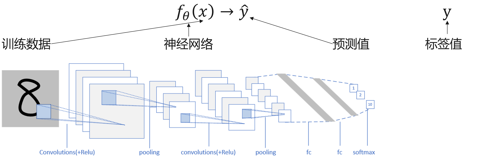
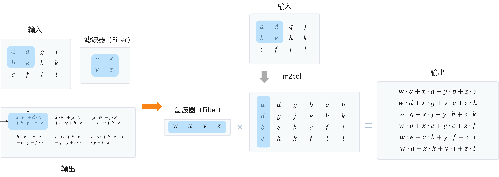
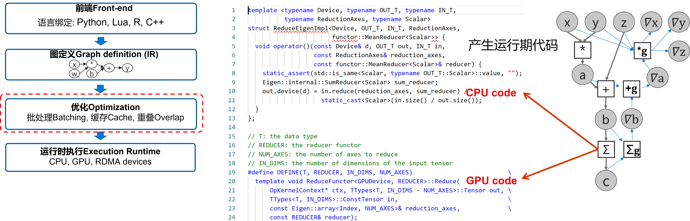
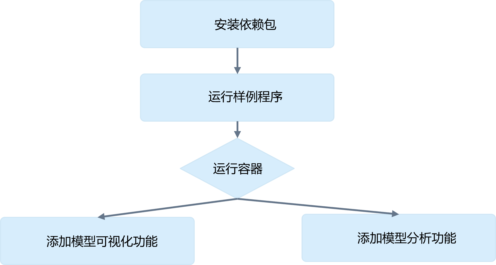

<!--Copyright © Microsoft Corporation. All rights reserved.
  适用于[License](https://github.com/microsoft/AI-System/blob/main/LICENSE)版权许可-->

# 1.4 深度学习样例背后的系统问题

算法工程师通过 Python 和框架书写人工智能程序，而人工智能程序底层的系统问题被当前层的抽象隐藏，到底在每个代码部分具体底层发生了什么？有哪些有意思的系统设计问题？我们将从一个实例启发读者，并和后面各个章节构建起桥梁与联系。

- [1.4 深度学习样例背后的系统问题](#14-深度学习样例背后的系统问题)
  - [1.4.1 一个深度学习样例与其中的系统问题](#141-一个深度学习样例与其中的系统问题)
  - [1.4.2 模型算子实现中的系统问题](#142-模型算子实现中的系统问题)
  - [1.4.3 框架执行深度学习模型的生命周期](#143-框架执行深度学习模型的生命周期)
  - [1.4.4 更广泛的人工智能系统生态](#144-更广泛的人工智能系统生态)
  - [1.4.5 深度学习框架及工具入门实验](#145-深度学习框架及工具入门实验)
    - [1.4.5.1 实验目的](#1451-实验目的)
    - [1.4.5.2 实验环境](#1452-实验环境)
    - [1.4.5.3 实验原理](#1453-实验原理)
    - [1.4.5.4  实验内容](#1454--实验内容)
    - [1.4.5.5  实验计划](#1455--实验计划)
  - [小结与讨论](#小结与讨论)
  - [参考文献](#参考文献)

## 1.4.1 一个深度学习样例与其中的系统问题

如下图 1.5.1 所示，我们可以看到一个深度学习模型可以接受输入（例如，当前手写数字图片），产生输出（例如图中为数字分类），这个过程叫前向传播（Forward Propagation）。那么如何得到一个针对当前已有的输入输出数据上，预测效果最好的模型呢？我们需要通过训练的过程，训练过程可以抽象为一个优化问题，优化目标为:
$$\theta = argmin_{\theta}\sum[Loss(f_{\theta}(x), y)]$$
其中的 $f_{\theta}$ 代表深度学习模型，例如后面提到的LeNet，$Loss$ 代表损失函数，$x$ 代表数据中的输入也就是图像，$y$ 代表数据中的标签值，也就是输出，训练的过程就是找到最小化 $Loss$ 的 $\theta$ 取值，$\theta$ 也称作权重。在训练过程中将通过梯度下降算法进行求解，$\theta = \theta - \alpha \delta_{\theta}Loss(\theta)$，其中 $\alpha$ 也叫学习率(Learning Rate)。当训练完成，就可以通过 $\hat{y} = f_\theta(x)$ 进行推理，使用和部署模型。

<center></center>
<center>图 1.5.1 深度学习训练过程</center>

如下图 1.5.2 所示，左上角的图示中展示的是输入为手写数字图像，输出为分类向量，中间的矩形为各层输出的特征图，我们将其映射为具体的实现代码，其结构通过图右侧定义出来。我们可以看到深度学习模型就是通过各个层将输入图像通过多个层的算子处理为类别输出概率向量。用户一般经过两个阶段进行构建: （1）定义网络结构，例如图中和下面代码实例中构建的 LeNet 网络，其中包含有二维卷积（Conv2D），最大池化（MaxPool2D），全连接（Linear）层。（2）开始训练，遍历一个批尺寸（Batch Size）数据，设置计算资源，前向传播计算，计算损失（Loss）。

<center></center>
<center>图 1.5.2 PyTorch训练LeNet实例</center>

下面的实例是 PyTorch 在 MNIST 数据集上训练一个卷积神经网络 [LeNet](http://yann.lecun.com/exdb/lenet/)[<sup>[1]</sup>](#lenet) 的代码实例。具体解释请读者参考代码中的注释，代码入口为 "def main():" 函数。

```
...
# 读者可以参考"第 3 章深度学习框架基础"理解深度学习框架的底层原理和设计
import torch
...

# 如果模型层数多，权重多到无法在单 GPU 显存放置，我们需要通过模型并行方式进行训练，读者可以参考"第6章分布式训练算法与系统"进行了解
class LeNet(nn.Module):
    def __init__(self):
        super(LeNet, self).__init__()
        # 请参考 1.4.2 小节，通过循环实现卷积理解卷积的执行逻辑并思考其中的潜在系统问题
        self.conv1 = nn.Conv2d(3, 6, 5)
        # 我们能否调整超参数6为64？如何高效的搜索最有的配置？这些内容我们将在"第 9 章自动化机器学习系统"展开介绍
        self.conv2 = nn.Conv2d(6, 16, 5)
        self.fc1 = nn.Linear(16*5*5, 120)
        self.fc2 = nn.Linear(120, 84)
        self.fc2 = nn.Linear(84, 10)

    def forward(self, x):
        out = F.relu(self.conv1(x))
        out = F.max_pool2d(out, 2)
        out = F.relu(self.conv2(out))
        out = F.max_pool2d(out, 2)
        out = out.view(out.size(0), -1)
        out = F.relu(self.fc1(out))
        out = F.relu(self.fc2(out))
        out = self.fc3(out)
        return out


def train(args, model, device, train_loader, optimizer, epoch):
    # 如何进行高效的训练，运行时是如何执行的？我们将在"第 3 章深度学习框架基础"进行介绍
    model.train()
    for batch_idx, (data, target) in enumerate(train_loader):
        data, target = data.to(device), target.to(device)
        optimizer.zero_grad()
        output = model(data)
        loss = F.nll_loss(output, target)
        loss.backward()
        optimizer.step()
        ...


def test(model, device, test_loader):
    model.eval()
    ... 
    with torch.no_grad():
        for data, target in test_loader:
            data, target = data.to(device), target.to(device)
            # 推理系统如何高效进行模型推理？我们将在"第 8 章深度学习推理系统"进行介绍
            output = model(data)
            ...


def main():
    ...
    # 当前语句决定了使用哪种加速器，读者可以通过"第4章矩阵运算与计算机体系结构"了解不同加速器的体系结构及底层原理。
    device = torch.device("cuda" if use_cuda else "cpu")
    # 如果batch size过大，造成单GPU内存无法容纳模型及中间激活的张量，读者可以参考"第 6 章分布式训练算法与系统"进行了解如何分布式训练
    train_kwargs = {'batch_size': args.batch_size}
    test_kwargs = {'batch_size': args.test_batch_size}
    ...
    """
    如何高效的进行数据读取？这些内容我们将在"第7章异构计算集群调度与资源管理系统"进行介绍。
    如果我们训练的数据集和模型是为了解决预测系统优化配置问题，我们想训练的模型是优化系统配置，那么读者可以参考"第 13 章人工智能优化计算机系统"，思考如何将 AI 应用到系统优化。
    如果我们的数据集没有提前准备好，需要实时和环境交互获取，那么读者可以参考"第 10 章强化学习系统"进行理解。
    """
    dataset1 = datasets.MNIST('../data', train=True, download=True, transform=transform)
    dataset2 = datasets.MNIST('../data', train=False, transform=transform)
    train_loader = torch.utils.data.DataLoader(dataset1,**train_kwargs)
    test_loader = torch.utils.data.DataLoader(dataset2, **test_kwargs)
    model = LeNet().to(device)
    optimizer = optim.Adadelta(model.parameters(), lr=args.lr)
    ... 
    for epoch in range(1, args.epochs + 1):
        train(args, model, device, train_loader, optimizer, epoch)
        # 模型如果训练完成需要部署，我们如何压缩和量化后再部署？读者可以参考"第 11 章深度学习推理系统"进行了解
        test(model, device, test_loader)
        ... 

# 如果用户提交多个这样的训练作业，系统如何调度和管理资源？读者可以参考"第7章异构计算集群调度与资源管理系统"进行了解
if __name__ == '__main__':
    main()
```

## 1.4.2 模型算子实现中的系统问题

我们在深度学习中所描述的层（Layer），一般在深度学习编译器或者算子中也称作操作符（Operator）。底层算子的具体实现时先将其映射或转换为对应的矩阵运算（例如，通用矩阵乘），再由其对应的矩阵运算翻译为对应的循环（目前我们简化问题，后面的实例中忽略 stride 等其他超参数影响）。

图 1.5.3 的卷积层实例中，每次选取输入数据一层的一个窗口（例如和卷积核一样的宽高）然后和对应的卷积核(例如 Filter-1 中的 $5 \times 5$ 卷积核代表高 5 维宽 5 维的矩阵)进行[矩阵内积（Dot Product）](https://en.wikipedia.org/wiki/Dot_product)运算，最后将所有的计算结果与偏置项$b$相加后输出。
然后一次沿着行进行滑动移动一定的步长，进行下次矩阵内积计算，直到边界后再沿着一定步长跳到下一列重复刚才的滑动窗口。这些结果最终组合成输出矩阵也就是产生特征图（Feature Map）。
例如，图中所示的维度为，输入张量形状（Tensor Shape）为 $3 \times 32 \times 32$（3 代表通道，32 代表张量高度，32 代表张量宽度），经过 $2 \times 3 \times 5 \times 5$ 的卷积（2 代表输出通道数，3 代表输入通道数，5 代表卷积核高度，5 代表卷积核宽度）后，输出张量形状(Tensor Shape)为$2 \times 28 \times 28$（2 代表通道，28 代表高，28 代表宽）。

<center></center>
<center>图 1.5.3 Conv2D 计算过程实例 (<a href="https://github.com/microsoft/ai-edu">图片引用 ai-edu</a>)</center>

我们以卷积算子为例，图中所示的卷积的计算可以表达为多层嵌套循环，我们以下面代码为例进行分析。

```
# 为简化阐述计算过程，我们简化没有呈现维度（Dimension）的形状推导（Shape Inference）。
# Conv2D 将被转换为如下的7层循环进行计算:

# 批尺寸维度 batch_size
for n in range(batch_size):
  # 输出张量通道维度 output_channel
  for oc in range(output_channel):
    # 输入张量通道维度 input_channel
    for ic in range(input_channel):
      # 输出张量高度维度 out_height
      for h in range(out_height):
        # 输出张量宽度维度 out_width
        for w in range(out_width):
          # 卷积核高度维度 filter_height
          for fh in range(filter_height):
            # 卷积核宽度维度 filter_width
            for fw in range(filter_width):
              # 乘加（Multiply Add）运算
              output[h, w, oc] += input[h + fw, w + fh, ic] * kernel[fw, fh, c, oc]  
```

在这其中有很多有趣的问题问题读者可以思考与预估：

- 算法变换：从算法来说，当前7层循环可以转换为更加易于优化和高效的矩阵计算(例如，[cuDNN](https://docs.nvidia.com/deeplearning/cudnn/)[<sup>[2]</sup>](#cudnn) 库中的卷积就提供了[多种实现算法](https://docs.nvidia.com/deeplearning/cudnn/api/index.html#cudnnConvolutionForward))方式。这些算法被封装在库中，有些框架会在运行时动态调优选择不同算法策略，读者可以参考第 3 章进行更多的了解。

深度学习加速库（例如 cuDNN 等）通常通过应用 [im2col](https://hal.inria.fr/inria-00112631/document) 函数将卷积转换为通用矩阵乘法（General Matrix Multiplication）缩写 [GEMM](https://en.wikipedia.org/wiki/GEMM)，如图 1.4.4 所示。cuDNN 也支持利用其他算法实现卷积，例如 FFT， WINOGRAD 等。通用矩阵乘是计算机视觉和自然语言处理模型中的主要的计算原语（例如，卷积，全连接，平均池化，注意力等算子均可以转换为 GEMM），同时底层 GPU 和其他专有人工智能芯片ASIC也针对矩阵乘作为底层支持（例如 NVIDIA GPU 张量核（[Tensor Core](https://www.nvidia.com/en-us/data-center/tensor-cores/)），TPU 脉动阵列的矩阵乘单元（Matrix Multiply Unit）等），这样的转换就可以让算子利用专有底层硬件和软件的优化。

<center> </center>

图 1.4.4 卷积通过 im2col 转换为通用矩阵乘（图中我们使用一个卷积核和一个输入图片通道为例简要说明）(<a href="https://arxiv.org/pdf/2005.13076.pdf">图片引用 PHAST[<sup>[3]</sup>](#im2col)</a>)

- 利用片上内存：其中参与计算的输入，权重和输出张量能否完全放入 GPU 缓存（L1，L2）？如果不能放入则需要通过循环块（Tile）编译优化进行切片，这些内容将在第5章着重介绍。
- 局部性：循环执行的主要计算语句是否有局部性可以利用？空间局部性（缓存线内相邻的空间是否会被连续访问）以及时间局部性（同一块内存多久后还会被继续访问），这样我们可以通过预估后，尽可能的通过编译调度循环执行，这些内容将在第 5 章着重介绍。在 1.5 中我们也将打印矩阵乘的局部性，读者可以参考理解。
- 近似计算：如果有些权重为 0 是否可以不进行计算？读者可以参考第 11 章稀疏性（Sparsity）部分进行了解。
- 内存管理与扩展（Scale Out）：读者可以[预估](https://www.microsoft.com/en-us/research/uploads/prod/2020/09/dnnmem.pdf)各个层的输出（Output）张量，输入（Input）张量，和内核（Kernel）张量大小，进而评估是否需要多卡，内存管理策略设计，以及换入换出策略等。读者可以参考第 5，8 章相关内存优化与管理内容。
- 运行时任务调度：那么当算子与算子在运行时按一定调度次序执行，框架如何进行运行时管理，请读者参考第 3 章相关内容理解

## 1.4.3 框架执行深度学习模型的生命周期

“Inside every large program is a small program struggling to get out.”--Tony Hoare。

我们从下面实例会看到，目前算法工程师只需要书写核心算法（small program - 核心算法与高层设计），而不需要关注底层的很多代码（底层 large program）细节，通过层层抽象，提升了开发效率，但是对系统研发却隐藏了细节，需要我们进一步探究。

在之前的实例中，我们基本知晓 Python 书写训练程序，以及深度学习框架代码中的一个算子（例如，卷积）是如何翻译成底层 for 循环计算的，这类 for 循环计算通常可以被设备厂商提供的运行时算子库抽象，不需要用户继续书写 for 循环了，例如 cuDNN 提供卷积的实现和 API。

如图 1.4.5 所示，相当于我们已经抽象到了 cuDNN 这层书写，似乎我们已经提升了很多开发效率

- 我们为什么还需要深度学习框架（例如，TensorFlow，PyTorch）？
- 那么框架作为至关重要的深度学习系统究竟在其中扮演什么角色和做了其他什么工作呢？
- 用户的 Python 代码是如何一步步翻译到底层的具体实现呢？

我们以一个实例为例介绍：

<center> </center>
<center>图 1.4.5 深度学习程序的层次化调用关系</center>

首先，我们先对比一下，如果没有深度学习框架，而只将算子 for 循环抽象提供算子库（例如，cuDNN）的调用，读者将只能通过设备提供的底层 API 编写作业。例如，通过 CUDA + cuDNN 库书写卷积神经网络（[cuDNN书写的卷积神经网络LeNet实例](https://github.com/tbennun/cudnn-training)）[<sup>[4]</sup>](#cudnnlenet)。

我们通过 LeNet 实现实例，对比 cuDNN + CUDA 这层抽象还不足以让算法工程师非常高效的设计模型和书写算法。如下两个实例所示，同样实现 LeNet，使用高层框架只需要 9 行，而通过 cuDNN 需要上千行代码，而且还需要精心的管理内存分配释放，拼接模型计算图，效率十分低下。

***(1) 通过cuDNN + CUDA API编程实现LeNet，需要~1000行实现模型结构和内存管理等逻辑***
[参考实例 cudnn-training](https://github.com/tbennun/cudnn-training/blob/master/lenet.cu)

```C++
// 内存分配，如果用深度学习框架此步骤会省略
...
cudaMalloc(&d_data, sizeof(float) * context.m_batchSize * channels * height * width);
cudaMalloc(&d_labels, sizeof(float) * context.m_batchSize * 1  * 1 * 1);
cudaMalloc(&d_conv1, sizeof(float) * context.m_batchSize * conv1.out_channels * conv1.out_height * conv1.out_width);
...
// 前向传播第一个卷积算子（仍需要写其他算子）
...
cudnnConvolutionForward(cudnnHandle, &alpha, dataTensor,
                        data, conv1filterDesc, pconv1, conv1Desc, 
                        conv1algo, workspace, m_workspaceSize, &beta,
                        conv1Tensor, conv1);
...
// 反向传播第一个卷积算子（仍需要写其他算子），如果用深度学习框架此步骤会省略
cudnnConvolutionBackwardBias(cudnnHandle, &alpha, conv1Tensor,
                             dpool1, &beta, conv1BiasTensor, gconv1bias);

cudnnConvolutionBackwardFilter(cudnnHandle, &alpha, dataTensor,
                               data, conv1Tensor, dpool1, conv1Desc,
                               conv1bwfalgo, workspace, m_workspaceSize, 
                               &beta, conv1filterDesc, gconv1));
// 第一个卷积权重梯度更新（仍需要写其他算子），如果用深度学习框架此步骤会省略
cublasSaxpy(cublasHandle, static_cast<int>(conv1.pconv.size()),
            &alpha, gconv1, 1, pconv1, 1);
cublasSaxpy(cublasHandle, static_cast<int>(conv1.pbias.size()),
            &alpha, gconv1bias, 1, pconv1bias, 1);
// 内存释放，如果用深度学习框架此步骤会省略
...
cudaFree(d_data);
cudaFree(d_labels);
cudaFree(d_conv1);
...
```

***(2) 通过 Keras 书写 LeNet （TensorFlow Backend）[<sup>[5]</sup>](#keraslenet)，只需要 9 行构建模型结构，算上训练逻辑只需要几十行代码***
[参考文档 LeNet-5-with-Keras](https://github.com/TaavishThaman/LeNet-5-with-Keras/blob/master/lenet_5.py)

```python
model = keras.Sequential()
model.add(layers.Conv2D(filters=6, kernel_size=(3, 3), activation='relu', input_shape=(32,32,1)))
model.add(layers.AveragePooling2D())
model.add(layers.Conv2D(filters=16, kernel_size=(3, 3), activation='relu'))
model.add(layers.AveragePooling2D())
model.add(layers.Flatten())
model.add(layers.Dense(units=120, activation='relu'))
model.add(layers.Dense(units=84, activation='relu'))
model.add(layers.Dense(units=10, activation = 'softmax'))
```

从上面我们看到，深度学习框架对算法工程师开发深度学习模型，训练模型非常重要。总结起来，深度学习框架一般会提供以下功能：

1. 以 Python API 供读者编写复杂的模型计算图（Computation Graph）结构，调用基本算子实现（例如，卷积的 cuDNN 实现），大幅降低开发代码量。
2. 自动化内存管理，不暴露指针和内存管理给用户。
3. 自动微分（Automatic Differentiation）的功能，并能自动构建反向传播计算图，与前向传播图拼接成统一计算图。
4. 调用或生成运行期优化代码（静态优化）
5. 调度算子在指定设备的执行，并在运行期应用并行算子，提升设备利用率等优化（动态优化）。

从上面我们已经感受到深度学习框架已经我们解决了很多底层系统问题，隐藏了很多细节，但是这些细节和底层实现又是系统工程师比较关注的。接下来我们以一个深度学习作业如何被框架一步步底层执行的流程为例，为大家揭开框架底层隐藏的实现。 
TensorFlow 也是应用非常广泛的框架，相比 PyTorch 的[命令式执行（Imperative Execution）](https://en.wikipedia.org/wiki/Imperative_programming)方式（运行到算子代码即触发执行，易于调试），TensorFlow 采用[符号执行（Symbolic Execution）](https://en.wikipedia.org/wiki/Symbolic_execution) （调用 session.run 才真正触发执行，并且框架能获取完整计算图进行优化）方式。二者详细区别我们将在后面框架章节进行介绍。我们在下面的图示和实例中以 TensorFlow 的一个简单程序为例，展示一个深度学习模型是如何被深度学习框架静态（Static）编译与运行时动态（Dynamic）管理的。

如图 1.4.6 到图 1.4.9 所示，我们通过划分不同阶段，解释一个 TensorFlow 程序完成一个精简模型 x*y + z 的训练全生命周期。

（1）前端程序转换为数据流图：如图 1-4-6 所示，这个阶段框架会将用户书写的模型程序，通过预先定义的接口，翻译为中间表达（Intermediate Representation），并且构建算子直接的依赖关系，形成前向数据流图（Data-Flow Graph）。

<center> </center>
<center>图 1.4.6 Python + TensorFlow 程序解析为中间表达和前向传播数据流图</center>

（2）反向求导：如图 1-4-7 所示，这个阶段框架会分析形成前向数据流图，通过算子之前定义的反向传播算子，构建反向传播数据流图，并和前向传播数据流图一起形成整体的数据流图。

<center> </center>
<center>图 1.4.7 反向求导，自动微分(Automatic Differentiation)</center>

（3）产生运行期代码：如图 1.4.8 所示，这个阶段框架会分析整体的数据流图，并根据运行时部署所在的设备（CPU，GPU 等），将算子中间表达产生为算子针对特定设备的运行期的代码，例如图中的 CPU 的 C++ 算子实现或者 GPU 的 CUDA 算子实现。

<center> </center>
<center>图 1.4.8 产生运行期代码</center>

（4）调度并运行代码：如图 1.4.9 所示，这个阶段框架会将算子及其运行期的代码实现，依次根据依赖关系，调度到计算设备上进行执行。对一些不方便静态做优化的选择，可以通过运行期调度达到，例如，并发（Concurrent）计算与 I/O，如有空闲资源并行执行没有依赖的算子等。目前框架例如，[PyTorch](https://proceedings.neurips.cc/paper/2019/file/bdbca288fee7f92f2bfa9f7012727740-Paper.pdf)，[TensorFlow](https://github.com/tensorflow/runtime/blob/master/documents/cuda-proposal.md#core-design-principles-and-decisions) 一般选择单 CUDA Stream 在 NVIDIA GPU 侧进行算子内核调度，数据加载会选择再设置其他 Stream。例如，PyTorch 出于[以下考量](https://proceedings.neurips.cc/paper/2019/file/bdbca288fee7f92f2bfa9f7012727740-Paper.pdf)[<sup>[6]</sup>](#pytorch)，以一种让他们合作共享 GPU 的方式编写 CUDA 内核较为困难，因为精确的调度是硬件控制。在实践中，内核编写者通常组合多个任务形成单片内核。数据加载和分布式计算实用程序是单 Stream 设计的例外，它们小心地插入额外的同步以避免与内存分配器的不良交互。

<center> </center>
<center>图 1.4.9 调度并运行代码</center>

综上所示，我们通过上面两个小节可以发现，如果没有框架和算子库的支持，算法工程师进行简单的深度学习模型设计与开发都会举步维艰，所以我们看到深度学习算法本身飞速发展的同时，也要看到底层系统对提升整个算法研发的生产力起到了不可或缺的作用。

## 1.4.4 更广泛的人工智能系统生态

除了以上小节框架本身提供的功能进行单模型训练，当前还在以下几个方面存在更广泛的人工智能系统生态。

- 更多的超参数组合与模型结构探索
  - 之前我们看到的实例本身是单个模型的样例，但是深度学习模型可以通过变换其中的超参数和模型结构获取和训练更好的结果，这种探索式的过程也叫做自动化机器学习，读者可以参考第9章-自动化机器学习系统了解相关领域内容与挑战。
- 共享的资源与多租的环境
  - 如果我们现在的 GPU 等训练资源都是被公司或组织机构集中管理，用户需要共享使用资源进而提升资源整体利用率，那么在这种环境下系统如何提供给算法工程师接近单机的使用环境体验让算法工程师更加简便高效的使用资源？读者可以参考第7章-异构计算集群调度与资源管理系统进行了解平台如何应对当前的挑战。
- 假设数据无法离线提前准备好？
  - 如果数据没有提前准备好，需要系统提供更加多样的训练方式，深度学习系统需要不断与环境或者模拟器交互，通过强化学习方式进行训练，读者可以参考第 10 章-强化学习系统进行了解，强化学习系统如何在更复杂与多样的场景下进行模型训练以及数据获取。
- 数据和人工智能模型的安全与隐私如何保障？
  - 当前深度学习为数据驱动的方法，同时会产生交付的模型文件，模型泄露，篡改以及本身的缺陷会造成潜在的安全风险。如何保障深度学习整体的安全与隐私相比传统安全领域遇到了新的挑战，读者可以参考第12章-人工智能安全与隐私进行了解。
- 之前我们大部分了解的是针对人工智能负载做系统设计也称作 System for AI，反过来我们也可以思考如何通过人工智能这种数据驱动的方法反过来指导系统设计与优化，也就是 AI for System，读者可以参考第13章-人工智能优化计算机系统进行了解。

## 1.4.5 深度学习框架及工具入门实验

Remzi Arpaci-Dusseau（University of Wisconsin—Madison）曾在 2019 年 FAST（USENIX Conference on File and Storage Technologies）大会上演讲“[Measure, Then Build](https://www.usenix.org/conference/atc19/presentation/keynote#:~:text=This%20talk%20will%20discuss%20an,implementing%20new%20systems%20to%20solve)”[<sup>[7]</sup>](#measurebuild)和 2022 年 FAST 大会上演讲“[FAST '22 - 25 Years of Storage Research and Education: A Retrospective](https://www.youtube.com/watch?v=u9RECEzxk6I)”[<sup>[8]</sup>](#storageresearch)，其中提到系统研与学习工作中度量之后构建 ***[“Measure, Then Build”](https://www.usenix.org/conference/atc19/presentation/keynote#:~:text=This%20talk%20will%20discuss%20an,implementing%20new%20systems%20to%20solve)*** 的系统工作研究方法。

核心想法是：通过度量（Measurement）去学习和找到实际的问题。
螺旋式学习路线：

1. 度量（Measure）

2. 理解（Understand）
   
   2.1. 学习到新的机会
   
   2.2. 启发新的想法

3. 构建（Build）

4. 重复1~3的过程

其提出：研究是一种学习练习 “Research is a learning exercise”，不断思考什么是可度量的，以及如何从中可以学到什么。

那么我们也开始从度量深度学习作业的执行进而感知和学习深度学习系统，为后续更深入的学习形成具象的认知。

读者可以通过本小节的实验，初步感受与观测人工智能系统的运行。

通过在深度学习框架上调试和运行样例程序，观察不同配置下的运行结果，了解深度学习系统的工作流程。通过实验读者将了解：（1）深度学习框架及工作流程（Deep Learning Workload）。（2）在不同硬件和批尺寸（Batch Size）条件下，张量运算产生的开销。

具体实现细节请大家参考实验 [AI-System Lab1 框架及工具入门示例](https://github.com/microsoft/AI-System/tree/main/Labs/BasicLabs/Lab1)。

实验（Experiment）与遥测（Telemetry）是系统工作必不可少的环节，同时系统研究与工作离不开动手实践。希望读者通过上面实例端到端跑通样例并对相关工具和系统有初步的实践体验。

### 1.4.5.1 实验目的

1. 了解深度学习框架及工作流程（Deep Learning Workload）
2. 了解在不同硬件和批尺寸（Batch Size）条件下，张量运算产生的开销

### 1.4.5.2 实验环境

* PyTorch==1.5.0

* TensorFlow>=1.15.0

* 【可选环境】 单机Nvidia GPU with CUDA 10.0

### 1.4.5.3 实验原理

通过在深度学习框架上调试和运行样例程序，观察不同配置下的运行结果，了解深度学习系统的工作流程。

### 1.4.5.4  实验内容

***实验流程图***

<center> </center>
<center>图 1.4.10 实验流程图</center>

***具体步骤***

1. 安装依赖包。PyTorch==1.5, TensorFlow>=1.15.0

2. 下载并运行 PyTorch 仓库中提供的 MNIST 样例程序。

3. 修改样例代码，保存网络信息，并使用 TensorBoard 画出神经网络数据流图。

4. 继续修改样例代码，记录并保存训练时正确率和损失值，使用 TensorBoard 画出损失和正确率趋势图。

5. 添加神经网络分析功能（profiler），并截取使用率前十名的操作。

6. 更改批次大小为1，16，64，再执行分析程序，并比较结果。

7. 【可选实验】改变硬件配置（e.g.: 使用/ 不使用 GPU），重新执行分析程序，并比较结果。

### 1.4.5.5  实验计划

***实验环境***

|      |                        |                                                                                                                                             |
| ---- | ---------------------- | ------------------------------------------------------------------------------------------------------------------------------------------- |
| 硬件环境 | CPU（vCPU数目）            | &nbsp; &nbsp; &nbsp; &nbsp; &nbsp; &nbsp; &nbsp; &nbsp; &nbsp; &nbsp; &nbsp; &nbsp; &nbsp; &nbsp; &nbsp; &nbsp; &nbsp; &nbsp; &nbsp; &nbsp; |
|      | GPU(型号，数目)             |                                                                                                                                             |
| 软件环境 | OS版本                   |                                                                                                                                             |
|      | 深度学习框架<br>python包名称及版本 |                                                                                                                                             |
|      | CUDA版本                 |                                                                                                                                             |
|      |                        |                                                                                                                                             |

***实验结果***

1. 模型可视化结果截图

|                                                      |                                                                                                                                                           |
| ---------------------------------------------------- | --------------------------------------------------------------------------------------------------------------------------------------------------------- |
| <br/>&nbsp;<br/>神经网络数据流图<br/>&nbsp;<br/>&nbsp;       | &nbsp; &nbsp; &nbsp; &nbsp; &nbsp; &nbsp; &nbsp; &nbsp; &nbsp; &nbsp; &nbsp; &nbsp; &nbsp; &nbsp; &nbsp; &nbsp; &nbsp; &nbsp; &nbsp; &nbsp; &nbsp; &nbsp; |
| <br/>&nbsp;<br/>损失和正确率趋势图<br/>&nbsp;<br/>&nbsp;      |                                                                                                                                                           |
| <br/>&nbsp;<br/>网络分析，使用率前十名的操作<br/>&nbsp;<br/>&nbsp; |                                                                                                                                                           |
|                                                      |                                                                                                                                                           |

2. 网络分析，不同批大小结果比较

|                                          |                                                                            |
| ---------------------------------------- | -------------------------------------------------------------------------- |
| 批大小 &nbsp;                               | &nbsp; &nbsp; &nbsp; &nbsp; &nbsp; 结果比较 &nbsp; &nbsp; &nbsp; &nbsp; &nbsp; |
| <br/>&nbsp;<br/>1<br/>&nbsp;<br/>&nbsp;  |                                                                            |
| <br/>&nbsp;<br/>16<br/>&nbsp;<br/>&nbsp; |                                                                            |
| <br/>&nbsp;<br/>64<br/>&nbsp;<br/>&nbsp; |                                                                            |
|                                          |                                                                            |

***参考代码***

1. MNIST样例程序：
   
   代码位置：AI-System/Labs/BasicLabs/Lab1/mnist_basic.py
   
   运行命令：`python mnist_basic.py`

2. 可视化模型结构、正确率、损失值
   
   代码位置：AI-System/Labs/BasicLabs/Lab1/mnist_tensorboard.py
   
   运行命令：`python mnist_tensorboard.py`

3. 网络性能分析
   
   代码位置：AI-System/Labs/BasicLabs/Lab1/mnist_profiler.py

***参考资料***

* 样例代码：[PyTorch-MNIST Code](https://github.com/pytorch/examples/blob/master/mnist/main.py)
* 模型可视化：
  * [PyTorch Tensorboard Tutorial](https://pytorch.org/tutorials/intermediate/tensorboard_tutorial.html) 
  * [PyTorch TensorBoard Doc](https://pytorch.org/docs/stable/tensorboard.html)
  * [pytorch-tensorboard-tutorial-for-a-beginner](https://medium.com/@rktkek456/pytorch-tensorboard-tutorial-for-a-beginner-b037ee66574a)
* Profiler：[how-to-profiling-layer-by-layer-in-pytroch](https://stackoverflow.com/questions/53736966/how-to-profiling-layer-by-layer-in-pytroch)

## 小结与讨论

本章我们主要通过一些实例启发读者建立本书各个章节之间的联系，由于系统的多层抽象造成我们实践人工智能的过程中已经无法感知底层系统的运行机制，希望读者结合后面章节的学习后，能够看到深度学习系统底层的作用和复杂性，并从中指导上层人工智能作业和代码更加高效的书写。

请读者读完后面章节后再回看当前章节，并重新思考当前书写的人工智能Python代码底层发生了什么？

## 参考文献

<div id="lenet"></div>

1. [Y. Lecun, L. Bottou, Y. Bengio and P. Haffner, "Gradient-based learning applied to document recognition," in Proceedings of the IEEE, vol. 86, no. 11, pp. 2278-2324, Nov. 1998, doi: 10.1109/5.726791.]()

<div id="cudnn"></div>

2. [Chetlur, Sharan, et al. "cudnn: Efficient primitives for deep learning." arXiv preprint arXiv:1410.0759 (2014).](https://arxiv.org/abs/1410.0759)

<div id="im2col"></div>

3. [Gómez-Hernández, Eduardo José, et al. "Using PHAST to port Caffe library: First experiences and lessons learned." arXiv preprint arXiv:2005.13076 (2020).](https://arxiv.org/abs/2005.13076)

<div id="cudnnlenet"></div>

4. [https://github.com/tbennun/cudnn-training](https://github.com/tbennun/cudnn-training)

<div id="keraslenet"></div>

5. [https://github.com/TaavishThaman/LeNet-5-with-Keras](https://github.com/TaavishThaman/LeNet-5-with-Keras)

<div id="pytorch"></div>

6. [Paszke, Adam, et al. "Pytorch: An imperative style, high-performance deep learning library." Advances in neural information processing systems 32 (2019).](https://arxiv.org/abs/1912.01703)

<div id="measurebuild"></div>

7. [Remzi Arpaci-Dusseau, University of Wisconsin—Madison. Measure, Then Build. ATC 2019](https://www.usenix.org/conference/atc19/presentation/keynote#:~:text=This%20talk%20will%20discuss%20an,implementing%20new%20systems%20to%20solve)

<div id="storageresearch"></div>

8. [Remzi Arpaci-Dusseau, University of Wisconsin—Madison. 25 Years of Storage Research and Education: A Retrospective. FAST 2022](https://www.usenix.org/conference/fast22/presentation/keynote)
