<!--Copyright © Microsoft Corporation. All rights reserved.
  适用于[License](https://github.com/microsoft/AI-System/blob/main/LICENSE)版权许可-->

# 1.5 影响深度学习系统设计的理论，原则与假设

变化是唯一不变的 “Change is the only constant”--Heraclitus

没有记住过去的人会重蹈覆辙 “Those who cannot remember the past are condemned to repeat it”--George Santayana, 1905

人工智能系统目前仍是系统研究领域更新与发展较快的方向，新工作层出不穷，似乎我们很难把握其发展趋势与脉络，但是当我们从经典的系统设计理论，原则与假设回过头来看当前很多问题，似乎在更抽象的层面能找到不变的问题与方法。人工智能系统内容保罗万象，涵盖传统计算机体系结构，编译器，操作系统，计算机网络的经典的应用与拓展。同时我们也可以观察到经典的计算机系统相关理论和系统优化方法在深度学习中依然在发挥巨大的作用，我们依然可以将当前很多问题映射和抽象并通过经典理论所解决。那么在展开后面内容之前，我们通过几个代表性理论和在深度学习系统中的应用，以及深度学习作业的独有特点所产生的新问题展开，启发之后我们在学习具体系统问题时形成理论指导。

- [1.5 影响深度学习系统设计的理论，原则与假设](#15-影响深度学习系统设计的理论原则与假设)
  - [1.5.1 抽象-层次化表示与解释](#151-抽象-层次化表示与解释)
  - [1.5.2 摩尔定律（Moore's Law）与算力发展趋势](#152-摩尔定律moores-law与算力发展趋势)
  - [1.5.3 局部性原则（Priciple of Locality）与内存层次结构（Memory Hierarchy）](#153-局部性原则priciple-of-locality与内存层次结构memory-hierarchy)
  - [1.5.4 深度学习负载的线性代数（Linear Algebra）计算与缺陷容忍（Defect Tolerance）特性](#154-深度学习负载的线性代数linear-algebra计算与缺陷容忍defect-tolerance特性)
  - [1.5.5 并行（Parallel）加速与阿姆达尔定律（Amdahl's Law）优化上限](#155-并行parallel加速与阿姆达尔定律amdahls-law优化上限)
  - [1.5.6 冗余（Redundancy）与可靠性（Dependability）](#156-冗余redundancy与可靠性dependability)
  - [小结与讨论](#小结与讨论)
  - [参考文献](#参考文献)

## 1.5.1 抽象-层次化表示与解释

计算机系统中的分层设计是关注点分离（[Separation of Concerns](https://en.wikipedia.org/wiki/Separation_of_concerns)）原则的另一个体现（例如图 1-5-1 中的深度学习系统的各层表示)。为什么会有抽象-层次化（Layering）？正如 2010 年 N. Vlajic 在 “[Layered Architectures and Applications](https://www.eecs.yorku.ca/course_archive/2010-11/F/3213/CSE3213_03_LayeredArchitecture_F2010.pdf)”[<sup>[1]</sup>](#layered) 中总结到：“

- 模块化（Modularity）：文本被解耦为一系列更小的可控的子问题，每个子问题可以独立敏捷演化和解决。
- 功能复用：底层的功能可以被上层复用。
- 更敏捷的增量更新与演化：单片（Monolithic）系统设计修改起来非常昂贵，层次化设计可以更新更加敏捷。”

深度学习系统也遵循层次化的设计。系统会在各个层次抽象不同的表示，在高层方便用户表达算子，在底层则被转换为指令被芯片执行。这样搭积木的方式让整个工具链快速协同发展且能复用，大为加速了开发效率与自动化。

我们一般通过 Python 语言书写和调用深度学习库完成整个机器学习流水线的构建，但其实刚刚接触到其中一层，从上到下系统已经为我们抽象了多个层次。我们通过下面实例可以了解各个层次的抽象与表达，为之后的学习形成跨层的视角。

例如图1-5-1.所示，我们通过一个向量加法的实例，从顶到下，看各个层次是如何抽象和层次化标识具体的执行逻辑的：

<center>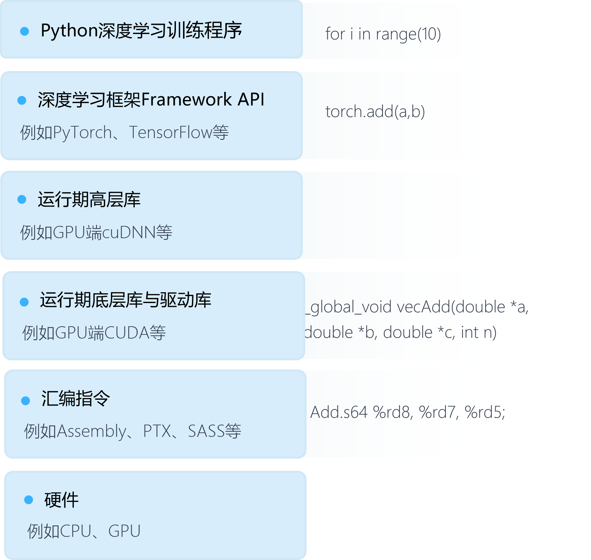</center>
<center>图1-5-1. 深度学习程序的抽象与层次化表达 </center>

- 语言层：Python 语言

在本层可以书写各种控制流（循环），调用库等。

```
for i in range(10):
  # 执行vector add
```

- 框架层：TensorFlow， PyTorch等

例如，我们通过 Python 调用 PyTorch 实现一个简单的向量加法。

```python
impor torch
...
K = ... # 定义向量维度(Dimension)
a = torch.randn(K) # 初始化
b = torch.randn(K)
torch.add(a, b) # PyTorch执行向量加法
```

在本层，我们可以编写深度学习模型，通过卷积，池化，全连接，注意力机制等算子，组合出复杂的数据流图模型。

- 驱动编程库层：CUDA，cuDNN等

当向量加法执行到 CUDA 层，将通过下面 CUDA 编程 API 进行实现。

例如，在 CUDA 层就会实现：

```c++
...
// CUDA内核。每个线程执行一个元素的加法
__global__ void vecAdd(double *a, double *b, double *c, int n)
{
    // 获取全局线程 Id
    int id = blockIdx.x*blockDim.x+threadIdx.x;

    // 确保不越界
    if (id < n)
        c[id] = a[id] + b[id];
}
...
int main( int argc, char* argv[] )
{
... 
    // 启动（Launch）vecAdd CUDA内核（Kernel），通过gridSize和blockSize配置并行线程数量
    vecAdd<<<gridSize, blockSize>>>(d_a, d_b, d_c, n);
...
```

- 汇编指令层：NVIDIA GPU 中有 PTX，SASS 等

PTX 是一种低级并行线程执行虚拟机（Virtual Machine）和指令集架构（ISA），目的是为了跨不同代的 GPU 支持。PTX 将 GPU 暴露为并行计算设备。SASS 是编译成二进制微码的低级汇编语言，绑定指定代设备，在 NVIDIA GPU 硬件上本地执行。PTX 可读性更强，我们下面以 PTX 实例解释向量加法实现。

例如，读者可以书写导出或者参考[实例](https://docs.nvidia.com/cuda/ptx-compiler-api/index.html#sample-example)。

下面为通过工具导出的向量加法的 PTX 指令实例：

```
.visible .entry _Z6vecAddPdS_S_i( // .entry 定义内核入口名(Entry Point Name)
.param .u64 _Z6vecAddPdS_S_i_param_0, // 64位无符号参数_Z6vecAddPdS_S_i_param_0，对应CUDA代码double *a
.param .u64 _Z6vecAddPdS_S_i_param_1, // 对应 CUDA 代码double *b
.param .u64 _Z6vecAddPdS_S_i_param_2, // 对应 CUDA 代码double *c
.param .u32 _Z6vecAddPdS_S_i_param_3 // 对应 CUDA 代码int n
)
{
.reg .pred %p<2>; // 定义谓词（Predicate）寄存器变量，用于放置比较运算符结果
.reg .b32 %r<6>; // 定义一组32比特无类型（Untyped），寄存器变量，未来用于存放常量数组索引
.reg .f64 %fd<4>; // 定义一组64比特浮点型，寄存器变量，用于存取中间结果，未来用于存放输入参数的数据地址
.reg .b64 %rd<11>; // 定义一组64比特无类型（Untyped），寄存器变量，未来用于放置存储结构的数据地址


ld.param.u64 %rd1, [_Z6vecAddPdS_S_i_param_0]; // a 加载到%rd1寄存器
ld.param.u64 %rd2, [_Z6vecAddPdS_S_i_param_1]; // b 加载到%rd2寄存器
ld.param.u64 %rd3, [_Z6vecAddPdS_S_i_param_2]; // c 加载到%rd3寄存器
ld.param.u32 %r2, [_Z6vecAddPdS_S_i_param_3]; // n 加载到%r2寄存器
mov.u32 %r3, %ctaid.x; // 加载 blockIdx.x 到寄存器 %r3
mov.u32 %r4, %ntid.x; // 加载 blockDim.x 到寄存器 %r4
mov.u32 %r5, %tid.x; // 加载 threadIdx.x 到寄存器 %r5
mad.lo.s32 %r1, %r4, %r3, %r5; // 对应 CUDA 代码 int id = blockIdx.x * blockDim.x + threadIdx.x
setp.ge.s32     %p1, %r1, %r2; // %p = (%r1 >= %r2)，%r1代表id，%r2代表n
@%p1 bra BB0_2; // 对应 CUDA 代码 if (id < n)，如果 id < n为假（False）也就是 id >= n 为真（True），跳转到 BB0_2

cvta.to.global.u64 %rd4, %rd1; // 转换 %rd1 也就是 a 为全局内存地址到寄存器 %rd4
mul.wide.s32 %rd5, %r1, 8; // 因为当前地址为64比特也就是8字节，id * 8 的结果放置到寄存器 %rd5，用于未来寻址数组中对应位置数据
add.s64 %rd6, %rd4, %rd5; // 数组 a 全局地址 %rd4加 id * 8结果 %rd5，得到数组第 i 元素地址放置于 %rd6
cvta.to.global.u64 %rd7, %rd2; // 转换 %rd2 也就是 b 为全局内存地址 %rd7，
add.s64 %rd8, %rd7, %rd5; // 数组 b 全局地址 %rd7 加 id * 8 结果 %rd5，得到数组第 i 元素地址放置于 %rd8
ld.global.f64 %fd1, [%rd8]; // 加载全局内存数组 b 的地址 [%rd8]（也就是第 i 个元素）数据到寄存器 %fd1
ld.global.f64 %fd2, [%rd6]; // 加载全局内存数组 a 的地址 [%rd8]（也就是第 i 个元素）数据到寄存器%fd2
add.f64 %fd3, %fd2, %fd1; // 相加寄存器中 a，b 第 i 元素到寄存器 %fd3，对应代码 a[id] + b[id]
cvta.to.global.u64 %rd9, %rd3; // 转换 %rd3 也就是 c 的地址转换为为全局内存地址到寄存器 %rd9
add.s64 %rd10, %rd9, %rd5; // 数组 c 全局地址 %rd9 加 id * 8 结果 %rd5，得到数组第 i 元素地址放置于 %rd10
st.global.f64 [%rd10], %fd3; // 将寄存器 %fd3 的数据也就是 a[id] + b[id] 结果，存储到 c 在全局内存中的 [%rd10] 对应地址空间，也就是第 i 个元素

BB0_2:
ret; // 返回
}
```

- 机器码

每条汇编指令则会在内存中编码（Encode）表示为 "01010010" 形式的二进制序列，最终被芯片解码（Decode）执行。

- 硬件执行单元：ALU，控制单元，寄存器，总线等

例如，在[冯诺依曼架构（Von Neumann architecture）](https://en.wikipedia.org/wiki/Von_Neumann_architecture)[<sup>[2]</sup>](#vonneumann)的 GPU 中分别由指令流水线进行指令存储，加载，解码，并执行指令。通过指令控制，由数据流水线，将数据加载到寄存器，放入 ALU 执行并将结果写回内存。

通过以上从上层到下层的抽象，我们可以看到，越上层对用户隐藏的细节越多，开发效率越高，工具与系统的演化和构建就像 ***搭积木***。系统工作需要在适合的层做相应的抽象和展开工作，这些需要在之后的具体工作中进行取舍。

## 1.5.2 摩尔定律（Moore's Law）与算力发展趋势

摩尔定律（Moore's law）[<sup>[3]</sup>](#moore) 是由英特尔（Intel）创始人之一戈登·摩尔提出的。“集成电路上可容纳的晶体管数目，约每隔两年便会增加一倍。而英特尔首席执行官大卫·豪斯（David House）提出且经常被引用的是预计 18 个月会将芯片的性能提高一倍（即更多的晶体管使其更快）。”

在 GPU 领域，[黄氏定律（Huang’s Law）](https://en.wikipedia.org/wiki/Huang%27s_law#:~:text=Moores%20law%20would%20predict%20a,the%20new%20'law'%20possible.)[<sup>[4]</sup>](#huang)是英伟达创始人黄仁勋提出，即“图形处理器（GPU) 的发展速度比传统中央处理单元 (CPU) 的发展速度要快得多，GPU 的性能每两年将翻一番以上。”

有多种论调在讨论摩尔定律已死，例如，David Patterson 在 IEEE 2018 Spectrum 上发表 “Moore’s Law is over, ushering in a golden age for computer architecture, says RISC pioneer”[<sup>[7]</sup>](#david)，Jensen Huang 在 GTC 2019 提出的“黄氏定律”[<sup>[4]</sup>](#huang)。当然也有一些论调认为摩尔定律还存在，只不过是需要以另一种方式来理解，例如台积电企业研究副总裁 Philip Wong 博士在 2019年的 HotChips（A Symposium on High Performance Chips） 大会上在主题演讲（Keynotes）环节的演讲 “[What Will the Next Node Offer Us?](https://old.hotchips.org/hc31/HC31_2.7_Plenary_2_-_HS_Philip_Wong_-_TSMC_-_What_Will_the_Next_Node_Offer_Us_20190817_hspw4.pdf)”[<sup>[5]</sup>](#wong) 中提出“摩尔定律非常有效（[MOORE’S LAW IS WELL AND ALIVE](https://www.youtube.com/watch?v=O5UQ5OGOsnM)）”，其出发点在于“处理器速度时钟速度已经饱和并不意味着摩尔定律已经失效，就像摩尔博士很多很多年前预测的那样，***密度***（例如，晶体管，逻辑门，SRAM等）不断增加是摩尔定律持续存在的驱动力”。当时还在 Intel 的 Jim Keller 也层做过 ["Moore’s Law is Not Dead"](https://eecs.berkeley.edu/files/jim-keller-moores-law-not-dead)[<sup>[6]</sup>](#jim) 的演讲，并提出：“要理解计算领域的这种不减增长，我们需要将摩尔定律晶体管数量指数解构为计算堆栈中众多独立创新的输出——在硅工艺技术、集成电路设计、微处理器架构和软件方面。虽然晶体管性能和功率等某些向量的收益确实在递减，但晶体管架构、微处理器架构、软件和新材料等其他向量的收益却在增加。”所以我们也看到 ***软件系统*** 也扮演越来越重要的角色，***软硬件协同设计*** 可以进一步挖掘硬件性能。例如，我们在 NVIDIA 的 GPU 中就可以观察到这种趋势，H100 中已经引入变换器引擎，之前系列引入张量核，就是利用算法层的优化思路，如稀疏性等引入到硬件设计中，根据负载特点进行协同优化。

除了随着芯片不断提升算力让系统性能越来越快，我们发现芯片和系统性能还会受到其他约束（Constraint）所限制，这些约束衍生了系统层的系统与系统算法工作设计动机（Motivation）。例如：

- ***[功耗墙](http://www.edwardbosworth.com/My5155_Slides/Chapter01/ThePowerWall.htm)约束***：
  
  - 1990 年代末和 2000 年代初的设计目标是提高时钟频率，这是通过在更小的芯片上添加更多晶体管来实现的。不幸的是，这增加了 CPU 芯片的功耗，且超出了廉价冷却技术的能力。所以这种约束让工业界有两种路线，一种是采用更复杂的冷却技术，一种是转向多核设计。我们目前看到的针对人工智能设计的芯片也都是多核或者是众核的。
    参考表 1.5.1 受限于功耗墙，我们可以观察到 GPU 不同代之间的最大热设计功率（Max Thermal Design Power）每年的增幅比例并不高。同时我们在 NVIDIA GPU 中通过 nvidia-smi 命令也可以看到，当 GPU 的温度超出一定阈值，GPU 会减速或者关闭。
    例如下面的实例中，我们查询 NVIDIA P40 GPU 可以获取到其对温度（Temperature）的约束，达到 92C GPU 会减速（Slowdown），达到95度，GPU 会停止（Shutdown）。
    
    ```
    Temperature
        GPU Current Temp                  : 26 C
        GPU Shutdown Temp                 : 95 C
        GPU Slowdown Temp                 : 92 C
    ```
    
    在转向多核设计角度，一般我们会看到软硬件通过以下方式应对挑战：（1）硬件层面：例如，NVIDIA 不仅推出 GPU，还推出 [DGX 系统](https://www.nvidia.com/en-us/data-center/dgx-systems/)和 [DGX Pod](https://www.nvidia.com/en-us/data-center/dgx-pod/)，互联更多的 GPU，打破单卡瓶颈。（2）软件层面：2.1 在后面会看到越来越多的大模型采用多卡或分布式训练的方式打破单卡算力瓶颈 2.2 推理系统在移动端会被功耗所约束需要通过压缩量化等手段精简模型。

- ***暗硅 (Dark Silicon)与异构硬件（Heterogeneous Hardware）*** 的趋势：2010 年，ARM 的 CTO Mike Muller 将在 EE Times 的 Designing with ARM 虚拟会议上发表[暗硅警告“Warns of Dark Silicon”](https://www.eetimes.com/arm-cto-warns-of-dark-silicon/)[<sup>[8]</sup>](#mike)主题演讲。根据 Mike 的说法：“尽管工艺缩小到 11 nm，但固定的功率预算（Fixed Power Budgets）可能很快就无法利用芯片（Chip）上的所有可用晶体管（Transistors）。如果没有新的创新，设计人员可能会发现自己处于 ***暗硅 (Dark Silicon)*** 时代，能够制造出他们无法负担得起的高密度设备。”Olivier Temam 在 2010 年 ISCA（The ACM IEEE International Symposium on Computer Architecture） 大会演讲“The Rebirth of Neural Networks”[<sup>[9]</sup>](#olivier)中提到，[对暗硅问题，一种结果是向异构系统的可能演变：程序分解为“算法序列”，每个算法在任何给定时间映射到一个或几个加速器：晶体管的一小部分在任何给定时间使用（规避“暗硅”问题）](https://pages.saclay.inria.fr/olivier.temam/homepage/ISCA2010web.pdf)。例如图 1.5.1 现在的深度学习程序虽然都是在一套 Python 脚本书写，但是当翻译到底层执行，具体的会拆分到异构设备进行指令执行，的数据加载与作业调度控制在 CPU 完成，模型训练在 GPU 完成，也有公司将推理未来部署于 FPGA 进行加速。异构计算的趋势会造成后面编译器章节对异构平台进行编译的需求，以及集群资源管理系统对异构硬件资源进行调度与资源分配的需求。
  当前异构计算的很多工作在数据中心异构和云化的趋势下常常会看到和下面主题相关的系统工作和设计思路：
  
  - 卸载（Offloading）：对不断增长的计算 CPU 越来越难以负担，卸载成为一种行之有效的方式。（1）一种思路是卸载控制平面或协议栈到硬件，减少 CPU 中断和开销（Overhead），和用户内核态数据拷贝，例如，DMA，[RDMA](https://conferences.sigcomm.org/sigcomm/2018/files/tp/sigcomm18-tp-06-rdma-and-hardware-support.pdf)，[GPUDirect Storage](https://developer.nvidia.com/blog/gpudirect-storage/) 等设计思路。（2）另一种是借鉴 [Exokernel](https://en.wikipedia.org/wiki/Exokernel) 的思想，卸载内核态软件栈（例如，网络栈，[I/O 处理栈](http://www.cs.columbia.edu/~junfeng/papers/bpf-storage-hotos18.pdf)）逻辑到用户态，通过内核旁路（Kernel Bypassing）减少内核态与用户态切换与数据拷贝，例如，[Mellanox Messaging Accelerator (VMA) library](https://docs.nvidia.com/networking/display/VMAv883/Introduction+to+VMA)。（3）还有一种直接卸载密集计算：适合 SIMD 计算模型的负载（例如，深度学习模型的矩阵运算等）卸载到以 SIMD 为执行模型的GPU等加速器，适合[多指令流多数据流（Multiple Instruction Multiple Data）简称 MIMD](https://en.wikipedia.org/wiki/Multiple_instruction,_multiple_data)（例如，字符串数据预处理等）负载卸载到 [DPU](https://en.wikipedia.org/wiki/Data_processing_unit)等新兴加速器。除去负载的逻辑特点，如果用户的任务负载程序与指令稳定变化小（例如，一些特定场景的模型推理），也较为适合放入 FPGA 中硬件级定制加速器处理逻辑。
  - 分解（Dissaggregation）：数据中希望计算，内存，网络分解（Dissaggregation）提供更加灵活多样适合多样数据中心负载需求的资源配置，例如，以分解内存（Dissaggregation Memory）管理为代表的工作（[MIND SOSP '21](https://dl.acm.org/doi/10.1145/3477132.3483561) 等）需要重新设计和卸载页表等基本功能。
  - 抽象与统一管理（Unified Management）：对计算或存储异构硬件，常常抽象在统一的空间内进行管理，最终达到对用户透明。例如，NVIDIA 的[统一内存（Unified Memory）](https://developer.nvidia.com/blog/unified-memory-cuda-beginners/)就类似传统的虚拟内存（Virtual Memory）的思想统一管理 GPU 显存和主存。Intel 的[oneAPI](https://www.oneapi.io/)统一编程模型，管理 CPU 和GPU算力。也有在框架层进行抽象与统一管理的工作，例如，[BytePS OSDI '20](https://www.usenix.org/conference/osdi20/presentation/jiang) 协同利用 CPU 和 GPU 训练模型。
    
    <center>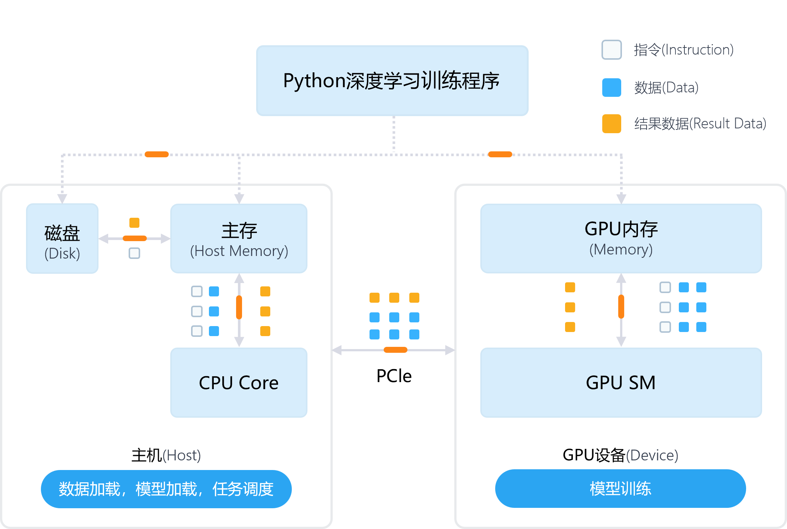</center>
    <center>图1-5-2. 深度学习程序异构计算</center>

- ***[内存墙](https://en.wikipedia.org/wiki/Random-access_memory#Memory_wall)约束***：
  
  - [“内存墙”](https://en.wikipedia.org/wiki/Random-access_memory#Memory_wall)是芯片与芯片外的内存之间越来越大的速度差距。造成这种差距的一个重要原因是超出芯片边界的有限通信带宽，也称为带宽墙。例如，“从 1986 年到 2000 年，CPU 速度以每年 55% 的速度提高，而内存速度仅提高了 10%。鉴于这些趋势，预计内存延迟将成为计算机性能的压倒性瓶颈。”虽然增速比例不同，但是这种通常计算发展更快的现状其实我们在 GPU 的发展过程中也可以观察到，例如表 1.5.1 所示，NVIDIA H100 相比 A100 在 FP32 Vector 上是 48 TFLOPS 相比 19.5 TFLOPS 的近 2.46 倍提升，但是内存带宽只是 2 TB/s (PCIe 版 GPU）比 1,935GB/s （PCIe 版 GPU）的 1.06 倍提升，访存落后于计算的提升速度，如果我们考虑新型号 GPU 中计算单元进行稀疏，低精度量化加速，这个差距可能会变得更大。可以认为在人工智能领域内存墙这种情况还存在。一般应对内存墙有以下思路进行缓解：（1）利用缓存减少数据访存搬运，同时我们在后面的编译优化等章节会看到很多策略是尽可能利用片上共享内存或者GPU显存，尽可能的减少数据搬运。（2）[关联处理（Associative Processing）的思想和关联处理器（Associative Processors）](https://ieeexplore.ieee.org/document/330035)，将计算直接卸载到数据侧，例如，[IMCA TVLSI '21 加速器设计](https://ieeexplore.ieee.org/document/9324735)。除了硬件支持，软件层也可以借鉴其思想。在传统大数据系统中，Spark 等尽可能搬运 UDF，将计算放在数据块所在节点处理，减少搬运数据，以及 Big Table 和 HBase 的[协处理器（Coprocessor）](https://blogs.apache.org/hbase/entry/coprocessor_introduction)设计都是关联处理思想的延伸。（3）减少数据本身，例如，利用稀疏性与低精度量化，减少待计算需要传递的的数据量。（4）计算屏蔽数据搬运开销，例如，GPU 通过更小开销的硬件线程切换设计，让需要访存的线程让出计算核，进而提升整体一批线程的计算吞吐，减少访问的开销。

| GPU 规格（Specification）                                             | 32位浮点运算量（FP32 FLOPS）                                | 访存带宽（Memory Bandwidth） | 内存尺寸（Memory Size） | 最大热设计功率（Max Thermal Design Power） | 发布年份     |
| ----------------------------------------------------------------- | --------------------------------------------------- | ---------------------- | ----------------- | --------------------------------- | -------- |
| [H100 PCIe](https://www.nvidia.com/en-us/data-center/h100/)       | 48 teraFLOPS + 800 teraFLOPS* \| 400 teraFLOPS      | 2TB/s                  | 80GB              | 350W                              | 2022年3月  |
| [A100 PCI2](https://www.nvidia.com/en-us/data-center/a100/)       | 19.5 TFLOPS + 156 TFLOPS \| 312 TFLOPS* Tensor Core | 1,935GB/s              | 80GB HBM2e        | 300W                              | 2020年5月  |
| [V100S PCIe](https://www.nvidia.com/en-us/data-center/v100/)      | 16.4 teraFLOPS + 130 teraFLOPS Deep Learning        | 1134GB/s               | 32GB  HBM2        | 250W                              | 2017年12月 |
| [P100 PCIe](https://www.nvidia.com/en-us/data-center/tesla-p100/) | 9.3 teraFLOPS                                       | 732 GB/s               | 16GB              | N/A                               | 2016年7月  |

<center>表 1.5.1 不同数据中心 NVIDIA GPU 型号的 FP32 浮点运算量和访存带宽统计</center>

在了解以上趋势后，会启发我们看到为何后面章节中大量的系统设计优化，利用多核和分布式计算，以及为何减少数据搬运的原因。因为单纯依靠单计算硬件达到的算力是有上限约束，我们还要通过扩展和异构硬件不断打破上限功耗墙与暗硅约束，同时我们还需要软硬件协同通过系统与系统算法设计进一步提升效率和性能逼近上限，绕过内存墙等约束。

## 1.5.3 局部性原则（Priciple of Locality）与内存层次结构（Memory Hierarchy）

由 1.5.2 我们看到，由于内存墙，算法执行过程中一种方式是尽可能的减少访存，利用缓存，本小节我们通过内存的层次结构，和跨层次之间利用算法的局部性，如何减少访存。

深度学习的访存特点是：

- 对模型整体的每轮迭代，读取批次数据，这部分会随机采样数据进行读取。
- 对模型中的每个算子计算可以转换为底层的循环执行，这其中对输入输出数据的访问有一定的缓存复用机会。

如图 1.5.3 所示，计算机的内存层次结构很深，不同层级的访存时间，带宽，空间和成本都不同，但遵循一定的递增或递减的关系。

<center>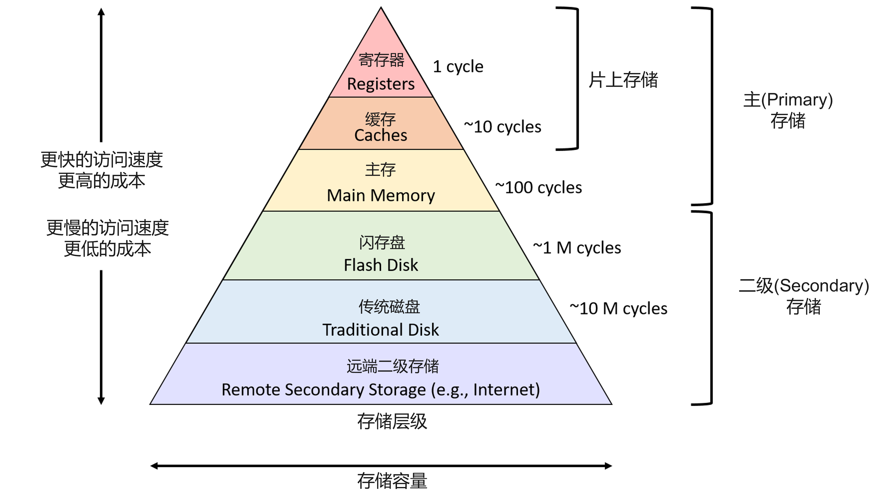</center>

图 1.5.3 内存层次结构（Memory Hierarchy）[图片引用 Dive Into Systems](https://diveintosystems.org/book/C11-MemHierarchy/mem_hierarchy.html)[<sup>[10]</sup>](#dive)
在图中我们看到传统的内存层次结构问题总结中没有覆盖 GPU 和 AI 加速器内存，缓存和寄存器，但是其相对规律和上图是一致的，我们可以通过 PCIe 总线将 AI 加速器与当前已有体系结构互联，让计算机利用 AI 加速器加速模型的训练与推理。

<center>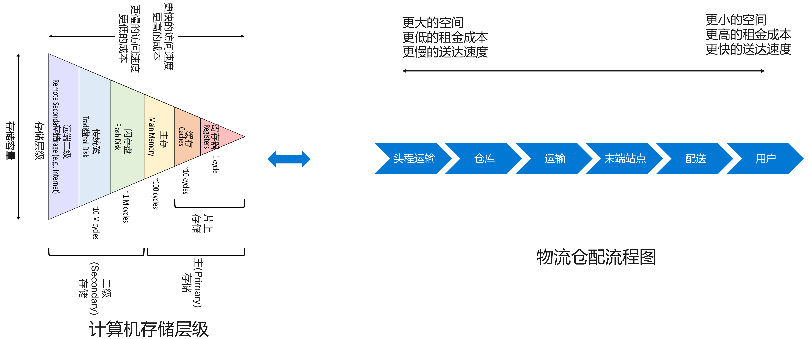</center>
<center>图 1.5.4 内存存储层级 vs 物流仓储配送流程(<a href="https://diveintosystems.org/book/C11-MemHierarchy/mem_hierarchy.html">图片引用</a>)</center>

如图 1.5.4 我们可以将存储和访存类比为 ***物流的仓库与配送*** ，进而更加具象的理解其中的设计与权衡。末端站点像缓存或寄存器，有更小的空间，更高的租金成本，更快的送达速度。仓库就像磁盘或内存，有更大的空间，更低的租金成本，更慢的送达速度。

图 1.5.5 中我们可以看到 GPU 显存和主存之间通过 PCIe 总线传输数据，一般是初始时的模型权重，以及每批次的输入数据张量。

<center>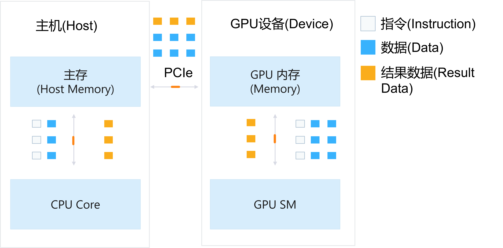</center>
<center>图 1.5.5. 主机和 GPU 之间的数据传输，GPU 显存和主存关系 (<a href="https://www.telesens.co/2019/02/16/efficient-data-transfer-from-paged-memory-to-gpu-using-multi-threading/">图片引用 ankur6ue 博客</a>)</center>

图 1.5.6 中我们可以看到 GPU 显存和缓存之间的数据流动。

<center>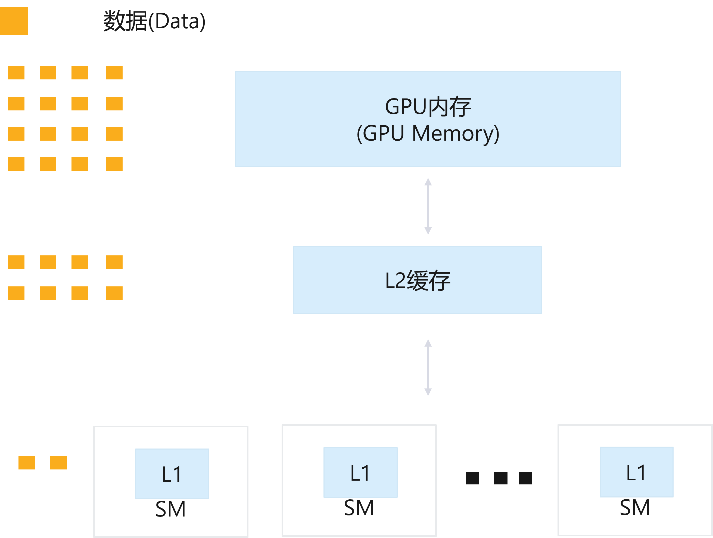</center>
<center>图 1.5.6 GPU 缓存与 GPU 内存数据传输，GPU 显存与缓存关系(<a href="https://docs.nvidia.com/deeplearning/performance/dl-performance-gpu-background/index.html">图片引用 NVIDIA 文档</a>)</center>

接下来我们以一个算子也就是卷积转换为矩阵乘计算后为例，看负载的局部性，这个情况下假设数据已经完成图 1.5.5 中读取，数据在 GPU 显存，所以只需要关注图 1.5.6 中的 GPU 显存与缓存之间的关系，分析矩阵乘的访存的局部性。

如下程序所示，我们通过 A，B 进行通用矩阵乘计算产生矩阵 C（通用矩阵乘常常用于全连接算子和卷积被 im2col 转化后的 GEMM 卷积算子中的运算）。通过分析我们看到，其使用
 $m \times n + m \times k + k \times n$ 的空间进行单算子的运算，读者思考以下问题：

1. 假设缓存线为 $x$ 字节，如何执行其中的乘加运算，访存次数最低？
2. 当 $m \times n + m \times k + k \times n > h$ ，$h$ 为片上内存尺寸（例如，GPU 共享内存和缓存），应该怎么办？
   以上两个问题既驱动软件优化（编译优化），也驱动硬件发展（加速器更大的片上内存设计），读者可以在后续的编译优化和体系结构阅读更为细致的讲解。

```cpp
// 矩阵 A[m][k] 和 B[k][n] 进行 GEMM 运算产生 C[m][n]
for (int m = 0; m < M; m++) {
  for (int n = 0; n < N; n++) {
    C[m][n] = 0;
    for (int k = 0; k < K; k++) {
      C[m][n] += A[m][k] * B[k][n];
    }
  }
}
```

**[局部性](https://en.wikipedia.org/wiki/Locality_of_reference)原则**：

在计算机科学中：“引用的局部性，也称为局部性原理，是处理器在短时间内重复访问同一组内存位置的趋势。参考局部性有两种基本类型——时间局部性和空间局部性。时间局部性是指在相对较短的时间内重复使用特定数据和资源。空间局部性（也称为数据局部性）是指在相对较近的存储位置内使用数据元素。”

如图 1.5.7 所示，如果我们打印按执行周期（Cycle）为横轴，一个循环程序的访存地址为纵轴，我们可以观察到，时间局部性（Temporal Locality）就是图中呈现的连续执行周期内，一直访问同一个地址，空间局部性（Spatial Locality）就是一段时间内访问连续的地址空间（例如，在同一个缓存线（Cache Line）内的数据）。如果以一定的粒度（例如，缓存线 64 Byte）加载数据，这样就可以减少访存次数，让每次加载都是有效的。这就像物流运输中，每次都让货车满载，而不是每次只放一箱货物，发多次货运车辆。

- 时间局部性（Temporal Locality）：
  - “通常我们在执行一些迭代计算（例如，循环）中，会在不远的未来再次访问模块地址空间，如果我们能摸清这个规律，利用这种时间局部性，在当前内存达到上限驱逐（Evict）这块地址空间数据之前再次访问，就能够减少再次加载这块数据的开销，提升整体性能和效率。这种优化常常应用于算子内核内部的循环计算中，或者粒度拓展到训练迭代的周期性加载批次数据中。”
- 空间局部性（Spatial Locality）：
  - “由于内存和总线处于效率和性能考虑，不同存储层级之间的读写最小单元并不是 1 个字节（例如，通常主存会设 128 字节的缓存线，加载数据到缓存。磁盘会设置 512 字节作为块大小作为最小的读写粒度。PCIe 会设置最大有效载荷（Maximum Payload）大小为主存缓存线大小来控制传递的数据粒度和效率。GPU 也会设置缓存线。），这样就需要系统跨内存加载数据时，尽可能不空载和不会近期访问的数据，类似让“物流”运输更加高效，塞满货车为近期就要使用的商品，提升效率。这种优化遍布于各个内存层次之间的数据搬运中。”

那么接下来，我们假设 GEMM 实例中 M = 3，N = 3，K = 3（常用卷积核大小为3X3），那么我们收集其访存地址（[参考实例](src/gemm_locality.cpp)），并可视化如图 1-5-7 所示的散点图，可以观察到图 1.5.7 中不同数组的访存存在一定的空间（数组 C）和时间局部性（数组 A），当前配置下，数组 B 需要间隔 2 次才访问到地址相邻数据，需要间隔 8 次访问到同一块内存地址。

```
...
C[m][n] += A[m][k] * B[k][n];
printf("%d \n", &A[m][k]);
printf("%d \n", &B[k][n]);
printf("%d \n", &C[m][n]);
...
```

<center>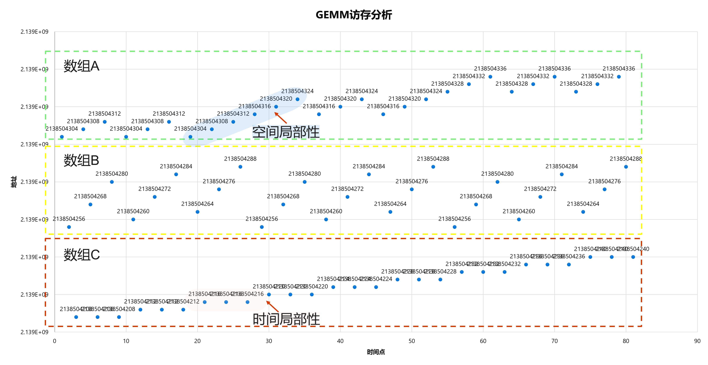</center>
<center>图 1.5.8 GEMM 访存分析</center>

以上的分析方法和思路是同样适合于其他两层之间的存储进行访存优化设计的，那么我们可以总结各个内存层次结构结构中的利用局部性的例子和机会：

- GPU L1, L2 缓存：
  
  - 片上缓存较小，对算子内计算负载进行切片以及访存调度优化是减少缓存失效是常见思路。深度学习编译器关注循环（Loop）的块（Tile）优化很大程度上因为缓存较小引起。
  - 缓存预取（Prefetch）指令设计：例如在 NVIDIA GPU 的 PTX 指令中，提供缓存预取指令，此例子通过预取指令加载数据到 L2 缓存[“```ld.global.L2::64B.b32   %r0, [gbl]; // Prefetch 64B to L2```”](https://docs.nvidia.com/cuda/parallel-thread-execution/index.html)。

- GPU 显存 DRAM（与主存通过 PCIe 总线互联）：
  
  - GPU 显存和主存之间通常传输的是批次（Batch）数据和模型。可以利用深度学习模型对批次数据的访问时间局部性做相应优化，例如可以通过[ vDNN MICRO '16](https://dl.acm.org/doi/10.5555/3195638.3195660)等方式对假设已知访存模式情况下的数据预取与卸载。

- 主存：
  
  - 主存和文件系统之间一般传输的是数据，和模型文件，可以提前下载和准备好数据文件，并做好缓存。
  - 对频繁访问的磁盘数据，也可以将缓存逻辑交给操作系统管理。

- 本机磁盘存储：
  
  - 高效和统一的顺序文件存储格式能够减少随机读写小文件的问题。
  - 本地磁盘存储也可以充当云存储的缓存，例如，[Azure Blob Fuse ](https://github.com/Azure/azure-storage-fuse)。

- 网络与云存储：
  
  - 缓存文件系统中数据或者预取数据可以减少网络或云存储中文件的读取代价，例如：[Alluxio](https://www.alluxio.io/)。

***访存一定会成为瓶颈吗？***

我们还可以通过 ***[Roofline](https://en.wikipedia.org/wiki/Roofline_model)性能分析模型***[<sup>[11]</sup>](#roofline) 进行分析到底当前任务是计算受限（Compute-Bound）还是内存受限（Memory-Bound），其常常用于体系结构领域芯片设计，例如根据负载进行 Roofline 分析发现当前的模型执行在硬件规格上的瓶颈，由应用驱动芯片设计。
例如，针对上面的GEMM，我们分析其[乘加运算（Multiply Accumulate 简称 (MAC)）](https://en.wikipedia.org/wiki/Multiply%E2%80%93accumulate_operation)为 $M \times N \times K$，其需要访问的内存数组大小为 $M \times K + K \times N + M \times N$，那么随着不同的 M，N，K 取值（深度学习模型的不同超参数配置），其 Roofline 模型的表现会呈现不同的差异，这里读者可以分析其曲线在不同的配置下呈现计算受限还是内存受限的表现。

在历史上的系统设计中，我们一般是抓住核心瓶颈进行优先优化，非核心瓶颈如果处于不同数量级的影响可以暂时忽略。所以我们会看到一些现象，在历史某个时期就是某个环节本可以优化部分做的并不高效，直到硬件发展到这个环节成为核心瓶颈，系统优化才着重针对这部分优化。对系统做相对定量分析在系统设计十分必要的。例如，Facebook 在 2018 年发布的数据中心推理场景的[经验分析](https://research.facebook.com/publications/deep-learning-inference-in-facebook-data-centers-characterization-performance-optimizations-and-hardware-implications/)中对数据中心部署的模型进行 Roofline 分析，启发未来深度学习芯片设计应该提升片上内存和访存带宽。

***缓存一致性约束***

同时如果是新设计出的缓存系统进行作业加速（例如，缓存云文件系统数据到多节点内存），由于信息产生了副本（Replication），工程师仍要面对类似传统的多核系统下的缓存一致性（Cache Coherence）问题，可以参考[ MESI 协议](https://en.wikipedia.org/wiki/MESI_protocol)[<sup>[12]</sup>](#mesi)等设计新的协议约束当前计算负载任务，保证一致性。

## 1.5.4 深度学习负载的线性代数（Linear Algebra）计算与缺陷容忍（Defect Tolerance）特性

**线性代数**：大部分的深度学习算子可以抽象为线性代数运算，如通用矩阵乘（GEMM）。如图 1-5-8 所示，深度学习模型由很多的算子像积木一样组合而成，而每个算子又可以转换为对应的矩阵运算或非线性函数运算，而之后可以利用加速器（Accelerator）进行加速执行。例如，卷积可以通过 im2col 转换为通用矩阵乘。而矩阵乘在编译器中可以得到大量的优化，同时无论是 GPU 还是 ASIC 都可以为其设计专用加速器件。例如，NVIDIA GPU 通过[单指令多线程（SIMT）](https://en.wikipedia.org/wiki/Single_instruction,_multiple_threads)进行矩阵运算加速，单指令多线程 (SIMT) 是一种用于并行计算的执行模型，将单指令多数据 (SIMD) 与多线程相结合。Google TPU 通过经典的[脉动阵列（Systolic Array）](https://en.wikipedia.org/wiki/Systolic_array)定制矩阵乘加速单元（Matrix Multiply Unit）。

<center>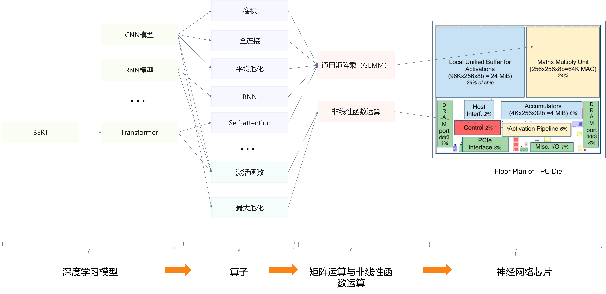</center>
<center>图 1.5.8 深度学习模型转换为底层矩阵运算，并在ASIC加速器为其定制的专用器件上进行加速 (<a href="">图片引用</a>)</center>

由于矩阵运算含有较少的的控制流，且计算之间依赖少，适合并行计算。大量的矩阵乘等计算让硬件可以通过单指令多数据流（SIMD）进行指令流水线精简设计，并将更多的片上资源用于计算，如图 1.5.9 所示。或者在更高的层次上通过多卡或分布式计算方式进行加速。这种特性的应用我们将在第 5 章中进行总结。同时我们也看到，由于矩阵计算早在几十年前在科学计算与高性能计算（HPC）领域有过大量的成熟研究，在深度学习系统领域也有很多工作会借鉴并优化传统科学计算与高性能计算领域的系统设计与开源组件。

<center>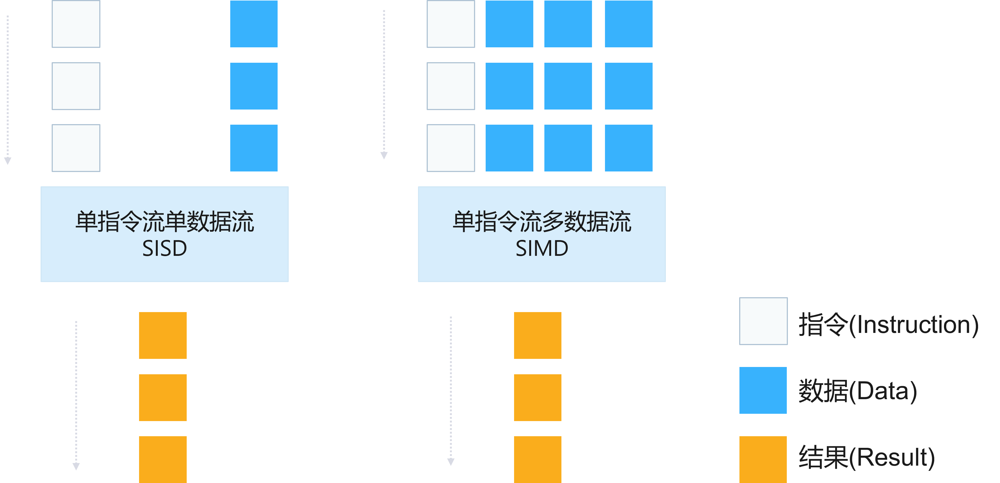</center>
<center>图 1.5.9 SISD 对比 SIMD</center>

如下图所示，我们通过 A，B 进行通用矩阵乘计算产生矩阵 C（全连接，卷积和平均池化等通常可以转换为通用矩阵乘）。但是我们观察到，下面都是标量的操作，如果每个线程都启动进行标量运算，相当于每个线程都是一个指令流和数据流，但是每个线程实际执行的是相同指令，造成了指令访存和流水线的浪费。

```cpp
// 矩阵 A[m][k] 和 B[k][n] 进行 GEMM 运算产生 C[m][n]
for (int m = 0; m < M; m++) {
  for (int n = 0; n < N; n++) {
    C[m][n] = 0;
    for (int k = 0; k < K; k++) {
      C[m][n] += A[m][k] * B[k][n];
    }
  }
}
```

思考如果一次计算一批数据，例如 16 个标量，其实执行的指令一致，差别主要在数据，如下代码所示：

```cpp
for (int m = 0; m < M; m++) {
  for (int n = 0; n < N; n += 16) {
    // 以下一批数据计算是否可以通过特定指令或者加速器架构达到融合批量计算？减少指令流水线开销？
    C[m][n + 0] = 0;
    ... 
    C[m][n + 16] = 0;
    for (int k = 0; k < K; k++) {
      C[m][n + 0] += A[m][k] * B[k][n + 0];
      ...
      C[m][n + 16] += A[m][k] * B[k][n + 16];
    }
  }
}
```

上面就是单指令流多数据流（SIMD）的思想，让相同指令处理的数据流被同一个指令流控制。

- 为了利用 SIMD，一种方式是指令层提供向量化（Vectorization）指令（例如，[FMA 指令集](https://en.wikipedia.org/wiki/FMA_instruction_set)，融合乘加运算FMA指令集（Fused Multiply Add）结合了乘法和加法运算，可以通过单一指令完成乘加运算），仍利用通用的 CPU，相当于一种软件层的 SIMD。
- 另一种方式就是直接在硬件层将指令流水线等器件的空间去冗余，排布更多的计算单元，也就是 GPU 等加速器的思路，其提供 SIMD 的一种方式 SIMT 作为执行模型，单指令多线程（Single Instruction Multiple Threads），同时提供 CUDA 并行编程模型和 [FMA](https://docs.nvidia.com/cuda/parallel-thread-execution/index.html#floating-point-instructions-fma) 等向量化 PTX 指令。这种方式很适合矩阵计算，因为其控制流少，一批线程（在 NVIDIA GPU 中称作束（Warp），一般为 32 个线程为一个束统一调度，执行相同指令处理不同数据）可以在很长时间内执行相同指令，所以对适合编译和转换为矩阵计算的上层应用（深度学习，图像处理等），非常适合采用 GPU 进行加速。
  但是其劣势读者可以思考：如果未来深度学习模型中由于动态性需求出现大量控制流（If/Else，For/While 循环等）需要如何设计新的硬件或者软件？
  例如，在 GPU 中，遇到控制流时，一般中称这种现象叫做[束发散（Warp Divergence）](https://people.maths.ox.ac.uk/gilesm/cuda/lecs/lec3-2x2.pdf)问题。如下实例所示：“GPU 可以在编译时确定所有束（Warp）的线程执行相同指令。如果分支很大，编译器（例如，NVCC）将代码插入到检查经线中的所有线程是否采用相同的分支（其称作束投票（Warp Voting）），然后执行相应地指令分支。”
  
  ```cpp
  // 如果 case 只能运行时获取，编译器无法获取，则最坏情况下会造成较大性能损失
  if (case==1)
    z = x*x*x;
  else
    z = x+3;
  ```
  
  “束曲发散会导致并行效率的巨大损失，在最坏的情况下，如果出现以下情况，性能实际上会损失 32 倍（束一般设置为 32 线程），是由于一个线程需要昂贵的分支，而其余的什么也不做。一般开发人员程序端可以选择使用以下优化：如果边界条件便宜，则遍历所有节点并根据边界条件的需要进行分支。如果边界条件很昂贵，推荐拆分为两个 CUDA 内核（Kernel）。硬件层，NVIDIA Volta 系列的[独立线程调度（Independent Thread Scheduling）](https://developer.nvidia.com/blog/using-cuda-warp-level-primitives/)支持从不同分支交叉执行语句。这使得能够执行细粒度并行算法，束（warp）中的线程可以同步和通信。如下图 1.5.10 所示，Volta 独立线程调度支持从不同分支交叉执行语句。这使得能够执行细粒度并行算法，其中 Warp 中的线程可以同步和通信。”
  虽然软件和硬件层尽可能的规避束发散（Warp Divergence）影响，我们还是看到如图所示其造成部分计算单元在一定时间内的浪费问题，所以问题的本质还是特定的硬件和编程模型适合特定的负载，对负载和硬件执行特点的理解是开掘硬件的计算能力达到软件层优化上限的关键。所以读者可以进一步思考 GPU 适合什么样的负载，以及局限性？

<center>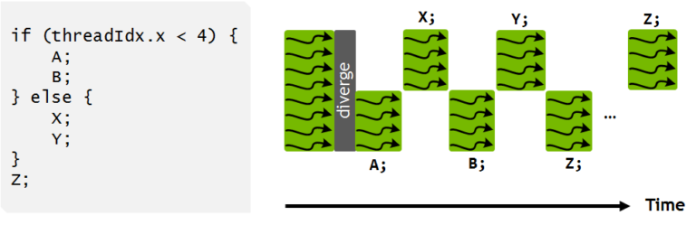</center>
<center>图 1.5.10 线程交替执行实例 (<a href="https://developer.nvidia.com/blog/using-cuda-warp-level-primitives/">图片引用 NVIDIA 文档</a>)</center>

当前问题的并行优化读者可以通过 1.5.5 中介绍的 ***阿姆达尔定律的约束*** 进行思考和分析并行后的加速上限是多少？

**缺陷容忍**：通常认为神经网络具有内置的容错特性（Fault Tolerance Property），主要是因为它们并行（Parallel）结构。 国际神经网络社区直到 1994 年才讨论这些属性，后来这个话题几乎被忽略了。再之后该主题再次被带到讨论中，由于在纳米电子（Nano-Electronic）系统中使用神经网络容错和优雅降级属性将是很重要，例如，[George Bolt的论文](https://mailman.srv.cs.cmu.edu/pipermail/connectionists/1993-March/014726.html)，[Joel Tobias Ausonio的论文](https://centaur.reading.ac.uk/83583/1/19026776_Ausonio_thesis.pdf#page=42&zoom=100,132,190)，[Ralf Eickhoff等的论文](https://core.ac.uk/download/pdf/15959758.pdf)，[Fernando Morgado Dias等的论文](http://cee.uma.pt/people/faculty/fernando.morgado/Down/global_model_naun.pdf)等对此都有所讨论。在学术界，神经网络芯片在2010年左右开始萌芽。2010 年 ISCA 大会上，来自法国国立计算机及自动化研究院（INRIA Saclay）的 Olivier Temam 教授做了[“The Rebirth of Neural Networks” ISCA 10'](https://pages.saclay.inria.fr/olivier.temam/homepage/ISCA2010web.pdf)[<sup>[9]</sup>](#olivier)的报告，指出了再次指出人工神经网络（Artificial Neural Network）的缺陷容忍（Defect Tolerance）特点。其提到“[缺陷容忍度是 ANN 的一个强项：无需识别与禁用故障部件，训练算法通过在不稳定（不相关）值时降低突触权重来自然且自动地消除故障突触与神经元](https://pages.saclay.inria.fr/olivier.temam/homepage/ISCA2010web.pdf)”。并利用这种特点后续开启了一系列的神经网络加速器工作。这种缺陷容忍（Defect Tolerance）特点的利用不仅在芯片领域，目前已经通过其他不同的方法将其动机拓展到软件层。在计算框架，编译器等部分也常常被作为更为激进优化方式的动机以及可近似优化的保证，例如，稀疏，量化，模型压缩等优化。

例如，我们可以在深度学习系统的以下相关领域关注到这类特性假设的应用。

- 硬件层：
  - 通过线性代数特点和缺陷容忍进行模块精简：例如，GPU 或针对人工智能的芯片很多精简指令流水线，采用 SIMD 的模型，提供更多的算力。
  - 稀疏性：在 NVIDIA 最新的 H100 GPU 中，提供硬件层对稀疏性计算的原生支持。
  - 量化：在 NVIDIA 的 H100 和其他型号 GPU 中，提供了 FP64，FP32，FP16，INT8等不同精度的支持，在准确度允许的范围下，越低精度浮点运算量越大。H100 中的变换器引擎（Transformer Engine）分析输出张量的统计信息，了解接下来会出现哪种类型的神经网络层以及什么它需要的精度，变换器引擎（Transformer Engine）在将其存储到内存中之前决定转换哪种目标格式数据类型张量。
- 软件层：
  - 稀疏：框架和算法可以根据稀疏性在运行时进行优化，不进行非 0 计算。
  - 量化：训练完成的模型可以通过量化进一步精简数据精度。
  - 模型压缩：训练完成的模型可以通过模型压缩进一步精简模型，降低浮点运算量与内存。
  - 模型权重的比特缺陷容忍：[Elvis等 CLUSTER '21](https://ieeexplore.ieee.org/document/9556041) 通过检查点变更（Checkpoint Alteration）方式研究深度学习模型软错误敏感性（Soft Error Sensitivity）。实验结果证实流行的深度学习模型通常能够吸收数十个位翻转，而对精度收敛的影响最小。
  - 弹性训练：框架在节点失效后，不阻塞，继续训练。例如：[Torch Elastic](https://pytorch.org/docs/stable/elastic/quickstart.html)。

***非确定性（Non-deterministic）与确定性（Deterministic）约束***

但是经历以上的优化后，会产生很多非确定性（Non-deterministic），这对调试（Debugging）和安全（Security）都会产生一些新的挑战，所以有些工作([Xiangzhe等 Arxiv '22](https://www.cs.purdue.edu/homes/taog/docs/CAIN22.pdf))，会尝试反其道而行之，对有特殊需求的场景（例如，安全与调试），保障深度学习确定性（Deterministic）的执行。从而我们可以看到，单一优化技术本身一般也会产生 ***副作用（Side Effect）*** ，当我们了解了各个基础技术后，如何针对现实需求，进行技术设计的权衡取舍（Trade Offs），是我们需要思考的。

通过以上我们可以看到在深度学习系统中，计算负载的特点本身启发了很多针对深度学习负载本身的系统优化。

## 1.5.5 并行（Parallel）加速与阿姆达尔定律（Amdahl's Law）优化上限

由 1.5.2 我们看到，由于功耗墙和暗硅，硬件逐渐朝着多核多节点设计，这样就天然需要软件层利用算法特点（1.5.4 介绍的矩阵运算的并行化机会）做并行化的设计与支持，但是并行化本身的加速不是无限增长的，也有相应的理论约束上限，可以通过本小节介绍的阿姆达尔定律分析。

深度学习的训练和推理负载可以在多核与多机的硬件下通过利用负载的并行性（Parallelism）进行加速。如图 1.5.11 所示，假设有三个计算核（Core）可以运行任务，此示例并行执行只需要串行执行的 1/3 时间即可完成。并行的设计思路贯穿于整个技术栈，从最底层的指令，到更高层的跨模型多任务并行，我们在系统设计的各个层次上都能找到并行计算的影子。

<center>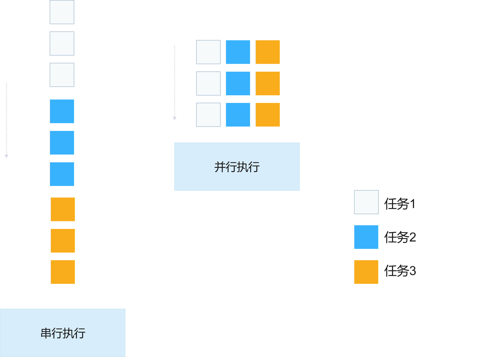</center>
<center>图 1.5.11 此示例并行执行只需要串行执行的1/3时间即可完成 </center>

例如，在以下的深度学习系统的不同层中，我们都能找到并行加速的影子：

- 加速器内并行：
  - 指令级并行：例如当前针对深度学习的加速器很多都是单指令流多数据流([SIMD](https://en.wikipedia.org/wiki/Single_instruction,_multiple_data))或针对矩阵乘设计的脉动阵列的体系结构，能支持指令级并行与流水线。
  - 线程级并行：例如在 NVIDIA 的技术栈中对线程和束（Warp）都提供了并行支持。
  - 算子内与算子间并行：例如，NVIDIA 的技术栈中对 CUDA 内核（Kernel）级并行 CUDA 流（Stream），CUDA 块（Block）级并行都有支持。
- 异构加速器间并行：  
  - 例如，框架层 [BytePS OSDI '20](https://www.usenix.org/conference/osdi20/presentation/jiang) 将任务分别部署到 CPU 与 GPU 上执行，充分利用两部分算力进行计算。
- 框架数据加载器并行：
  - [并行和流水线化的数据加载器](https://www.tensorflow.org/api_docs/python/tf/data/Dataset)可以加速深度学习的数据读取。
- 框架执行单模型并行：
  - 数据并行（Data Parallelism）：例如，框架 [Horovod arXiv '18](https://github.com/horovod/horovod) 将批次切片，部署多副本模型于各个GPU进行数据并行训练。
  - 模型并行（Model Parallelism）：例如，框架 [DeepSpeed KDD '20](https://dl.acm.org/doi/10.1145/3394486.3406703) 等将模型切片通过模型并行方式，将计算分布开来。
  - 流水并行（Pipeline Parallelism）：例如，[GPipe NIPS '19](https://dl.acm.org/doi/10.5555/3454287.3454297) 将模型执行的各个阶段物理划分到不同的单元，采用类[指令流水线](https://en.wikipedia.org/wiki/Instruction_pipelining)的机制加速执行。
- 超参数搜索并行：各个超参数组合的模型之前没有依赖关系可以并行执行。
- 强化学习训练模式并行：多个智能体（Agent）可以并行执行，模型本身可以并行执行。
- 推理中的并行：内核内与内核间都有较大的并行执行机会。

但是并行计算的天花板到底在哪里？如何提前评估并行加速的上限？[阿姆达尔定律（引用 Wikipedia）](https://en.wikipedia.org/wiki/Amdahl%27s_law)[<sup>[12]</sup>](#amdahl)就是为回答以上问题而产生。

阿姆达尔定律（引用 Wikipedia）为：
“$S_{latency}(s) = \frac{1}{(1-p) + \frac{p}{s}}$
其中$S_{latency}$ 是整个任务执行的理论加速；$s$ 是从改进的系统资源中受益的部分任务的加速；$p$ 是受益于改进资源的部分最初占用的执行时间的比例。我们可以看到并行加速受限于串行部分，之后的深度学习中，并行过程中的阶段与阶段间的同步点，聚合运算等都是需要一定串行并无法并行的部分。”

如图 1.5.12 所示，根据阿姆达尔定律，作为执行程序的处理器数量的函数（也可以推广到分布式或者多设备场景进行理论分析），程序执行延迟的理论加速（y 轴）。程序的加速受到程序的串行部分的限制。例如，如果 95% 的程序可以并行化（Parallel Portion = 95%），那么理论上使用并行计算的最大加速将是 20 倍（图中绿色曲线所示）。

<center>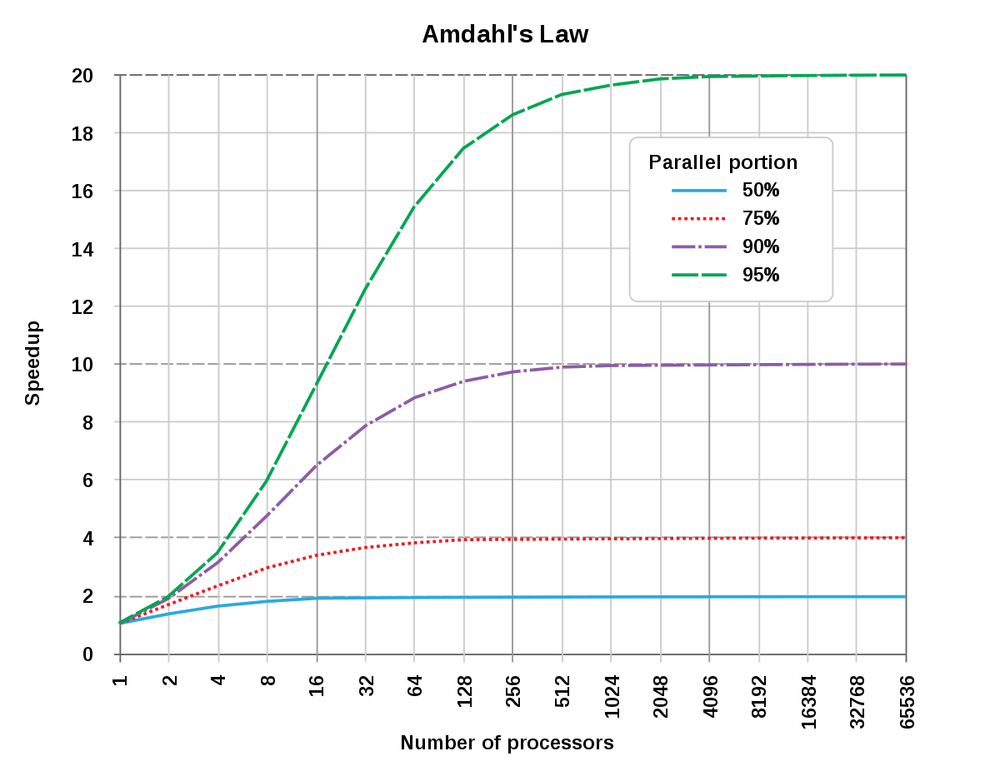</center>

图 1.5.12 阿姆达尔定律 (<a href="https://en.wikipedia.org/wiki/Amdahl%27s_law">图片引用 Wikipedia[<sup>[12]</sup>](#amdahl)</a>)

通过阿姆达尔定律我们可以看到如果某段程序只有百分之 50% 才能优化最终不管怎样增加核最多达到 2 倍提升上限，继续增加只会让 ***性价比（Cost Performance）*** 降低。

## 1.5.6 冗余（Redundancy）与可靠性（Dependability）

在 1985 年 图灵奖得主 [Jim Gray](https://en.wikipedia.org/wiki/Jim_Gray_(computer_scientist)) 曾发表“[Why Do Computers Stop and What Can Be Done About It?](https://www.hpl.hp.com/techreports/tandem/TR-85.7.pdf)”[<sup>[13]</sup>](#jimgray)的技术报告，探讨计算机的软硬件故障和容错问题，在人工智能系统不断发展的今天，软硬件技术栈中仍旧存在错误与容错问题。
硬件部署后受外部环境影响（例如，功耗产生的温度提升，所以 1.5.2 中芯片受到功耗墙约束）或自身的缺陷（Defect），容易出现硬件失效（Failure）进而造成软件失效，虽然深度学习算法负载提供一定的缺陷容忍（1.5.4 中介绍），但是在一些算法以外的系统和模块层面为保证整体系统正确执行，不丢失数据或出于调试模型等考虑，也需要设计一定的数据或模型冗余机制进而保证整体系统的可靠性。如图 1-5-13 所示，那么在深度学习系统的整个技术栈中，常见的一些系统冗余技术实例如下： 

- 硬件层: 内存错误检查和纠正，例如NVIDIA GPU中就支持相应的[内存错误管理](https://docs.nvidia.com/deploy/a100-gpu-mem-error-mgmt/index.html#abstract)，默认支持纠错码（Error Correction Code）内存，进行缺陷修复与检测。
- 框架层：框架的[模型检查点（Checkpoint）](https://pytorch.org/tutorials/beginner/saving_loading_models.html)机制，通过备份模型可以让工程师保证系统损坏情况下恢复模型到最近的状态，定期调试训练中的模型。虽然模型对错误有一定缺陷容忍， [Elvis 等 CLUSTER '21](https://ieeexplore.ieee.org/document/9556041) 通过检查点变更（Checkpoint Alteration）以及[ George Bolt 的论文](https://mailman.srv.cs.cmu.edu/pipermail/connectionists/1993-March/014726.html)，[Joel Tobias Ausonio 的论文](https://centaur.reading.ac.uk/83583/1/19026776_Ausonio_thesis.pdf#page=42&zoom=100,132,190)，[Ralf Eickhof等的论文](https://core.ac.uk/download/pdf/15959758.pdf)，[Fernando Morgado Dias 等的论文](http://cee.uma.pt/people/faculty/fernando.morgado/Down/global_model_naun.pdf)很多相关工作研究深度学习和传统人工神经网络模型软错误敏感性（Soft Error Sensitivity），实验结果证实流行的深度学习模型通常能够容忍一定限度的错误，而对精度收敛的影响最小。所以对超过一定程度阈值的模型失效还是会造成之前的训练无法恢复，需要重新训练，每隔一段时间定期做检查点并进行恢复相比重新长时间训练是比较经济的容错方式。
- 平台层：
  - 元数据：分布式数据库副本机制。例如，深度学习平台的元数据常常存放于 [etcd](https://etcd.io/) 或者 [ZooKeeper](https://zookeeper.apache.org/) 中，这些系统本身是通过多副本机制以及共识协议（Consensus Protocol）保证可靠性的。
  - 存储：分布式文件系统（例如，[HDFS](https://hadoop.apache.org/docs/r1.2.1/hdfs_design.html)，[Alluxio](https://www.alluxio.io/)，[Azure Blob](https://azure.microsoft.com/en-us/services/storage/blobs/) 等）中的副本机制。

<center>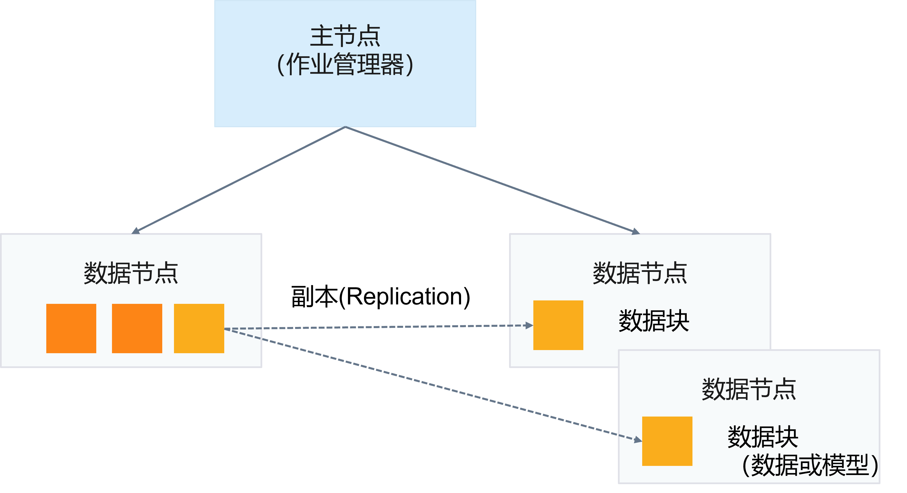</center>
<center>图 1.5.13 副本机制 </center>

由于冗余（Redundancy）副本会产生一致性（Consistency）的问题，工程师可以参考经典的分布式系统保持副本一致性的共识（Consensus）协议（例如，[Paxos](https://en.wikipedia.org/wiki/Paxos_(computer_science))，[Raft](https://en.wikipedia.org/wiki/Raft_(algorithm)) 等）保证新设计的副本系统数据一致和能够做领袖选举（Leader Election）从故障中恢复。

当然，除了以上一些经典理论，在计算机体系结构（Computer Architecture），系统（System），程序分析（Program Analysis），软件工程（Software Engineering）领域还有大量经典理论值得我们学习和借鉴并在人工智能系统中焕发新的生机。例如，最近的一些工作中，[HiveD OSDI '20](https://www.usenix.org/conference/osdi20/presentation/zhao-hanyu) 应用经典的 [Buddy memory allocation](https://en.wikipedia.org/wiki/Buddy_memory_allocation) 思想减少碎片，[Refty ICSE '22](https://www.microsoft.com/en-us/research/publication/refty-refinement-types-for-valid-deep-learning-models/) 应用程序分析中的[类型系统](https://en.wikipedia.org/wiki/Type_system)理论解决深度学习模型缺陷问题等。面向深度学习设计的新的系统理论，系统算法和系统也将会产生大量的新兴研究与工程实现机会，是一个令人激动人心和值得投身的领域。同时我们也看到，打好计算机基础对从事人工智能系统方向工作与研究至关重要。

综上所述，人工智能系统本身并不是凭空产生，本身继承了大量经典的系统理论与设计方法，并根据深度学习负载的计算，访存与缺陷容忍等特点进一步开掘新的优化机会。我们将在后面的章节中进一步细节的介绍相关场景下的系统设计与实现。

## 小结与讨论

本章我们主要围绕计算机领域的经典理论和原则在深度学习系统场景的应用，同时我们也发现深度学习自身的新的特点，并出现了新的系统设计需求和机会。

请读者读完后面章节后再回看当前章节，并思考随着技术的演进，哪些技术是在变化的，而哪些技术点并没变？

## 参考文献

<div id="layered"></div>

1. [N. Vlajic. Layered Architectures and Applications. CSE 3213, Fall 2010.](https://www.eecs.yorku.ca/course_archive/2010-11/F/3213/CSE3213_03_LayeredArchitecture_F2010.pdf)

<div id="vonneumann"></div>

2. [Wikipedia contributors. "Von Neumann architecture." Wikipedia, The Free Encyclopedia. Wikipedia, The Free Encyclopedia, 25 Apr. 2022. Web. 3 Jul. 2022.](https://en.wikipedia.org/wiki/Von_Neumann_architecture)

<div id="moore"></div>

3. [Wikipedia contributors. (2022, April 22). Huang's law. In Wikipedia, The Free Encyclopedia. Retrieved 09:03, July 3, 2022.](https://ieeexplore.ieee.org/document/4785860)

<div id="huang"></div>

4. [G. E. Moore, "Cramming more components onto integrated circuits, Reprinted from Electronics, volume 38, number 8, April 19, 1965, pp.114 ff.," in IEEE Solid-State Circuits Society Newsletter, vol. 11, no. 3, pp. 33-35, Sept. 2006, doi: 10.1109/N-SSC.2006.4785860.](https://en.wikipedia.org/wiki/Huang%27s_law)

<div id="wong"></div>

5. [H. . -S. P. Wong, R. Willard and I. K. Bell, "IC Technology – What Will the Next Node Offer Us?," 2019 IEEE Hot Chips 31 Symposium (HCS), 2019, pp. 1-52, doi: 10.1109/HOTCHIPS.2019.8875692.](https://ieeexplore.ieee.org/document/8875692)

<div id="jim"></div>

6. [Jim Keller. Moore’s Law is Not Dead. UCB EECS Colloquium 2019.](https://eecs.berkeley.edu/research/colloquium/190918)

<div id="david"></div>

7. [David Patterson Says It’s Time for New Computer Architectures and Software Languages Moore’s Law is over, ushering in a golden age for computer architecture, says RISC pioneer. IEEE Spectrum 2018.](https://spectrum.ieee.org/david-patterson-says-its-time-for-new-computer-architectures-and-software-languages)

<div id="mike"></div>

8. [Mike Muller. ARM CTO warns of dark silicon. 2010.](https://www.eetimes.com/arm-cto-warns-of-dark-silicon/)

<div id="olivier"></div>

9. [Olivier Temam. 2010. The rebirth of neural networks. SIGARCH Comput. Archit. News 38, 3 (June 2010), 349. https://doi.org/10.1145/1816038.1816008](https://dl.acm.org/doi/10.1145/1815961.1816008)

<div id="dive"></div>

10. ["Dive into Systems: A Free, Online Textbook for Introducing Computer Systems", Suzanne J. Matthews, Tia Newhall, Kevin C. Webb, in Proceedings of the 52nd ACM Technical Symposium on Computer Science Education (SIGCSE '21), March, 2021.](https://diveintosystems.org/)

<div id="roofline"></div>

11. [Samuel Williams, Andrew Waterman, and David Patterson. 2009. Roofline: an insightful visual performance model for multicore architectures. Commun. ACM 52, 4 (April 2009), 65–76. https://doi.org/10.1145/1498765.1498785](https://dl.acm.org/doi/10.1145/1498765.1498785)

<div id="mesi"></div>

12. [Mark S. Papamarcos and Janak H. Patel. 1984. A low-overhead coherence solution for multiprocessors with private cache memories. In Proceedings of the 11th annual international symposium on Computer architecture (ISCA '84). Association for Computing Machinery, New York, NY, USA, 348–354. https://doi.org/10.1145/800015.808204](https://dl.acm.org/doi/10.1145/800015.808204)

<div id="amdahl"></div>

12. [Wikipedia contributors. "Amdahl's law." Wikipedia, The Free Encyclopedia. Wikipedia, The Free Encyclopedia, 29 Jun. 2022. Web. 3 Jul. 2022.](https://en.wikipedia.org/wiki/Amdahl%27s_law)

<div id="amdahl"></div>

13. [Gray, Jim. “Why Do Computers Stop and What Can Be Done About It?” Symposium on Reliability in Distributed Software and Database Systems (1986).](https://www.hpl.hp.com/techreports/tandem/TR-85.7.pdf)

<div id="riscv"></div>

14. [计算机组成与设计：RISC-V](https://www.bilibili.com/video/BV1tz411z7GN?p=1&share_medium=android&share_plat=android&share_session_id=55501f17-936f-4831-8285-7794c1c4c282&share_source=WEIXIN&share_tag=s_i&timestamp=1649549336&unique_k=DxEcILk)
